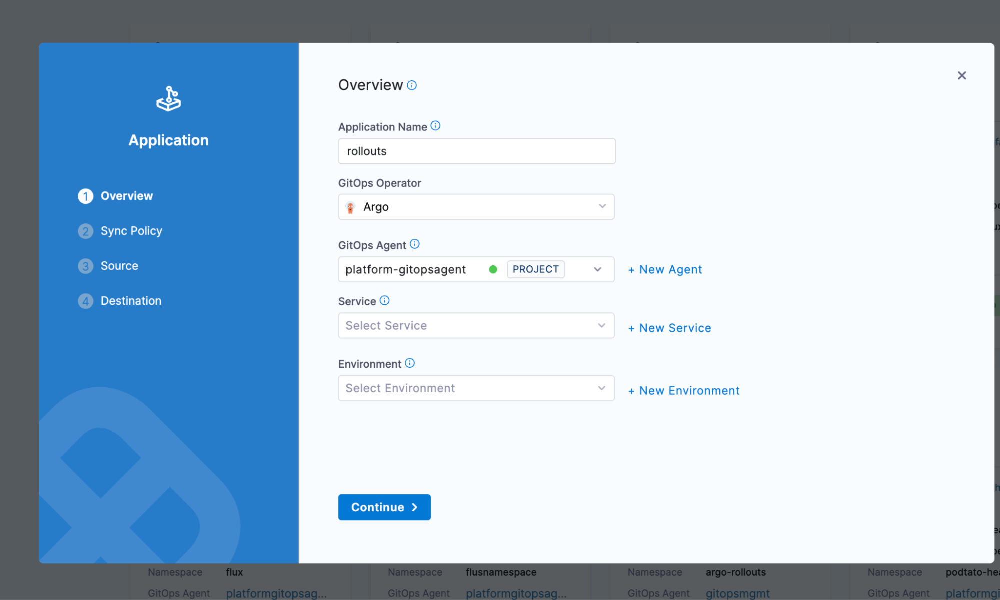
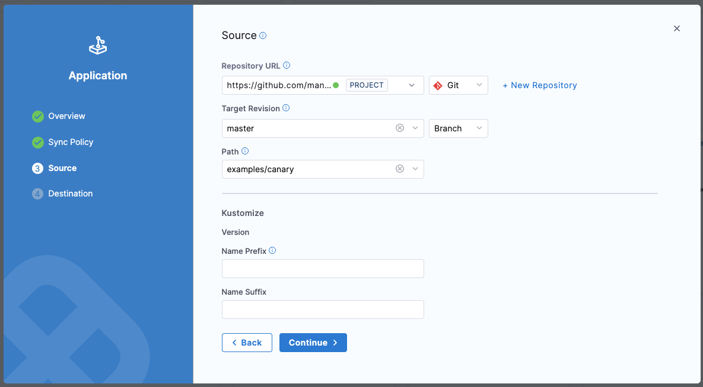
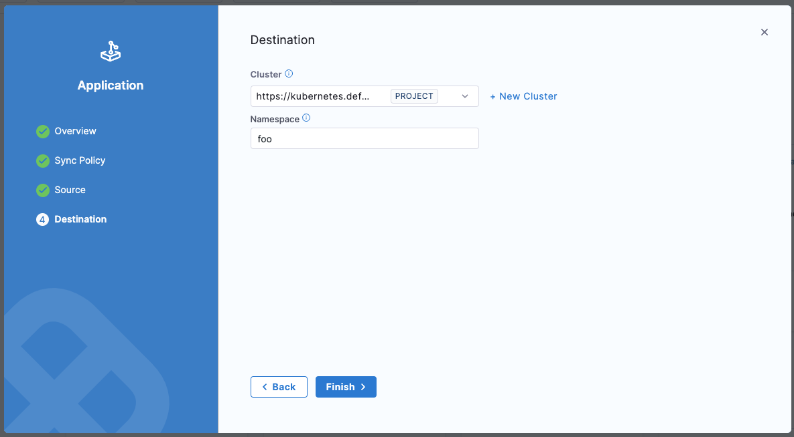
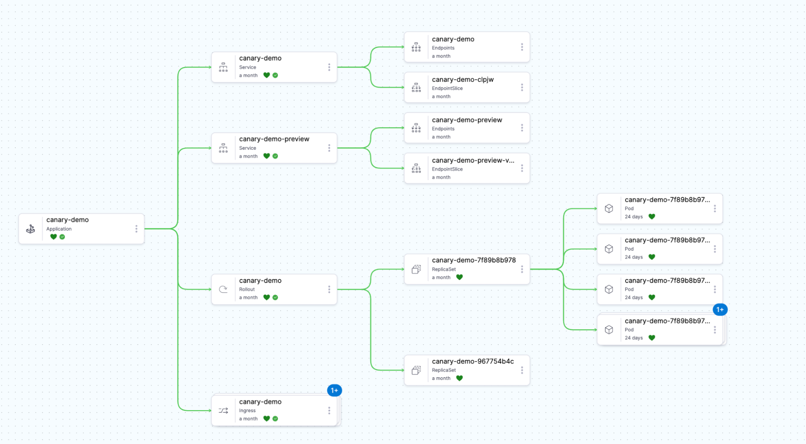

[Argo Rollouts](https://argoproj.github.io/rollouts/) is a progressive delivery controller for Kubernetes that provides advanced deployment capabilities such as blue-green, canary, and analysis-driven rollouts. When integrated with Harness GitOps, Argo Rollouts enables you to execute sophisticated deployment strategies declaratively while maintaining the GitOps workflow.

## Overview of Argo Rollouts and its benefits

Argo Rollouts extends Kubernetes Deployments with a new custom resource called a Rollout. This custom resource provides additional deployment strategies and features that aren't available with standard Kubernetes Deployments.

### Key benefits

**Safer deployments:** Progressive rollout strategies minimize the blast radius of problematic releases by gradually shifting traffic to new versions while monitoring their health.

**Advanced deployment strategies:** Native support for canary and blue-green deployments without complex scripting or third-party service mesh requirements.

**Traffic management:** Fine-grained control over traffic shifting between different versions of your application, allowing you to test new releases with a subset of users.

**Automated analysis:** Integration with monitoring and observability tools to automatically promote or roll back deployments based on metrics and health checks.

**Declarative configuration:** Define your deployment strategies in YAML manifests that can be version-controlled alongside your application code.

**GitOps-friendly:** Works seamlessly with Argo CD and Harness GitOps to maintain a declarative, Git-based workflow for all your deployments.

### How Argo Rollouts works with Harness GitOps

Harness GitOps integrates Argo CD with Argo Rollouts to provide a complete progressive delivery solution:

1. Rollout resources are defined in your Git repository alongside other Kubernetes manifests
2. Harness GitOps Agent syncs these resources to your cluster using Argo CD
3. Argo Rollouts controller executes the deployment strategy defined in your Rollout manifest
4. Harness pipelines can orchestrate and control rollout progression with built-in approval gates and monitoring

## Prerequisites

Before installing Argo Rollouts, ensure you have the following:

### Harness requirements

- A Harness account with GitOps module enabled
- Appropriate permissions to create and manage GitOps applications
- A configured Harness GitOps Agent connected to your cluster

### Kubernetes requirements

- Access to a Kubernetes cluster (version 1.19 or later recommended)
- Cluster admin permissions to install Custom Resource Definitions (CRDs)
- kubectl installed and configured to access your cluster

### Optional requirements

For advanced features, you may also need:

- A service mesh (Istio, Linkerd, or SMI) for advanced traffic management
- Ingress controller (NGINX, ALB, etc.) for traffic splitting
- Monitoring tools (Prometheus, Datadog, New Relic) for analysis templates

## Installation

Argo Rollouts can be installed in your Kubernetes cluster using the CLI. This method installs the Argo Rollouts controller and its associated Custom Resource Definitions.

### Install using the CLI

This is the quickest method to get Argo Rollouts running in your cluster.

**Step 1:** Create a dedicated namespace for Argo Rollouts:

```bash
kubectl create namespace argo-rollouts
```

**Step 2:** Apply the Argo Rollouts manifest:

```bash
kubectl apply -n argo-rollouts -f https://github.com/argoproj/argo-rollouts/releases/latest/download/install.yaml
```

This command installs:

- The Rollout Custom Resource Definition (CRD)
- The Argo Rollouts controller deployment
- Required RBAC permissions
- Service accounts and config maps

**Step 3:** Verify the installation:

```bash
kubectl get pods -n argo-rollouts
```

You should see the `argo-rollouts` controller pod running:

```
NAME                             READY   STATUS    RESTARTS   AGE
argo-rollouts-5d5b6b8c7d-xk9zt   1/1     Running   0          30s
```

## Verification steps

After installation, verify that Argo Rollouts is properly configured and ready to manage your deployments.

### Verify the controller is running

Check that the Argo Rollouts controller pod is running and healthy:

```bash
kubectl get pods -n argo-rollouts
```

Expected output:

```
NAME                             READY   STATUS    RESTARTS   AGE
argo-rollouts-5d5b6b8c7d-xk9zt   1/1     Running   0          2m
```

### Verify the CRDs are installed

Confirm that the Rollout custom resource definitions are registered:

```bash
kubectl get crd rollouts.argoproj.io
```

Expected output:

```
NAME                      CREATED AT
rollouts.argoproj.io      2024-01-04T10:30:00Z
```

You can also verify other related CRDs:

```bash
kubectl get crd | grep argoproj.io
```

### Check controller logs

Review the controller logs to ensure there are no errors:

```bash
kubectl logs -n argo-rollouts deployment/argo-rollouts
```

Look for a log line similar to:

```
time="2024-01-04T10:30:00Z" level=info msg="Argo Rollouts starting" version=v1.6.0
```

### Verify RBAC permissions

Ensure the controller has the necessary permissions:

```bash
kubectl get clusterrole argo-rollouts
kubectl get clusterrolebinding argo-rollouts
```

Both commands should return the respective resources without errors.

### Install the kubectl plugin (optional)

For easier management of rollouts from the command line, install the Argo Rollouts kubectl plugin:

**For Linux/Mac:**

```bash
curl -LO https://github.com/argoproj/argo-rollouts/releases/latest/download/kubectl-argo-rollouts-linux-amd64
chmod +x kubectl-argo-rollouts-linux-amd64
sudo mv kubectl-argo-rollouts-linux-amd64 /usr/local/bin/kubectl-argo-rollouts
```

**For Mac (using Homebrew):**

```bash
brew install argoproj/tap/kubectl-argo-rollouts
```

Verify the plugin installation:

```bash
kubectl argo rollouts version
```

## Quick start example

Let's deploy a simple canary rollout to see Argo Rollouts in action. This example uses a demo application that will help you understand the basic workflow.

### Step 1: Fork the demo repository

Fork or clone the Harness Rollouts demo repository:

```bash
git clone https://github.com/harness-community/Gitops-Samples
```

This repository contains several example rollout configurations in the examples/ directory.

### Step 2: Create a GitOps application for the demo

In Harness, navigate to Deployments > GitOps > Applications

Click **+ New Application**

Configure the application:

- **Name:** `rollouts-canary-demo`
- **GitOps Agent:** Select the same agent where you installed Argo Rollouts
- **Service (optional):** Create or select a service to track this deployment
- **Environment (optional):** Create or select an environment



### Step 3: Configure the application source

On the Source page:

- **Repository Type:** Git
- **Repository URL:** https://github.com/harness-community/Gitops-Samples
- **Target Revision:** master
- **Path:** examples/canary

The repository uses Kustomize for configuration. You can leave the Kustomize options at their defaults.

Click Continue.



### Step 4: Configure the destination

- **Cluster:** Select your target cluster
- **Namespace:** Enter an existing namespace or create a new one (e.g., rollouts-demo)

Click Create.



### Step 5: Monitor the initial deployment

Navigate to **Deployments > GitOps > Applications** and click on rollouts-canary-demo

Wait for the application to sync and reach a **Healthy** state

In the **Resources** tab, you'll see:

- A Rollout resource (instead of a standard Deployment)
- Two Service resources (stable and canary)
- A ReplicaSet created by the Rollout



### Step 6: Understand the canary configuration

The demo rollout uses a basic canary strategy. View the rollout details:

```bash
kubectl argo rollouts get rollout rollouts-demo -n rollouts-demo
```

- 20% of traffic → canary version
- Pause for manual promotion
- 40% of traffic → canary version
- Pause for manual promotion
- 60% of traffic → canary version
- Pause for manual promotion
- 80% of traffic → canary version
- Pause for manual promotion
- 100% of traffic → canary version (promotion complete)

### Step 7: Trigger a new rollout

Update the image tag in your Git repository to trigger a new rollout. If you're using the demo repository, you can modify the examples/canary/kustomization.yaml file:

```yaml
images:
  - name: argoproj/rollouts-demo
    newTag: blue  # Change this to 'green', 'yellow', 'orange', etc.
```
Commit and push this change. Harness GitOps will detect the change and sync it to your cluster.

### Step 8: Observe the canary rollout

1. In Harness, navigate to your application's **Resources** tab
2. Watch as the Rollout progresses through the canary stages
3. You'll see the rollout pause at each stage, waiting for manual promotion


To manually promote the rollout using kubectl:

```bash
kubectl argo rollouts promote rollouts-demo -n rollouts-demo
```
Repeat this command at each pause to progress through all canary stages.

### Step 9: Access the demo application

If the demo includes a service of type LoadBalancer or you've configured an Ingress, you can access the application to see the color change as traffic shifts between versions.

Get the service endpoint:

```bash
kubectl get svc -n rollouts-demo
```

## What's next?

Now that you've seen a basic canary rollout in action, you can:

- **Configure automated promotions:** Learn how to automatically promote rollouts based on analysis
- **Set up blue-green deployments:** Explore instant traffic switching strategies
- **Integrate with Harness Pipelines:** Use pipeline steps to control rollout progression
- **Add analysis templates:** Implement automated validation with your monitoring tools

Continue to the next section to learn how to configure different rollout strategies for your applications.

### Related resources

- [Argo Rollouts Official Documentation](https://argo-rollouts.readthedocs.io/)
- [Managing Rollouts in Harness Pipelines](./managing-rollouts-in-harness-pipelines.md)