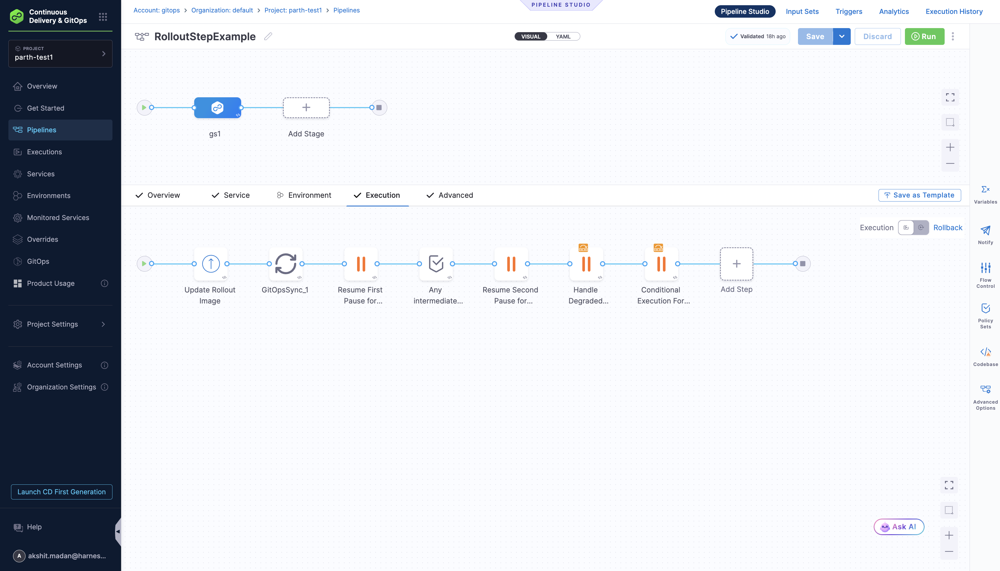
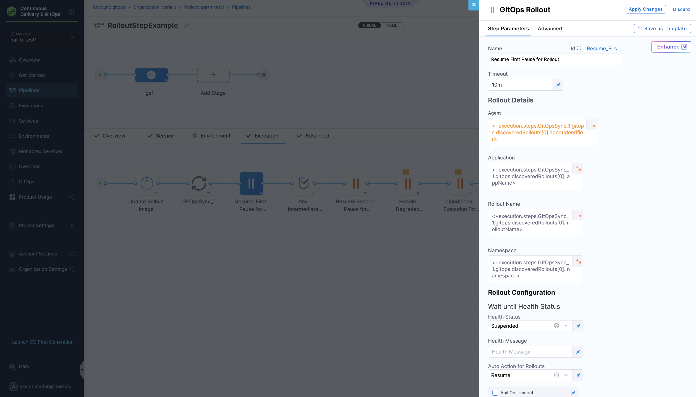

This advanced example demonstrates a complete pipeline that starts with a GitOps sync step followed by multiple GitOps Rollout steps, showing how to pass values between steps.

## Overview

Harness provides a powerful expression system to access outputs from previous steps. This enables dynamic configuration where steps automatically discover and use the correct rollout details without hardcoding values.

## Key Benefits

1. **Dynamic Configuration**: Steps automatically discover and use the correct rollout details
2. **Reusability**: The same pipeline can work across different environments and applications
3. **Error Reduction**: No hardcoded values that could become outdated
4. **Maintainability**: Changes to rollout names or namespaces are automatically reflected

## Pipeline Overview

Here's a visual representation of the pipeline:

:::important
To use Argo Rollouts with Harness GitOps pipelines, ensure the `CDS_GITOPS_ENABLE_ROLLOUTS_PIPELINE_UX` feature flag is enabled in your Harness account.
:::



This pipeline consists of the following key steps:

1. **Update Rollout Image**: Updates the image tag in your GitOps Application's manifest
2. **GitOps Sync**: Synchronizes the GitOps Application to apply the image update, which triggers a new rollout
3. **Resume First Pause for Rollout**: Resumes the rollout from the first pause step
4. **Any Intermediate Steps**: Optional placeholder steps for custom logic
5. **Resume Second Pause for Rollout**: Resumes the rollout from the second pause step
6. **Handle Degraded Rollout**: Handles degraded rollout states with retry action
7. **Conditional Execution For Rollout**: Conditional execution based on application name

## Pipeline YAML

```yaml
pipeline:
  name: RolloutStepExample
  identifier: RolloutStepExample
  projectIdentifier: projectidentifier
  orgIdentifier: default
  tags: {}
  stages:
    - stage:
        name: gs1
        identifier: gs1
        description: ""
        type: Deployment
        spec:
          deploymentType: Kubernetes
          gitOpsEnabled: true
          service:
            serviceRef: svc1
          execution:
            steps:
              - step:
                  type: UpdateGitOpsApp
                  name: Update Rollout Image
                  identifier: Update_Rollout_Image
                  spec:
                    targetRevision: master
                    kustomize:
                      images:
                        - argoproj/load-tester:latest
                        - argoproj/rollouts-demo:yellow
                      replicas: []
                    applicationName: app-rollout-example
                    agentId: qaargoagent
                  timeout: 10m
              - step:
                  type: GitOpsSync
                  name: GitOpsSync_1
                  identifier: GitOpsSync_1
                  spec:
                    prune: false
                    dryRun: false
                    applyOnly: false
                    forceApply: false
                    applicationsList:
                      - applicationName: app-rollout-example
                        agentId: qaargoagent
                    retryStrategy: {}
                    retry: false
                    syncOptions:
                      skipSchemaValidation: false
                      autoCreateNamespace: false
                      pruneResourcesAtLast: false
                      applyOutOfSyncOnly: false
                      replaceResources: false
                      prunePropagationPolicy: foreground
                  timeout: 10m
              - step:
                  type: GitOpsRollout
                  name: Resume First Pause for Rollout
                  identifier: Resume_First_Pause_for_Rollout
                  spec:
                    appName: <+execution.steps.GitOpsSync_1.gitops.discoveredRollouts[0].appName>
                    agentIdentifier: <+execution.steps.GitOpsSync_1.gitops.discoveredRollouts[0].agentIdentifier>
                    namespace: <+execution.steps.GitOpsSync_1.gitops.discoveredRollouts[0].namespace>
                    rolloutName: <+execution.steps.GitOpsSync_1.gitops.discoveredRollouts[0].rolloutName>
                    waitUntilHealthStatus:
                      healthStatus: Suspended
                    autoRolloutAction: resume
                  timeout: 10m
                  failureStrategies:
                    - onFailure:
                        errors:
                          - AllErrors
                        action:
                          type: Ignore
              - step:
                  type: Wait
                  name: Any intermediate steps
                  identifier: Any_intermediate_steps
                  spec:
                    duration: 30s
              - step:
                  type: GitOpsRollout
                  name: Resume Second Pause for Rollout
                  identifier: Resume_Second_Pause_for_Rollout
                  spec:
                    appName: <+execution.steps.GitOpsSync_1.gitops.discoveredRollouts[0].appName>
                    agentIdentifier: <+execution.steps.GitOpsSync_1.gitops.discoveredRollouts[0].agentIdentifier>
                    namespace: <+execution.steps.GitOpsSync_1.gitops.discoveredRollouts[0].namespace>
                    rolloutName: <+execution.steps.GitOpsSync_1.gitops.discoveredRollouts[0].rolloutName>
                    waitUntilHealthStatus:
                      healthStatus: Suspended
                    autoRolloutAction: resume
                  timeout: 10m
                  failureStrategies:
                    - onFailure:
                        errors:
                          - AllErrors
                        action:
                          type: Ignore
              - step:
                  type: GitOpsRollout
                  name: Handle Degraded Rollout
                  identifier: Handle_Degraded_Rollout
                  spec:
                    appName: <+execution.steps.GitOpsSync_1.gitops.discoveredRollouts[0].appName>
                    agentIdentifier: <+execution.steps.GitOpsSync_1.gitops.discoveredRollouts[0].agentIdentifier>
                    namespace: <+execution.steps.GitOpsSync_1.gitops.discoveredRollouts[0].namespace>
                    rolloutName: <+execution.steps.GitOpsSync_1.gitops.discoveredRollouts[0].rolloutName>
                    autoRolloutAction: retry
                  timeout: 10m
                  when:
                    stageStatus: Failure
              - step:
                  type: GitOpsRollout
                  name: Conditional Execution For Rollout
                  identifier: Conditional_Execution_For_Rollout
                  spec:
                    appName: <+execution.steps.GitOpsSync_1.gitops.discoveredRollouts[0].appName>
                    agentIdentifier: <+execution.steps.GitOpsSync_1.gitops.discoveredRollouts[0].agentIdentifier>
                    namespace: <+execution.steps.GitOpsSync_1.gitops.discoveredRollouts[0].namespace>
                    rolloutName: <+execution.steps.GitOpsSync_1.gitops.discoveredRollouts[0].rolloutName>
                    autoRolloutAction: restart
                  timeout: 10m
                  when:
                    stageStatus: All
                    condition: <+pipeline.stages.gs1.spec.execution.steps.GitOpsSync_1.gitops.applications[0].name>=="app-rollout-example"
            rollbackSteps: []
          environment:
            environmentRef: env1
            deployToAll: true
        tags: {}
        failureStrategies:
          - onFailure:
              errors:
                - AllErrors
              action:
                type: StageRollback

```

## How to Get Values from Previous Steps

Harness provides a powerful expression system to access outputs from previous steps. Here's how it works:

### 1. Accessing GitOps Sync Outputs

The GitOps Sync step outputs discovered rollouts that can be used in subsequent steps:

```
<+execution.steps.<step_identifier>.gitops.discoveredRollouts[<index>].<field>>
```



**Available fields:**
- `agentIdentifier` - The GitOps agent identifier
- `appName` - The GitOps application name
- `rolloutName` - The Rollout resource name
- `namespace` - The namespace where the rollout is deployed

### 2. Expression Examples

```yaml
# Get the first discovered rollout's agent
<+execution.steps.gitops_sync_step.gitops.discoveredRollouts[0].agentIdentifier>

# Get the rollout name
<+execution.steps.gitops_sync_step.gitops.discoveredRollouts[0].rolloutName>

# Get the namespace
<+execution.steps.gitops_sync_step.gitops.discoveredRollouts[0].namespace>
```

### 3. Multiple Rollouts

If you have multiple rollouts, access them by index:

```yaml
# First rollout
<+execution.steps.gitops_sync_step.gitops.discoveredRollouts[0].rolloutName>

# Second rollout
<+execution.steps.gitops_sync_step.gitops.discoveredRollouts[1].rolloutName>
```

### 4. Accessing Other Step Outputs

You can also access outputs from other step types:

```yaml
# Access shell script outputs
<+execution.steps.shell_step.output.outputVariables.VAR_NAME>

# Access HTTP response
<+execution.steps.http_step.output.responseBody>

# Access artifact information
<+execution.steps.build_step.output.artifactPath>
```

## Step-by-Step Explanation

### Step 1: Update Rollout Image
- **Purpose**: Updates the container image in your GitOps Application's manifest
- **Configuration**: Uses the `UpdateGitOpsApp` step to modify the image tag in the rollout manifest
- **Key Settings**:
  - `targetRevision`: Git branch containing your manifests
  - `kustomize.images`: Specify the new image to deploy
  - `applicationName`: Your GitOps Application name
  - `agentId`: GitOps Agent identifier

### Step 2: GitOps Sync
- **Purpose**: Synchronizes the GitOps Application to apply the image update
- **Configuration**: Uses the `GitOpsSync` step to trigger a sync operation
- **Key Settings**:
  - `applicationsList`: List of applications to sync
  - `syncOptions`: Various sync configuration options
  - `timeout`: Maximum time to wait for sync completion

### Step 3: Resume First Pause for Rollout
- **Purpose**: Resumes the rollout from the first pause step
- **Configuration**: Uses the `GitOpsRollout` step with resume action
- **Key Settings**:
  - `autoRolloutAction`: Set to `resume`
  - `waitUntilHealthStatus`: Set to `Suspended` to wait for pause state
  - Uses expressions from the Sync step to get rollout details
  - `failureStrategies`: Ignore errors to continue pipeline

### Step 4: Any Intermediate Steps
- **Purpose**: Placeholder for custom logic or additional processing
- **Configuration**: Uses the `Wait` step for simple delays
- **Use Cases**:
  - Add custom validation logic
  - Insert additional processing steps
  - Create delays between operations

### Step 5: Resume Second Pause for Rollout
- **Purpose**: Resumes the rollout from the second pause step
- **Configuration**: Uses the `GitOpsRollout` step with resume action
- **Key Settings**:
  - `autoRolloutAction`: Set to `resume`
  - `waitUntilHealthStatus`: Set to `Suspended` to wait for pause state
  - Uses expressions from the Sync step to get rollout details

### Step 6: Handle Degraded Rollout
- **Purpose**: Handles degraded rollout states with retry action
- **Configuration**: Uses the `GitOpsRollout` step with retry action
- **Key Settings**:
  - `autoRolloutAction`: Set to `retry`
  - `when`: Set to `Failure` to only run on stage failure
  - Uses expressions from the Sync step to get rollout details

### Step 7: Conditional Execution For Rollout
- **Purpose**: Conditional execution based on application name
- **Configuration**: Uses the `GitOpsRollout` step with restart action
- **Key Settings**:
  - `autoRolloutAction`: Set to `restart`
  - `when`: Conditional execution with custom condition
  - Uses expressions to check application name

## Best Practices

1. **Use descriptive step identifiers** for easier reference
2. **Add timeout values** appropriate for your deployment size
3. **Include health checks** for critical production deployments
4. **Consider manual approval steps** for production environments
5. **Test expressions** in the pipeline editor before saving

## Related Resources

- [Managing Rollouts in Harness Pipeline](./managing-rollouts-in-harness-pipelines.md)
- [GitOps Pipeline Steps](/docs/continuous-delivery/gitops/pr-pipelines/gitops-pipeline-steps.md)
- [Argo Rollouts Official Documentation](https://argoproj.github.io/argo-rollouts/)
- [Argo Rollouts kubectl Plugin](https://argoproj.github.io/argo-rollouts/features/kubectl-plugin/)