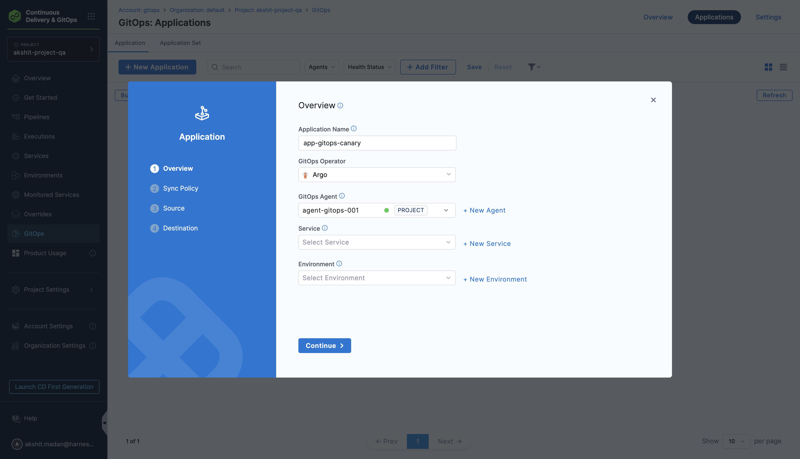
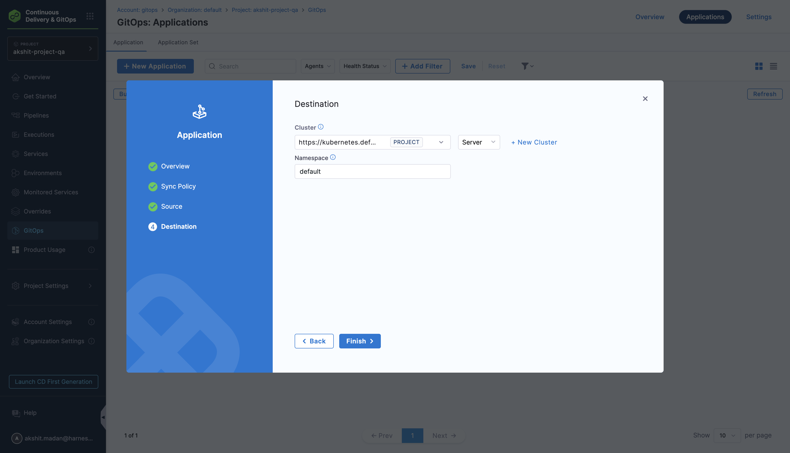
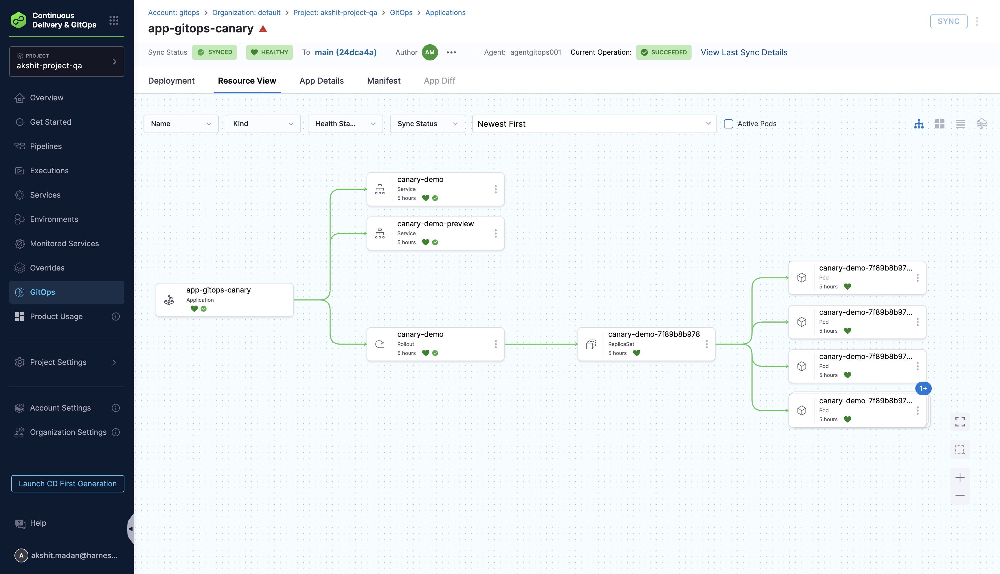
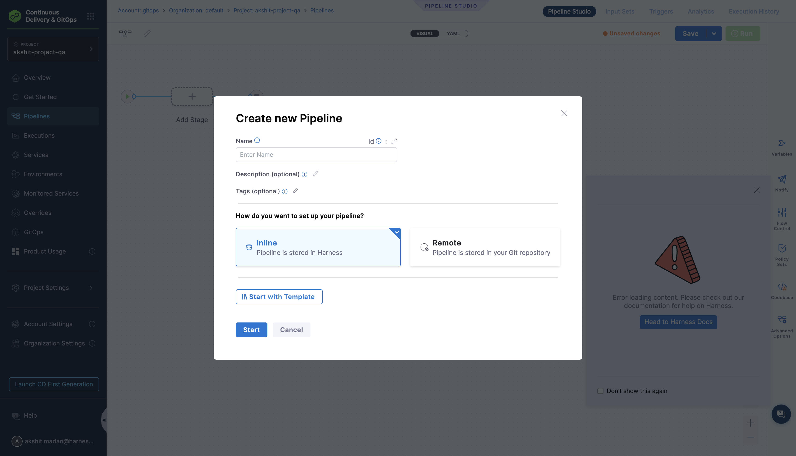
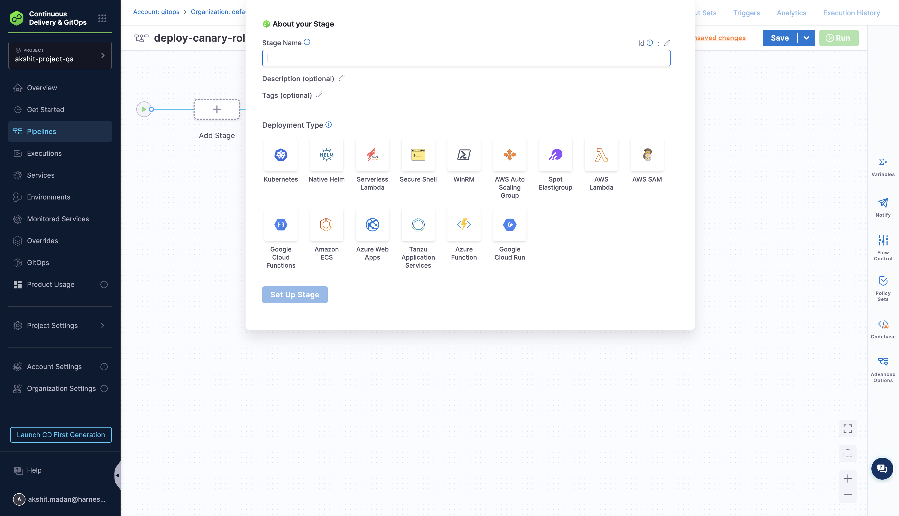
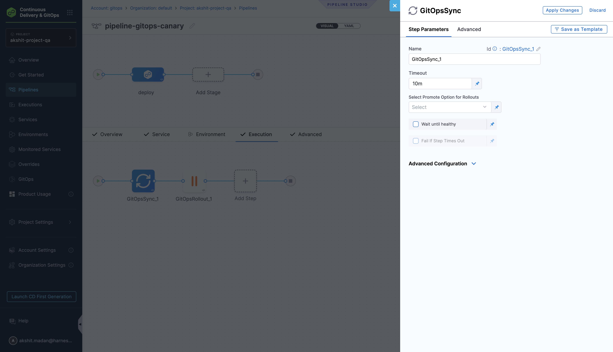
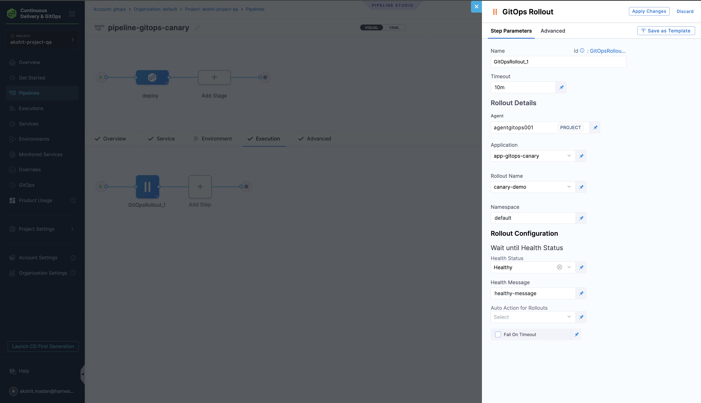
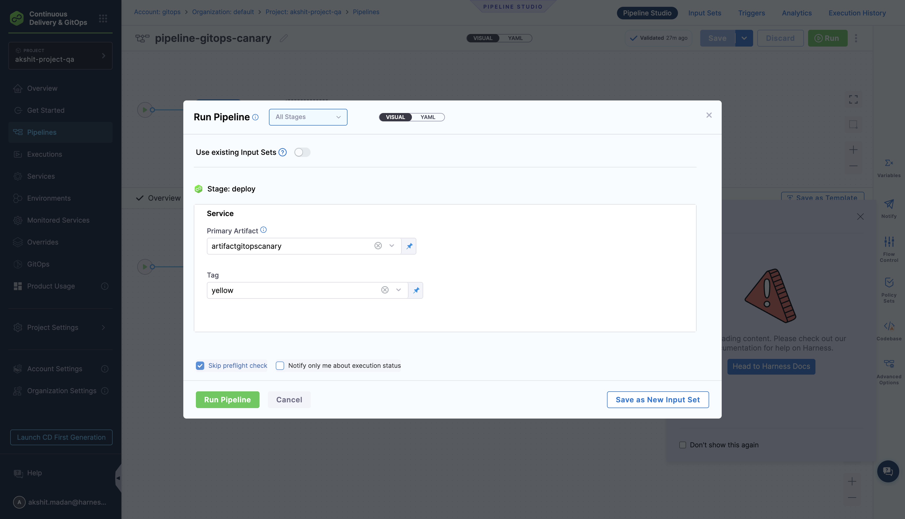
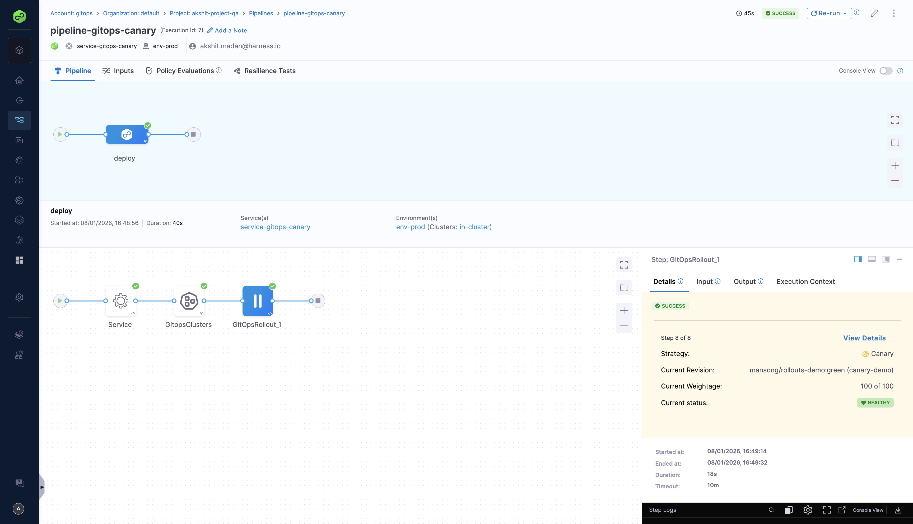
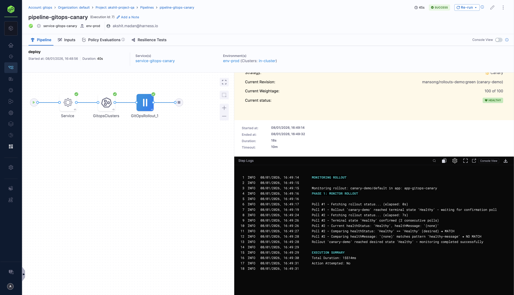

The **GitOps Rollout** step in Harness Pipelines allows you to control and manage Argo Rollouts directly from your deployment workflows. This step enables you to trigger rollouts, monitor their progression, and perform actions such as promoting, pausing, or aborting rollouts based on health checks and automated validation.

This guide provides a complete end-to-end walkthrough, from creating a GitOps Application with a Rollout resource to running a successful pipeline that manages the rollout.

## Overview

The GitOps Rollout step integrates Argo Rollouts with Harness Pipelines, enabling you to:

- **Trigger rollouts** from your CI/CD pipelines
- **Monitor rollout status** and wait for health checks to pass
- **Automate promotion** of canary or blue-green rollouts
- **Control rollout progression** with manual gates or automated actions
- **Handle failures** with configurable timeout and retry policies

This step works with Argo Rollouts that are managed through Harness GitOps applications, allowing you to orchestrate progressive deployments within your existing pipeline workflows.

## Understanding the Workflow

It's important to understand the difference between syncing the Rollout manifest and managing the rollout progression:

**GitOps Sync Step:**
- Syncs the Rollout manifest (and other resources) from Git to your Kubernetes cluster
- Ensures the Rollout resource exists and is up-to-date in the cluster
- This is about deploying/updating the manifest itself

**GitOps Rollout Step:**
- Manages and controls the rollout that's already deployed in the cluster
- Promotes canary stages, monitors health, pauses/aborts rollouts
- Controls the progression of an active rollout
- This is about managing the deployment process, not syncing files

### Typical Pipeline Flow

1. **Rollout manifest in Git** → Your `rollout.yaml` is committed to your Git repository
2. **GitOps Application** → Points to your Git repo and syncs resources to the cluster
3. **GitOps Sync step** (optional) → Triggers a sync to ensure the Rollout is deployed/updated
4. **GitOps Rollout step** → Manages the rollout progression (promote stages, monitor health, etc.)

:::tip

Think of it this way:
- **GitOps Sync** = "Deploy/update the Rollout manifest from Git to cluster"
- **GitOps Rollout** = "Control and manage the rollout that's now running (promote canary, wait for health, etc.)"

:::

## Prerequisites

Before using the GitOps Rollout step, ensure you have:

- **Argo Rollouts installed** in your cluster (see [Getting Started with Argo Rollouts](./argo-rollouts-overview.md))
- **Harness GitOps Agent** configured and connected to your cluster
- **Git repository** with your Rollout manifests ready
- Appropriate permissions to create GitOps applications and manage rollouts

## Step-by-Step Guide: End-to-End Setup

### Step 1: Prepare Your Git Repository

Your Git repository must contain the Rollout manifest and related Kubernetes resources.

#### Git Repository Structure

Your repository structure should look similar to this for Canary Deployment:

```
my-gitops-repo/
├── apps/
│   └── canary-demo/
│       ├── rollout.yaml          # Rollout manifest (required)
│       ├── stable-service.yaml   # Service for stable traffic
│       ├── canary-service.yaml   # Service for canary traffic
│       └── kustomization.yaml    # Kustomize configuration
└── README.md
```

[Check out the Argo Rollouts Examples here](https://github.com/harness-community/Gitops-Samples/tree/main/Argo-Rollouts-Examples)


### Step 2: Create a Harness GitOps Application

**You must create the GitOps Application first** before using it in a pipeline.

#### 2.1 Navigate to GitOps Applications

1. In Harness, navigate to **Deployments > GitOps > Applications**
2. Click **+ New Application**

#### 2.2 Configure Application Basic Settings

Configure the application basic information:

- **Name:** Enter a name for your application (e.g., `app-gitops-canary`)
- **GitOps Agent:** Select the GitOps Agent connected to your cluster
- **Service (optional):** Create or select a service to track this deployment
- **Environment (optional):** Create or select an environment

Click **Continue**.



#### 2.3 Configure Application Source

On the **Source** page, configure where your Rollout manifests are located:

- **Repository Type:** Git
- **Repository URL:** Your Git repository URL (e.g., `https://github.com/org/my-gitops-repo`)
- **Target Revision:** Branch or tag (e.g., `main`, `master`, `v1.0.0`)
- **Path:** Path to your Rollout manifests (e.g., `apps/canary-demo/`)

If using Kustomize:
- Leave **Kustomize** options at their defaults, or configure as needed

Click **Continue**.


#### 2.4 Configure Application Destination

Configure where the Rollout will be deployed:

- **Cluster:** Select your target cluster
- **Namespace:** Enter the namespace where the Rollout will be deployed (e.g., `default`)

Click **Create**.



#### 2.5 Sync the Application

After creating the application, you need to sync it to deploy the Rollout to your cluster:

1. In the application details page, click **Sync** (or enable auto-sync in settings)
2. Configure sync options if needed:
   - Select **Target Revision** if needed (default is usually correct)
   - Leave other options at defaults
3. Click **Synchronize**

Wait for the sync to complete and the application to reach **Healthy** state.

<!--  -->

#### 2.6 Verify Rollout is Deployed

1. Navigate to the application's **Resources** tab
2. Verify the following resources appear:
   - **Rollout** resource (e.g., `canary-demo`)
   - **Service** resources (e.g., `canary-demo`, `canary-demo-preview`)
   - **ReplicaSet** created by the Rollout
   - **Pods** managed by the Rollout

All resources should show as **Healthy**.



**Your GitOps Application is now ready!** The Rollout is deployed and synced to your cluster.

### Step 3: Create Your Pipeline

Now that your GitOps Application exists and the Rollout is synced, you can create the pipeline.

#### 3.1 Create a New Pipeline

1. Navigate to **Deployments > Pipelines**
2. Click **+ New Pipeline**
3. Enter a pipeline name (e.g., `deploy-canary-rollout`)
4. Select your project and organization



#### 3.2 Add a Deployment Stage

1. Click **+ Add Stage**
2. Select **Deploy** stage type
3. Configure the stage:

**Stage Configuration:**
- **Name:** Give your stage a name (e.g., `deploy`)
- **Service:** Select the service that matches your GitOps Application
- **Environment:** Select the environment that matches your GitOps Application
- **Infrastructure:** Select the cluster/infrastructure

:::important

**Critical:** The service, environment, and cluster must match what you configured in your GitOps Application. This is required for the GitOps Rollout step to find and manage your rollout.

:::



#### 3.3 Configure Stage Execution

1. Go to the **Execution** tab in your stage
2. You'll see default steps (Service, GitopsClusters) - these are fine
3. You can optionally add a **GitOps Sync** step if you want to sync changes before managing the rollout

**Note:** If your Rollout is already synced and healthy, you can skip the Sync step and go directly to the Rollout step.

<!--  -->

#### 3.4 Add GitOps Sync Step (Optional)

If you want to sync new changes from Git before managing the rollout:

1. Click **Add Step**
2. Search for and select **GitOps Sync**
3. Configure the step:
   - **Wait until healthy:** Check this to wait until the application is healthy
   - **Fail If Step Times Out:** Check if you want the step to fail on timeout
   - **Timeout:** Set appropriate timeout (e.g., `10m`)



#### 3.5 Add GitOps Rollout Step

:::important
To use Argo Rollouts with Harness GitOps pipelines, ensure the `CDS_GITOPS_ENABLE_ROLLOUTS_PIPELINE_UX` feature flag is enabled in your Harness account.
:::

Now add the GitOps Rollout step:

1. Click **Add Step**
2. Search for and select **GitOps Rollout** from the step library
3. Click on the step to configure it



### Step 4: Configure the GitOps Rollout Step

Configure the GitOps Rollout step with the correct settings.

#### 4.1 Configure Step Parameters

In the **Step Parameters** tab:

**Rollout Details:**

1. **Agent:**
   - Select the GitOps Agent that manages your cluster (same one used in GitOps Application)
   - This must be the same agent where your Rollout is deployed

2. **Application:**
   - Select the GitOps Application you created in Step 2 (e.g., `app-gitops-canary`)
   - The dropdown will show available GitOps Applications

3. **Rollout Name:**
   - Select the name of the Rollout resource you want to manage
   - This dropdown is populated based on Rollout resources found in the selected application
   - It must match the `metadata.name` in your Rollout manifest (e.g., `canary-demo`)

4. **Namespace:**
   - Enter or select the Kubernetes namespace where the Rollout is deployed
   - This must match the namespace in your Rollout manifest. 

<!--  -->

**Rollout Configuration:**

The GitOps Rollout step has two independent features that can be used separately or together:

<div style={{textAlign: 'center'}}>
  <DocImage path={require('./static/rollout-configuration.png')} width="90%" height="50%" title="Click to view full size image" />
</div>

**A. Wait until Health Status** - Waits and monitors until the rollout reaches a specific health status

**B. Auto Action for Rollouts** - Performs an action on the rollout (promote, restart, resume, etc.)

5. **Wait until Health Status:**
    - Select the health status to wait for before the step completes
    - If set, the step will poll the rollout status until it matches this value
    - Available options:
       - **`Healthy`** - Wait until the rollout reaches a healthy state
       - **`Degraded`** - Wait until the rollout is marked as degraded
       - **`Progressing`** - Wait while the rollout is progressing
       - **`Suspended`** - Wait until the rollout is suspended (paused)
       - **`Unknown`** - Wait until the rollout status is unknown

    :::important

    **Health Status is independent of Auto Action.** You can set just the health status, just the auto action, or both.

    :::

    - **Health Message:**
       - Optional: Enter a specific health message to match in addition to the health status
       - If provided, the step will wait until BOTH the health status AND the health message match
       - Example: When a rollout is paused at a canary step, you might set:
          - Health Status: `Suspended`
          - Health Message: `CanaryPauseStep` (or similar message indicating canary pause state)
       - This ensures the step only completes when the rollout is in the exact state you expect
       - Common values:
          - `CanaryPauseStep` – Rollout is paused at a canary step
          - `Paused` – Rollout is manually paused
          - Other messages may appear based on rollout configuration

      Note: `healthMessage` supports regex matching, so you can use patterns like:
         - `Canary.*`
         - `.*Pause.*`

    :::tip

   **Health Message Use Case:**
   
   When a canary rollout is paused at a step (e.g., after reaching 20% traffic), the health status might be `Suspended`, but you want to ensure it's specifically paused at a canary step, not for another reason. Setting both health status (`Suspended`) and health message (`CanaryPauseStep`) ensures the step only succeeds when the rollout is in that exact state.

   :::

7. **Auto Action for Rollouts:**
   - Optional: Select an action to perform on the rollout
   - This is independent of the health status setting
   - If set, the step will attempt to perform this action
   - Available options:
     - **`Promote Full`** - Automatically promote through all remaining stages (recommended for fully automated canary)
     - **`Restart`** - Restart the rollout
     - **`Resume`** - Resume a paused rollout
     - **`Abort`** - Abort the rollout
     - **`Retry`** - Retry a failed rollout


   :::important

   **Action Availability:**
   
   Actions are only available when applicable to the current rollout state. If you try to perform an action that's not possible in the current state (e.g., trying to `Promote` when the rollout is already complete), the step will fail.

   :::

8. **Fail On Timeout:**
   - Determines whether the step succeeds or fails when the timeout is reached
   - **Checked (true):** Step fails if timeout is reached before conditions are met
   - **Unchecked (false):** Step succeeds even if timeout is reached (useful for monitoring without blocking)
   - Recommended: Check this for production deployments to catch issues early
   - Only applies when waiting occurs (i.e., when Health Status is set)

**Timeout:**

9. **Timeout:**
   - Set the maximum duration the step will wait for the rollout to complete
   - Default: `10m` (10 minutes)
   - For multi-stage canary rollouts: Use `30m` to `1h` (canary with multiple stages needs time)
   - Format: Can use minutes (m), seconds (s), or hours (h)

<!--  -->

#### 4.2 Understanding Step Behavior

The GitOps Rollout step behaves differently based on which options you configure:

**Case 1: Neither Health Status nor Auto Action Set**
- Step checks the rollout status once
- Outputs the current status in step output parameters
- Completes immediately (does not wait)
- Use case: Quick status check without waiting or performing actions

**Case 2: Only Auto Action Set (No Health Status)**
- Step checks the current rollout status
- Attempts to perform the specified action immediately
- **Success:** If the action succeeds → step succeeds
- **Failure:** If the action fails or is not possible in the current state → step fails
- Use case: Perform an action on the rollout without waiting for a specific status

**Case 3: Only Health Status Set (No Auto Action)**
- Step polls the rollout status continuously
- Waits until the health status matches the selected value
- If health message is also set, waits until BOTH status and message match
- When condition is met → step succeeds
- If timeout is reached → behavior depends on "Fail On Timeout" setting
- Use case: Wait until rollout reaches a specific state before proceeding

**Case 4: Health Status + Health Message (No Auto Action)**
- Step polls continuously
- Waits until health status matches AND health message matches
- Both conditions must be true for the step to succeed
- Example: Health Status = `Suspended` + Health Message = `CanaryPauseStep`
  - Step only succeeds when rollout is suspended AND in canary pause state
- Use case: Ensure rollout is in a very specific state (more precise than status alone)

**Case 5: Both Health Status and Auto Action Set**

**First:** Waits for health status (and health message if set) to match

**Then:** Once the health condition is met, attempts to perform the auto action

**Important:** If the wait condition is NOT met (for example the step times out or the desired state isn't reached), the auto action will NOT be attempted. Whether the step ultimately succeeds or fails in that case depends on the **Fail On Timeout** setting - the action is only performed if the rollout reaches the specified state.

**Success:** If action succeeds → step succeeds

**Failure:** If action fails or is not possible → step fails

Use case: Wait for a specific state, then perform an action

Example: Wait for `Suspended` with `CanaryPauseStep` message, then perform `Resume` action

**Case 6: All Options Set (Health Status + Health Message + Auto Action)**
**First:** Waits for health status AND health message to both match

**Then:** Attempts to perform the auto action

**Important:** If the combined health status and message conditions are NOT met (for example the step times out or the exact message isn't observed), the auto action will NOT be attempted. The step's outcome in that scenario is governed by the **Fail On Timeout** setting; no auto action is performed unless the required state is reached.

**Success:** If action succeeds → step succeeds

**Failure:** If action fails → step fails

Use case: Most precise control - wait for exact state, then perform specific action

**Fail On Timeout:**
- This setting applies to all cases where waiting occurs (when health status is set)
- Determines whether the step succeeds or fails if timeout is reached before conditions are met
- Does not affect auto action behavior

**Terminal states and confirmation polling:**

- Terminal states: **Healthy** and **Degraded**. When waiting for any condition, the rollout may enter one of these terminal states.
- Confirmation: the step requires the same terminal state to be observed in two consecutive polls before it treats that state as final (this prevents transient/flapping states from ending waiting prematurely).
- Behavior when terminal state is observed twice:
   - If the observed terminal state is **Healthy**, the step stops waiting and succeeds (provided any attempted auto action also succeeds).
   - If the observed terminal state is **Degraded**, the step stops waiting and fails.

This terminal-state confirmation is applied regardless of the specific wait until health status or health message configuration: if a terminal state is detected (and confirmed by a second poll), waiting ends immediately and the step outcome follows the rules above.

#### 4.3 Review Configuration

Verify your configuration:

- ✅ Agent matches your GitOps Application
- ✅ Application matches the one you created
- ✅ Rollout Name matches the `metadata.name` in your manifest
- ✅ Namespace matches where the Rollout is deployed
- ✅ Health Status is set if you want to wait for a specific state
- ✅ Health Message is set if you need to match a specific pause/state message
- ✅ Auto Action is set if you want to perform an action on the rollout
- ✅ Timeout is sufficient for your rollout strategy
- ✅ Fail On Timeout is set appropriately for your use case

Click **Apply Changes**.

<!--  -->

### Step 5: Run the Pipeline

Now you're ready to run the pipeline and see the GitOps Rollout step in action.

#### 5.1 Save and Run

1. Click **Save** to save your pipeline
2. Click **Run** to execute the pipeline
3. The pipeline will start executing



#### 5.2 Monitor Pipeline Execution

Watch the pipeline execution:

1. **Service Step:** Should complete quickly (green checkmark)
2. **GitopsClusters Step:** Should complete quickly (green checkmark)
3. **GitOps Sync Step** (if added): Will sync the application if there are changes
4. **GitOps Rollout Step:** 
   - Will monitor the rollout status
   - Will automatically promote through canary stages (if `Promote Full` is selected)
   - Will wait for each stage to become healthy before proceeding



#### 5.3 View Rollout Progression

During execution, you can:

1. **View Step Logs:** Click on the GitOps Rollout step to see detailed logs
   - You'll see messages like: "Rollout 'canary-demo' is HEALTHY. Current weightage: 20 of 100"
   - The step will progress through stages: 20% → 40% → 60% → 80% → 100%

2. **View in GitOps UI:** Navigate to **Deployments > GitOps > Applications** to see the rollout progress in real-time

3. **View in Kubernetes:** Use `kubectl argo rollouts get rollout canary-demo -n default` to see detailed rollout status



#### 5.4 Successful Completion

When the pipeline completes successfully:

- All steps will show green checkmarks
- The GitOps Rollout step will show:
  - Status: **SUCCESS**
  - Current Weightage: **100 of 100** (fully promoted)
  - Current Status: **HEALTHY**
  - Strategy: **Canary**

<!--  -->

**Congratulations! Your GitOps Rollout pipeline is working!** 🎉

### Step 6: Understanding the Workflow

Here's what happened in your pipeline:

1. **GitOps Application** → Synced the Rollout manifest from Git to cluster
2. **GitOps Sync Step** (if used) → Ensured the application is up-to-date
3. **GitOps Rollout Step** → 
   - Monitored the rollout health
   - Automatically promoted through canary stages (20% → 40% → 60% → 80% → 100%)
   - Waited for each stage to become healthy
   - Completed when rollout reached 100% weightage and HEALTHY status

### Step 7: Triggering New Rollouts

To trigger a new rollout with a new version:

#### Option 1: Update Git and Sync

1. **Update your Rollout manifest in Git:**
   - Change the image tag/version (e.g., from `green` to `blue`)
   - Commit and push to Git

2. **Sync via GitOps Sync Step:**
   - The GitOps Sync step will detect changes and sync them
   - Or rely on auto-sync if enabled in your GitOps Application

3. **GitOps Rollout Step will manage the new rollout:**
   - Automatically promote through all canary stages
   - Monitor health at each stage

#### Option 2: Use Update GitOps App Step (PR Pipeline)

For more advanced workflows, use the **Update GitOps App** step in a PR pipeline to update the application before syncing.

## Troubleshooting

### Common Issues and Solutions

#### Issue 1: Rollout Not Found Error

**Error:**
```
Error: Rollout argoproj.io rollout-canary not found as part of application app-gitops-canary
```

**Causes:**
1. Wrong Rollout Name - doesn't match `metadata.name` in manifest
2. Wrong Namespace - doesn't match where Rollout is deployed
3. Rollout not synced - GitOps Application hasn't synced the Rollout yet
4. Wrong Application selected

**Solutions:**
1. **Verify Rollout Name:**
   - Check the exact name in your Rollout manifest: `metadata.name`
   - Ensure it matches what you selected in the step
   - Use: `kubectl get rollouts -n <namespace>` to see actual names

2. **Verify Namespace:**
   - Check where the Rollout is actually deployed
   - Ensure it matches the namespace in the step configuration
   - Use: `kubectl get rollouts --all-namespaces`

3. **Verify Rollout is Synced:**
   - Go to **Deployments > GitOps > Applications > [Your App] > Resources** tab
   - Verify the Rollout resource appears in the list
   - If missing, sync the application first

4. **Verify Application:**
   - Ensure you selected the correct GitOps Application in the step
   - The Application must manage the cluster where the Rollout exists

#### Issue 2: Action Not Available Error

**Error:**
```
Error: Action 'retry' failed: Action not available. Available actions: restart
```

**Cause:**
- Selected an action that's not applicable to the current rollout state
- Rollout is already complete (100% weight, HEALTHY) and you're trying to promote

**Solutions:**
1. **Check Rollout Status:**
   - If rollout is already complete (HEALTHY, 100% weight), you don't need the step
   - Or use `Restart` if you want to restart it

2. **Use Appropriate Action:**
   - For ongoing rollouts: Use `Promote Full` or `Promote`
   - For completed rollouts: Use `Restart` or skip the step
   - For paused rollouts: Use `Resume`

3. **Add Conditional Execution:**
   - Use conditional execution to skip the step if rollout is already complete
   - Check rollout status before running the step

<!--  -->

#### Issue 3: Health Check Timeout

**Error:**
```
Step timed out waiting for rollout to reach healthy state
```

**Causes:**
1. Rollout strategy has long pause durations
2. Health checks taking too long
3. Insufficient timeout value

**Solutions:**
1. **Review Rollout Strategy:**
   - Check pause durations in your Rollout manifest
   - Reduce pause times if testing
   - For production, ensure timeout accounts for all stages

2. **Increase Timeout:**
   - Set timeout to `30m` or `1h` for multi-stage canary rollouts
   - Consider total time: (number of stages × stage duration) + buffer

3. **Check Health Checks:**
   - Verify application health checks are working
   - Check pod readiness and liveness probes

#### Issue 4: Step Fails Immediately

**Causes:**
1. GitOps Agent not connected or accessible
2. Insufficient permissions
3. Application not healthy

**Solutions:**
1. **Verify GitOps Agent:**
   - Check agent is online and connected
   - Verify agent has access to the target cluster
   - Check agent logs for connection issues

2. **Check Permissions:**
   - Ensure agent has RBAC permissions to manage rollouts
   - Verify agent can access the target namespace

3. **Verify Application Health:**
   - Go to GitOps Applications and verify application is Healthy
   - Sync the application if needed
   - Wait for sync to complete before running pipeline

### Getting Help

If you encounter issues not covered here:

1. **Check Step Logs:** Detailed error messages are in the step execution logs
2. **Check Rollout Status:** Use `kubectl argo rollouts get rollout <name> -n <namespace>`
3. **Review GitOps Application:** Verify application and resource status in Harness UI
4. **Check Documentation:** Review [Argo Rollouts documentation](https://argoproj.github.io/argo-rollouts/)

## Advanced Examples

For detailed advanced examples, see:

- **[GitOps Sync with Multiple Rollout Steps](./gitops-sync-with-multiple-rollouts-steps.md)** - Learn how to pass values between GitOps Rollout steps using Harness expressions

## Related Resources

- [Getting Started with Argo Rollouts](./argo-rollouts-overview.md)
- [GitOps Pipeline Steps](/docs/continuous-delivery/gitops/pr-pipelines/gitops-pipeline-steps.md)
- [Argo Rollouts Official Documentation](https://argoproj.github.io/argo-rollouts/)
- [Argo Rollouts kubectl Plugin](https://argoproj.github.io/argo-rollouts/features/kubectl-plugin/)
