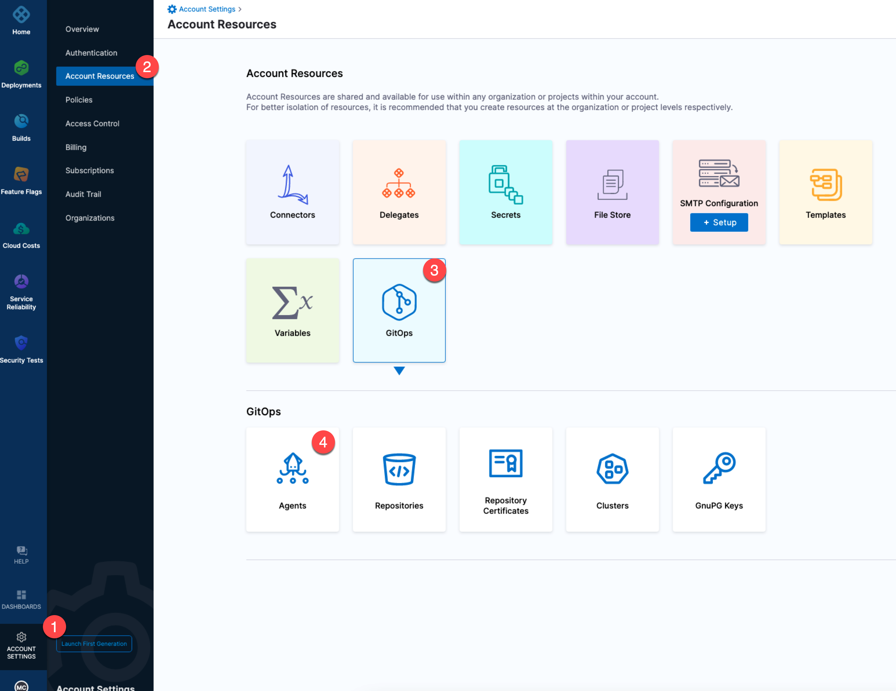
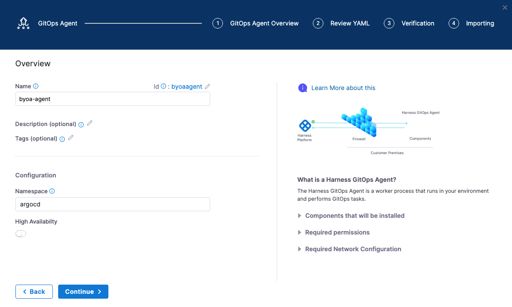
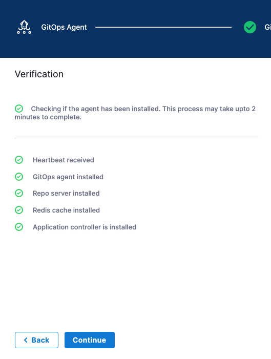
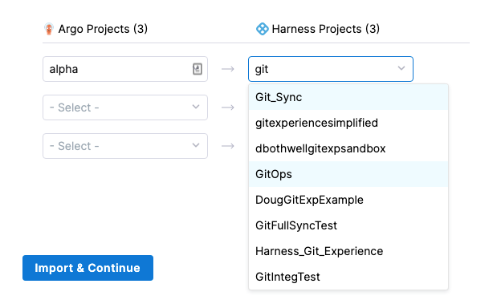
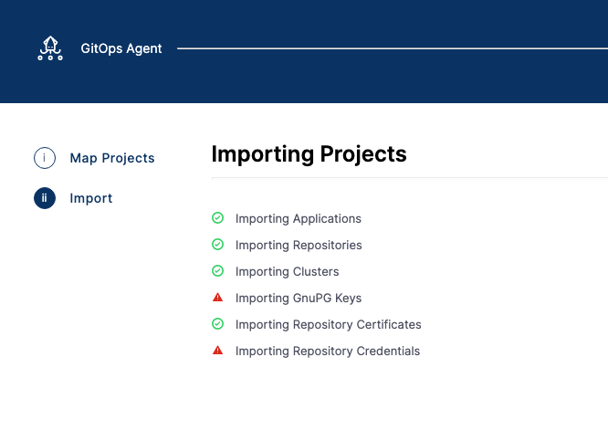
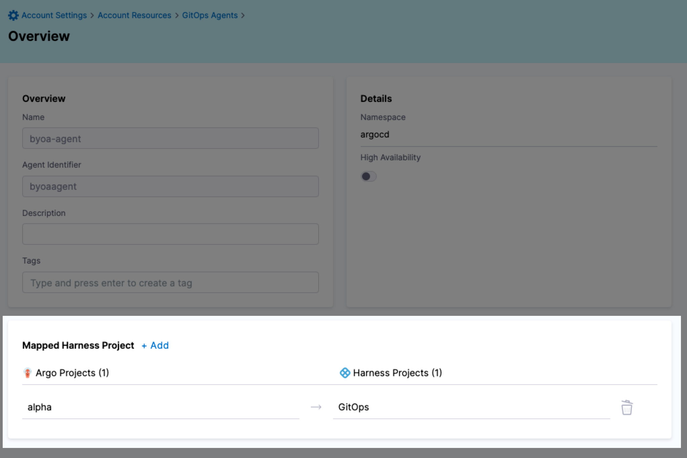
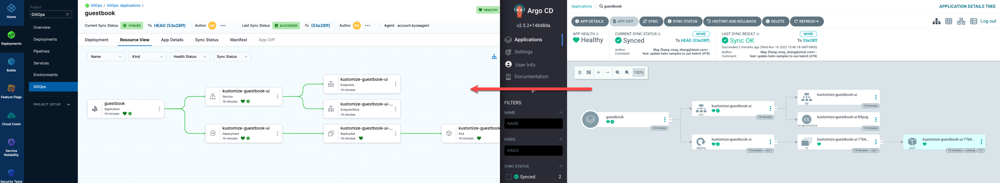
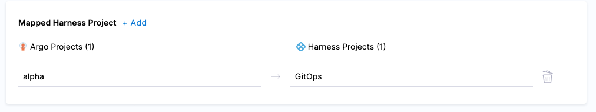
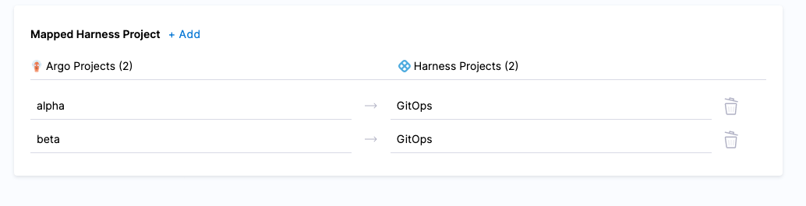
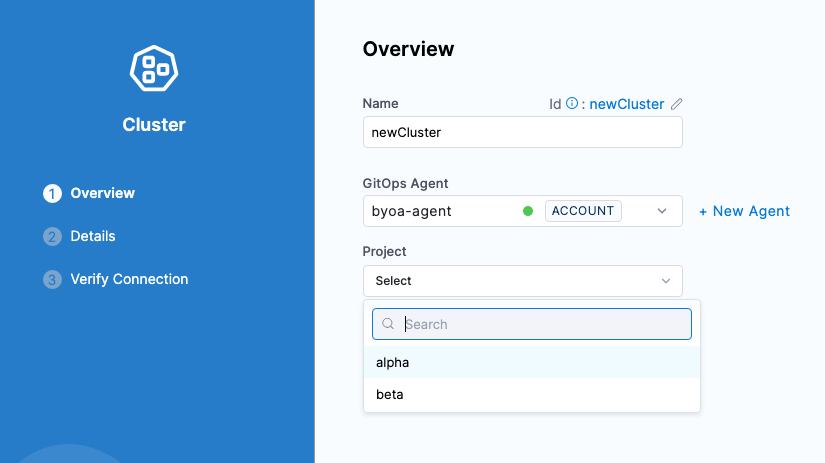

This topic describes how to manage a Bring Your Own Argo CD (BYOA) setup in Harness.

## Bring Your Own Argo CD (BYOA)

You can import an existing Argo CD setup and it's entities directly into Harness GitOps. We call this Bring Your Own Argo CD (BYOA).

In addition, when you install the Harness GitOps Agent in your existing Argo CD cluster as part of BYOA, you can map Argo CD projects to Harness Projects. Harness will import all the Argo CD project entities (applications, clusters, repos, etc.) and create them in Harness automatically.

Also, whenever new entities are created in the mapped Argo CD projects, they are added to Harness automatically.

With a non-BYOA setup, Harness installs and manages Argo CD for you when you install a Harness GitOps Agent. 

For more information on how to create a non-BYOA setup, go to [Install a Harness GitOps Agent](/docs/continuous-delivery/gitops/use-gitops/install-a-harness-git-ops-agent.md).

### Mapping existing Argo CD projects across different Harness scopes

To map Argo CD projects to Harness Projects, you need to install the Harness GitOps Agent at the Harness account or org level. Then you can map the Argo CD projects to any of the Harness Projects in the account or org.

If you install the GitOps Agent at the Harness Project level, you can only map to the current Project.

In the following example, we will install the GitOps Agent at the Harness account level.

## Installing a GitOps Agent in an existing Argo CD setup (BYOA)

The following steps show you how to install a GitOps Agent into an existing Argo CD namespace and then map your existing projects to your Harness Project.

1. In your Harness account, click **Account Settings**.
2. click **GitOps**, and then click **Agents**.
   
   

3. Click **New GitOps Agent**.
4. In **Agent Installation**, in **Do you have any existing Argo CD instances**, click **Yes**, and then click **Start**.
   
   

5. In **Name**, enter a name for your agent, such as **byoa-agent**.
6. In **GitOps Operator**, select one of the following:

   * **Argo**. Uses Argo CD as the GitOps reconciler.
   * **Flux**. Uses Flux as the GitOps reconciler. For more information, go to [Manage Flux applications with Harness GitOps](/docs/continuous-delivery/gitops/connect-and-manage/flux/use-flux.md).

7. In **Namespace**, enter the namespace where Argo CD is hosted. The default is **argocd**.
   
   

8. Click **Continue**.
9. In **Review YAML**, click **Download & Continue**.

   :::note

   Alternatively, the **Helm Chart** option lets you download a `helm-chart` file for the Harness GitOps Agent. You can download this file and install it in your Harness GitOps Agent cluster if you prefer using Helm.

   ::: 

10. Log into the cluster hosting Argo CD.
11. Run the install command provided in the Agent installer, such as `kubectl apply -f gitops-agent.yml -n argocd`. You'll see output similar to this:
    ```bash
    serviceaccount/byoa-agent-agent created  
    role.rbac.authorization.k8s.io/byoa-agent-agent created  
    clusterrole.rbac.authorization.k8s.io/byoa-agent-agent created  
    rolebinding.rbac.authorization.k8s.io/byoa-agent-agent created  
    clusterrolebinding.rbac.authorization.k8s.io/byoa-agent-agent created  
    secret/byoa-agent-agent created  
    configmap/byoa-agent-agent created  
    deployment.apps/byoa-agent-agent created  
    configmap/byoa-agent-agent-upgrader created  
    role.rbac.authorization.k8s.io/byoa-agent-agent-upgrader created  
    rolebinding.rbac.authorization.k8s.io/byoa-agent-agent-upgrader created  
    serviceaccount/byoa-agent-agent-upgrader created  
    cronjob.batch/byoa-agent-agent-upgrader created
    ```
12.  Back in the Harness GitOps Agent installer, click **Continue**.
   
   The Agent has registered with Harness.
   
   

13.  Click **Continue**. The **Map Projects** settings appear.

:::warning

Make sure that you deploy only one GitOps Agent per Argo CD namespace. Deploying multiple Agents created in different projects or accounts can lead to unpredictable behaviour.

Harness supports mapping Argo CD projects into Harness projects through the Agent that controls the Argo CD deployment. When importing Argo CD projects, Harness maps Argo CD projects into Harness projects that belong to one account.

Enabling multiple Agents in one Argo CD namespace implies cross-account resource sharing which Harness does not support.

:::

## Map existing Argo Projects

To map your existing Argo CD projects to Harness Projects, you simply select the Argo CD projects you want to use, and select the corresponding Harness Project to map.

1. In **Map Projects**, in **Select your Argo Projects to Import**, click the Argo CD projects you want to map.
   
   

2. In each row, select the Argo project and corresponding Harness Project.
   
   

:::note
Do not map the same Argo CD project to multiple Harness Projects.
:::

3. Click **Import & Continue**.
   
   The Argo CD projects are imported.

   Here's an example where the Argo CD applications, repositories, repository certs, and clusters are imported.

   

1. Click **Finish**. The mapping is displayed in the Agent details.
   
   
   
2. Click **Save**.

## Verify mapping

Next, look in the mapped Harness Project to see the imported Argo CD entities.

1. In your Harness Project, click **GitOps**, and then click **Applications**.
   You can see the imported application.
   
   

2. Click **Settings**, and then click **Repositories**.
   You can see the imported repositories.
3. Click **Settings**, and then click **Clusters**.
   You can see the imported clusters.

Do the same for any other mapped project entities.

## Adding new mappings to existing Agent

You can add new mappings to an existing Agent in the Agent's **Mapped Harness Project** settings.

1. In Harness, open an existing Agent.
2. Click **Edit**. In this example, I already have the Argo CD project **alpha** mapped to the Harness Project **GitOps**.
   
   
   
   Let's add a new mapping.

3. In **Mapped Harness Project**, click **Add**.
4. In **Map Projects**, in **Select your Argo Projects to Import**, select the new Argo CD project to map. Do not select a project you have already mapped.
5. Map the new Argo CD project to a Harness Project and click **Import & Continue**.
   Do not re-map an existing mapping. Harness will throw an error.
   
   

6. When the import is complete, click **Finish**.  

Both projects are now mapped.



## Adding Argo CD entities to Harness automatically

When an Agent contains Argo CD project mappings to a Harness Project, any new entities added to the Argo CD project are added to the mapped Harness Project automatically.

Try adding a new Argo CD repository to the mapped Argo CD project.

Once it's saved in Argo CD, go to Harness and look at the GitOps Repositories in the mapped Harness Project. A new repo is added.

### Automatically added Argo CD repositories

When adding Argo CD repositories, Harness automatically generates the name of Repository when it's added to Harness. This is necessary because Argo CD has no name setting for its repos.

The process for generating the name is: take the repo name, remove any dashes, and then add an underscore and a unique suffix.

For example, the Argo CD repo `https://github.com/argoproj/gitops-engine.git` is named `gitopsengine_kmjzyrbs` in Harness


### Make sure that your Argo CD entities are visibile in the Harness UI

In some Argo CD versions, you are not required to specify a project for your entities. However, for the entities to be visible in the Harness UI, you must associate the entities with a project. 

If you are unable to edit an entity from the Argo CD UI, you can edit that entity in the cluster so that they have a project and other required values. The entities are stored in different formats in the cluster. For example, clusters, repositories, and repository credential templates are stored in `Secret`, and GnuPG keys and repository certificates are stored in `ConfigMap` in the namespace in which Argo CD is installed. 

Edit the respective secret of the entity and add the fields `project` and `name` in the `data` or `stringData` block. For examples, please go to [Manage an Argo CD configuration by using Harness GitOps](/docs/continuous-delivery/gitops/connect-and-manage/argocd/manage-argo-configs.md#git-configuration-files).


## Creating GitOps Entities with multiple projects

When you have multiple Argo CD projects mapped to your Harness Project, you can choose which Argo CD project to use when you create a new GitOps entity **(Cluster / Repository / Application)** in your Harness Project.

By default, in the Argo CD console, when you create a cluster it is not associated with an Argo CD project. You can add the cluster using the `argocd cluster add` CLI and its `--project` option.

The following steps are common to all three entities when you create them in Harness, however we will demonstrate this for GitOps clusters:

1. While creating a GitOps cluster in the Harness Project that is mapped to multiple Argo CD projects, under **GitOps Agent**, select the Agent where you set up the mappings. The **Project** setting appears.
   
   If the Agent has only 1 Argo CD project mapped, the **Project** setting is not shown.

2. In **Project**, select the Argo CD project with the cluster you want to import.
   
   

When you have completed [setting up the Cluster](/docs/continuous-delivery/gitops/get-started/harness-cd-git-ops-quickstart.md#step-3-add-a-harness-gitops-cluster), it will appear in the GitOps Cluster list.

## Notes

* Harness honors Argo CD project permissions. If the project selected for the Harness Application does not have permission for the repository or cluster, then Harness will return a permission error. You will need to go into Argo CD and adjust the projects **scoped repositories** and **destinations**.
* A non-BYOA setup does not support multiple Argo CD mappings to a single Harness Project.

