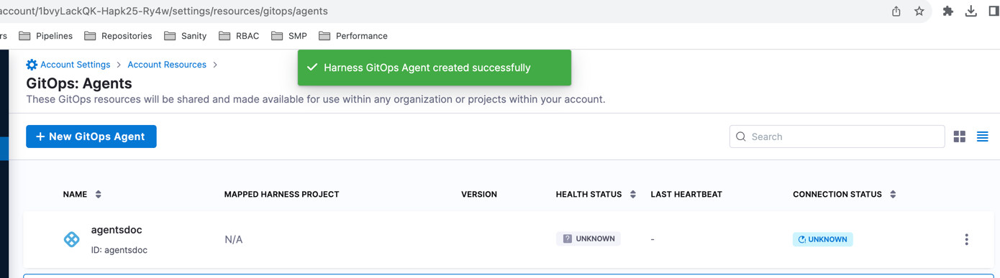

As an alternative to deploying and managing GitOps agents on your own Kubernetes clusters, you can use Harness Hosted GitOps to host the agents required for application management and deployment.

:::note

Hosted GitOps is only available at the Harness account level, and there is a limit of one Hosted GitOps agent per Harness account.

:::

## Set up Hosted GitOps

To use a Harness Hosted GitOps agent, do the following:

1. In you Harness account, go to **Account Settings**, then select **Account Resources**.
2. Select **GitOps**.   
3. Select **GitOps Agents**.
4. Select **New GitOps Agent**, and select **Hosted Agent**.

  <DocImage path={require('./static/76450d7cf9497677c96fb1f5d788cf80736e70b62228317f53197df7a3e9cbff.png')} width="60%" height="60%" title="Click to view full size image" />  

5. In **Agent Name**, enter a name for the agent and Harness will create a unique identifier.
6. Select **Provision Now**.
   
   After agent is successfully provisioned, it takes some time for agent to become ready.
   
     

Wait until the **Health Status** is **Healthy** and the **Connection Status** is **Connected**.  

Additionally, if your destination cluster is behind a firewall you can provide a list of IPs that should be allowed to access the cluster. For more information. go to [Harness hosted GitOps IP addresses](/docs/platform/references/allowlist-harness-domains-and-ips#add-harness-hosted-gitops-ips-to-the-allowlist).

When your agent is ready and authorized to access your clusters, you can start creating GitOps repositories, clusters, and applications. For more information, go to [GitOps Quickstart](/docs/continuous-delivery/gitops/get-started/harness-cd-git-ops-quickstart.md).
