This topic describes how to install a Harness GitOps Agent, a worker process that runs in your environment and performs GitOps tasks.

You need to set up an Agent before you can set up a Cluster, Repository, or Application, as the Agent is selected in all three of these.

Typically, you install the Agent in the target cluster, but you can install it any cluster and it can connect to remote clusters using the credentials you provide.

## Requirements

The Harness GitOps Agent has the following requirements:

* **vCPUs, Memory, Disk Size:** the Harness GitOps Agent only needs 1vCPUs, 2GB memory, 20GB disk, but you'll also be running Kubernetes and your deployed services. Consider the total CPU and memory needs for the Agent and the applications and services in your cluster.
* **Networking:** outbound HTTPS for the Harness connection to **app.harness.io**, **github.com**, and **hub.docker.com**. Allow TCP port 22 for SSH.
* A **Kubernetes service account** with the permissions need to create your desired state. The Harness GitOps Agent requires either `cluster-admin` or admin permissions in the target namespace:
	+ Create Deployment, Service, StatefulSet, Network Policy, Service Account, Role, ClusterRole, RoleBinding, ClusterRoleBinding, ConfigMap, Secret.
	+ Permission to apply CustomResourceDefinition.  
	For more information, see [User-Facing Roles](https://kubernetes.io/docs/reference/access-authn-authz/rbac/#user-facing-roles) from Kubernetes.
* **Namespace:** The target namespace in the cluster must be created already. Harness will not create the namespace.

## Using existing Argo CD projects

Typically, when you set up a Harness GitOps Agent you install a new Harness GitOps Agent in your target cluster along with other services (Repo server, Redis cache, Application controller, ApplicationSet controller).

In some cases, you might already have an Argo CD Project running in your target cluster. In this case, you can select this Project when you set up the Harness GitOps Agent.

You can use an existing Argo CD Project when you already have services deployed to different environments from that Argo CD instance.

If you don't use an existing Argo CD Project, you will create GitOps Applications, Repos, Clusters, etc in Harness. You may have to delete some of the already existing entities in Argo CD cluster, for example, repositories or cluster you already have with the same URL.

In both cases, you will install the Harness GitOps Agent process.

If you use an existing Argo CD instance, then Harness will use the following existing processes in the cluster:

* Repo server
* Redis cache
* Application controller
* ApplicationSet controller

If you do not use an existing Argo CD instance, then Harness will install the following:

* GitOps agent
* Repo server
* Redis cache
* Application controller
* ApplicationSet controller

See [Harness GitOps Basics](/docs/continuous-delivery/gitops/get-started/harness-git-ops-basics.md).

## Create a GitOps Agent

Ensure your Harness Project has the **Continuous Delivery** module enabled.

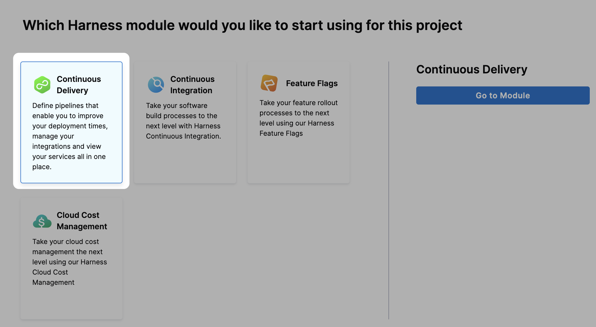

In your Harness Project, click **GitOps**.

The Harness GitOps **Overview**, **Applications**, and **Settings** appear. If this is the first time GitOps has been set up in the Project, the Applications will be empty.

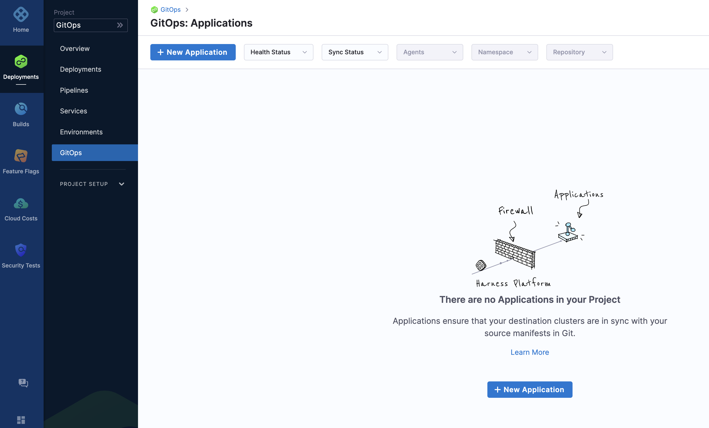

All entities other than Applications are in **Settings**.

Select **Settings**. The Harness GitOps settings appear.

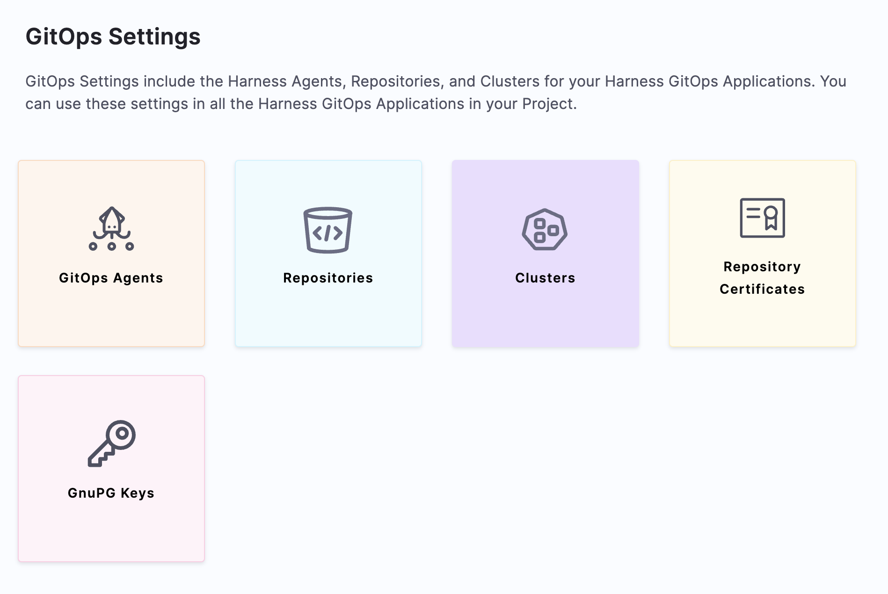

Select **GitOps Agents**.

Select **New GitOps Agent**. The Agent wizard appears.

:::note

For the example in this topic, a regular Harness GitOps agent is created without an existing Argo CD instance (non-BYOA setup). For creating a BYOA setup (with an existing Argo CD installation), please refer to [Bring Your Own Argo CD into Harness GitOps](/docs/continuous-delivery/gitops/connect-and-manage/multiple-argo-to-single-harness)

:::

In **Agent Installations**, you can choose to install a Harness GitOps Agent with or without an existing Argo CD instance.

Select **No**, and then click **Start**.

In **Name**, enter the name for the new Agent.

In **GitOps Operator**, select one of the following:
  
  * **Argo**. Uses Argo CD as the GitOps reconciler.
  * **Flux**. Uses Flux as the GitOps reconciler. [Manage Flux applications with Harness GitOps](/docs/continuous-delivery/gitops/connect-and-manage/use-flux).

In **Namespace**, enter the namespace where you want to install the Harness GitOps Agent.

If **Namespaced** is selected, the Harness GitOps agent is installed without cluster-scoped permissions, and it can access only those resources that are in its own namespace. You can select **Skip Crds** to not install Argo CD CRDs to avoid a collision if already installed. 

Note that if you remove CRDs, you may loose your Argo CD objects like applications or projects.

Select **Next**. The **Download YAML** or **Download Helm Chart** settings appear.

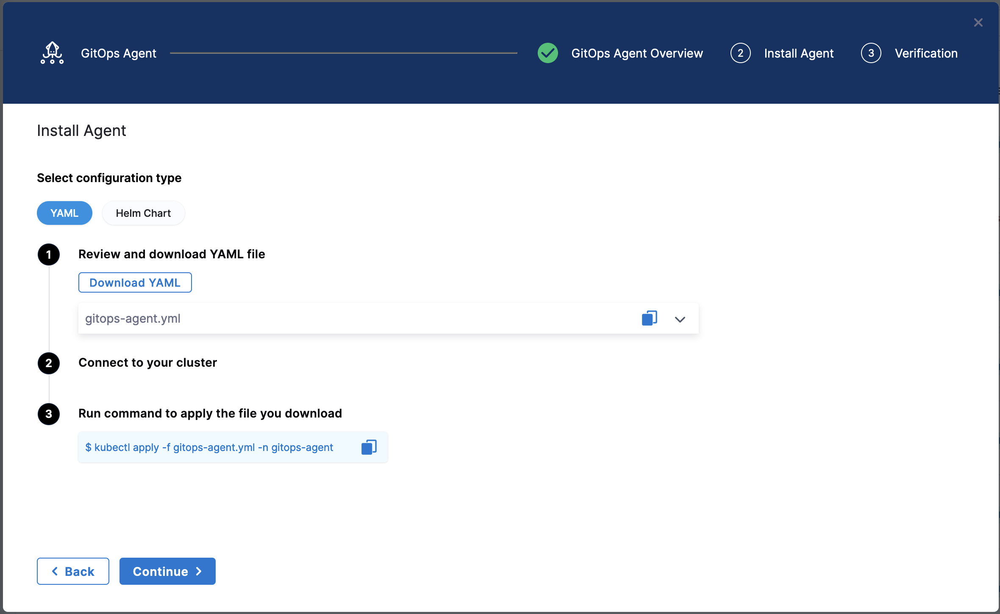

The **YAML** option lets you download the manifest YAML for the Harness GitOps Agent. You can download this YAML file and run it in your Harness GitOps Agent cluster.

The **Helm Chart** option lets you download a `helm-chart` file for the Harness GitOps Agent. You can download this file and install it in your Harness GitOps Agent cluster.

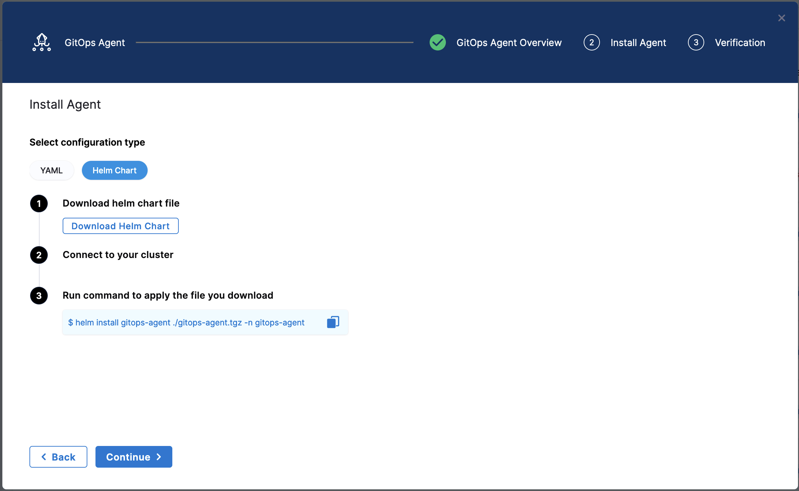

:::note

For Helm based installations, if your account is behind the feature flag `GITOPS_AGENT_HELM_V2`, you will be able to download an `override.yaml` file which will contain the Helm Value overrides to apply, and you can use the commands mentioned to install the agent using the [public Helm Repository](https://harness.github.io/gitops-helm/) for the GitOps Agent.

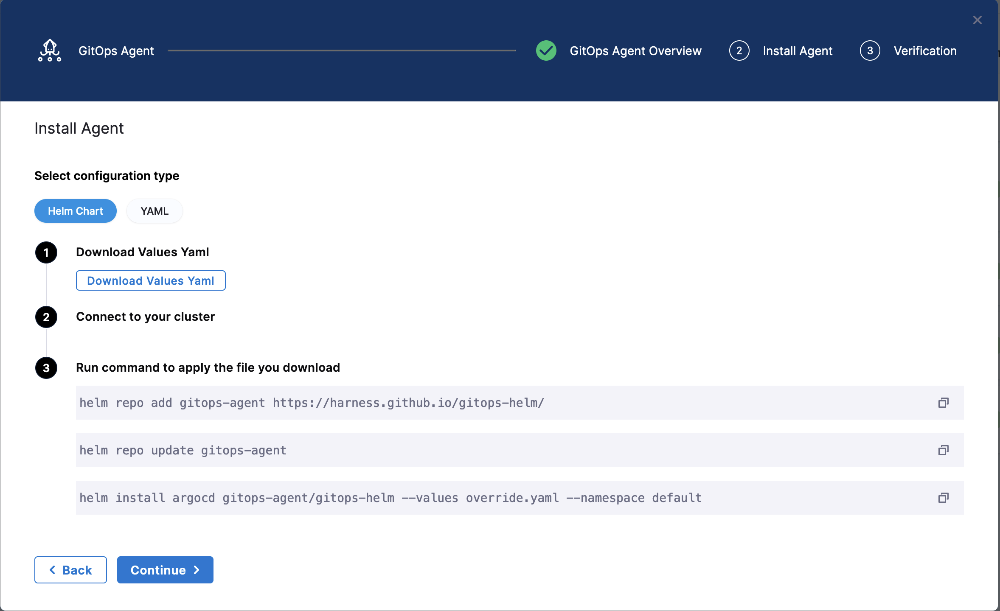

Contact [Harness Support](mailto:support@harness.io) to enable this feature.

:::

## Install the Agent

Select **Download & Continue**. You are prompted to save the YAML file.

Open a terminal and navigate to the folder where you downloaded the YAML file.

In the same terminal, log into the Kubernetes cluster where you want to install the Agent.

For example, here's a typical GKE login:


```
gcloud container clusters get-credentials <cluster_name> --zone us-central1-c --project <project_name>
```

In case of **YAML**, run the following command to apply the YAML file you downloaded (in this example, the namespace entered in the **Namespace** setting is `default`):

```
kubectl apply -f gitops-agent.yaml -n default
```

In case of **Helm Chart**, run the following command to install the `helm-chart` file you downloaded (in this example, the namespace entered in the **Namespace** setting is `default`):

```
helm install gitops-agent ./gitops-agent.tgz -n default
```

:::note

For Helm based installations, if your account is behind the feature flag `GITOPS_AGENT_HELM_V2`, you will be able to download an `override.yaml` file which will contain the Helm Value overrides to apply, and you can use the commands mentioned to install the agent using the [public Helm Repository](https://harness.github.io/gitops-helm/) for the GitOps Agent.

```
helm repo add gitops-agent https://harness.github.io/gitops-helm/
helm repo update gitops-agent
helm install argocd gitops-agent/gitops-helm --values override.yaml --namespace default
```
You can use `--set argo-cd.crds.install=false` to skip CRDs installation to avoid collision if CRDs were already installed with previous installation of GitOps Agent or Argo CD.	

Contact [Harness Support](mailto:support@harness.io) to enable this feature.

:::

In the following output example you can see all of the Harness GitOps objects created in Kubernetes.

This example output is for installing a new Harness GitOps Agent without using an existing Argo CD instance using the YAML.

```
% kubectl apply -f harness-gitops-agent.yaml -n default  
networkpolicy.networking.k8s.io/argocd-application-controller created
networkpolicy.networking.k8s.io/argocd-applicationset-controller created
networkpolicy.networking.k8s.io/argocd-repo-server created
networkpolicy.networking.k8s.io/argocd-redis created
serviceaccount/argocd-application-controller created
serviceaccount/argocd-applicationset-controller created
serviceaccount/argocd-repo-server created
serviceaccount/argocd-redis created
serviceaccount/gitops-agent created
serviceaccount/gitops-agent-upgrader created
secret/argocd-secret created
secret/gitops-agent created
configmap/argocd-cm created
configmap/argocd-cmd-params-cm created
configmap/argocd-gpg-keys-cm created
configmap/argocd-rbac-cm created
configmap/argocd-ssh-known-hosts-cm created
configmap/argocd-tls-certs-cm created
configmap/gitops-agent created
configmap/gitops-agent-upgrader created
customresourcedefinition.apiextensions.k8s.io/applications.argoproj.io configured
customresourcedefinition.apiextensions.k8s.io/applicationsets.argoproj.io configured
customresourcedefinition.apiextensions.k8s.io/appprojects.argoproj.io configured
clusterrole.rbac.authorization.k8s.io/argocd-application-controller-default created
clusterrole.rbac.authorization.k8s.io/argocd-repo-server-default created
clusterrole.rbac.authorization.k8s.io/example-agent created
clusterrolebinding.rbac.authorization.k8s.io/argocd-application-controller-default created
clusterrolebinding.rbac.authorization.k8s.io/argocd-repo-server-default created
clusterrolebinding.rbac.authorization.k8s.io/example-agent created
role.rbac.authorization.k8s.io/argocd-application-controller created
role.rbac.authorization.k8s.io/argocd-applicationset-controller created
role.rbac.authorization.k8s.io/argocd-repo-server created
role.rbac.authorization.k8s.io/argocd-server created
role.rbac.authorization.k8s.io/gitops-agent created
role.rbac.authorization.k8s.io/gitops-agent-upgrader created
rolebinding.rbac.authorization.k8s.io/argocd-application-controller created
rolebinding.rbac.authorization.k8s.io/argocd-applicationset-controller created
rolebinding.rbac.authorization.k8s.io/argocd-repo-server created
rolebinding.rbac.authorization.k8s.io/argocd-server created
rolebinding.rbac.authorization.k8s.io/gitops-agent created
rolebinding.rbac.authorization.k8s.io/gitops-agent-upgrader created
service/argocd-applicationset-controller-metrics created
service/argocd-applicationset-controller created
service/argocd-repo-server-metrics created
service/argocd-repo-server created
service/argocd-server created
service/argocd-redis created
deployment.apps/argocd-applicationset-controller created
deployment.apps/argocd-repo-server created
deployment.apps/argocd-server created
deployment.apps/argocd-redis created
deployment.apps/gitops-agent created
statefulset.apps/argocd-application-controller created
cronjob.batch/gitops-agent-upgrader created
ingress.networking.k8s.io/argocd-applicationset-controller created
```
:::note

This list will have slight differences on accounts where the feature flag `GITOPS_AGENT_HELM_V2` is not enabled. Contact [Harness Support](mailto:support@harness.io) to enable this.

If the Harness GitOps Agent is being deployed to a cluster running Kubernetes v1.21 or less, Harness requires you replace `apiVersion: apiextensions.k8s.io/v1` with `apiVersion: apiextensions.k8s.io/v1beta1` in the deployment YAML file.

:::

Back in Harness, select **Continue**.

Harness indicates that the Harness GitOps Agents is registered.

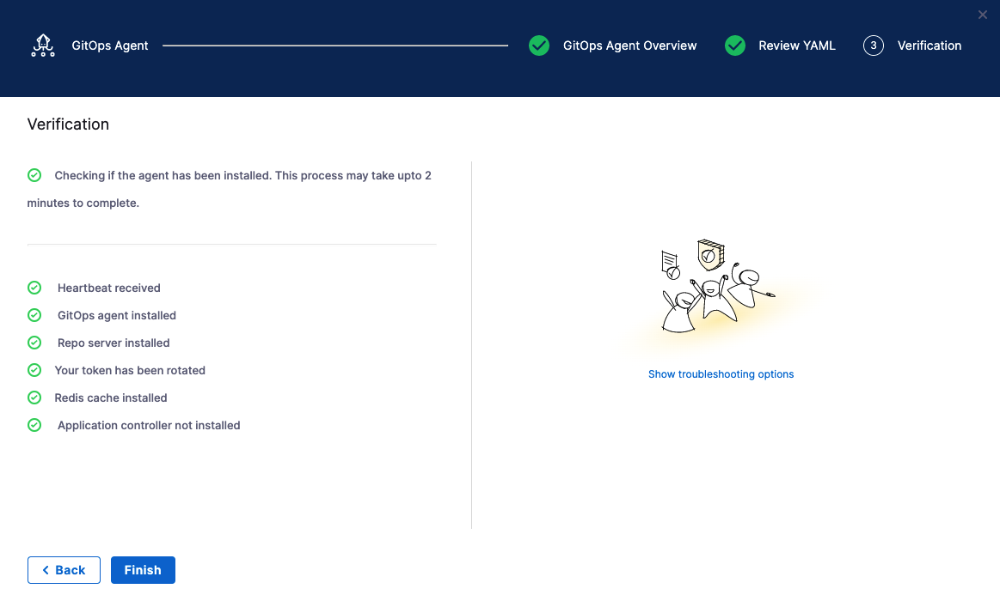

Select **Continue**.

When you are finished, the **Agents** list shows the new Agent as **Healthy** and **Connected**.

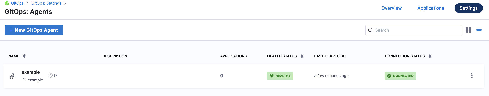

In your cloud platform Kubernetes cluster you can see the agent workload:

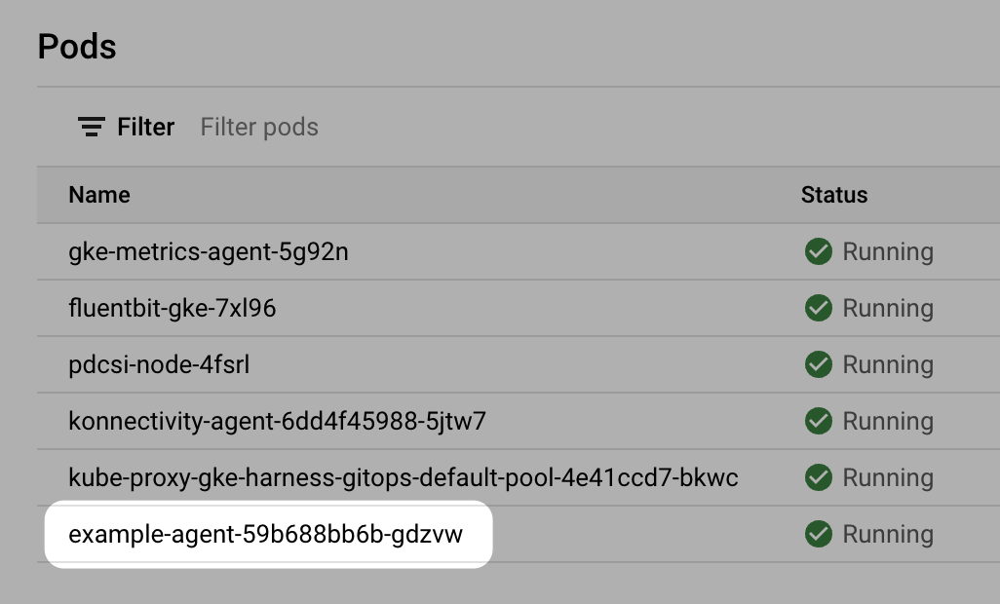

Now that you have the Harness GitOps Agent installed, running, and registered, you can configure the remaining components.

## Argo CD and Harness project mapping

Once you have installed the Agent, when you create Application, Cluster, or Repository in Harness project, Harness will create its own Argo CD project in the cluster and name it with a random string.

**Once you use this Agent to add another entity,** such as a Cluster or Repository, Harness will then map this new Argo CD project to a Harness Project identifier (Id). You will see this mapping in Harness:

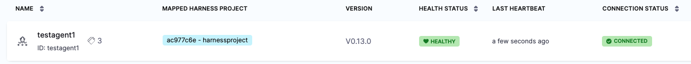

If you used an existing Argo CD Project, you will see the existing Argo CD Project mapped to your Harness Project Id:

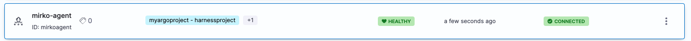

See [Entity Identifier Reference](/docs/platform/references/entity-identifier-reference).

### Mapping existing Argo CD projects to Harness projects for BYOA

When you install a Harness GitOps Agent in an existing Argo CD namespace, Harness can import your existing Argo CD entities into Harness GitOps. We call this Bring Your Own Argo CD (BYOA).

In addition, when you install the Harness GitOps Agent in your existing Argo CD cluster, you can map Argo CD projects to Harness Projects. Harness will import all the Argo CD project entities (applications, clusters, repos, etc) and create them in Harness automatically.

Also, whenever new entities are created in mapped Argo CD projects, they are added to Harness automatically.

For steps on setting up the mapping and import, go to [Map existing Argo projects](/docs/continuous-delivery/gitops/connect-and-manage/multiple-argo-to-single-harness#map-existing-argo-projects).

## Proxy support

The Harness GitOps Agent can work on environments where traffic is routed through a proxy. 

To do so, add your proxy settings to your GitOps agent when creating your agent.

1. Expand the **Advanced** dropdown menu in the **Overview** page. 
2. Find the **Proxy Settings** as seen below and fill in the relevant fields for your proxy.

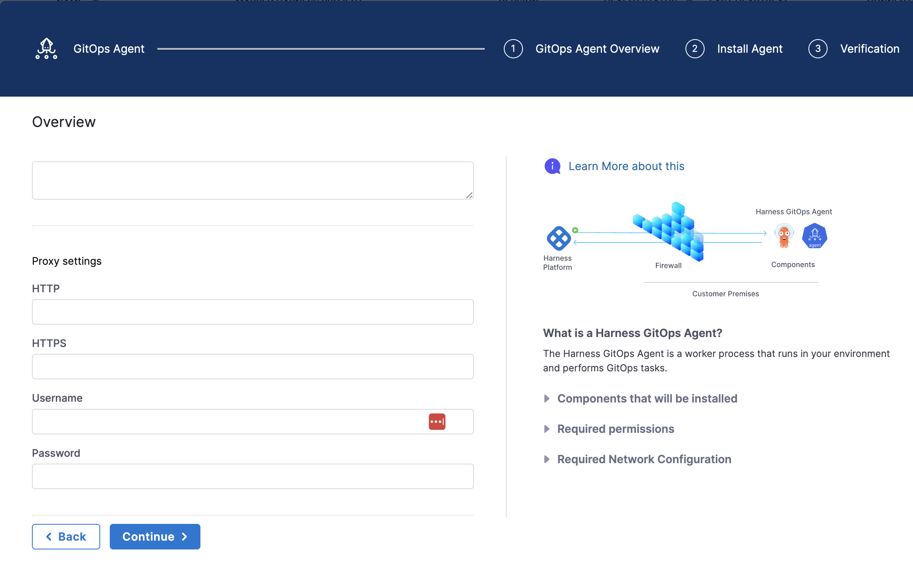

<details>
<summary>
Manually configure proxy support (DEPRECATED)
</summary>
To enable proxy support for the Harness GitOps Agent in environments where traffic is routed through a proxy, configuration is required for two key components: the `agent itself and the argocd-repo-server. Follow these steps to set up proxy support for both components.

1. **Agent:** Add a property/config `HTTPS_PROXY`, and add proxy details, such as URL, port, and auth details as its value in the ConfigMap `gitops-agent`. For example, `HTTPS_PROXY: "http://squid.proxy-test:3128"`.
2. **Agent:** Add an environment variable `NO_PROXY` in the Harness GitOps Agent deployment with the following value.  
   ```
   localhost,argocd-repo-server,argocd-redis,127.0.0.1,$(KUBERNETES_SERVICE_HOST)
   ```
3. **ArgoCD Repo Server:** Add the following environment variables and relevant proxy details, such as URL, port, and auth details in the `argocd-repo-server` deployment as well the second initcontainer under the `argocd-repo-server` deployment , namely the `sops-helm-secrets-tool` since it downloads resources from the internet using `wget`. 

An example of how the repo-server yaml would look like:

```yaml
... rest of the agent YAML ...
apiVersion: apps/v1
kind: Deployment
metadata:
 labels:
   app.kubernetes.io/name: argocd-repo-server
   app.kubernetes.io/instance: argocd
   app.kubernetes.io/component: repo-server
   app.kubernetes.io/managed-by: Helm
   app.kubernetes.io/part-of: argocd

... other objects ...

spec: 
 ... other fields ...
 containers:
   - command:

       - sh
       - -c
       - entrypoint.sh argocd-repo-server --redis argocd-redis:6379
   env: 
     ... other variables ...
     - name: HTTPS_PROXY
       value: "http://squid.proxy-test:3128"
     - name: HTTP_PROXY
       value: "http://squid.proxy-test:3128"
     - name: NO_PROXY
       value: localhost,argocd-repo-server,argocd-redis,127.0.0.1,$(KUBERNETES_SERVICE_HOST),(\{agentname}-agent)
 initContainers:
   ... other init containers spec ...
   - name: sops-helm-secrets-tool
     image: alpine:latest
     imagePullPolicy: IfNotPresent
     command: [ sh, -ec ]
     env:
       - name: HELM_SECRETS_VERSION
         value: 4.4.2
       - name: KUBECTL_VERSION
         value: 1.26.7
       - name: SOPS_VERSION
         value: 3.7.3
       - name: https_proxy
         value: "http://squid.proxy-test:3128"
       - name: http_proxy
         value: "http://squid.proxy-test:3128"

   .. rest of agent YAML ...
```

### Proxy setup for testing

Use the following YAML example to install proxy in any other environment.
   
```
---
apiVersion: v1
kind: ConfigMap
metadata:
  name: script-cm
  namespace: proxy-test
data:
  entrypoint.sh: |-
    #!/bin/bash
    echo "Start"
    apt-get -q update && apt-get -qy --no-install-recommends install python squid curl && apt-get clean;
    sed -i "s/^#acl localnet/acl localnet/" /etc/squid/squid.conf;
    sed -i "s/^#http_access allow localnet/http_access allow localnet/" /etc/squid/squid.conf;
    mkdir -p /var/cache/squid;
    cp /etc/squid/squid.conf /etc/squid/squid.conf.in;
    squid
    sleep 15
    cd /var/log/squid
    echo "==========================================ls"
    ls
    tail -f access.log
    echo "==========================================End"
---
apiVersion: apps/v1
kind: Deployment
metadata:
  name: squid
  namespace: proxy-test
  labels:
    app.kubernetes.io/name: squid
spec:
  replicas: 1
  selector:
    matchLabels:
      app.kubernetes.io/name: squid
  template:
    metadata:
      labels:
        app.kubernetes.io/name: squid
    spec:
      containers:
        - name: squid
          image: debian:bullseye
          imagePullPolicy: Always
          command:
            - /bin/entrypoint.sh
          volumeMounts:
          - name: configmap-volume
            mountPath: /bin/entrypoint.sh
            readOnly: true
            subPath: entrypoint.sh  
      volumes:
       - name: configmap-volume
         configMap:
          defaultMode: 0700
          name: script-cm 
---
apiVersion: v1
kind: Service
metadata:
  labels:
    app.kubernetes.io/name: squid
  name: squid
  namespace: proxy-test
spec:
  ports:
    - name: tcp-proxy
      port: 3128
      targetPort: 3128
  selector:
    app.kubernetes.io/name: squid
---
```

</details>

## GitOps Agent FAQs

Here are some answers to commonly asked GitOps Agent questions.

### What version of GitOps Agent supports what version of Repo server and Redis cache?

| GitOps Agent version | Packaged Argo CD version | Supported Argo CD versions                    | Redis version       |
| -------------------- | ------------------------ | --------------------------------------------- | ------------------- |
| 0.78.0               | v2.10.14                 | v2.8.2, 2.9.0, 2.9.3, 2.9.4, 2.10.10, 2.10.14 | redis:7.2.4-alpine  |
| 0.77.0               | v2.10.10                 | v2.8.2, 2.9.0, 2.9.3, 2.9.4, 2.10.10          | redis:7.2.4-alpine  |
| 0.67.0 - 0.76.0      | v2.9.4                   | v2.7.2, v.2.7.8, v2.8.2, 2.9.0, 2.9.3, 2.9.4  | redis:7.0.11-alpine |
| 0.66.0               | v2.9.3                   | v2.7.2, v.2.7.8, v2.8.2, 2.9.0, 2.9.3         | redis:7.0.11-alpine |
| 0.64.0 - 0.65.0      | v2.9.0                   | v2.7.2, v.2.7.8, v2.8.2, 2.9.0,               | redis:7.0.11-alpine |
| 0.60.0 - 0.63.0      | v2.8.2                   | v2.3.5, v2.7.2, v.2.7.8, v2.8.2               | redis:7.0.11-alpine |

The supported Argo CD versions listed above are what Harness has verified. However, any patch version should work for each minor version listed. For example, the GitOps agent version `0.78.0` should support the Argo CD version of `2.10.0`, but this is not verified by Harness. 

### How long is a GitOps Agent version supported?

Harness supports GitOps Agent versions that support Argo CD versions n to n-2 minor version (e.g 2.5.4, 2.4.4, 2.3.4).

### How can I update the GitOps Agent and related components?

The GitOps Agent comes with an upgrader service that performs upgrades and automatically detects when an upgrade is needed.

If you disable automatic upgrades, we recommend you manually update often since Harness is actively rolling out bug fixes and feature enhancements.

The Argo CD components upgrade must be done manually.

### How can I uninstall a GitOps Agent?

If you need to uninstall a GitOps Agent, you can use `kubectl delete` with the same manifest you used to install it. For example, `kubectl delete -f gitops-agent.yml -n argocd`.


## High Availability GitOps Agent

The Harness GitOps agent is a worker process based on ArgoCD that is responsible for executing Harness GitOps tasks. It has the following components:

- `agent`
- `redis`
- `argocd-application-controller`
- `argocd-repo-server`
- `argocd-applicationset-controller`

It has two install types:

- Normal
- High Availability (HA)

### Normal Agent

The Normal install type installs exactly 1 replica of all components.

### High Availability (HA)

Both ArgoCD and Harness have an HA install type. The Harness HA type installs different variations of the components with more than 1 replicas.

- `agent` has 2 replicas. In HA mode, the agent will utilize a Horizontal Pod Autoscaler for CPU and memory, with a minimum of 1 replica and a maximum of 5 replicas.
- `redis` has 3 replicas/sentinels (`haproxy`).
- `argocd-application-controller` has 1 replica (ArgoCD uses 2).
- `argocd-repo-server` server has 2 replicas.
- `argocd-applicationset-controller` has 1 replica.


### ArgoCD use case

#### Handling UI load

Since ArgoCD has only 1 instance per UI, adding multiple replicas helps to manage load from the UI. 

Adding multiple replicas helps scale the operations required by the UI, so more users can log in concurrently. For more information, go to [argocd-server](https://github.com/argoproj/argo-cd/blob/master/server/server.go#L160).

#### Handling the application reconciliation and syncs

ArgoCD performs application reconciliation and syncs using the `argocd-application-controller` and `argocd-repo-server`. 

The `argocd-application-controller` has 2 queues that are used for processing of application reconciliation and application syncs. By default, `argocd-application-controller` has 20 processors for the application reconciliation queue and 10 processors for the application syncs. 

For reference, the ArgoCD community recommends using 50 and 20 processors respectively for 1000 applications. 

For more information, go to: 
- [https://github.com/argoproj/argo-cd/blob/master/cmd/argocd-application-controller/commands/argocd_application_controller.go#L191](https://github.com/argoproj/argo-cd/blob/master/cmd/argocd-application-controller/commands/argocd_application_controller.go#L191) 
- [https://github.com/argoproj/argo-cd/blob/master/cmd/argocd-application-controller/commands/argocd_application_controller.go#L192](https://github.com/argoproj/argo-cd/blob/master/cmd/argocd-application-controller/commands/argocd_application_controller.go#L192).
- [High Availability from ArgoCD](https://argo-cd.readthedocs.io/en/latest/operator-manual/high_availability/#argocd-application-controller).

The `argocd-application-controller` also watches (at a fixed frequency of 10 seconds, by default) the clusters using the Kubernetes client on the current state and maintains a cache for faster retrieval.

If the controller manages a lot of clusters and is facing memory issues, the clusters are sharded (`ARGOCD_CONTROLLER_SHARDING_ALGORITHM`) across multiple replicas of `argocd-application-controller`. 

For more information, go to [High Availability from ArgoCD](https://argo-cd.readthedocs.io/en/latest/operator-manual/high_availability/#argocd-application-controller).

#### Handling Monorepos

The `argocd-repo-server` maintains one repository clone locally and uses it for application manifest generation. If the manifest generation must change a file in the local repository clone, then only one concurrent manifest generation per server instance is allowed. This limitation might significantly slowdown ArgoCD if you have a monorepo with multiple applications (50+). 

For more information, go to [High Availability from ArgoCD](https://argo-cd.readthedocs.io/en/latest/operator-manual/high_availability/#argocd-application-controller).

### Harness use cases

With Harness GitOps, where multiple agents can run in a single UI, Harness is not bound to have just 1 instance per UI. Harness can have multiple agents deployed across different scopes/clusters that can handle more applications than ArgoCD.

**When to use Harness GitOps HA Agent?:**

- If you have high UI activity (50+ active sessions) for the applications on the agent.
- When you have a monorepo.
- If you want to add more than 100 applications per agent.


### Considerations

#### Harness Agent reconciliation

The GitOps agent has 2 types of reconciliation on top of the ArgoCD’s reconciliation. This ensures that the data the GitOps service has is in sync with what is present in the destination cluster.

1. On CRUD events, reconciliation runs every 10 seconds.
2. The bulk reconciliation (to check if anything was removed/added in the cluster directly) runs every 100 seconds.

#### Known problem

Currently, the agents running with multiple replicas are not aware that more replicas are running and hence the reconciliation runs on all. 

Consequently, if there is an HA agent running 5 pods all of the pods will send the reconcile call (5 times in 1 cycle). This results in computing overhead.

## References

* [Harness GitOps Basics](/docs/continuous-delivery/gitops/get-started/harness-git-ops-basics)
* [Harness CD GitOps Quickstart](/docs/continuous-delivery/gitops/get-started/harness-cd-git-ops-quickstart)
* [Troubleshooting](/docs/continuous-delivery/gitops/troubleshooting)
