This topic describes how to import your existing Argo CD configuration into Harness GitOps as a Bring Your Own Argo CD (BYOA) setup.

In addition, when you install the Harness GitOps Agent in your existing Argo CD cluster as part of BYOA, you can map Argo CD projects to Harness projects. Harness imports all the Argo CD project entities (applications, clusters, repos, etc.) and creates them in Harness automatically.

Also, whenever new entities are created in the mapped Argo CD projects, they are added to Harness automatically.

With a standard Harness GitOps Agent installation (non-BYOA), Harness can install and manage Argo CD for you. This scenario is different from a BYOA where you are importing an existing Argo CD configuration into Harness GitOps.

For more information, go to [Install a Harness GitOps Agent](/docs/continuous-delivery/gitops/connect-and-manage/install-a-harness-git-ops-agent).

### Mapping existing Argo CD projects across different Harness scopes

To map Argo CD projects to Harness projects, you need to install the Harness GitOps Agent from the Harness account or organization level. Then you can map the Argo CD projects to any of the Harness projects in the account or organizations.

If you install the GitOps Agent at the Harness project level, you can only map to the current project.

The following example installs the GitOps Agent at the Harness account level.

## Installing a GitOps Agent in an existing Argo CD setup (BYOA)

The following steps show you how to install a GitOps Agent into an existing Argo CD namespace and then map your existing projects to your Harness project.

1. In your Harness account, select **Account Settings**.
2. Select **GitOps**, and then select **Agents**.
   
   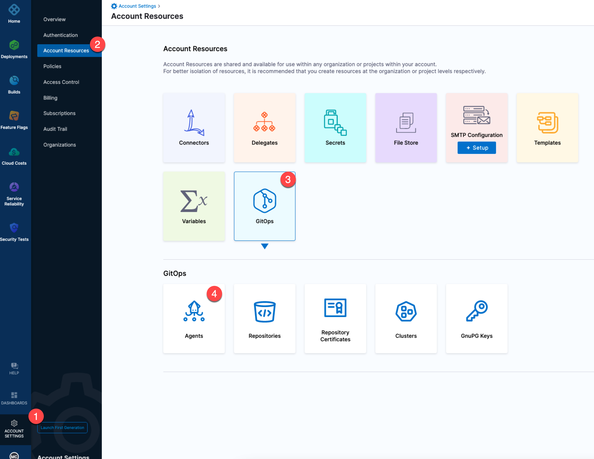

3. Select **New GitOps Agent**.
4. In **Agent Installation**, in **Do you have any existing Argo CD instances**, select **Yes**, and then select **Start**.
   
   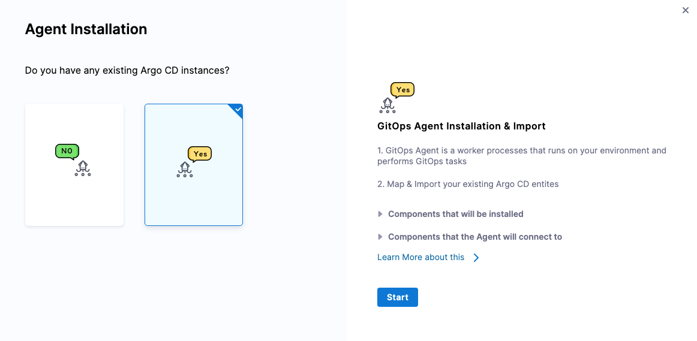

5. In **Name**, enter a name for your agent, such as `byoa-agent`.
6. In **GitOps Operator**, select one of the following:

   * **Argo**. Uses Argo CD as the GitOps reconciler.
   * **Flux**. Uses Flux as the GitOps reconciler. For more information, go to [Manage Flux applications with Harness GitOps](/docs/continuous-delivery/gitops/connect-and-manage/use-flux).

7. In **Namespace**, enter the namespace where Argo CD is hosted. The default is `argocd`.
   
   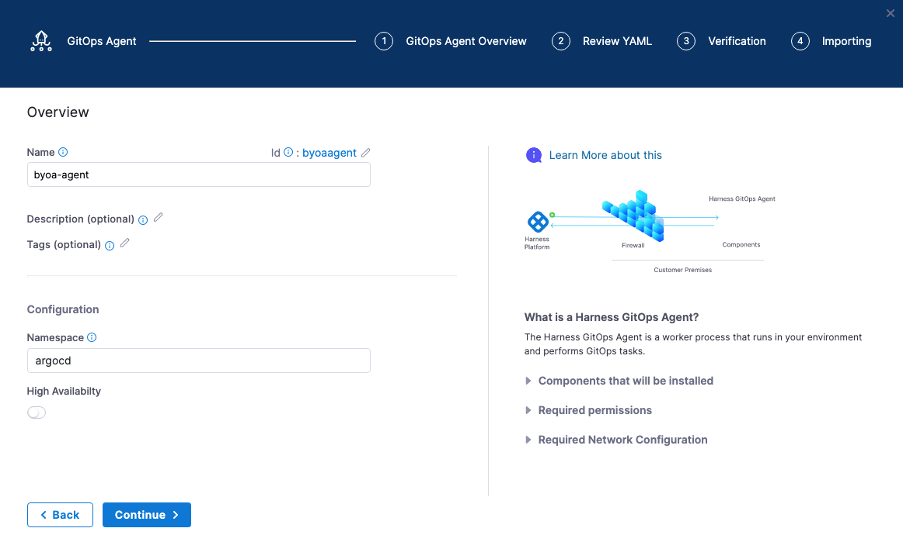

8. Select **Continue**.
9. In **Review YAML**, select **Download & Continue**.

   :::note

   Alternatively, the **Helm Chart** option lets you download a `helm-chart` file for the Harness GitOps Agent. You can download this file and install it in your Harness GitOps Agent cluster if you prefer using Helm.

   If your account is behind the feature flag `GITOPS_AGENT_HELM_V2`, you will be able to download an `override.yaml` file which will contain the Helm Value overrides to apply, and you can use the commands mentioned to install the agent using the [public Helm Repository](https://harness.github.io/gitops-helm/) for the GitOps Agent.
   
   Contact [Harness Support](mailto:support@harness.io) to enable this.

   :::

10. Log in to the cluster hosting Argo CD.
11. Run the install command provided in the Agent installer, such as `kubectl apply -f gitops-agent.yml -n argocd`. You'll see output similar to this:
    ```bash
    serviceaccount/gitops-agent created
    serviceaccount/gitops-agent-upgrader created
    secret/gitops-agent created
    configmap/gitops-agent created
    configmap/gitops-agent-upgrader created
    clusterrole.rbac.authorization.k8s.io/byoa-agent-agent created
    clusterrolebinding.rbac.authorization.k8s.io/byoa-agent-agent created
    role.rbac.authorization.k8s.io/gitops-agent created
    role.rbac.authorization.k8s.io/gitops-agent-upgrader created
    rolebinding.rbac.authorization.k8s.io/gitops-agent created
    rolebinding.rbac.authorization.k8s.io/gitops-agent-upgrader created
    deployment.apps/gitops-agent created
    cronjob.batch/gitops-agent-upgrader created
    ```
   :::note

   This list will have slight differences on accounts where the feature flag `GITOPS_AGENT_HELM_V2` is not enabled.
   
   :::

12. In the Harness GitOps Agent installer, select **Continue**.
   
   The Agent has registered with Harness.
   
   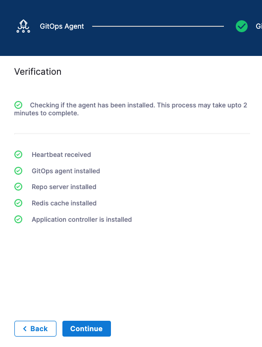

13.  Select **Continue**. The **Map Projects** settings appear.

:::warning

Ensure that you deploy only one Harness GitOps Agent per Argo CD namespace. Deploying multiple Agents created in different projects or accounts can lead to unpredictable behavior.

Harness supports mapping Argo CD projects into Harness projects through the Agent that controls the Argo CD deployment. When importing Argo CD projects, Harness maps Argo CD projects into Harness projects that belong to one account.

Enabling multiple Agents in one Argo CD namespace implies cross-account resource sharing which Harness does not support.

:::

## Map existing Argo projects

To map your existing Argo CD projects to Harness projects, select the Argo CD projects you want to use, and then select the Harness project where you want to map the Argo CD project.

1. In **Map Projects**, in **Select your Argo Projects to Import**, select the Argo CD projects you want to map.
   
   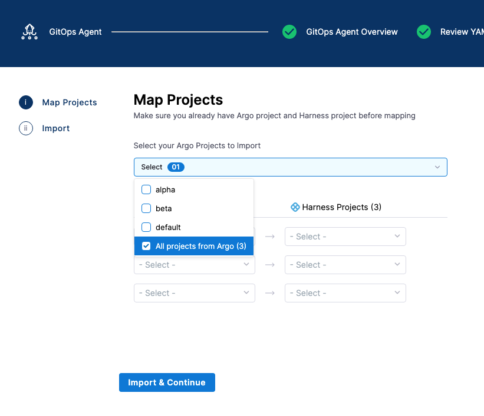

2. In each row, select the Argo project and the Harness project.
   
   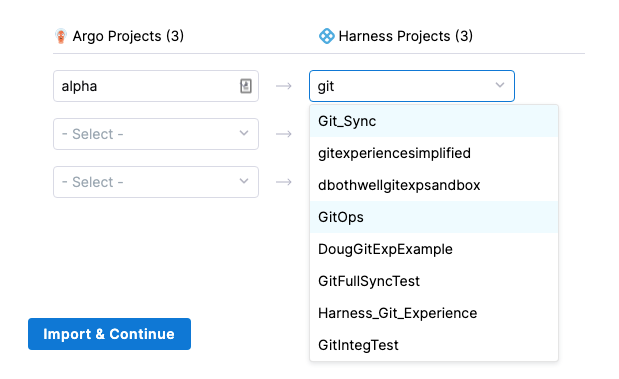
   
   :::note
   Do not map the same Argo CD project to multiple Harness projects.
   :::

3. Select **Import & Continue**.
   
   The Argo CD projects are imported.

   Here's an example where the Argo CD applications, repositories, repository certs, and clusters are imported.

   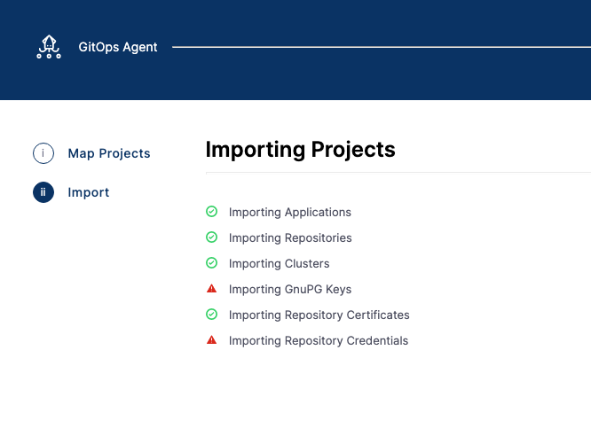

4. Select **Finish**. The mapping is displayed in the Agent details.
   
   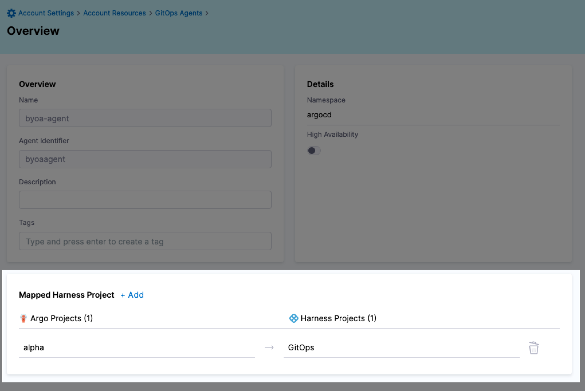
   
5. Select **Save**.

## Verify mapping

To see the imported Argo CD entities from the mapping, look in the mapped Harness project.

1. In your Harness project, Select **GitOps**, and then select **Applications**.
   You can see the imported application.
   
   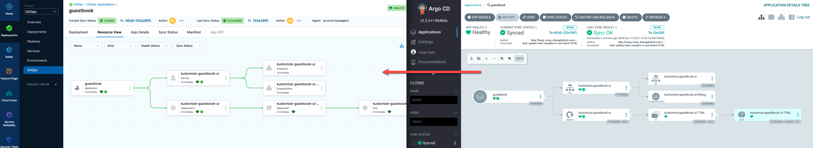

2. Select **Settings**, and then select **Repositories**.
   You can see the imported repositories.
3. Select **Settings**, and then select **Clusters**.
   You can see the imported clusters.

Do the same for any other mapped project entities.

## Adding new mappings to existing Agent

You can add new mappings to an existing Agent in the Agent's **Mapped Harness Project** settings.

1. In Harness, open an existing Agent.
2. Select **Edit**. In this example, the Argo CD project **alpha** is mapped to the Harness project **GitOps**.
   
   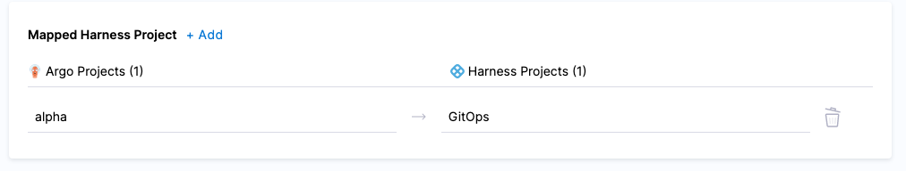
   
   Let's add a new mapping.

3. In **Mapped Harness Project**, select **Add**.
4. In **Map Projects**, in **Select your Argo Projects to Import**, select an Argo CD project. Do not select a project you have already mapped.
5. Map the Argo CD project to a Harness project and select **Import & Continue**.
   Do not re-map an existing mapping. Harness will throw an error.
   
   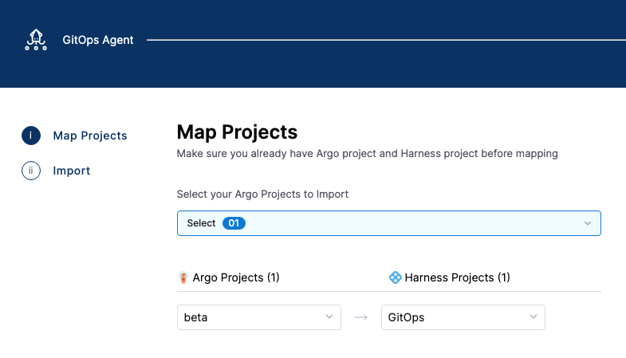

6. When the import is complete, select **Finish**.

Both projects are now mapped.

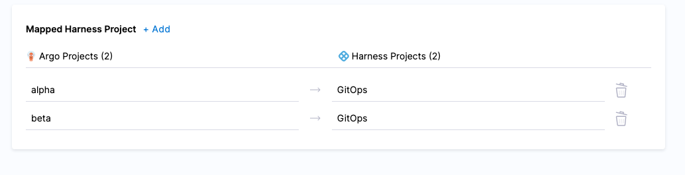

## Adding Argo CD entities to Harness automatically

When an Agent contains Argo CD project mappings to a Harness project, any new entities added to the Argo CD project are added to the mapped Harness project automatically.

Try adding a new Argo CD repository to the mapped Argo CD project.

Once it is saved in Argo CD, go to Harness and look at the GitOps repositories in the mapped Harness project. A new repository is added.

### Automatically added Argo CD repositories

When Argo CD repositories are added to Harness, Harness automatically generates a name for each repository. Name generation is necessary because Argo CD has no name setting for its repositories. When generating a name for a repository, Harness removes any dashes from the name of the repository, and then appends an underscore followed by a unique suffix.

For example, the Argo CD repository `https://github.com/argoproj/gitops-engine.git` is named `gitopsengine_kmjzyrbs` in Harness.

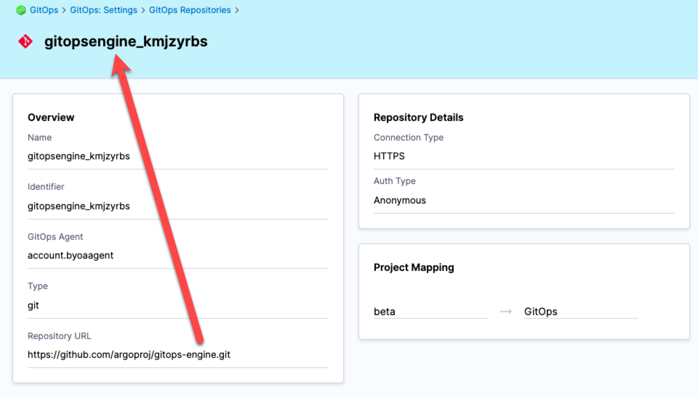

### Ensure your Argo CD entities are visible in Harness

In some Argo CD versions, you are not required to specify a project for your entities. However, for the entities to be visible in Harness, you must associate the entities with a project.

If you are unable to edit an entity from the Argo CD UI, you can edit that entity in the cluster so that they have a project and other required values. The entities are stored in different formats in the cluster. For example, clusters, repositories, and repository credential templates are stored in `Secret`, and GnuPG keys and repository certificates are stored in `ConfigMap` in the namespace where Argo CD is installed. 

Edit the respective secret of the entity and add the fields `project` and `name` in the `data` or `stringData` block. For examples, go to [Manage an Argo CD configuration in Git with Harness GitOps](/docs/continuous-delivery/gitops/connect-and-manage/manage-argo-configs#git-configuration-files).


## Creating GitOps entities with multiple projects

When you have multiple Argo CD projects mapped to your Harness project, you can choose which Argo CD project to use when you create a new GitOps entity (cluster, repository, or application) in your Harness project.

By default, in the Argo CD console, when you create a cluster, it is not associated with an Argo CD project. You can add the cluster by using the `argocd cluster add` CLI and its `--project` option.

The following steps are common to all three entities (clusters, repositories, and applications) when you create them in Harness. We will demonstrate this with GitOps clusters:
   
1. While creating a GitOps cluster in the Harness project that is mapped to multiple Argo CD projects, under **GitOps Agent**, select the Agent where you set up the mappings. The **Project** setting appears. <!-- "Agent where"? -->

   If the Agent has only one Argo CD project mapped, the **Project** setting is not shown.

2. In **Project**, select the Argo CD project with the cluster you want to import.
   
   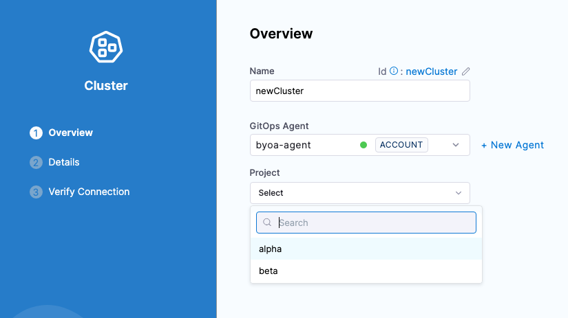

When you have completed [setting up the cluster](/docs/continuous-delivery/gitops/get-started/harness-cd-git-ops-quickstart#step-3-add-a-harness-gitops-cluster), the cluster appears in the GitOps Cluster list.

## Notes

* Harness honors Argo CD project permissions. If the project selected for the Harness application does not have permissions for the repository or cluster, then Harness returns a permissions-related error. You must go to Argo CD and adjust the project's scoped repositories and destinations.
* A non-BYOA setup does not support mapping multiple Argo CD projects to a single Harness project.
* **Upgrading your Argo CD Version**: If you upgrade your Argo CD version to any version that is >= v2.8.0 with a BYO Argo GitOps agent installed, you will have to restart the agent pods in order for the agent to pickup the required configuration change. You canrestart the deployment or the pods individually.
