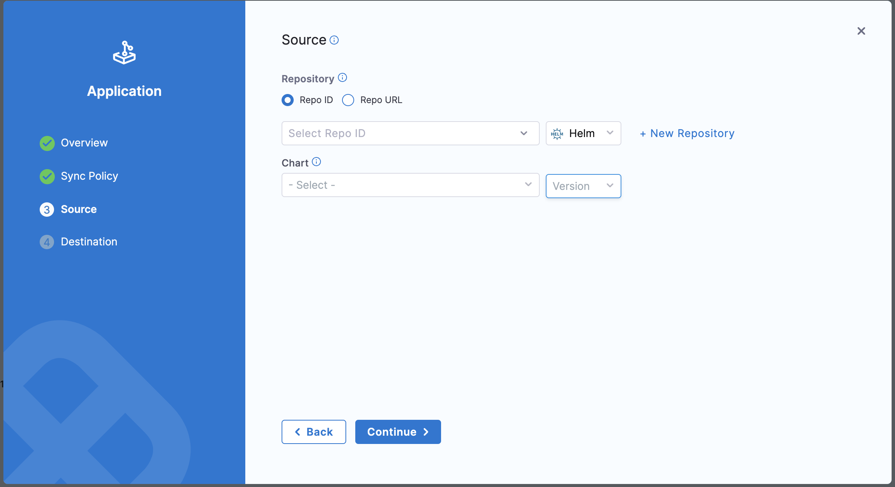

Argo Rollouts is an enhancement for Argo CD that brings advanced deployment capabilities, notably blue-green and canary strategies. Argo Rollouts adds a layer of sophistication to Kubernetes deployments, providing teams with the tools needed for safer, more controlled updates. By utilizing its capabilities, you can ensure that your application rollouts are smooth and reliable.

Harness GitOps integrates with Argo CD and Argo Rollouts to provide a declarative model for progressive deployment strategies that can be used with your Harness GitOps-managed deployments. 

Progressive deployment strategies improve the deployment process by enabling safer and more controlled updates, which in turn enhance uptime and user experience.

### Why Argo Rollouts?

- **Safer Updates**: Gradual rollouts minimize risks associated with deploying new versions.
- **Traffic Control**: Provides capabilities to manage and steer traffic between old and new versions effectively.
- **Advanced Strategies**: Supports sophisticated deployment strategies like blue-green and canary without the need for complex custom scripting.

## Prerequisites

- Access to a Kubernetes cluster.
- Harness account with necessary permissions.
- Argo CD instance provided by Harness.
- kubectl installed and configured.

## Install the Argo Rollouts controller

### Install using the CLI 

Deploy the Argo Rollouts controller into your Kubernetes cluster to start using its features.

```
kubectl create namespace argo-rollouts
kubectl apply -n argo-rollouts -f https://github.com/argoproj/argo-rollouts/releases/latest/download/install.yaml
```

### Install from a Helm Chart in Argo CD

1. Create a new Argo Application. Choose the proper GitOps agent, and optionally add a service and environment.


2. On the next screen, set up your sync policy:


3. On the final screen, add the repository:


When defining the source, we will use the upstream Helm chart:



Once complete, Argo CD will begin deploying all the necessary Argo Rollouts components. 

4. Navigate to the **GitOps applications** view again and find your new rollouts service with the name you gave it. After a few moments (depending on your cluster's performance), you should see the application enter a synced and healthy state.


5. Check the application's resource tab to verify that everything is installed and working before moving on to the next section. 

### Deploy a canary deployment

This guide uses a demo repository to help walk through a canary deployment. To use the demo repo, go to [Harness Rollouts Demo](https://github.com/mansong1/rollouts-demo.git).

#### Deploy the demo application

1. Go to GitHub and clone this repo: 

```yaml
repoURL: https://github.com/mansong1/rollouts-demo.git
```

2. Create a new Argo CD application. Its name and sync options are up to you, but make sure that you are using the same GitOps agent that you installed Argo Rollouts into above.

3. Use the **Source** setup page to deploy the demo app from the clone you just made. To do so, update the following fields:

- **Repository URL**: `https://github.com/mansong1/rollouts-demo.git`
- **Target Revision**: `master`
- **Path**: `examples/canary`

4. Once these are filled, Kustomize options will pop up. You can leave those as is and click **Continue**.


5. Choose your cluster and an existing namespace.


6. Browse to your application in Harness under **GitOps Applications**. Once it has been deployed by the system, you should see something like this:


#### Validation and finalization

7. Click into the `canary-demo` application to open a page that shows the progress of your deployment. Check this page after the traffic is switched to ensure the new version is stable and performs as expected. Roll back if any issues are detected.


## Best practices

- **Regularly Update**: Stay current with the latest versions of Argo Rollouts and its plugins.
- **Monitor Rollouts**: Continuously observe rollouts to detect and respond to any issues promptly.
- **Understand Strategy Nuances**: Deeply understand how blue-green, canary, and other strategies work to leverage them effectively.

