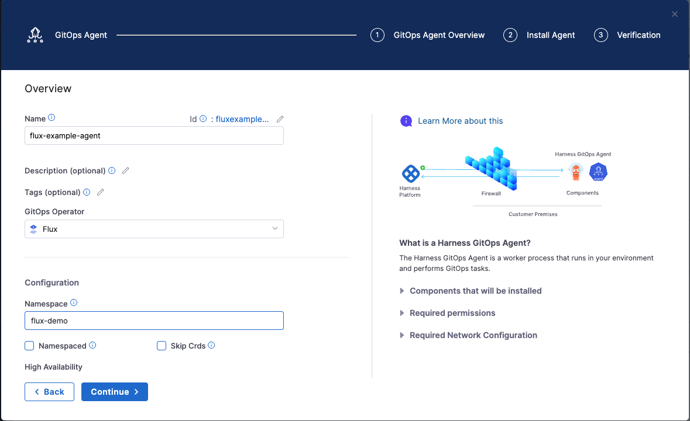
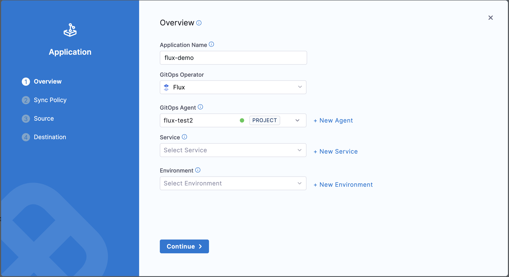
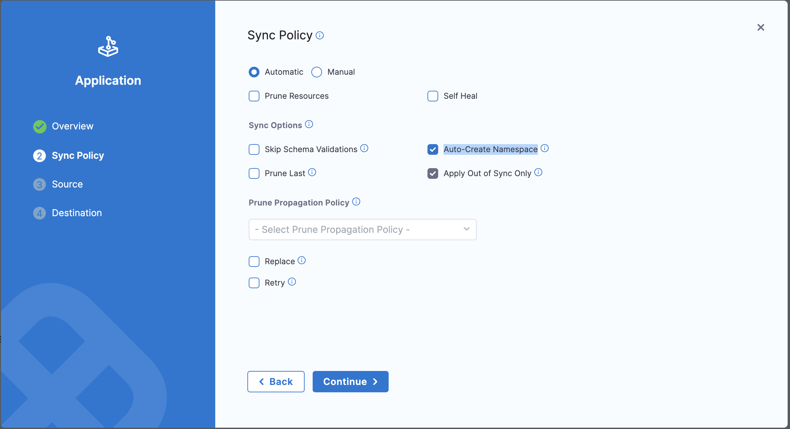
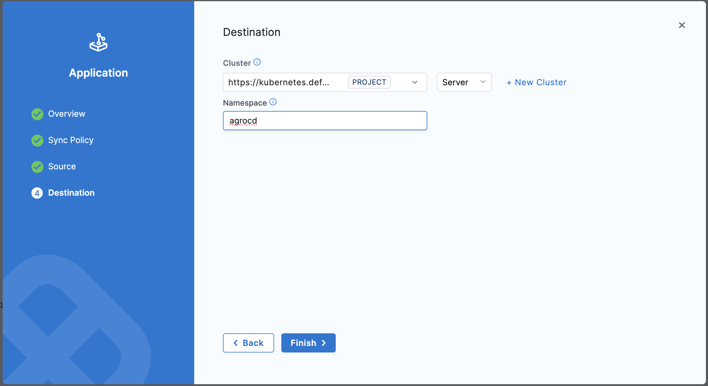
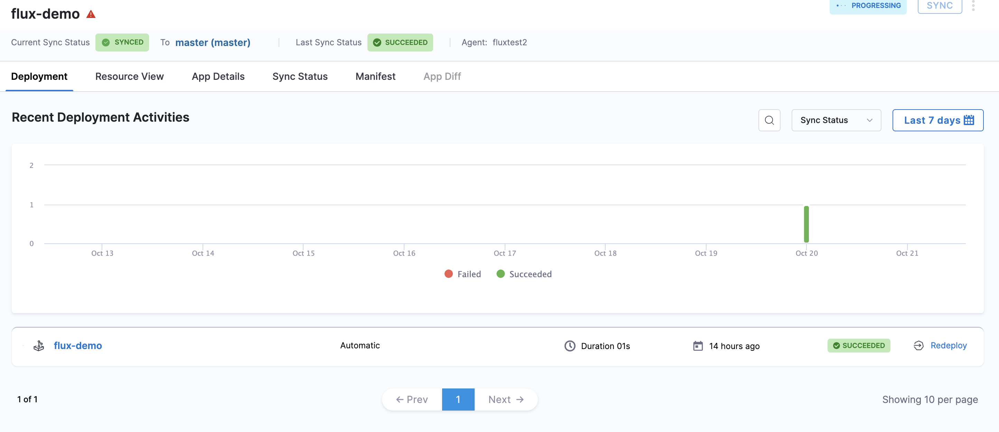

If you are managing workloads with Flux, you can also manage them from the GitOps user interface in Harness. Support for managing Flux workloads is accomplished by connecting the Harness GitOps agent to Flux through a special flux application resource in ArgoCD. The resource is the Flux Subsystem for Argo (FSA), also known as Flamingo. You can use the GitOps user interface to manage both regular ArgoCD and Flux resources, and view them all on the GitOps dashboard. 

When you create a Flux application, to make the application available in the GitOps user interface, you only need to specify that the application is of type *Flux* and provide the existing Flux manifests. You also need to select Flux as the sync policy so that Flux becomes the GitOps reconciler for that application. For more information about how FSA works, go to [Flux Subsystem for Argo](https://flux-subsystem-argo.github.io/website/).

## Prerequisites:

Before you can manage Flux applications from the Harness GitOps user interface, complete the following tasks:

* Install Flux and Flux CLI in your Kubernetes cluster. 

**Install Flux**

Install Flux using the CLI:
```bash
brew install fluxcd/tap/flux
```

Verify the installation:
```bash
flux --version
```

For information about installing Flux, go to the [Flux installation](https://fluxcd.io/flux/installation/) documentation. 

* Create a Harness account and verify that you have access to the Continuous Delivery and GitOps module.

## Setting Up a Flux Application

There are two ways to set up a Flux application:

### Bring your own Argo-CD Application

If you have existing custom applications that you want to manage with Harness GitOps, BYOA allows you to integrate those applications into your existing workflows without needing to rewrite or refactor them.

To install Flamingo and the Flamingo CLI using Homebrew, run:

```bash
brew install flux-subsystem-argo/tap/flamingo 
```

To verify the installation:

```bash
flamingo version
```

Create a Namespace for Flamingo

It's a good practice to create a dedicated namespace for your applications:

```bash
kubectl create namespace flamingo
```
Install Flamingo

You can install Flamingo using Helm

```bash
helm install flamingo flamingo/flamingo --namespace flamingo
```

Verify if Flamingo has been installed successfully:

```bash
kubectl get all -n flamingo
```

Install agent into same namespace where flamingo is setup. [Install a Harness GitOps Agent](/docs/continuous-delivery/gitops/connect-and-manage/install-a-harness-git-ops-agent).

### create a new Argo-CD Flux application with Harness

If you want to create a new Argo-CD application with Harness, follow these steps:

Install flamingo cli. 

```bash
brew install flux-subsystem-argo/tap/flamingo 
```

To varify installation: 
```bash
flamingo version
```

When creating a GitOps agent, select Flux as the GitOps operator. You configure all other configuration settings in the same way as you configure a Harness GitOps agent. For more information, go to [Install a Harness GitOps Agent](/docs/continuous-delivery/gitops/connect-and-manage/install-a-harness-git-ops-agent).



Flamingo installation is not required because Harness Agents come preconfigured with it.

### Create flux application with manifest

Create a Podinfo Flux Kustomization by running the following command on your Kubernetes cluster:

```bash
cat << EOF | kubectl apply -f -
---
apiVersion: v1
kind: Namespace
metadata:
  name: podinfo-kustomize
---
apiVersion: source.toolkit.fluxcd.io/v1beta2
kind: OCIRepository
metadata:
  name: podinfo
  namespace: podinfo-kustomize
spec:
  interval: 10m
  url: oci://ghcr.io/stefanprodan/manifests/podinfo
  ref:
    tag: latest
---
apiVersion: kustomize.toolkit.fluxcd.io/v1
kind: Kustomization
metadata:
  name: podinfo
  namespace: podinfo-kustomize
spec:
  interval: 10m
  targetNamespace: podinfo-kustomize
  prune: true
  sourceRef:
    kind: OCIRepository
    name: podinfo
  path: ./
EOF
```

To generate a Flamingo application to visualize the Podinfo objects, run:

```bash
flamingo generate-app \
  --app-name=podinfo-ks \
  -n podinfo-kustomize ks/podinfo
```

Now, navigate to Harness GitOps Applications tab, Click on create a **New application**.

For the GitOps Operator, select **Flux**

For the GitOps Agent, select the Gitpos agent you earlier created.



In the Sync Policy tab, select **Automatic** sync setting and select the **Auto-Create Namespace** checkbox



In the Source tab, configure your repository with your flux application.


In the destinations tab, select the Gitpos agent that you earlier created.



Click on Finish. The application may take a few minutes to load.

Now, create an Flux app in Harness to visualize application in Harness using flamingo cli

```bash
flamingo generate-app --app-name=<FLUX_APP_NAME> --app-ns=<AGENT_NAMESPACE> -n <FLUX_APP_NS> ks/podinfo
```

Replace `FLUX_APP_NAME` with the name of the Harness application.

Replace `AGENT_NAMESPACE` with the namespace where the Gitops agent is installed.

Replace `FLUX_APP_NS` with the namespace where you want to deploy your application.

Now you can see the flux application is created and is in sync.

 