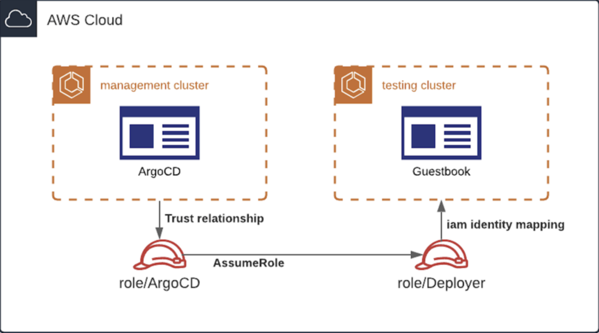
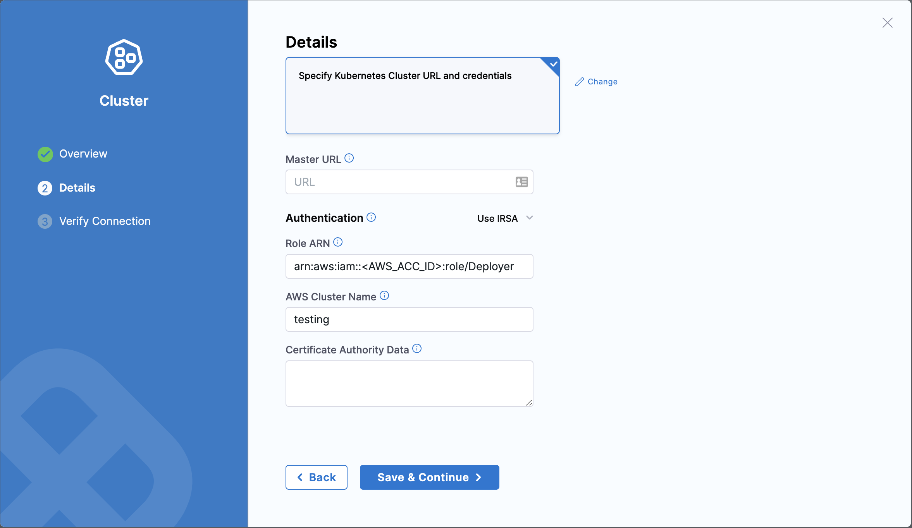

This topic describes how to create a Harness GitOps cluster in Amazon EKS, and deploy applications to the cluster using an IAM role.

## What is an IAM role?

Identity and Access Management (IAM) roles allow you to manage user access and permissions to various Amazon Web Services (AWS) services and resources. IAM roles are sets of permissions that you can assign to AWS services or resources, rather than individual users. 

This tutorial covers how to handle Harness GitOps Agent setup in a multi-cluster AWS environment and deploy applications to those clusters by letting the Agent assume an IAM role. 

:::info

Currently, this feature is behind the feature flag, `GITOPS_IAM`. Contact [Harness Support](mailto:support@harness.io) to enable the feature.

:::

:::info

GitOps clusters with IAM roles can be created only for a GitOps Agent installed in Amazon EKS.

:::


## Objectives

You'll learn how to create:

* A management cluster that hosts the Harness GitOps Agent.
* An IAM role, `role/ArgoCD` that the GitOps Agent assumes first.
* A testing cluster in which you can deploy a guestbook application.
* An IAM role, `role/Deployer` that has permissions to deploy applications in your testing cluster.

  

## Requirements

Make sure that you have met the following requirements:

* You have an AWS account ready to receive a couple of new VPC's with EKS clusters.
* You have installed and configured [awscli](https://docs.aws.amazon.com/cli/latest/userguide/cli-configure-quickstart.html) for your account.
* You have installed [eksctl](https://docs.aws.amazon.com/eks/latest/userguide/eksctl.html#installing-eksctl) on your machine.
* You have installed [kubectl](https://kubernetes.io/docs/tasks/tools/install-kubectl/) on your machine.

## Create a management cluster

Here, you will create two clusters in a single AWS account. The configuration works with cross-account and multi-cluster setups by setting the proper trust relations between the IAM roles.

### Provision the management cluster

Use the following command to provision the management cluster using an OpenID Connect (OIDC) provider:

`eksctl create cluster --name management --with-oidc`

This command takes anytime between 10 to 20 minutes to execute. It creates a management cluster, and everything it needs to function such as VPC, security groups, EC2 nodegroup, and so on.

The AWS authenticator packaged with Harness GitOps Agent uses the OIDC provider to acquire a token. Using this token, the Agent can assume the IAM role, **role/ArgoCD** that you'll create in the next step.

### Create an IAM role for your GitOps Agent

1. Set the management cluster `AWS_ACCOUNT_ID` and `OIDC_PROVIDER` as environment variables using the following commands:

   `AWS_ACCOUNT_ID=$(aws sts get-caller-identity --query "Account" --output text)`

   `OIDC_PROVIDER=$(aws eks describe-cluster --name management --query "cluster.identity.oidc.issuer" --output text | sed -e "s/^https:\/\///")`
2. Create a `trust.json` file with the variables you set in the previous step. 
     
   You must reference the namespace on which you will deploy your GitOps Agent so that all cluster roles can assume the IAM role you'll create in the next step.

   ```

   read -r -d '' TRUST_RELATIONSHIP <<EOF
   {
     "Version": "2012-10-17",
     "Statement": [
       {
         "Effect": "Allow",
         "Principal": {
           "Federated": "arn:aws:iam::${AWS_ACCOUNT_ID}:oidc-provider/${OIDC_PROVIDER}"
         },
         "Action": "sts:AssumeRoleWithWebIdentity",
         "Condition": {
           "StringLike": {
             "${OIDC_PROVIDER}:sub": "system:serviceaccount:iam:*"
           }
         }
       }
     ]
   }
   EOF

   echo "${TRUST_RELATIONSHIP}" > trust.json && cat trust.json 

   ```

   Make sure that the `trust.json` file includes the proper `AWS_ACCOUNT_ID` and `OIDC_PROVIDER`:

   ```

   aws iam create-role --role-name ArgoCD --assume-role-policy-document file://trust.json --description "IAM Role to be used by Harness GitOps Agent to gain AWS access"

   ```
3. Create an inline policy that gives the IAM role the ability to assume other roles so that GitOps Agent can assume the Deployer role that you'll create later.

   You could also use the ArgoCD role directly. However, having a separate role to deploy resources into the testing cluster is recommended as it is more flexible and secure.

   ```
   read -r -d '' POLICY <<EOF
    {
       "Version": "2012-10-17",
       "Statement": [
           {
               "Sid": "AssumeRole",
               "Effect": "Allow",
               "Action": "sts:AssumeRole",
               "Resource": "*"
           }
       ]
   }
   EOF

   echo "${POLICY}" > policy.json && cat policy.json

   aws iam put-role-policy --role-name ArgoCD --policy-name AssumeRole --policy-document file://policy.json
   ```

   Use the AWS web console to check the role you just created. The Kubernetes service accounts that the Agent uses in the management cluster assumes the IAM role through the OIDC provider.

### Set up Harness GitOps Agent

Create a namespace for Harness GitOps Agent in the management cluster using the following command:

`kubectl create namespace iam`

Go to [Installing a GitOps Agent](install-a-harness-git-ops-agent.md) for a tutorial on how to create a Harness GitOps Agent.

### Patch the GitOps Agent

1. Annotate the Kubernetes service accounts the Agent used with the ARN of the role to instruct the GitOps Agent to use the role you defined earlier.

   ```
   kubectl -n iam patch serviceaccount argocd-application-controller --type=json \
   -p="[{\"op\": \"add\", \"path\": \"/metadata/annotations/eks.amazonaws.com~1role-arn\", \"value\": \"arn:aws:iam::${AWS_ACCOUNT_ID}:role/ArgoCD\"}]"

   kubectl -n iam patch serviceaccount gitops-agent --type=json \
   -p="[{\"op\": \"add\", \"path\": \"/metadata/annotations/eks.amazonaws.com~1role-arn\", \"value\": \"arn:aws:iam::${AWS_ACCOUNT_ID}:role/ArgoCD\"}]"
   ```

   It is important that the annotations show the correct ARN of the ArgoCD role otherwise the Agent won't know which IAM role to assume. 

2. Verify that the service accounts are changed correctly using the following commands:

   ```
   kubectl -n iam describe serviceaccount gitops-agent

   kubectl -n iam describe serviceaccount argocd-application-controller
   ```

3. Patch the deployments to set the `securityContext/fsGroup` to `999` so that the Docker image user can use the IAM authenticator. 
     
   The IAM authenticator tries to mount a secret on `/var/run/secrets/eks.amazonaws.com/serviceaccount/token`. If the correct `fsGroup` (999 corresponds to the ArgoCD user) isn't set, it will fail.

   ```
   kubectl -n iam patch deployment gitops-agent --type=json  \
   -p='[{"op": "add", "path": "/spec/template/spec/securityContext/fsGroup", "value": 999}]'

   kubectl -n iam patch statefulset argocd-application-controller --type=json \
   -p='[{"op": "add", "path": "/spec/template/spec/securityContext/fsGroup", "value": 999}]'
   ```

   After patching Deployment and StatefulSet, the `application-controller` and `gitops-agent` pods restart.

   Ensure that the GitOps Agent is healthy and connected before proceeding any further.

## Create a testing cluster 

You have a working management cluster with GitOps Agent installed now. Next, you have to set up a testing cluster to which you can deploy the GitOps Agent. 

### Provision the testing cluster

Enter the following command to provision the testing cluster:

`eksctl create cluster --name testing`

You don't need an OIDC provider for the testing cluster. However, you need an IAM role to deploy applications in this cluster.

### Create an IAM Role to deploy applications

1. Create a trust relationship for the ArgoCD role so that it can assume the Deployer role.
   
   :::info
   
   In a multi account setup, you can change the trust relationship to reference the ArgoCD role in the account that holds the management cluster, and place the Deployer role in the same account as the testing cluster.
   
   :::

   ```
   read -r -d '' TRUST_TESTING <<EOF
   {
     "Version": "2012-10-17",
     "Statement": [
       {
         "Effect": "Allow",
         "Principal": {
           "AWS": "arn:aws:iam::${AWS_ACCOUNT_ID}:role/ArgoCD"
         },
         "Action": "sts:AssumeRole",
         "Condition": {}
       }
     ]
   }
   EOF

   echo "${TRUST_TESTING}" > trust-testing.json && cat trust-testing.json
   ```
2. Verify that the `AWS_ACCOUNT_ID` for the ArgoCD role is correct:

   ```
   aws iam create-role --role-name Deployer --assume-role-policy-document file://trust-testing.json --description "IAM Role to be used by AWS to Deploy in the testing cluster"

   eksctl create iamidentitymapping --cluster testing  --arn arn:aws:iam::${AWS_ACCOUNT_ID}:role/Deployer --group system:masters --username deployer
   ```

### Register the testing cluster with Harness to create and deploy applications
   
1. In Harness, select **Deployments** > **GitOps**.
2. Select **Settings** on the top right corner, and then select **Clusters** > **New Cluster**.
3. Enter a name for the cluster.
4. Select the GitOps Agent, and then select **Continue**.
5. In **Details**:
   - **Master URL**: Enter the HTTP endpoint of the Kubernetes API of the server.
   - **Authentication**: Select **IRSA**. IRSA stands for IAM Roles for Service Accounts.
   - **Role ARN**: Enter the role your GitOps Agent will have to assume to deploy to this cluster.
   - **Certificate Authority Data**: Enter the corresponding public certificate of the Kubernetes API.

   

You have successfully created a cluster in Harness with the connection status, `unknown`.

### Deploy applications to your cluster

You can now deploy applications to your cluster through Harness. Go to [Add a Harness GitOps application](harness-cd-git-ops-quickstart.md#step-4-add-a-harness-gitops-application) for more details.