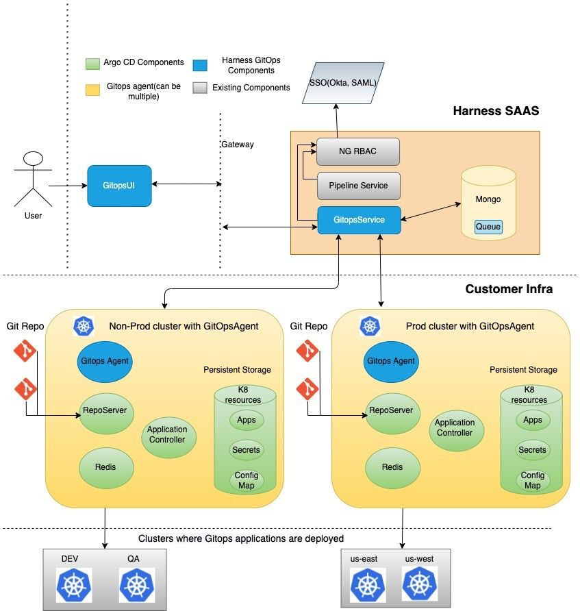
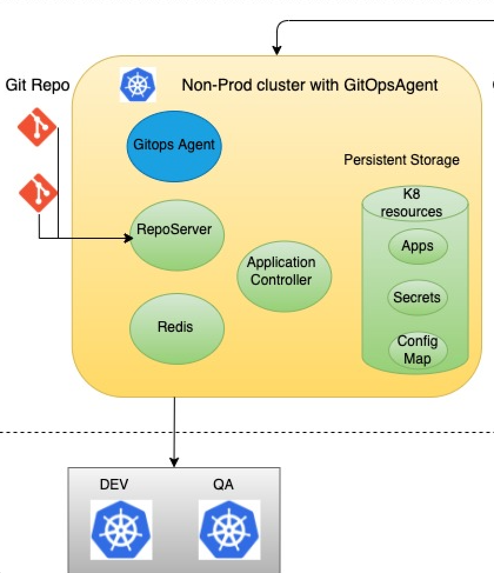

Harness GitOps has two components:  
- Harness GitOps service: A REST based service to manage the GitOps deployment.
- Harness GitOps Agent: The worker process responsible for GitOps tasks along with ArgoCD components. 

Let's dive deep into the Harness GitOps Agent architecture.

Harness GitOps Agent has four components:  
- GitOps Agent: Harness component
- Application controller: ArgoCd component
- Repo server: ArgoCd component
- Redis cache: ArgoCd component

### GitOps Agent

GitOps Agent is a Harness owned and managed worker process responsible for: 

- Executing GitOps tasks along with the ArgoCD Components. Tasks are CRUD events triggered from the UI like creating, reading, updating, or deleting a connection to the repository from where Harness reads the manifests or to a cluster where you want to deploy.
- Interacting with ArgoCD components to fulfill these tasks. For example, interacting with the repo server for fetching the branches released from a repository, or with the application controller when a user creates an application.
- Serving as an entry point to the customer’s premises. 
- Updating the Harness SaaS with all the GitOps related details by establishing outbound connection to the Harness SaaS (GitOps service). 

### Application controller

The application controller is an ArgoCD component responsible for:

- Continuously monitoring the applications.
- Comparing the live state against the desired state.
- Detecting application state and optionally taking corrective action.

### Repo server

The repo server is an ArgoCD component responsible for:

- Downloading manifests from the repository.
- Generating and returning the Kubernetes manifests when asked by the application controller.

### Redis cache
Redis cache is an ArgoCD component responsible for caching data required by the repo server. 

:::important
ConfigMaps and secrets are used for storing the details like cluster info, repo details, and so on that are stored directly on the cluster where the Agent is deployed. Harness SaaS does not store any credentials. Everything is stored in the customer’s environment along with the Agent.
:::

