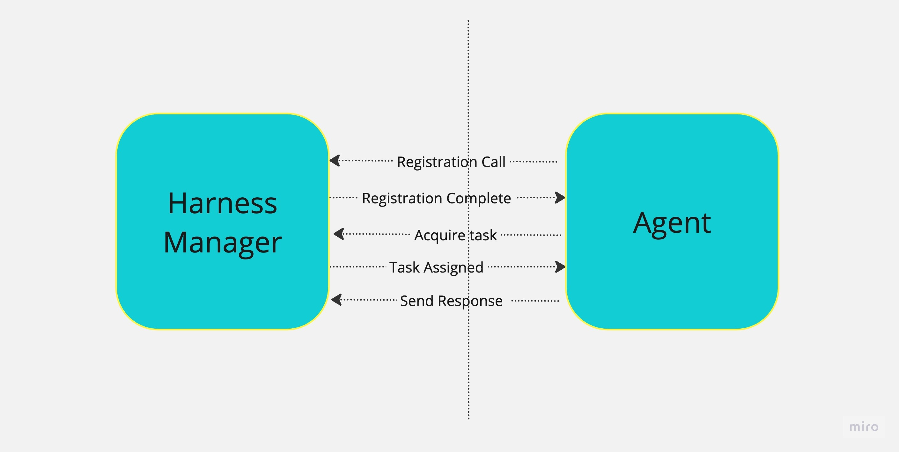

## Introduction

GitOps is a modern approach to Continuous Delivery (CD) where Git acts as the single source of truth for deployments. It enables:

✅ **Automated Deployments** – Syncs your Git configuration with your cluster automatically.

✅ **Full Traceability** – Every change is version-controlled in Git.

✅ **Enforced Desired State** – Ensures your deployed state always matches the version in Git (without modifying Git from the cluster).

Instead of manually deploying via pipelines, GitOps continuously syncs your Kubernetes cluster with your declarative manifests (YAML, Helm, Kustomize, etc.), ensuring consistency across environments.

Checkout [in-depth comparison between Argo CD and Harness GitOps](/docs/continuous-delivery/gitops/get-started/harness-gitops-vs-argocd)

## How GitOps works in Harness

Harness GitOps ensures that your applications and infrastructure are always in sync with what’s defined in Git. Instead of manually deploying updates, Harness automatically syncs changes from Git to your Kubernetes clusters—keeping everything consistent and version-controlled.

### GitOps Workflow in Harness

1️⃣ **Store Your Desired State in Git**

Define your application configurations using Kubernetes manifests, Helm charts, or Kustomize.

These files act as the single source of truth for deployments.

2️⃣ **Harness Continuously Monitors Git for Changes**

Whenever a change is made in Git, Harness detects it.

No need to trigger deployments manually.

3️⃣ **Sync the Changes to Your Kubernetes Cluster**

The live state of the cluster is automatically updated to match Git.

This ensures consistency across environments.

### How Does Harness Apply Changes?

To enable secure and automated deployments, Harness uses a **GitOps Agent**, a lightweight worker process installed in a Kubernetes cluster.

- The Agent can be installed in the target cluster or a separate cluster with network access to the target cluster.

- It makes outbound connections to Harness SaaS and the Git source repo.

- Syncs the desired state from Git to the live cluster—ensuring consistency without modifying Git.

**No Cluster-to-Git Reconciliation**

Harness does not push changes from the cluster back to Git. Your Git repository remains the only source of truth, ensuring a predictable and auditable deployment process.

Here's a very simple diagram of the GitOps architecture:

  

Harness offers multiple Git-based features to enhance deployment and configuration management. To understand the differences between GitOps, Config-as-Code, and the Harness Git Experience, see [Difference between Harness Gitops, Config as Code and Harness Git Experience](./gitops-vs-gitex-vs-config).

## What Can I Deploy with Harness GitOps?

You can deploy any Kubernetes objects, including microservices and infrastructure. You can also use GitOps to bootstrap infrastructure before deploying applications.

## Harness Platform Integration

Harness GitOps benefits from all Harness platform features, such as:

- **Access Control & Security** – Granular permissions ensure controlled access using [Harness RBAC](/docs/platform/role-based-access-control/rbac-in-harness).

- **REST APIs** – Automate GitOps tasks programmatically using [Harness APIs](https://apidocs.harness.io/).

- **Monitoring & Auditing** – Track changes and ensure compliance using [Harness Dashboard](/docs/continuous-delivery/monitor-deployments/monitor-cd-deployments.md).

- **Continuous Verification (CV)** - Automatically detect anomalies and reduce deployment risks using [Harness CV](/docs/continuous-delivery/verify/cv-getstarted/configure-first-cv).

While the GitOps Agent runs in your environment, all other GitOps functionalities are managed through Harness SaaS—eliminating the need to manage separate dashboards or administrative frontends.

## Harness GitOps Key Components

### Harness GitOps Agent

A Harness GitOps Agent is a worker process that runs in your environment, makes secure, outbound connections to Harness SaaS, and performs all the GitOps tasks you request in Harness.

Here's an image that illustrates how the Agent interacts with Harness:

The Agent uses the Repository and Cluster to connect to source repos and target environments. When you create a Harness GitOps Application, you select the Agent you want to use for these connections and GitOps operations.

#### Ways to Use the GitOps Agent

You can run an Agent in your target cluster or in any cluster that has access to your target clusters.

Agents can deploy to all clusters or you can isolate an Agent in a single cluster. For example, you might have one Agent deploy to Dev and QA environments and another Agent deploy to the production environment.

Here's an image that illustrates a Kubernetes deployment on the same cluster as the Agent, a deployment on different clusters, and deployments on two different clusters using one Agent:

There are pros and cons to each of these scenarios:
  1. **Scenario 1: Single Cluster, Single Agent, In-Cluster Deployment of Resources**

  **Pros:**
     * **Simplicity:** This pattern is straightforward to set up and maintain as it involves a single GitOps Agent and ArgoCD instance managing deployments within a single cluster.
     * **Resource Efficiency:** With a single instance, resource usage is optimized as there is no need for additional instances or coordination between clusters.

  **Cons:** 
     * **Limited Scalability:** Scaling beyond a single cluster can be challenging as the ArgoCD instance is tightly coupled to the specific cluster it is managing.
     * **Single Point of Failure:** If the ArgoCD instance fails, all deployments within that cluster may be affected.

  1. **Scenario 2: Single Target Cluster for Deployment, Single Agent outside of Target Cluster**

  **Pros:**
     * **Simplicity:** A single GitOps Agent to manage as well as a single target cluster.
     * **Better Isolation** as compared to in-cluster set-up in Scenario 1.

  **Cons:**
     * **Increased Management Overhead:** Configuration overhead like IP allow listing, permission for external cluster to connect and so on.

  1. **Scenario 3: Multi-Cluster, Single ArgoCD Instance - hub and spoke** 

  **Pros:**
     * **Centralized Management:** A single GitOps Agent coupled with an ArgoCD instance can manage multiple Kubernetes clusters, enabling centralized deployment management.
     * **Simplicity:** A single GitOps Agent to manage applications across multiple clusters.

  **Cons:**
     * **Single Point of Failure:** If the ArgoCD instance fails, all deployments may be affected.
     * **Performance and Scalability Challenges:** As the number of clusters and deployments increase, the performance and scalability of a single Agent may become a limiting factor, in which case you can either switch to using multiple agents across multiple clusters.

  **Multiple Target Clusters and Multiple Agents:** This is another scenario not described in the diagram. Harness GitOps manages the complexity of multiple ArgoCD instances and this way of using Harness GitOps provides high scalability and isolation, allowing teams to manage deployments independently across multiple clusters and if one ArgoCD instance fails, it does not impact deployments in other clusters. Although this will come with an overhead of higher **Resource Utilization** and **Management overhead**.
    
Installing an Agent involves setting up an Agent in Harness, downloading its YAML file, and applying the YAML file in a Kubernetes cluster (`kubectl apply`). Kubernetes then pulls the Harness and ArgoCD images from their respective public repositories.

### Service

A Harness GitOps service is the same as any other Harness service. A service represents your microservices and other workloads logically. A Service is a logical entity to be deployed, monitored, or changed independently.

For more information, go to [Services and environments overview](/docs/continuous-delivery/get-started/services-and-environments-overview).

### Service instance

Service instances represent the dynamic instantiation of a service you sync via Harness GitOps.

For example, for a service representing a Docker image, service instances are the number of pods running with the Docker image.

A single service can have multiple service instances. For example, one for Dev, one for QA, and one for Prod.

### Environments

Harness environments represent your live environment logically (QA, Prod, etc). In Harness GitOps, an environment is the live state of the infrastructure.

For more information, go to [Services and environments overview](/docs/continuous-delivery/get-started/services-and-environments-overview).

### Application

GitOps Applications are how you manage GitOps operations for a given desired state and its live instantiation.

A GitOps Application collects the Repository (what you want to deploy), Cluster (where you want to deploy), and Agent (how you want to deploy). You define these entities and then select them when you set up your Application.

You will also select:

* Sync Options to define how the Application syncs state.
* Prune Policy for garbage collection of orphaned resources.
* The Source manifest to use (Kubernetes, Helm chart, Kustomization, etc).
* The Destination cluster and namespace.

### ApplicationSets

An ApplicationSet can be used to define one application and sync it to multiple target environments. [See more](/docs/category/applicationsets)

ApplicationSets can be used along with [PR Pipelines](/docs/category/pr-pipelines) to make changes to the application in just one of the ApplicationSet target environments.

### Storage

Harness GitOps stores all configuration data in your cluster using **ConfigMaps** and **Secrets**, making the cluster itself the database for GitOps.

- Your GitOps Application, Repository, and Cluster configurations are saved on the cluster’s **PersistentVolume** (where the GitOps Agent runs).
- Harness SaaS only stores the **state cache**.

### Cluster

A cluster is where your applications are deployed and is continuously compared to the desired state defined in Git.

- Clusters sync with the source manifests stored in GitOps Repositories.
- You can run a GitOps Agent on the target cluster itself or on any other cluster with access to it.
- By default, each agent is assigned a cluster (`in-cluster`) with API URL `kubernetes.default.svc`.
- Namespaced agents don’t have cluster-wide access, so they require a service account with cluster-scope access to manage deployments.

Only the GitOps Agent is required for GitOps operations. However, a [Harness Delegate](/docs/platform/delegates/delegate-concepts/delegate-overview) is required for other Harness operations such as [PR pipeline](/docs/continuous-delivery/gitops/pr-pipelines/pr-pipelines-basics) steps involving Git operations — for example:

- **UpdateReleaseRepo**
- **MergePR**
- **RevertPR**
- **FetchLinkedApps**

You can deploy both the **GitOps Agent** and the Harness Delegate in the same cluster, or choose to deploy only the Agent if your use case is limited to GitOps-specific operations.

The Delegate is not required for RBAC functionality in Harness GitOps.

### Repository

A Harness GitOps Repository is a repo containing the declarative description of a desired state. The declarative description can be in Kubernetes manifests, Helm Chart, Kustomize manifests, etc.

### Repository Certificates

You can apply a Repository certificate or known host key to a GitOps Agent.

The GitOps Agent will use the certificate or key for all the connections it makes to repositories.

## Operational Concept

### Desired state and Live State

- **Desired State**: The intended configuration of a service and environment as defined in Git.
- **Live State**: The actual deployed state of a service and environment.

### Drift 

Drift occurs when the actual state of a system deviates or is deviating from the desired state. Identifying and rectifying drift is a crucial aspect of maintaining system stability and consistency.

### Refresh

Pulls the latest commit from Git and displays whether the current Sync State is Synced or Out of Sync. It does not sync with the live cluster state.

### Sync and Sync Status

A Sync brings the live state to its desired state by applying changes made in the declarative description.

Sync Status identifies if the target state is Synched, Out of Sync, or Unknown.

### Sync Policy

Applications react to variations in state between the source manifest and the target cluster using a Sync Policy.

With Automatic sync enabled, changes to the source manifest initiate sync automatically.

Sync Options tune the synchronization.

### Prune Policy

Prune Policy tells [Kubernetes garbage collection](https://kubernetes.io/docs/concepts/architecture/garbage-collection/) how to check for and delete objects that no longer have owner references.

### Health and Health Status

The health status of an application in Harness GitOps indicates whether the application is functioning as expected. It reflects the synchronization state and the operational status of resources deployed in the target Kubernetes cluster.

Health status is determined based on Kubernetes resource conditions and readiness probes. Harness GitOps continuously monitors the health of applications and provides real-time feedback.

### App Diff

Compares the latest file in Git with the live state and shows what is different.

If an Application is Healthy and Synced, then there is no App Diff.

### GnuPG Keys

GnuPG Keys can be used to configure Harness GitOps to only sync against commits that are signed in Git using GnuPG.

## Get Started with Harness GitOps

Want to jump right in? Try the [Harness CD GitOps Quickstart](/docs/continuous-delivery/gitops/get-started/harness-cd-git-ops-quickstart.md) to set up and deploy your first GitOps Application.

Click the link to begin and experience GitOps automation with Harness! 🚀

## FAQs

For frequently asked questions about Harness GitOps, go to [GitOps FAQs](/docs/continuous-delivery/gitops/gitops-faqs).