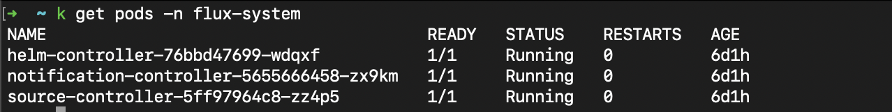
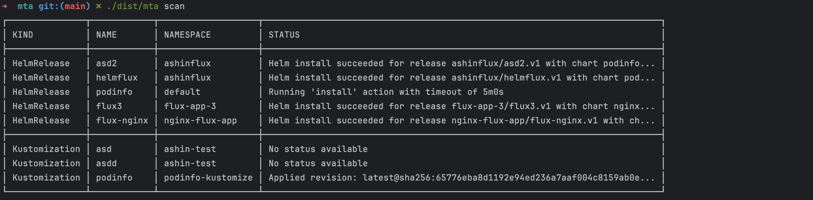
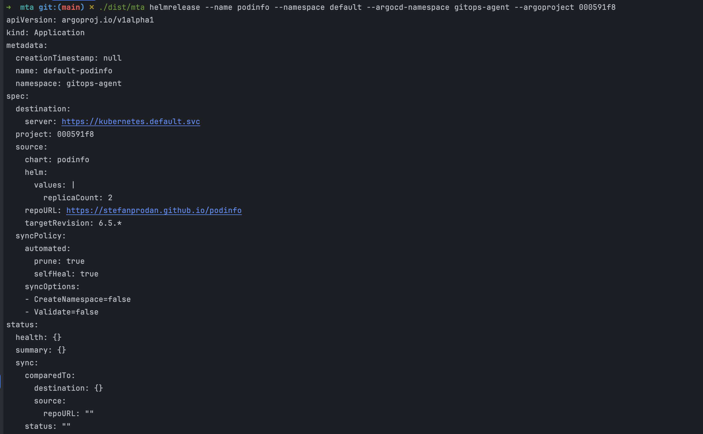
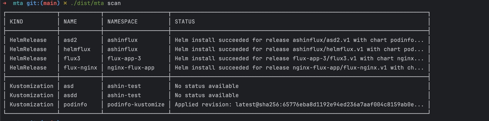
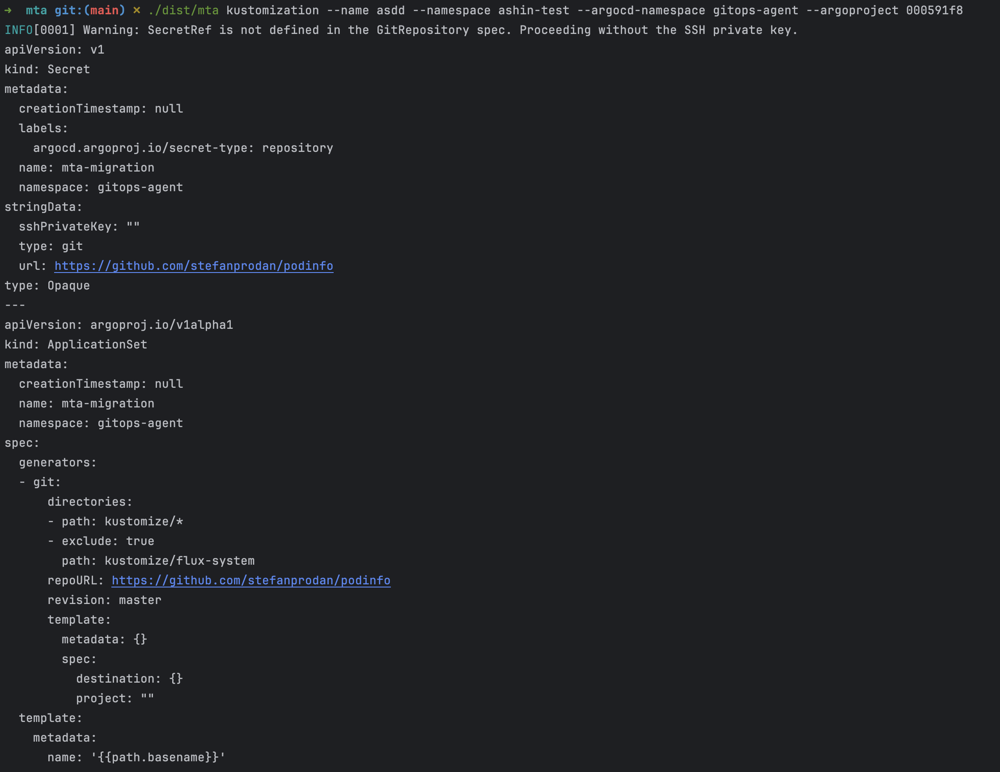

If you're currently running Flux and want to move to ArgoCD with Harness GitOps, the MTA (Migrate To ArgoCD) CLI tool can automate most of the heavy lifting for you. This guide walks you through the migration process, from scanning your existing Flux resources to running them successfully on ArgoCD.

## Before you begin

You'll need a working Flux setup with controllers running in your cluster. This includes your HelmRelease and Kustomization resources, along with their corresponding GitRepository or HelmRepository objects. The screenshot below shows what a healthy Flux deployment looks like.



You should also have a Harness GitOps agent installed with ArgoCD as the reconciliation engine. For this guide, we're using a namespace called `gitops-agent`, but you can use whatever namespace makes sense for your setup.

## Getting the MTA tool

Download the MTA CLI for your operating system. The tool is available for both Linux and macOS, with separate binaries for AMD64 and ARM64 architectures.

**Linux:**
- AMD64: [mta-linux-amd64](https://app.harness.io/public/shared/tools/mta/release/v0.0.1/mta-linux-amd64)
- ARM64: [mta-linux-arm64](https://app.harness.io/public/shared/tools/mta/release/v0.0.1/mta-linux-arm64)

**macOS:**
- Intel (AMD64): [mta-darwin-amd64](https://app.harness.io/public/shared/tools/mta/release/v0.0.1/mta-darwin-amd64)
- Apple Silicon (ARM64): [mta-darwin-arm64](https://app.harness.io/public/shared/tools/mta/release/v0.0.1/mta-darwin-arm64)

After downloading, make the binary executable and move it to a location in your PATH so you can run it from anywhere.

## Setting up your environment

Before you start migrating applications, make sure your Harness GitOps agent is running properly. You need three key workloads up and running: `helm-controller`, `notification-controller`, and `source-controller`. These handle the synchronization between ArgoCD and your repositories.

If your Flux applications pull from private repositories, add those repositories to your Harness GitOps configuration now. Public repositories and Helm charts don't require any special setup. You'll find the repository configuration in your Harness project under GitOps settings.

### Finding your ArgoCD project ID

Every Harness GitOps agent creates an ArgoCD project automatically. You'll need this project ID for the migration commands, so grab it now from your agent's configuration. Navigate to the gitops-agent namespace (or wherever you installed your agent) and copy the generated ArgoCD project ID. It looks something like `000591f8`.

:::info
The ArgoCD project ID ties your migrated applications to your Harness project. Make sure you're using the correct one for your environment.
:::

## Running the migration

### Discovering what you have

Start by authenticating to your cluster and running a scan. The MTA tool will find all your Flux resources and show you what's available to migrate. You can use `k` as an alias for `kubectl` if you have it configured.

```bash
mta scan
```

The scan output shows every HelmRelease and Kustomization in your cluster, along with their current status. This gives you a complete inventory before you start making changes.



You'll see each resource listed with its kind, name, namespace, and current status. This information helps you decide which applications to migrate first. We recommend starting with less critical applications to get comfortable with the process.

### Migrating a HelmRelease

Let's walk through migrating a HelmRelease resource. We'll use the `podinfo` application in the `default` namespace as an example. First, run the command in dry-run mode to see what ArgoCD application will be generated.

```bash
mta helmrelease --name podinfo --namespace default --argocd-namespace gitops-agent --argoproject 000591f8
```

The command breaks down like this: `--name` identifies the HelmRelease from your scan output, `--namespace` specifies where it currently lives, `--argocd-namespace` points to your GitOps agent, and `--argoproject` uses the project ID you copied earlier.



The generated manifest shows exactly what will be created in your cluster. Review it carefully to make sure the repository URL, Helm values, and target revision match your expectations. The tool preserves your existing configuration while translating it into ArgoCD's format.

### Applying the migration

Once you're satisfied with the dry-run output, add the `--confirm-migrate` flag to actually perform the migration. This creates the ArgoCD application and removes the original Flux HelmRelease to prevent conflicts.

```bash
mta helmrelease --name podinfo --namespace default --argocd-namespace gitops-agent --argoproject 000591f8 --confirm-migrate
```

The tool handles everything automatically. It creates the ArgoCD application in your gitops-agent namespace and cleans up the Flux resource. You can either pipe the output manually to your cluster or let the tool apply it directly.

### Verifying the migration

After migration, check that your application appears in both your agent's namespace and the Harness UI. Run another scan to confirm the Flux resource is gone. This prevents any confusion about which system is managing your application.



Notice how the migrated application no longer appears in the Flux resource list. This is expected behavior—the tool removes the Flux HelmRelease to ensure only ArgoCD manages the application going forward.

## Working with Kustomizations

Kustomization resources need a bit more attention than HelmReleases. The MTA tool generates ArgoCD applications for them, but you'll likely need to adjust the manifests before applying them. This is particularly important for path configurations and namespace settings.

Run a dry-run for any Kustomization resource just like you did for HelmReleases:

```bash
mta kustomization --name asdd --namespace ashin-test --argocd-namespace gitops-agent --argoproject 000591f8
```




:::warning
Always review Kustomization manifests carefully before applying them. Pay special attention to the source path, target revision, and destination namespace. These often need manual adjustments to match your repository structure.
:::

We recommend saving Kustomization manifests to a file, reviewing them, making any necessary changes, and then applying them manually with `kubectl apply`. This gives you complete control over the final configuration.

## What's supported

The MTA tool handles HelmRelease resources completely. The generated ArgoCD applications work out of the box with all your Helm values preserved. You can migrate these with confidence using the `--confirm-migrate` flag.

Kustomization resources are partially supported. The tool generates valid ArgoCD applications, but they typically need manual adjustments before deployment. This is because Kustomizations can have complex directory structures and path dependencies that require human verification.

The tool doesn't automatically remove Flux controllers from your cluster or handle custom Flux configurations. You'll need to clean up Flux manually after confirming all your applications are running successfully on ArgoCD. Some Flux-specific features might not have direct ArgoCD equivalents, so plan your migration strategy accordingly.
