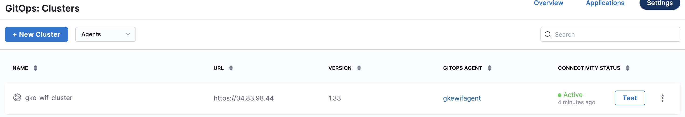
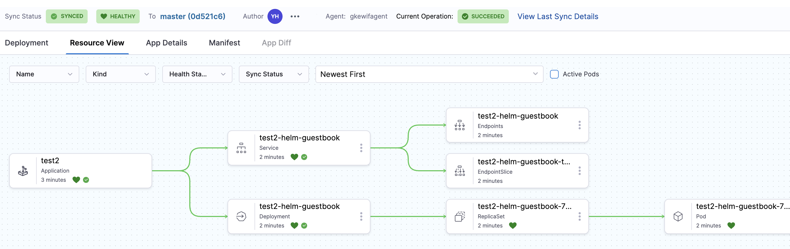

In this guide, you'll set up Harness GitOps to connect securely to a Google Kubernetes Engine (GKE) cluster without storing kubeconfigs or static credentials.

## What is GKE Workload Identity?

GKE **Workload Identity** allows Kubernetes ServiceAccounts to securely access Google Cloud resources **without storing credentials or secrets** in the cluster.  
Instead, GKE binds Kubernetes ServiceAccounts to Google Cloud IAM Service Accounts, enabling workloads to authenticate using short-lived tokens.

With Workload Identity:
- No kubeconfigs or static service account keys are stored
- Authentication is short-lived and automatically rotated
- Access is scoped to a specific Kubernetes ServiceAccount
- Follows Google Cloud's security best practices

**Learn more:**
- [GKE Workload Identity documentation](https://cloud.google.com/kubernetes-engine/docs/how-to/workload-identity)
- [Argo CD GKE Workload Identity setup](https://argo-cd.readthedocs.io/en/stable/operator-manual/declarative-setup/#gke)

## Prerequisites

Before setting up GKE Workload Identity with GitOps, ensure you have:

- **Google Cloud Platform (GCP) project** with appropriate permissions to:
  - Create and manage IAM service accounts
  - Assign IAM roles and policies
  - Manage GKE clusters
  - Configure Workload Identity bindings
- **GKE cluster** with Workload Identity enabled
- **gcloud CLI** installed and configured
- **kubectl** installed and configured
- **Harness GitOps module** enabled in your account

:::info
Workload Identity must be enabled at the cluster level and configured for the specific node pools where your GitOps agent will run.
:::

## Overview of the Setup Process

The GKE Workload Identity setup involves these key steps:

1. **Enable Workload Identity on GKE Cluster** - Configure your cluster to support Workload Identity
2. **Create GCP IAM Service Account** - Create a service account for GitOps agent authentication
3. **Grant IAM Permissions** - Assign necessary permissions to the service account
4. **Establish IAM Binding** - Link the Kubernetes service account to the GCP IAM service account
5. **Download and Modify GitOps Agent YAML** - Download the agent YAML and configure service account annotations
6. **Deploy GitOps Agent** - Install the modified agent in your cluster
7. **Create Cluster Secret** - Configure the cluster connection with Workload Identity authentication
8. **Verify Setup** - Ensure the cluster appears healthy in Harness UI

## Step 1: Enable Workload Identity on GKE Cluster

Workload Identity must be enabled at both the cluster level and node pool level.

### Check if Workload Identity is Already Enabled

First, check if your cluster already has Workload Identity enabled:

```bash
# Set your project and cluster details
export PROJECT_ID="your-gcp-project-id"
export CLUSTER_NAME="your-gke-cluster"
export CLUSTER_ZONE="us-central1-a"  # Replace with your cluster zone/region

# Check cluster configuration
gcloud container clusters describe "$CLUSTER_NAME" \
  --zone="$CLUSTER_ZONE" \
  --project="$PROJECT_ID" \
  --format="value(workloadIdentityConfig.workloadPool)"
```

If the output shows `<PROJECT_ID>.svc.id.goog`, Workload Identity is already enabled. Skip to Step 2.

### Enable Workload Identity on Existing Cluster

If Workload Identity is not enabled, enable it on your cluster:

```bash
gcloud container clusters update "$CLUSTER_NAME" \
  --zone="$CLUSTER_ZONE" \
  --project="$PROJECT_ID" \
  --workload-pool="${PROJECT_ID}.svc.id.goog"
```

:::warning
Enabling Workload Identity on an existing cluster does not automatically enable it on existing node pools. You must update node pools separately.
:::

### Enable Workload Identity on Node Pools

Update your node pools to enable Workload Identity:

```bash
# List all node pools
gcloud container node-pools list \
  --cluster="$CLUSTER_NAME" \
  --zone="$CLUSTER_ZONE" \
  --project="$PROJECT_ID"

# Enable Workload Identity on each node pool
gcloud container node-pools update <NODE_POOL_NAME> \
  --cluster="$CLUSTER_NAME" \
  --zone="$CLUSTER_ZONE" \
  --project="$PROJECT_ID" \
  --workload-metadata=GKE_METADATA
```

Replace `<NODE_POOL_NAME>` with your actual node pool name. Repeat for all node pools.

### Create New Cluster with Workload Identity (Optional)

If you're creating a new cluster, enable Workload Identity during creation:

```bash
gcloud container clusters create "$CLUSTER_NAME" \
  --zone="$CLUSTER_ZONE" \
  --project="$PROJECT_ID" \
  --workload-pool="${PROJECT_ID}.svc.id.goog" \
  --enable-autoscaling \
  --min-nodes=1 \
  --max-nodes=3
```

## Step 2: Create GCP IAM Service Account

Create a Google Cloud IAM service account that will be used by your GitOps agent to authenticate to the GKE cluster.

### Set Environment Variables

```bash
export GCP_SA_NAME="gitops-wi-sa"
export GCP_SA_EMAIL="${GCP_SA_NAME}@${PROJECT_ID}.iam.gserviceaccount.com"
export GCP_SA_DISPLAY_NAME="GitOps Workload Identity Service Account"
```

:::tip Using Existing Service Account
If you already have a GCP IAM service account, you can use it instead of creating a new one. Just set the `GCP_SA_EMAIL` variable to your existing service account email.
:::

### Create the IAM Service Account

```bash
gcloud iam service-accounts create "$GCP_SA_NAME" \
  --project="$PROJECT_ID" \
  --display-name="$GCP_SA_DISPLAY_NAME" \
  --description="Service account for Harness GitOps agent to access GKE cluster via Workload Identity"
```

### Verify Service Account Creation

```bash
gcloud iam service-accounts describe "$GCP_SA_EMAIL" \
  --project="$PROJECT_ID"
```

## Step 3: Grant IAM Permissions to Service Account

Grant the necessary IAM permissions to your service account to access the GKE cluster.

### Grant Container Cluster Viewer Role (Required)

The service account needs permissions to interact with GKE clusters. At minimum, grant the **Container Cluster Viewer** role:

```bash
gcloud projects add-iam-policy-binding "$PROJECT_ID" \
  --member="serviceAccount:${GCP_SA_EMAIL}" \
  --role="roles/container.clusterViewer"
```

This role provides:
- Get and list GKE clusters
- Get cluster credentials
- View cluster resources

:::important
This permission is **required** for the GitOps agent to authenticate and connect to the cluster. Without it, you'll see errors like:
- `Permission 'iam.serviceAccounts.getAccessToken' denied`
- `User cannot list resource "secrets" in API group ""`
:::

### Grant Additional Roles (Optional)

Depending on your requirements, you may need additional roles:

```bash
# For more extensive cluster management capabilities
gcloud projects add-iam-policy-binding "$PROJECT_ID" \
  --member="serviceAccount:${GCP_SA_EMAIL}" \
  --role="roles/container.developer"
```

:::tip Custom IAM Roles
For production environments, consider creating custom IAM roles with minimal required permissions instead of using predefined roles.
:::

## Step 4: Establish IAM Binding

Create an IAM policy binding that allows the Kubernetes service account to impersonate the GCP IAM service account.

### Set Kubernetes Service Account Variables

```bash
export K8S_NAMESPACE="your-namespace"
export K8S_SA_NAME="default"
```

:::info Namespace and Service Account Selection
Choose a namespace where you'll deploy your GitOps agent. The agent YAML will need to be configured to use this namespace and service account.
:::

### Create the IAM Policy Binding

```bash
gcloud iam service-accounts add-iam-policy-binding "$GCP_SA_EMAIL" \
  --project="$PROJECT_ID" \
  --role="roles/iam.workloadIdentityUser" \
  --member="serviceAccount:${PROJECT_ID}.svc.id.goog[${K8S_NAMESPACE}/${K8S_SA_NAME}]"
```

This command creates a binding that allows the Kubernetes service account `<K8S_SA_NAME>` in namespace `<K8S_NAMESPACE>` to act as the GCP service account.

### Verify IAM Binding

```bash
gcloud iam service-accounts get-iam-policy "$GCP_SA_EMAIL" \
  --project="$PROJECT_ID"
```

You should see a binding similar to:
```yaml
bindings:
- members:
  - serviceAccount:your-gcp-project-id.svc.id.goog[your-namespace/default]
  role: roles/iam.workloadIdentityUser
```

## Step 5: Download and Modify GitOps Agent YAML

Before you can configure workload identity authentication, you need to download the GitOps agent YAML from Harness and make specific modifications to enable Workload Identity.

### Download GitOps Agent YAML from Harness

First, let's get the agent YAML file from your Harness account:

1. **Log in to your Harness account** and navigate to the GitOps module
2. Go to **GitOps** → **Settings** → **GitOps Agents**
3. Click **+ New GitOps Agent**
4. Fill in the agent details:
   - **Name**: Enter a descriptive name for your agent (e.g., `gke-wif-agent`)
   - **Agent Type**: Select **Argo CD**
   - **Namespace**: Enter your namespace (this must match the namespace in your IAM binding)
5. Click **Continue** or **Next**
6. **Download the agent YAML file** - this will be a file named something like `gitops-agent.yaml`
7. **Save the file locally** - you'll need to edit it before applying to your cluster

:::important
Do NOT apply the agent YAML to your cluster yet. You must first modify it with the Workload Identity service account annotation as described in the next steps.
:::

### Annotate the Service Account in Agent YAML

Now that you have the agent YAML file, you need to annotate the service account to enable Workload Identity.

**Step 1: Open the downloaded YAML file** in your preferred text editor.

**Step 2: Find the Application Controller Service Account section.** Look for this section in the file:

```yaml
# Source: gitops-helm/charts/argo-cd/templates/argocd-application-controller/serviceaccount.yaml
apiVersion: v1
kind: ServiceAccount
automountServiceAccountToken: true
metadata:
  name: argocd-application-controller
  namespace: your-namespace
  labels:
    # ... existing labels
```

**Step 3: Add the GCP Workload Identity annotation** to the `metadata.annotations` section:

```yaml
# Source: gitops-helm/charts/argo-cd/templates/argocd-application-controller/serviceaccount.yaml
apiVersion: v1
kind: ServiceAccount
automountServiceAccountToken: true
metadata:
  annotations:
    iam.gke.io/gcp-service-account: your-gcp-sa@your-gcp-project-id.iam.gserviceaccount.com
  name: argocd-application-controller
  namespace: your-namespace
  labels:
    # ... existing labels
```

Replace `your-gcp-sa@your-gcp-project-id.iam.gserviceaccount.com` with your actual GCP service account email.

:::tip Using Existing Service Account
If you're using an existing Kubernetes service account (like `default` in your case), you have two options:

**Option A: Modify the agent to use the existing service account**
Change the agent YAML to reference your existing service account instead of creating a new one:
```yaml
apiVersion: apps/v1
kind: StatefulSet
metadata:
  name: argocd-application-controller
  namespace: your-namespace
spec:
  template:
    spec:
      serviceAccountName: default  # Use your existing annotated service account
```

**Option B: Annotate the agent's service account**
If you want to use the service account created by the agent YAML, add the annotation as shown above.
:::

### Annotate Additional Service Accounts (If Using Option B)

If you're creating new service accounts via the agent YAML, you may also need to annotate the `argocd-server` service account for displaying logs in the Harness UI:

**Find the Argo CD Server Service Account section:**

```yaml
# Source: gitops-helm/charts/argo-cd/templates/argocd-server/serviceaccount.yaml
apiVersion: v1
kind: ServiceAccount
automountServiceAccountToken: true
metadata:
  annotations:
    iam.gke.io/gcp-service-account: your-gcp-sa@your-gcp-project-id.iam.gserviceaccount.com
  name: argocd-server
  namespace: your-namespace
  labels:
    # ... existing labels
```

### Verify Your Modifications

Before proceeding, double-check that you've made these changes:

- Added `iam.gke.io/gcp-service-account` annotation with your GCP service account email
- Updated the namespace to match your target namespace
- If using an existing service account, updated the `serviceAccountName` references in deployments/statefulsets
- Saved the modified YAML file

:::tip
Keep the original downloaded file as a backup in case you need to start over with the modifications.
:::

## Step 6: Annotate Existing Service Account (If Using Existing SA)

If you're using an existing Kubernetes service account that's already being used by other workloads, you need to annotate it with the Workload Identity binding.

### Create Namespace (if it doesn't exist)

```bash
kubectl create namespace "$K8S_NAMESPACE" --dry-run=client -o yaml | kubectl apply -f -
```

### Annotate the Kubernetes Service Account

```bash
kubectl annotate serviceaccount "$K8S_SA_NAME" \
  --namespace="$K8S_NAMESPACE" \
  iam.gke.io/gcp-service-account="$GCP_SA_EMAIL" \
  --overwrite
```

This is the command you've already run. The annotation establishes the link between the Kubernetes service account and the GCP IAM service account.

### Verify Service Account Annotation

```bash
kubectl describe serviceaccount "$K8S_SA_NAME" \
  --namespace="$K8S_NAMESPACE"
```

You should see the annotation:
```
iam.gke.io/gcp-service-account: your-gcp-sa@your-gcp-project-id.iam.gserviceaccount.com
```

## Step 7: Deploy GitOps Agent

Apply the modified GitOps agent YAML to your cluster.

### Ensure kubectl Context is Correct

Before applying, ensure you're connected to the correct cluster:

```bash
# Configure kubectl to use your GKE cluster
gcloud container clusters get-credentials "$CLUSTER_NAME" \
  --zone="$CLUSTER_ZONE" \
  --project="$PROJECT_ID"

# Verify context
kubectl config current-context
```

### Apply the GitOps Agent YAML

```bash
kubectl apply -f gitops-agent.yaml
```

### Verify Agent Deployment

Check that all GitOps agent pods are running:

```bash
kubectl get pods -n "$K8S_NAMESPACE"
```

Wait for all pods to be in `Running` state. The main pods to watch for are:
- `argocd-application-controller-*`
- `argocd-repo-server-*`
- `argocd-server-*`
- `gitops-agent-*` (if using Harness-specific components)

### Check Pod Logs for Workload Identity

Verify that Workload Identity is working by checking the application controller logs:

```bash
kubectl logs -n "$K8S_NAMESPACE" -l app.kubernetes.io/name=argocd-application-controller --tail=50
```

You should NOT see any authentication errors related to GCP credentials.

### Verify Agent in Harness UI

1. Navigate to **GitOps** → **Settings** → **GitOps Agents** in your Harness account
2. Verify that your agent shows a **Healthy** status

## Step 8: Create Cluster Secret

Create a Kubernetes secret that defines how to connect to your GKE cluster using Workload Identity authentication.

### Gather Cluster Information

Get your cluster's API server endpoint and CA certificate:

```bash
# Get cluster endpoint
export CLUSTER_ENDPOINT=$(gcloud container clusters describe "$CLUSTER_NAME" \
  --zone="$CLUSTER_ZONE" \
  --project="$PROJECT_ID" \
  --format="value(endpoint)")

echo "Cluster endpoint: https://${CLUSTER_ENDPOINT}"

# Get CA certificate (base64 encoded)
export CA_CERT=$(gcloud container clusters describe "$CLUSTER_NAME" \
  --zone="$CLUSTER_ZONE" \
  --project="$PROJECT_ID" \
  --format="value(masterAuth.clusterCaCertificate)")

echo "CA Certificate (first 50 chars): ${CA_CERT:0:50}..."
```

### Create the Cluster Secret

Create the secret that tells Harness GitOps how to authenticate to the cluster:

```bash
cat <<EOF | kubectl apply -f -
apiVersion: v1
kind: Secret
metadata:
  name: gke-wif-cluster
  namespace: ${K8S_NAMESPACE}
  labels:
    argocd.argoproj.io/secret-type: cluster
type: Opaque
stringData:
  name: gke-wif-cluster
  server: https://${CLUSTER_ENDPOINT}
  config: |
    {
      "execProviderConfig": {
        "command": "argocd-k8s-auth",
        "args": ["gcp"],
        "apiVersion": "client.authentication.k8s.io/v1beta1"
      },
      "tlsClientConfig": {
        "insecure": false,
        "caData": "${CA_CERT}"
      }
    }
EOF
```

:::info Authentication Method
The cluster secret uses `argocd-k8s-auth gcp` command which leverages the Workload Identity setup. This command automatically uses the annotated service account to obtain credentials from the GCP metadata server.
:::

### Alternative: Create Secret from YAML File

If you prefer to create a separate YAML file:

```yaml
apiVersion: v1
kind: Secret
metadata:
  name: gke-wif-cluster
  namespace: your-namespace
  labels:
    argocd.argoproj.io/secret-type: cluster
type: Opaque
stringData:
  name: gke-wif-cluster
  server: https://<CLUSTER_ENDPOINT>
  config: |
    {
      "execProviderConfig": {
        "command": "argocd-k8s-auth",
        "args": ["gcp"],
        "apiVersion": "client.authentication.k8s.io/v1beta1"
      },
      "tlsClientConfig": {
        "insecure": false,
        "caData": "<BASE64_ENCODED_CA_CERT>"
      }
    }
```

Replace the placeholders:
- `<CLUSTER_ENDPOINT>`: Your cluster's API server endpoint
- `<BASE64_ENCODED_CA_CERT>`: The base64-encoded CA certificate

Then apply:
```bash
kubectl apply -f gke-cluster-secret.yaml
```

### Verify the Secret

Check that the secret was created correctly:

```bash
kubectl get secret gke-wif-cluster -n "$K8S_NAMESPACE"
kubectl describe secret gke-wif-cluster -n "$K8S_NAMESPACE"
```

## Step 9: Verify Setup in Harness UI

### Check Cluster Status

1. Navigate to **GitOps** → **Settings** → **Clusters** in your Harness account
2. You should see your cluster listed with an **Active** status
3. The cluster should show as **Connected**



### Test the Connection

Create a simple test application to verify the connection:

1. Go to **GitOps** → **Applications**
2. Click **+ New Application**
3. Configure a simple application pointing to your cluster
4. Verify that the application can successfully sync to the cluster



## Summary

In this guide, you've learned how to:

1. Enable Workload Identity on your GKE cluster and node pools
2. Create and configure GCP IAM service accounts with the required Container Cluster Viewer permissions
3. Establish Workload Identity bindings between Kubernetes and GCP service accounts
4. Modify and deploy Harness GitOps agents with Workload Identity annotations
5. Create cluster secrets for secure authentication using `argocd-k8s-auth`
6. Verify the setup and deploy applications to your cluster

Your GKE cluster is now securely connected to Harness GitOps using Workload Identity, eliminating the need for static credentials and following Google Cloud security best practices.
