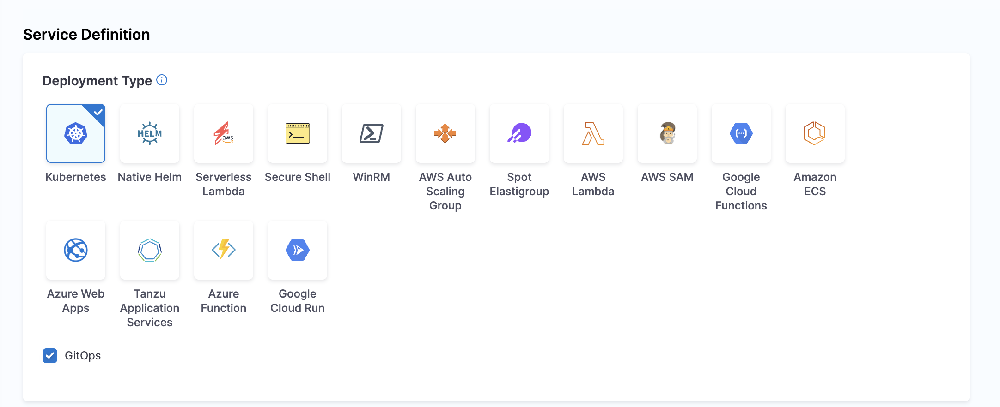
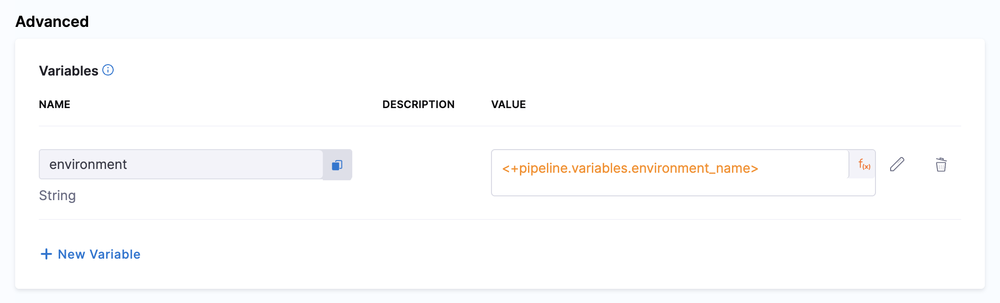

# GitOps Services

This topic describes how to use Harness GitOps services to track your GitOps applications and their deployment state.

## What is a Service in GitOps?

In the GitOps context, a service represents an application or a group of related applications deployed through the GitOps methodology. GitOps services help you:

- Track the deployment state of your applications
- Provide a central location to manage and observe all your GitOps applications

Unlike traditional CD services that define deployment artifacts and configurations, GitOps services focus on tracking, monitoring, and visualizing the state of applications synced automatically through GitOps agents.

## How to Create a GitOps Service

A Harness service in the GitOps context logically corresponds to a microservice/application template in an ApplicationSet. Together with the environment and cluster entities, Harness resolves application config.json files in a Git repository to update manifest values through PR pipelines.

### Creating a GitOps Service

1. Navigate to **Deployments** > **Services** in your Harness project.
2. Click **New Service**.
3. Enter a name for your service.
4. Select **Save**.
5. In the service configuration tab, under the service definition, in the deployment type, select Kubernetes and toggle on **Enable GitOps**.
   
   

6. Add the Manifests and Artifact details. You have two main options for manifests:

   #### a. Add a Release Repo Manifest
   
   This manifest points to configuration files (like `config.json`) in your Git repository. It is used by the **Update Release Repo** step in PR pipelines to update configuration files and create pull requests.
   
   1. In **Manifests**, select **Add Release Repo Manifest**.
   2. In **Release Repo Store**, select your Harness Git connector to the repository containing your config.json files.
   3. In **Manifest Details**, configure:
      - **Manifest Name**: Enter a name like `config.json`
      - **Git Fetch Type**: Select **Latest from Branch**
      - **Branch**: Enter your main branch name
      - **File Path**: Enter the path to your config files, using expressions like:
        `examples/git-generator-files-discovery/cluster-config/engineering/<+env.name>/config.json`
   
   The `<+env.name>` expression resolves to the Harness environment you select when running the pipeline.
   
   :::info
   You can also use cluster-specific paths with expressions:
   
   ```
   examples/git-generator-files-discovery/cluster-config/engineering/<+env.name>/<+cluster.name>/config.json
   ```
   
   Your Git directories would then be structured as:
   ```
   examples/git-generator-files-discovery/cluster-config/engineering/dev/cluster1/config.json
   examples/git-generator-files-discovery/cluster-config/engineering/dev/cluster2/config.json
   ```
   
   This allows you to update only applications deployed in specific clusters.
   :::
   
   #### b. Add a Deployment Repo Manifest
   
   This manifest specifies the path to your ApplicationSet template. It is used by the **Fetch Linked Apps** step in PR pipelines to retrieve information about the GitOps applications associated with your service.
   
   1. In **Manifests**, select **Add Deployment Repo Manifest**.
   2. In **Manifest Details**, configure:
      - **Manifest Name**: Enter a name like `Application Set`
      - **Git Fetch Type**: Select **Latest from Branch**
      - **Branch**: Enter your main branch name
      - **File Path**: Enter the path to your ApplicationSet template, such as:
        `examples/git-generator-files-discovery/git-generator-files.yaml`

   When these manifests are configured in your service and the corresponding pipeline steps are added to your pipeline execution, they fetch the respective manifest YAML and perform the deployment.

7. You can also reference an App Set by clicking on the **Reference App Set** option and configuring the Agent and the app set reference.

8. Click **Save** to complete the service configuration.

### Using App Set Reference

Another way is to use the App Set Reference field, wherein you provide the agent and the app set reference. This is a more dynamic way to add the service to the pipeline, as the app set and agent are already created and installed.


### Linking Existing Applications to a Service

Here's another way to create GitOps services by linking existing applications:

1. Navigate to **Deployments** > **GitOps** > **Applications**.
2. Select the application you want to map to a service.
3. In the **App Details** tab, you can map the application to a service.
4. Choose to either create a new service or map to an existing service.
5. Complete the mapping configuration and click **Apply Changes**.

This approach is useful when you have already created GitOps applications via the GitOps UI or imported them from Argo CD.

## Service Variables

Service variables play a crucial role in managing configurations and deployments in GitOps. These variables help customize your deployments across different environments and clusters.



### How Service Variables Work

In GitOps, service variables provide the following capabilities:

1. **Service Variables Definition**: 
   - Define variables specific to your service, such as `imageTag`, `port`, and other service-specific settings
   - These variables can be referenced in your manifests and configurations

2. **Environment and Cluster-Level Overrides**: 
   - Variables can be overridden at different levels - environment, cluster, or service level
   - This flexibility allows for proper configuration management across environments

3. **Runtime Inputs**: 
   - Some service variables can be defined as runtime inputs
   - This is useful for variables that change frequently or need to be specified at deployment time

4. **Precedence and Overrides**: 
   - The order of precedence typically flows from infrastructure variables (highest priority) to service level variables (lowest priority)
   - This ensures that the most specific configurations are applied

### Using Cluster Name as a Service Variable

A specific use case is referencing cluster attributes stored in configuration files:

1. Store the cluster name in a configuration file (like `config.json`)
2. Reference this value as a service variable using expression syntax
3. During deployment, the service can target the correct cluster based on this reference

By using service variables with expressions, you can create dynamic and configurable deployments that adapt to different environments and requirements.

## GitOps Service Dashboard

The GitOps Service Dashboard provides visibility into your GitOps applications and services. This dashboard helps you monitor deployment activity, success rates, and service status across your entire environment.

### Accessing the Service Dashboard

1. Navigate to **Deployments** > **Services**in your Harness project.
2. You'll see a list of all your services, including traditional CD and GitOps services.

### Dashboard Features

The Services Dashboard displays comprehensive information about your services:

#### Overview Statistics

At the top of the dashboard, you can see summary statistics including:

- **Total Services**: The total number of services in your project
- **Service Instances**: The number of active service instances
- **Deployments**: Number of deployments in the selected time period
- **Failure Rate**: Percentage of deployments that have failed
- **Frequency**: Average number of deployments per day

You can filter the view to see data for the last 7 days, 30 days, or a custom time range.

#### Environment Distribution

The dashboard shows how your services are distributed across environments:
- **Production** (Prod): Services deployed to production environments
- **Non-Production** (Non Prod): Services deployed to testing, development, or staging environments

#### Most Active Services

This section displays your most frequently deployed services, showing:
- Service names
- Number of deployments per service
- Success/failure status

#### Services Table

The main services table provides detailed information about each service:

| Column | Description |
|--------|-------------|
| SERVICE | Name of the service and its unique ID |
| Code Source | Source of the service configuration (Inline, Git, etc.) |
| TYPE | Type of service |
| ACTIVE INSTANCE COUNT | Number of active instances for each service |
| DEPLOYMENTS | Count of deployments, broken down by environment |
| FAILURE RATE | Percentage of failed deployments |
| FREQUENCY | Average number of deployments per time period |
| LAST PIPELINE EXECUTION | Most recent pipeline that deployed this service and its status |

#### Service Actions

From the service dashboard, you can perform several actions:
- Create a new service
- Search for specific services
- Sort services by various attributes
- View service details by clicking on a service name
- Access pipeline execution details by clicking on the last pipeline execution

### Service-Centric Monitoring

The Services dashboard provides a service-centric view of your deployments, enabling you to:

1. **Monitor deployment trends**: Track service deployment frequency and success rates over time
2. **Identify problematic services**: Quickly spot services with high failure rates
3. **Compare environments**: See how services perform across production and non-production environments

By utilizing the Services dashboard, you gain visibility into all your services, including GitOps applications. This helps you maintain reliable deployments and quickly address issues as they arise.

## Using GitOps Services with PR Pipelines

Since GitOps services are closely integrated with PR pipelines, understanding how they work together is crucial. PR pipelines enable you to make environment-specific changes through pull requests that are automatically merged and applied to your deployments.

### GitOps Service Manifest Types

When configuring GitOps services for use with PR pipelines, you need to understand two types of manifests:

1. **Release Repo Manifest**: Used with the Update Release Repo step in PR pipelines. This manifest points to configuration files (like `config.json`) containing environment-specific settings.

2. **Deployment Repo Manifest**: Used with the Fetch Linked Apps step. This manifest provides information about the GitOps applications associated with your service.

Both manifest types are configured in your GitOps service definition and are referenced by different PR pipeline steps.

### Dynamic Path Configuration with Variables

When defining manifest paths in your GitOps service, you can use environment variables to dynamically select the correct configuration:

- Use `<+env.name>` in your paths to dynamically reference environment-specific files.
- Example path: `examples/git-generator-files-discovery/cluster-config/engineering/<+env.name>/config.json`

This approach allows a single service definition to work with multiple target environments.

### Pipeline Steps for GitOps Services

PR pipelines include several steps specifically designed for working with GitOps services:

1. **Update Release Repo**: Updates configuration files and creates a PR.
   - Supports hierarchical variables and list updates.
   - Overrides service or environment variables with the same name.

2. **Fetch Linked Apps**: Retrieves information about GitOps applications linked to your service.
   - Displays app name, agent identifier, and URL to the Harness GitOps app.
   - Requires a properly configured Deployment Repo manifest.

3. **GitOps Sync**: Triggers synchronization of your GitOps applications.
   - Filters applications by name, regex pattern, or labels.
   - Updates the cluster with the latest state from Git.

4. **Update GitOps App**: Modifies your GitOps application configuration.
   - Updates values files or overrides specific parameters.
   - Works with both single-source and multi-source applications.

5. **GitOps Get App Details**: Fetches detailed information about your applications.
   - Returns status data as JSON that can be used in subsequent steps.
   - Supports hard refresh to get real-time status information.

By combining these pipeline steps with GitOps services, you can build comprehensive workflows that manage your application configurations and deployments through Git.

## Next Steps

- [Learn about PR Pipeline Basics](/docs/continuous-delivery/gitops/pr-pipelines/pr-pipelines-basics)
- [Learn more about GitOps Applications](/docs/continuous-delivery/gitops/application/manage-gitops-applications)
- [Compare GitOps vs CD Services](./gitops-vs-cd-service.md)