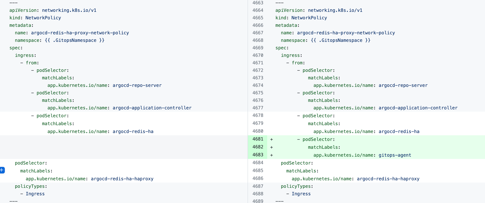
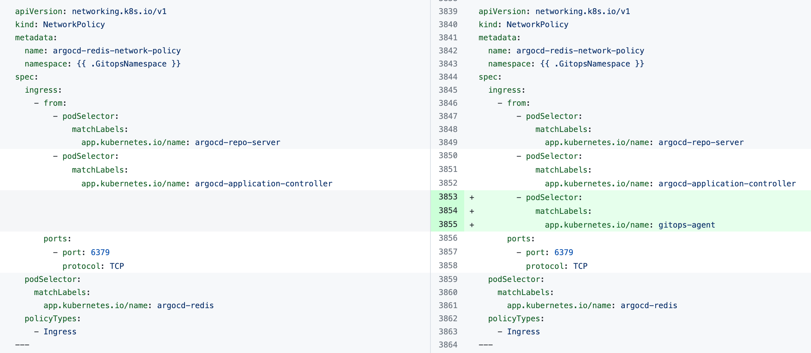
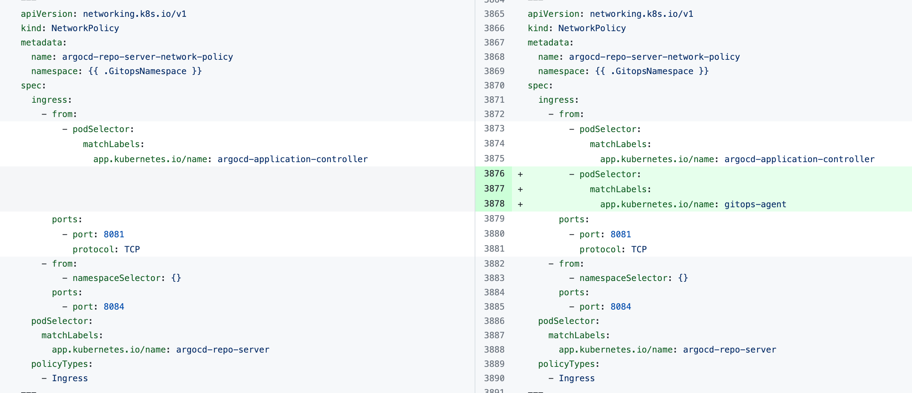

This documentation lists issues encountered when installing and using Harness GitOps and describes how to resolve them.

## Installation errors

### Error: "Agent took too long to respond"

You might encounter the error `the Agent took too long to respond` when installing the Harness GitOps Agent with an existing Argo CD instance.

The error indicates that the Harness GitOps Agent is unable to connect to Redis or to the Argo CD Repo Server and needs additional `NetworkPolicy` settings.

Add the following `podSelector` settings to the `NetworkPolicy` objects defined in your existing Argo CD *argocd-redis* and *argocd-repo-server* services.

The following table lists the `NetworkPolicy` objects for HA and non-HA Agents, and include the YAML before and after the new `podSelector` is added.

| **NetworkPolicy** | **HA Agent** |
| --- | --- |
| `argocd-redis-ha-proxy-network-policy` |   |
| `argocd-repo-server-network-policy` |   |
|  | **Non-HA Agent** |
| `argocd-redis-network-policy` |   |
| `argocd-repo-server-network-policy` |   |

### Error: "Forbidden: seccomp may not be set provider"

If you see the error `Forbidden: seccomp may not be set provider`, remove the following block from all Argo CD configuration files that have a `kind: deployment` key-value pair.

```
seccompProfile:
  type: RuntimeDefault
```

## Operational Errors

### Error: "Finalizer detected"

The message `failed to delete app in argo: failed to execute delete app task: rpc error: code = Unknown desc = finalizer detected,` indicates that the application you are trying to delete has a finalizer. If a finalizer is used, Argo CD does not delete the application until its resources are deleted. Therefore, the Harness GitOps Agent reconciles the existing application. 

To delete the application, remove the finalizer or delete its resources. Removing the finalizer should lead to the app being deleted automatically. For more information about the Argo CD app deletion finalizer, go to the [Argo CD documentation](https://argo-cd.readthedocs.io/), switch to the [supported Argo CD version](docs/continuous-delivery/cd-integrations.md), and then perform a search for the app deletion finalizer.

### Issue: Agent degraded when installing a Bring Your Own Argo CD (BYOA) agent with a Helm chart

Execute the following script with the name of the agent as the argument. The agent name should be as shown in the Harness GitOps UI:

```
#!/bin/sh
#Extract values from the existing ConfigMap argocd-cmd-params-cm
REDIS_SERVER=$(kubectl get configmap -n argocd argocd-cmd-params-cm -o json | jq -r ‘.data[“redis.server”]‘)
ARGOCD_SERVER_REPO_SERVER=$(kubectl get configmap -n argocd argocd-cmd-params-cm -o json | jq -r ‘.data[“repo.server”]‘)
configmap_name=$1
agent_name=$1
echo $REDIS_SERVER
echo $ARGOCD_SERVER_REPO_SERVER
kubectl patch configmap -n argocd “$configmap_name” --type merge -p ‘{“data”: {“ARGOCD_SERVER_REPO_SERVER”: “‘$ARGOCD_SERVER_REPO_SERVER’“, “REDIS_SERVER”: “‘$REDIS_SERVER’“, “GITOPS_ARGOCD_REDIS_HA”: “redis-ha”, “GITOPS_ARGOCD_REDIS_HA_PROXY”: “redis-ha-haproxy”}}'
#comment the below command if ha mode is not used
kubectl patch deployment $configmap_name -n argocd --type=json -p=‘[{“op”: “replace”, “path”: “/spec/template/spec/containers/0/command”, “value”: [“/app/agent”, “--redis”, “‘”${REDIS_SERVER}“‘”]}]’
#Restart agent
kubectl rollout restart deployment -n argocd $agent_name
```

After you execute the script, verify that the script made the following changes to the ConfigMap. Where applicable, angle brackets (`<` and `>`) have been used to indicate where your release name should appear:

```
ARGOCD_SERVER_REPO_SERVER: “<YOUR_RELEASE_NAME>-argocd-repo-server:8081”
REDIS_SERVER: “<YOUR_RELEASE_NAME>-argocd-redis-ha-haproxy:6379"
GITOPS_ARGOCD_REDIS_HA: “redis-ha”
GITOPS_ARGOCD_REDIS_HA_PROXY: “redis-ha-haproxy”
```

### Error: "rpc error: code = InvalidArgument desc = existing cluster spec is different;"

This error indicates that the GitOps entity you are trying to create exists. It might exist in one of the following locations:

- A different scope (account, organization, or project) in Harness.

- A different Argo CD project that is not mapped to a Harness project.