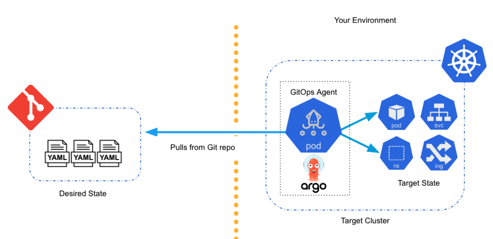
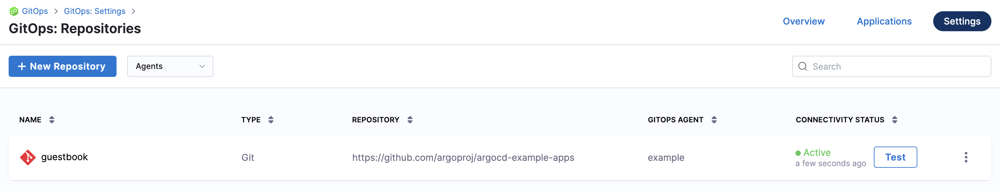
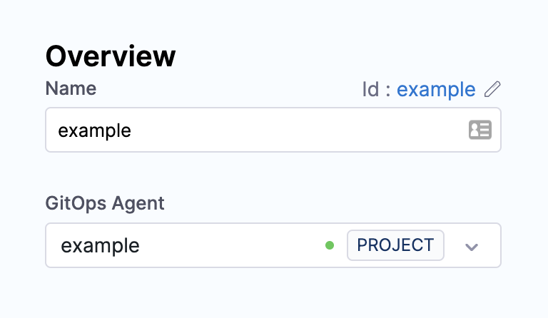
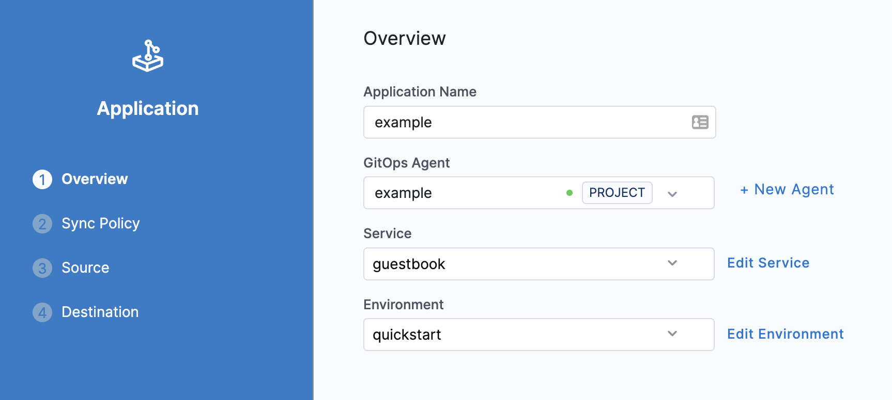
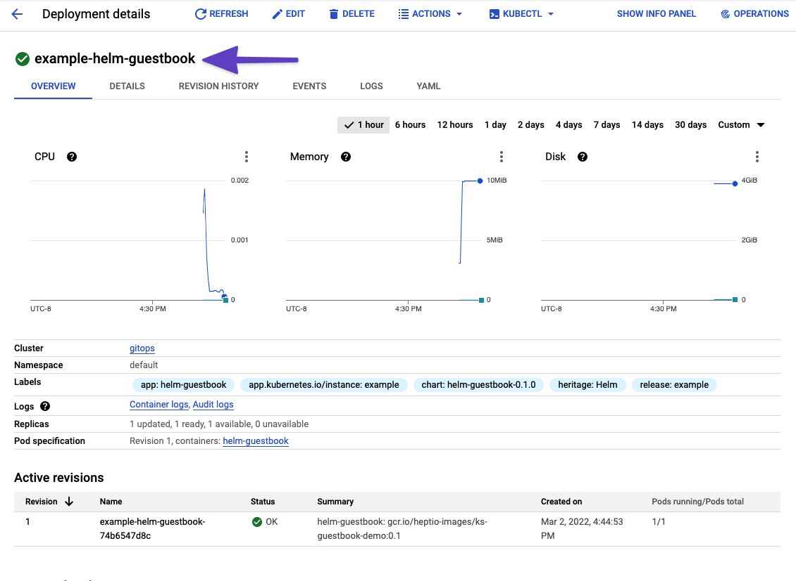

This topic describes how to use Harness GitOps to deploy services by syncing the Kubernetes manifests in your source repos with your target clusters.

## What is GitOps?

GitOps automates Kubernetes-based deployments by syncing declarative specifications (your manifests) with your target environments. In GitOps, Git is the single source of truth for the desired state of a cluster and its applications. GitOps continually converges the target state (cluster) in accordance with the desired state (manifests). This method turns your deployed applications and infrastructures into fully-traceable and fully-versioned artifacts.

You set up Harness GitOps by installing a GitOps Agent in your environment. Next, you define how to manage the desired and target state in a GitOps Application in Harness. The GitOps Agent performs the sync operations defined in the Application and reacts to events in the source and target states.

  

This quickstart shows you how to set up Harness GitOps using one of your Kubernetes clusters.

## Objectives

You'll learn how to:

* Install a Harness GitOps Agent in your target cluster.
* Set up a Harness GitOps Cluster to points to the target cluster.
* Set up a Harness GitOps Repository that points to the source manifest repo.
* Set up a Harness GitOps Application that collects the Agent Cluster, and Repository, and defines the sync policy for GitOps.
* Perform GitOps using your Harness GitOps Application.

For a quick summary of Harness GitOps concepts, see [Harness GitOps Basics](harness-git-ops-basics.md).

## Before You Begin

* (Optional) **GitHub and DockerHub account:** this quickstart uses a publicly available manifest in GitHub and a public Docker image. You will be using anonymous credentials for connection, but you can use your own credentials if you like.  
We'll be using public manifests from <https://github.com/argoproj/argocd-example-apps>.
* **Target Kubernetes cluster:** you can use a cluster in any cloud platform. Harness makes a platform-agnostic connection to the cluster.

* **Set up your Kubernetes Cluster:** you'll need a target Kubernetes cluster for the Harness GitOps Agent and deployment. Ensure your cluster meets the following requirements:
  * **Number of nodes:** 2.
  * **vCPUs, Memory, Disk Size:** the Harness GitOps Agent only needs 1vCPUs, 2GB memory, 20GB disk, but you'll also be running Kubernetes and the deployed service.  
  A cluster with 2vCPUs, 8GB memory, 50GB disk is sufficient. In GKE, the **e2-standard-2** machine type is enough for this quickstart.
  * **Networking:** outbound HTTPS for the Harness connection to **app.harness.io**, **github.com**, and **hub.docker.com**. Allow TCP port 22 for SSH.
  * A **Kubernetes service account** with the permissions need to create your desired state. The Harness GitOps Agent requires either `cluster-admin` or admin permissions in the target namespace:
  	+ Create Deployment, Service, StatefulSet, Network Policy, Service Account, Role, ClusterRole, RoleBinding, ClusterRoleBinding, ConfigMap, Secret.
  	+ Permission to apply CustomResourceDefinition.  
  	For more information, see [User-Facing Roles](https://kubernetes.io/docs/reference/access-authn-authz/rbac/#user-facing-roles) from Kubernetes.

## Note

GitOps entities can be created at account, organization, and project levels. The GitOps Agent is needed to create other entities. A GitOps Agent associated with an account has the authority to create and control entities at all levels. However, an organization-level Agent can manage entities within the organization and its projects and a project-level Agent can only manage entities at a project level.

## Step 1: Add a Harness GitOps Agent

A Harness GitOps Agent is a worker process that runs in your environment and performs GitOps tasks.

You need to set up an Agent before you can set up a Cluster, Repository, or Application, as the Agent is selected in all three of these.

Typically, you install the Agent in the target cluster, but you can install it any cluster and it can connect to remote clusters using the credentials you provide.

Ensure your Harness Project has the **Continuous Delivery** module enabled.


In your Harness Project, click **GitOps**.

The Harness GitOps **Overview**, **Applications**, and **Settings** appear. If this is the first time GitOps has been set up in the Project, the Applications will be empty.


All entities other than Applications are in **Settings**.

Click **Settings**. The Harness GitOps settings appear.


Click **GitOps** **Agents**.

Click **New GitOps Agent**. The Agent wizard appears.


In **Name**, enter the name **example**.

In **Namespace**, enter the namespace where you want to install the Harness GitOps Agent. Typically, this is the target namespace for your deployment. For this quickstart, we use **default**.

Click **Next**. The **Review YAML** settings appear.

This is the manifest YAML for the Harness GitOps Agent. You will download this YAML file and run it in your Harness GitOps Agent cluster.

Click **Download & Continue**. You are prompted to save the YAML file.

Open a terminal and navigate to the folder where you downloaded the YAML file.

In the same terminal, log into the Kubernetes cluster where you want to install the Agent.

For example, here's a typical GKE login:


```
gcloud container clusters get-credentials <cluster_name> --zone us-central1-c --project <project_name>
```
Run the following command to apply the YAML file you downloaded (in this example, `default` was the namespace entered in the **Namespace** setting):


```
kubectl apply -f gitops-agent.yaml -n default
```
In this output example you can see all of the Harness GitOps objects created in Kubernetes:


```
% kubectl apply -f harness-gitops-agent.yaml -n default  
customresourcedefinition.apiextensions.k8s.io/applications.argoproj.io created  
customresourcedefinition.apiextensions.k8s.io/appprojects.argoproj.io created  
serviceaccount/argocd-application-controller created  
serviceaccount/argocd-redis created  
serviceaccount/example-agent created  
role.rbac.authorization.k8s.io/example-agent created  
role.rbac.authorization.k8s.io/argocd-application-controller created  
clusterrole.rbac.authorization.k8s.io/argocd-application-controller-default created  
clusterrole.rbac.authorization.k8s.io/example-agent created  
rolebinding.rbac.authorization.k8s.io/argocd-application-controller created  
rolebinding.rbac.authorization.k8s.io/argocd-redis created  
clusterrolebinding.rbac.authorization.k8s.io/argocd-application-controller-default created  
rolebinding.rbac.authorization.k8s.io/example-agent created  
clusterrolebinding.rbac.authorization.k8s.io/example-agent created  
configmap/argocd-cm created  
configmap/argocd-cmd-params-cm created  
configmap/argocd-gpg-keys-cm created  
configmap/argocd-rbac-cm created  
configmap/argocd-ssh-known-hosts-cm created  
configmap/argocd-tls-certs-cm created  
secret/argocd-secret created  
service/argocd-metrics created  
service/argocd-redis created  
service/argocd-repo-server created  
deployment.apps/argocd-redis created  
deployment.apps/argocd-repo-server created  
statefulset.apps/argocd-application-controller created  
networkpolicy.networking.k8s.io/argocd-application-controller-network-policy created  
networkpolicy.networking.k8s.io/argocd-redis-network-policy created  
networkpolicy.networking.k8s.io/argocd-repo-server-network-policy created  
secret/example-agent created  
configmap/example-agent created  
deployment.apps/example-agent created  
configmap/example-agent-upgrader created  
role.rbac.authorization.k8s.io/example-agent-upgrader created  
rolebinding.rbac.authorization.k8s.io/example-agent-upgrader created  
serviceaccount/example-agent-upgrader created  
Warning: batch/v1beta1 CronJob is deprecated in v1.21+, unavailable in v1.25+; use batch/v1 CronJob  
cronjob.batch/example-agent-upgrader created
```

Back in Harness, click **Continue**.

Harness indicates that the Harness GitOps Agents is registered.


Click **Finish**.

The **Agents** list shows the new Agent as **Healthy** and **Connected**.


In your cloud platform Kubernetes cluster you can see the agent workload:


Now that you have the Harness GitOps Agent installed, running, and registered, you can configure the remaining components.

## Step 2: Add a Harness GitOps Repository

GitOps Repositories store the source manifests you want to sync with destination environments.

In the Repository setup, you will select the Agent to use when synching state.

You will also provide the credentials to use when connecting to the Git repository.

We're going to use a publicly available GitHub repo and manifests located at `https://github.com/argoproj/argocd-example-apps/tree/master/guestbook`. We'll make an anonymous connection, so no GitHub credentials are required.

1. In your Harness Project, click **GitOps**, and then click **Settings**.
2. Click **Repositories**.
3. Click **New Repository**.
   
   

4. In **Specify Repository Type**, click **Git**.
5. Enter the following:
   1. In **Repository Name**, enter **guestbook**.
   2. In **GitOps Agent**, select the Agent you just added and click **Apply Selected**.
   For this quickstart, we'll make an anonymous connection to a GitHub repo over HTTPS.
   3.  In **Repository URL**, enter the URL: `https://github.com/argoproj/argocd-example-apps`.
6.  Click **Continue**.
7.  In **Credentials**, in **Connection Type**, select **HTTPS**.
8.  In **Authentication**, select **Anonymous**.
9.  Click **Save & Continue**. Harness validates the connection.
    The connection is verified.
    
    

10. If you encounter errors, check that you have the correct repo URL and selected **HTTPS**.
11. Click **Finish**. You now have a Harness GitOps Repository added.



## Step 3: Add a Harness GitOps Cluster

Clusters are the target deployment environments that are synced with the source manifests you add as GitOps Repositories.

In the Cluster setup, you will select the Harness GitOps Agent to use when synching state.

You will also provide the credentials to use when connecting to the target cluster. In this quickstart, we'll connect using the cluster master URL and a Service Account Token for the **default** namespace.

1. In your Harness Project, click **GitOps**, and then click **Settings**.
2. Click **Clusters**, and then click **New Cluster**.
3. In **Name**, enter **example**.
4. In **GitOps Agent**, select the Agent you added earlier in this quickstart, and then click **Continue**.
   
   

5. In **Details**, click **Use the credentials of a specific Harness GitOps Agent**. This Cluster will use the Agent's Kubernetes role permissions for connections.
6. Using Specify Kubernetes Cluster URL and credentialsIf you want to use **Specify Kubernetes Cluster URL and credentials**, do the following:
7. In **Master URL**, enter the master URL for your cluster. You can just log into your cluster and run `kubectl cluster-info`. Use the URL listed in the output `Kubernetes master is running at`.
8. In **Authentication**, select **Service Account**.
9.  In **Service Account Token**, paste in the Service Account Token for the cluster's **default** namespace.

To use a Kubernetes Service Account (SA) and token, you will need to either use an existing SA that has `cluster-admin` or *admin* permissions in the namespace, or create a new SA and grant it the permissions. This is described in [Add a Kubernetes Cluster Connector](/docs/platform/Connectors/Cloud-providers/add-a-kubernetes-cluster-connector).

To create a cluster entity using IAM role in Amazon EKS, go to [Creating a GitOps cluster with IAM role](/docs/continuous-delivery/gitops/create-cluster-with-iam.md).

Here's an example of a SA and ClusterRoleBinding with `cluster-admin`:

```yaml
apiVersion: rbac.authorization.k8s.io/v1beta1  
kind: ServiceAccount  
metadata:  
  name: harness-service-account  
  namespace: default  
---  
apiVersion: rbac.authorization.k8s.io/v1beta1  
kind: ClusterRoleBinding  
metadata:  
  name: harness-admin  
roleRef:  
  apiGroup: rbac.authorization.k8s.io  
  kind: ClusterRole  
  name: cluster-admin  
subjects:  
- kind: ServiceAccount  
  name: harness-service-account  
  namespace: default
```
To get a list of the SAs, run `kubectl get serviceAccounts`.

Once you have the SA, use the following commands to get its token (replace `{SA name}` with the Service Account name and `{target namespace}` with the target namespace name, such as **default**):

```bash
SERVICE_ACCOUNT_NAME={SA name}  
  
NAMESPACE={target namespace}  
  
SECRET_NAME=$(kubectl get sa "${SERVICE_ACCOUNT_NAME}" --namespace "${NAMESPACE}" -o=jsonpath='{.secrets[].name}')  
  
TOKEN=$(kubectl get secret "${SECRET_NAME}" --namespace "${NAMESPACE}" -o=jsonpath='{.data.token}' | base64 -d)  
  
echo $TOKEN
```

The token output is decoded and ready to be pasted into Harness.

1. In **Namespace**, enter **default**.
2. Click **Save & Continue**.

Harness validates the connection to the cluster from the Harness GitOps Agent.


In this quickstart, the Agent is running inside the target cluster, but you might use an Agent outside a target cluster in your own scenarios. So long as the Agent you select can connect to the target cluster's master URL, you can add the cluster in Harness GitOps.

Now that you have a Harness GitOps Agent, Repository, and Cluster set up, you're ready to add a Harness GitOps Application.

## Step 4: Add a Harness GitOps Application

A GitOps Application syncs a source manifest with a target cluster using a GitOps Agent.

In the Application setup, you will select the Agent, Repository, and Cluster to use when synching state.

1. In your Harness Project, click **GitOps**, and then click **New Application**.
   
   

2. In **Application Name**, enter **example**.
3. In **GitOps Agent**, select the Agent you added earlier.
4. In **Service**, click **New Service**, and name the Service **guestbook**.
5. In **Environment**, click **New Environment**, name the Environment **quickstart**, and select **Pre-Production**.
   
   

6. Click **Continue**.
7. In **Sync Policy**, you can define the following:
   + Sync Options to define how the Application syncs state.
   + Prune Policy for garbage collection of orphaned resources.
   + The Source manifest to use (Kubernetes, Helm chart, Kustomization, etc).
   + The Destination cluster and namespace.
   
   For this quickstart, we'll simply select a manual sync policy and no other options. You can change any of these settings by editing your Application or whenever you sync.
8. In **Sync Policy**, click **Manual**, and then click **Continue**.
9.  In **Source**, you specify the source repo to use.
10. In **Repository Type**, click **Git**.
11. Click in **Repository URL** and select the URL you entered in your Harness GitOps Repository: `https://github.com/argoproj/argocd-example-apps`.
12. In **Revision Type**, select **Branch**.
13. In **Revision**, select **master**.
14. Wait a moment for **Path** to populate. Harness will pull the paths from the repo.
15. In **Path**, select **helm-guestbook**. This is the location of this app in the repo: `https://github.com/argoproj/argocd-example-apps/tree/master/helm-guestbook`.
16. In **Revision Type**, select:
    * **Branch**: Select a branch and path from the prepopulated dropdown list.
    * **Tag**: Select a branch and tag from the prepopulated dropdown list.
17. In **Helm**, in **Values Files**, select **values.yaml**.
18. Scroll down to see **Parameters**.
  All of the parameters from values.yaml are displayed and can be edited. This lets you modify values.yaml parameters in your Harness GitOps Application.
  Do not change the parameters for this quickstart.
1.  When you're done, **Source** will look like this:
   
   

2.  Click **Continue**.
3.  In **Destination**, click **Cluster URL** and select the Cluster you added earlier.
   
   You can see its name and master URL. Since a Harness GitOps Cluster contains the authentication settings needed to access the cluster, your Harness GitOps Application can select any Cluster.
4.  In **Namespace**, enter **default**.
   
   

5. Click **Finish**.
6.  The new Application is created. At first, it will be **UNKNOWN**.
   
    

Now we can manually sync the Application.

## Step 5: Perform GitOps

Now that you have everything set up, you can sync the source state with the desired state.

1. In your Application, click **SYNC**.

   

2. The Synchronize settings appear.

   

3. Here you can change any of the **Sync Policy** options you set in the Application.
4. Click **Synchronize**.
5. You will see the status **Progressing** and then **HEALTHY**.


Congratulations! You've performed GitOps with Harness!

Let's look in the cluster to verify the deployment.

```bash
kubectl get pods -n default
```

You will see the example-helm-guestbook Pods running.

```bash
NAME                                      READY   STATUS    RESTARTS   AGE  
...  
example-helm-guestbook-74b6547d8c-74ckv   1/1     Running   0          5m22s  
...
```
Here's what the deployment looks like in GCP.



## Step 6: Using the Application

Back in your Harness Application, you can view details on sync status, desired and live states, and perform GitOps.


* **Git details:** you can see the Git commit used as the source for the sync. Clicking the commit Ids opens the commit in the source provider.
* **Deployment:** the deployments dashboard shows when the Application was deployed (synced).
* **Resource View:** displays the desired to target state mapping of each Kubernetes object. Click any item to see its logs and manifest.
  The **Resource View** lets you inspect the live target infrastructure by:
	+ **Name:** Kubernetes object names.
	+ **Kind:** Kubernetes object types.
	+ **Health Status:** the health status of the Application. For example, is it syncing correctly (Healthy)?
	+ **Sync Status:** sort Kubernetes objects by their sync status.
* **App Details:** displays the settings of the Application. You can edit the settings and apply your changes, including the **Sync Options & Policy**.
* **Sync Status:** displays all of the sync operations performed by the Application.
* **Manifest:** displays the manifest of the Application. This is not the same as the source manifest in the Git source repo.  
You can edit the manifest in **Manifest** and the changes are synced in the target infrastructure, but when you do a full sync from your source repo the state of the source repo overwrites any changes made in **Manifest**.
* **App Diff:** displays a diff against the live state in the cluster and desired state in Git. 

Here's an example:

  

You can also initiate a Sync or Refresh from the main GitOps page.


- **Refresh** will pull the latest commit from Git and display whether the current Sync State is **Synced** or **Out of Sync**. It does not sync with the live cluster state. You can Refresh, then use App Diff to view the diff between the desired Git state with the live cluster state.
- **Sync** will sync the desired Git state with the live cluster state.

## Cleaning Up

To delete the Harness GitOps Agent from your Kubernetes cluster, you delete the StatefulSet for the Agent. Once created, the StatefulSet ensures that the desired number of pods are running and available at all times. Deleting the pod without deleting the StatefulSet will result in the pod being recreated.

For example, if you have the Agent pod name `gitops-agent-6877dbf7bf-wg6xv`, you can delete the StatefulSet with the following command:

`$ kubectl delete statefulset -n default gitops-agent-6877dbf7bf`

You can also simply delete and recreate the namespace which will delete all resources except for RoleBindings, ServiceAccounts or NetworkPolicy:


```bash
kubectl delete namespace {namespace}  
  
kubectl create namespace {namespace}
```

## Next Steps

Next, try Harness GitOps using one of your own repos and target clusters.

