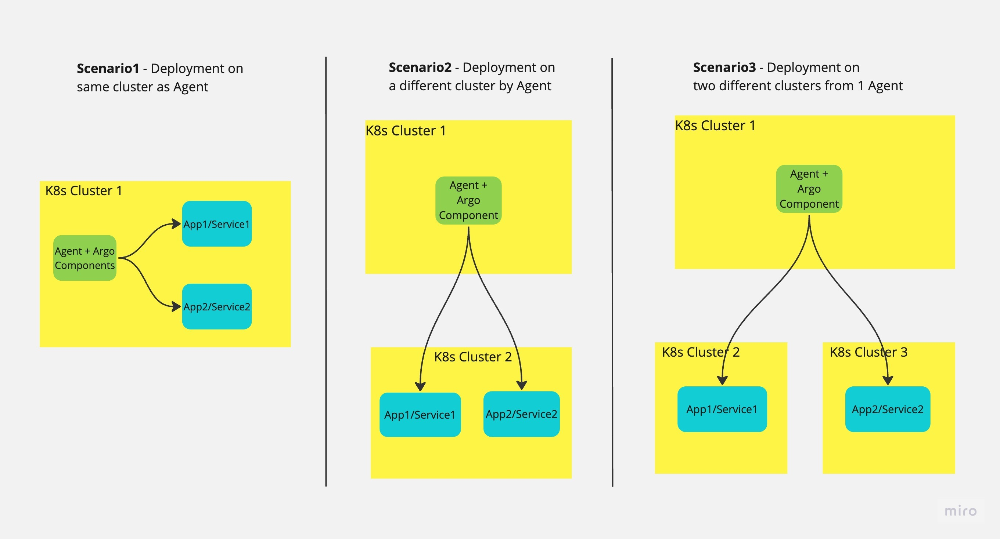
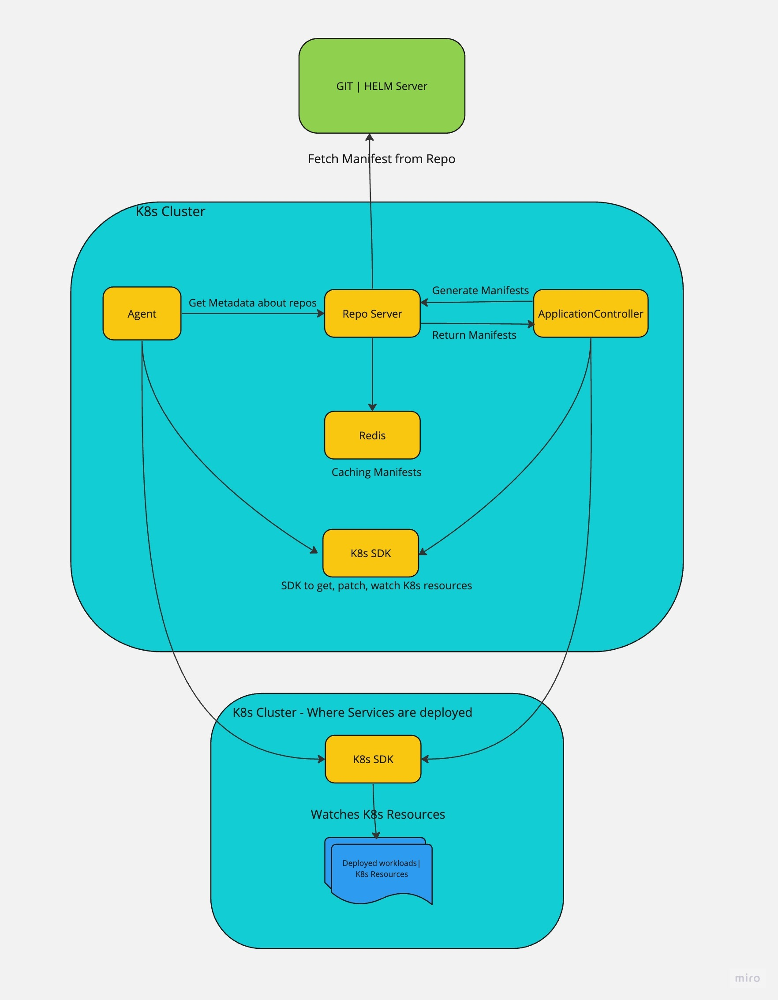

This topic describes the basic concepts of Harness GitOps.

Harness GitOps lets you perform GitOps deployments in Harness. You define the desired state of the service you want to deploy in your Git manifest, and then use Harness GitOps to sync state with your live Kubernetes cluster.

Want to jump right in? Try the [Harness CD GitOps Quickstart](harness-cd-git-ops-quickstart.md).

## Harness GitOps Summary

**What is GitOps?** GitOps is simply using Git to perform Operations Team (Ops) tasks, such as building infrastructure, release automation, and orchestration.

GitOps is also a way to perform CD using Git as the source of truth for the desired state of the deployment. Architecturally, GitOps uses an operator of some kind to continuously monitor the desired state in Git and and sync it with the live state in the Kubernetes cluster.

In contrast to using Pipeline steps to perform deployments, GitOps automates deployments by syncing declarative specifications (your manifests) with your target environments. GitOps continually converges the target state (cluster) in accordance with the desired state (manifests). This method turns your deployed applications and infrastructures into fully-traceable, fully-versioned artifacts.

The declarative description can be in Kubernetes manifest, Helm Charts, Kustomize manifests, and so on.

The live state can be any microservice or application and its Kubernetes environment.

Here's a very simple diagram of the GitOps architecture:

  

The Harness GitOps Agent is a worker process installed in a Kubernetes cluster. The Agent can be installed in your target cluster or any cluster with connectivity to the target cluster.

The Harness GitOps Application runs in Harness SaaS and is where you select the source and target resources to use and how to sync them.

The GitOps Agent makes outbound connections to the GitOps Application in Harness and the Git source repo.

The GitOps Agent then syncs the desired state of the source manifest with the live state of the cluster.

**No Cluster-to-Git Push:** in Harness GitOps, the Git manifest is always the source of truth. GitOps does not perform cluster reconciliation (or *Self Heal*), a process where changes made to the cluster are pushed to the Git source.

## What Can I Deploy with Harness GitOps?

You can deploy any Kubernetes objects. 

You can deploy services and infrastructure or just bootstrap infrastructure.

You can deploy an ApplicationSet and update it using a PR pipeline. See [Harness GitOps ApplicationSet and PR Pipeline Tutorial](https://developer.harness.io/docs/continuous-delivery/cd-gitops/harness-git-ops-application-set-tutorial/).

## Harness Platform Integration

Harness GitOps takes advantage of all the Harness platform features, such as Access Control, REST APIs, monitoring, auditing, etc.

The Harness GitOps Agent runs in your environment, but the remaining GitOps features are run in Harness SaaS. You do not need to devote resources to running a frontend for administration or dashboards and Harness manages backend resources other than the Agent.

### GitOps vs Config-as-Code vs Harness Git Experience

Harness has multiple Git-based features and it's important to understand the differences:

* **GitOps:** used for deploying infrastructure and services. The Git commit in a source manifest repo triggers a sync between the desired state in Git and the live cluster state. This can be used to simply bootstrap clusters or for full service deployments.
* **Config-as-Code:** Harness supports full YAML-based configuration of Pipelines and other Harness entities like Connectors. Harness Pipeline Studio includes a full YAML IDE with hints and autocomplete, so you can simply code your Pipelines as YAML. See [Harness YAML Quickstart](../../platform/8_Pipelines/harness-yaml-quickstart.md).
* **Harness Git Experience:** Harness can sync your Pipelines and other entities with Git repos so you can make all your changes in Git instead of, or in addition to, using the Harness Manager UI. See [Harness Git Experience Overview](/docs/platform/Git-Experience/git-experience-overview).

## Service

A Harness GitOps service is the same as any other Harness service.

A service represents your microservices and other workloads logically. A Service is a logical entity to be deployed, monitored, or changed independently.

You can create or select services from an account, organization, or project level. 

An account level service can only reference connectors for the manifests and artifacts within the account. These services are global and cannot have dependencies at a lower hierarchy level.

For more information, go to [Services and environments overview](/docs/continuous-delivery/get-started/services-and-environments-overview).

## Service instance

Service instances represent the dynamic instantiation of a service you sync via Harness GitOps.

For example, for a service representing a Docker image, service instances are the number of pods running with the Docker image.

A single service can have multiple service instances. For example, one for Dev, one for QA, and one for Prod.

## Environments

Harness environments represent your live environment logically (QA, Prod, etc). In Harness GitOps, an environment is the live state of the infrastructure.

You can create or select environments from an account, organization, or project level. 

An account level environment can only reference connectors within the account, and cannot have dependencies at a lower hierarchy level.

For more information, go to [Services and environments overview](/docs/continuous-delivery/get-started/services-and-environments-overview).

## Application

GitOps Applications are how you manage GitOps operations for a given desired state and its live instantiation.

A GitOps Application collects the Repository (what you want to deploy), Cluster (where you want to deploy), and Agent (how you want to deploy). You define these entities and then select them when you set up your Application.

You will also select:

* Sync Options to define how the Application syncs state.
* Prune Policy for garbage collection of orphaned resources.
* The Source manifest to use (Kubernetes, Helm chart, Kustomization, etc).
* The Destination cluster and namespace.

## Agent

A Harness GitOps Agent is a worker process that runs in your environment, makes secure, outbound connections to Harness SaaS, and performs all the GitOps tasks you request in Harness.

Here's an image that illustrates how the Agent interacts with Harness:

The Agent uses the Repository and Cluster to connect to source repos and target environments. When you create a Harness GitOps Application, you select the Agent you want to use for these connections and GitOps operations.

You can run an Agent in your target cluster or in any cluster that has access to your target clusters.

Agents can deploy to all clusters or you can isolate an Agent in a single cluster. For example, you might have one Agent deploy to Dev and QA environments and another Agent deploy to the production environment.

Here's an image that illustrates a Kubernetes deployment on the same cluster as the Agent, a deployment on different clusters, and deployments on two different clusters using one Agent: 

Installing an Agent involves setting up an Agent in Harness, downloading its YAML file, and applying the YAML file in a Kubernetes cluster (`kubectl apply`). Kubernetes then pulls the Harness and ArgoCD images from their respective public repositories.

### Can I use Harness GitOps images from a local registry?

Yes.  Pulling images from your private registry is possible and can be done by pulling the publicly available images to your private registry and then updating the GitOPS Agent YAML to use the private registry.

## Storage

All GitOps information is stored on your cluster as ConfigMaps and Secrets. Essentially, the cluster acts as the database for GitOps.

Your Harness GitOps Application, Repository, Cluster configurations, etc, are all stored on the PersistentVolume of the cluster hosting the Agent.

Harness SaaS is used to store the state cache only.

## Cluster

A cluster is the target deployment cluster that is compared to the desire state.

Clusters are synced with the source manifests you add as GitOps Repositories.

You can run an Agent in your target cluster or in any cluster that has access to your target clusters.

Only the Agent is needed for GitOps, but the Harness Delegate is needed for other Harness operations (RBAC, etc.). You can use the Agent cluster for both the Harness Delegate and the Agent, or just the Agent: 

## Repository

A Harness GitOps Repository is a repo containing the declarative description of a desired state. The declarative description can be in Kubernetes manifests, Helm Chart, Kustomize manifests, etc.

## Repository Certificates

You can apply a Repository certificate or known host key to a GitOps Agent.

The GitOps Agent will use the certificate or key for all the connections it makes to repositories.

## Desired state

The desired state of a Service and Environment as represented by files in a Repository.

## Live state

The live state of a Service and Environment. The instantiated microservices and pods that are deployed.

## Refresh

Pulls the latest commit from Git and displays whether the current Sync State is Synced or Out of Sync. It does not sync with the live cluster state.

## Sync and Sync Status

A Sync brings the live state to its desired state by applying changes made in the declarative description.

Sync Status identifies if the target state is Synched, Out of Sync, or Unknown.

## Sync Policy

Applications react to variations in state between the source manifest and the target cluster using a Sync Policy.

With Automatic sync enabled, changes to the source manifest initiate sync automatically.

Synch Options tune the synchronization.

## Prune Policy

Prune Policy tells [Kubernetes garbage collection](https://kubernetes.io/docs/concepts/architecture/garbage-collection/) how to check for and delete objects that no longer have owner references.

## Health and Health Status

The health of the Application. Is it syncing correctly (Healthy)?

## App Diff

Compares the latest file in Git with the live state and shows what is different.

If an Application is Healthy and Synced, then there is no App Diff.

## GnuPG Keys

GnuPG Keys can be used to configure Harness GitOps to only sync against commits that are signed in Git using GnuPG.

The GitOps Agent you select will enforce signature verification.

