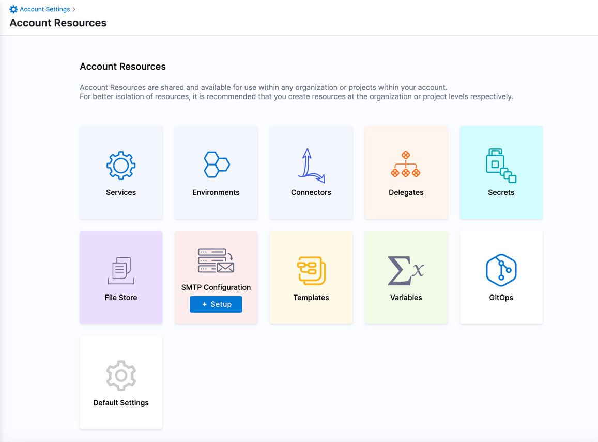
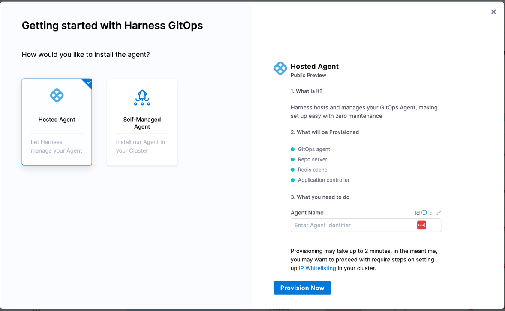
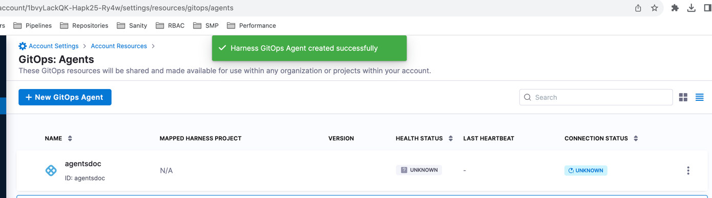

Deploying and managing agents for GitOps on Kubernetes clusters can be a challenge. Harness Hosted GitOps can be used for quick journey through GitOps. Harness Hosted GitOps makes it easy to deploy and manage applications on Kubernetes clusters, agent required for managing applications is deployed and hosted by Harness.

## How it works

To create a Harness Hosted GitOps agent you should go to [Account Resources] and pick `GitOps`. Hosted GitOps is only available at account level, and there is a limit of one agent per account. 

After you pick GitOps and then click on `Add Agent` you will be presented with a form to fill in the details of the agent. For Hosted GitOps agent it is required to provide only an identifier. 

Provisioning of agent can take some time, after agent is successfully created it takes some time for agent to become ready. 

Wait until  you see that `Health Status` and `Connection Status` are `Healthy` and `Connected` respectively.  

Additionally, if your destination cluster is behind a firewall you can provide a list of IPs that should be allowed to access the cluster.(See **IP Whitelisting** - [Harness hosted GitOps IP addresses](/docs/continuous-delivery/gitops/gitops-ref/gitops-allowlist.md) for more details.)

When your agent is ready and authorized to access your clusters (IP Whitelisting) you can start creating GitOps repositories, clusters and applications. (See [GitOps Quickstart](/docs/continuous-delivery/gitops/gitops-quickstart) for more details)
