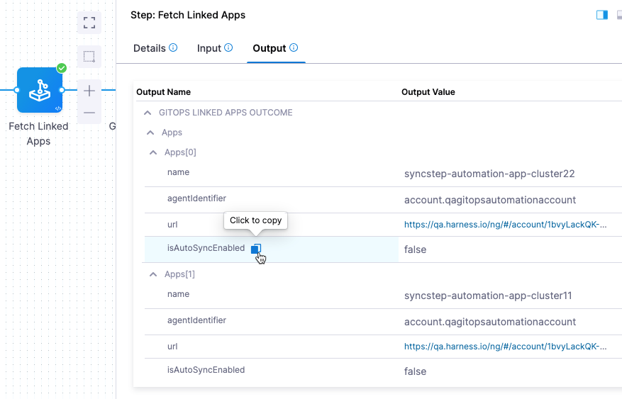
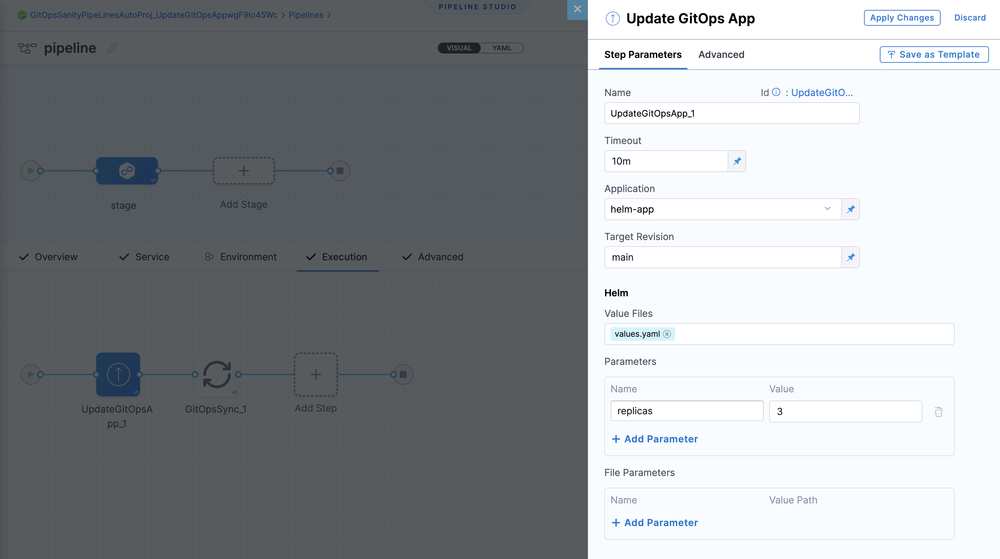
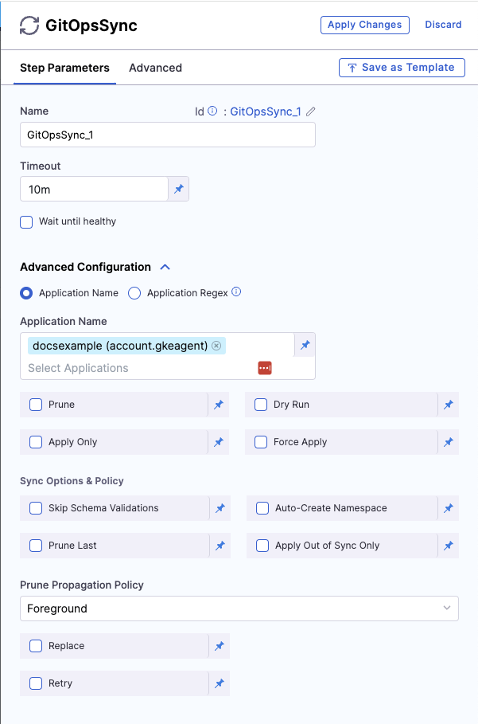
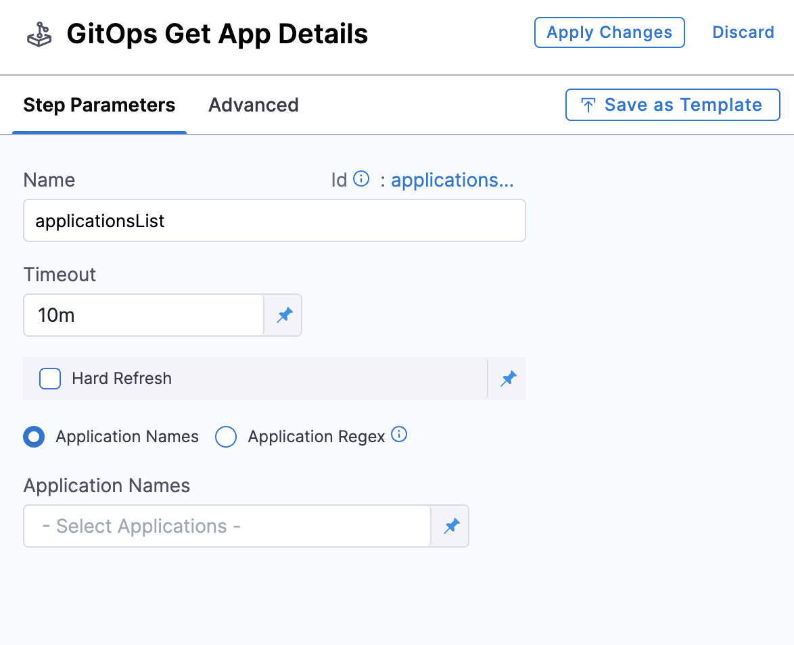

This topic shows you how to configure your Harness GitOps pipeline steps. Few of these steps are specifically meant to be used with [PR pipelines](/docs/continuous-delivery/gitops/pr-pipelines/pr-pipelines-basics.md), but others can be used directly in your GitOps pipeline stages. 

## PR Pipeline Steps

:::tip Important

This topic describes how to use Harness GitOps PR pipeline steps in your [Harness PR pipeline](/docs/continuous-delivery/gitops/pr-pipelines/pr-pipelines.md). Please refer to that topic before venturing into this one.

:::

Harness automatically adds multiple steps to the PR pipelines that you create in Harness. These steps and other PR pipeline steps are described in this section.

Steps that Harness adds to the PR pipeline:
- Update Release Repo step
- Merge PR step
- Fetch Linked Apps step

Other steps that you can add to the PR pipeline:
- Revert PR step

:::note

You don't have to edit anything in the **Update Release Repo**, **Merge PR** and **Fetch Linked Apps** steps. The steps are ready for use, but you can apply optional configurations specified below.

:::

### Update Release Repo step

:::note Limitation

Only one Update Release Repo or Revert PR step can run per GitHub token reference at a time.
This adheres to [GitHub's best practices](https://docs.github.com/en/rest/using-the-rest-api/best-practices-for-using-the-rest-api?apiVersion=2022-11-28#avoid-concurrent-requests) to prevent [secondary rate limits](https://docs.github.com/en/rest/using-the-rest-api/rate-limits-for-the-rest-api?apiVersion=2022-11-28#about-secondary-rate-limits) during pull request creation.

:::

This step fetches JSON or YAML files, updates them with your changes, performs a commit and push, and then creates the PR.

You can also enter variables in this step to update key-value pairs in the config file you are deploying.

In this step, you can do the following:

- Provide a **custom PR title**. If you don't provide a PR title, Harness creates the PR with the title **Harness: Updating config overrides**.

- Specify **hierarchical variables**. If you specify a dot-separated variable in this step, the step creates or updates a nested variable. For example, if you specify the key-value pair of a variable as `a.b:val`, it creates or updates the config file with the following JSON object:
   ```
   {
       "a": {
            "b": "val"
       }
       ...
       // other existing config.json values
   }
   ```

- If a variable name used in this step matches a variable in the Harness service or environment used in this pipeline, the variable entered in this step overrides the service or environment variable.

- If an empty or blank value is provided for a variable, the variable is disregarded, and no updates are made to the JSON or YAML file for that specific variable.

### Merge PR step

:::info Limitation

You can create a maximum of two Merge PR steps in a stage.

Currently, Git connectors authenticated through OAuth are not supported in the Merge PR step.

:::

This step merges a PR.

### Fetch Linked Apps step

The Fetch Linked Apps step provides app information, such as the app name, agent identifier, and URL to the Harness GitOps apps which are generated via ApplicationSet.

The following image shows information that is displayed on the **Output** tab of the step:



You can copy the expression for any output in the **Output Name** column and use it to reference the output value in a subsequent Shell Script step or step setting.

Configuring the Deployment Repo manifest in your service is required for this step to execute correctly.

Harness fetches the ApplicationSet YAML file from its file store and identifies the related Harness GitOps app(s). For example: 

```

Starting Git Fetch Files
Git connector Url: https://github.com/wings-software/gitops-automation.git
Branch: syncstepautomation

Fetching following Files :
- helm2/app1/appset.yaml

Successfully fetched following files:
- helm2/app1/appset.yaml


Git Fetch Files completed successfully.
App set Name: helm-k8s-app
Found linked app: syncstep-automation-app-cluster22. Link - https://app.harness.io/ng/#/account/1bvyLackQK-Hapk25-Ry4w/cd/orgs/default/projects/DoNotDeleteGitopsAutomationSyncStep/gitops/applications/syncstep-automation-app-cluster22?agentId=account.qagitopsautomationaccount
Found linked app: syncstep-automation-app-cluster11. Link - https://app.harness.io/ng/#/account/1bvyLackQK-Hapk25-Ry4w/cd/orgs/default/projects/DoNotDeleteGitopsAutomationSyncStep/gitops/applications/syncstep-automation-app-cluster11?agentId=account.qagitopsautomationaccount
```

### Revert PR step

:::note Limitation

Only one Update Release Repo or Revert PR step can run per GitHub token reference at a time.
This adheres to [GitHub's best practices](https://docs.github.com/en/rest/using-the-rest-api/best-practices-for-using-the-rest-api?apiVersion=2022-11-28#avoid-concurrent-requests) to prevent [secondary rate limits](https://docs.github.com/en/rest/using-the-rest-api/rate-limits-for-the-rest-api?apiVersion=2022-11-28#about-secondary-rate-limits) during pull request creation.

:::

This step reverts the commit passed and creates a new PR. Use this step if you want to run any tests or automation on the pipeline and then revert the commit done by the **Update Release Repo** step.

The Revert PR step uses the commitId from the Update Release Repo step as input. The commitId can be an expression, runtime input, or a static value. For example,

```
<+pipeline.stages.deploy.spec.execution.steps.updateReleaseRepo.updateReleaseRepoOutcome.commitId>
```

The Revert PR step creates a new branch and creates a commit to revert the changes made by the commit in the Update Release Repo step.

You can create another Merge PR step to merge the PR created by the Revert PR step. In this scenario, the Merge PR step reaches its maximum limit for a stage.

## Additional Harness GitOps Pipeline Steps

:::info

For these steps, ensure that the service, environment, and cluster selected in the pipeline matches the service, environment and cluster, respectively, in the application.

:::

### Update GitOps App step

:::note Limitation

You can use the Update GitOps App step only once in a stage.

:::

This step updates a GitOps application through a PR Pipeline. Use this step if you have an existing GitOps application and want to update its target revision (branch or tag), Helm, or Kustomize overrides.

A common Git-based use case bases production deployments on Git tags because tags are immutable. In this use case, to deploy a new version, you can use the Update GitOps App step to update your GitOps application to a new tag.

You can use this step to override your Kustomize application configuration from the pipeline. 

From this step, you can also provide Helm overrides (parameters, file parameters, or values files) from the pipeline. Helm parameters and file parameters represent individual value overrides for your Helm application, while values files represent an existing set of overrides already present in the repository.

:::info

Existing Helm parameters and file parameters are merged with the values provided in the PR pipeline. Other parameters remain unchanged. A parameter and a file parameter are not merged with each other.

:::

If a parameter is specified both in the values file and as a parameter or file parameter override, the latter takes precedence.



Once your GitOps application is updated, you can use the GitOps Sync step to deploy your changes.

### GitOps Sync step

This step triggers a sync for your existing or updated GitOps application.

Optionally, click on the **Wait until healthy** checkbox, if you would like the step to run until the application reaches it's "Healthy" state.

In **Advanced Configuration**, select the application you want to sync and configure the sync options. You can either can either choose an application or applications manually, or you can match up to 1000 applications using a regex filter.



The sync options provided are the same options you receive while syncing an application in GitOps directly.

### GitOps Get App Details step

This step fetches the details and status of your application.

:::info

Currently, Get App Details step is behind the feature flag `GITOPS_GET_APP_DETAILS_STEP`. Contact Harness Support to enable the feature.

:::

If **Hard Refresh** is enabled, the application status will be hard refreshed when retrieving the information. 

You can choose on how the application can be fetched. 



Choose **Application Names** to select the application names from the dropdown. You can also provide the application name when you start the pipeline execution by selecting the Runtime input option.

You can also fetch up to 1000 applications by choosing **Application Regex**. You can provide a regex expression as a Fixed value, or provide it as a run-time input or Expression.

:::note Limitations and Constraints

Applications are included in the step’s outcome only if the serviceId, envId, and clusterId match the values provided in the pipeline.

If no matching applications are found, the step will fail.

The applicationRegex must be a valid regex, or the step will fail.

You can fetch up to 1000 applications in a single step, provided the final JSON string remains under 512kB.

To stay within the 512kB size limit, certain fields in the response are trimmed or excluded. These include `.app.spec.ignoreDifferences`, `.app.spec.info`, `.app.status.resources`, and `.app.status.operationstate.syncresult.resources`

:::

The data will be returned as a JSON payload that will be parsed by the step. The response can be referenced using Harness expressions in subsequent steps.

Example response of one application fetched: `{"applications":[{app1}]}`

Example response of multiple application fetched: `{"applications:[{app1},{app2}]}`

This completes all the configurable steps for GitOps in Harness pipelines. Happy Deploying!