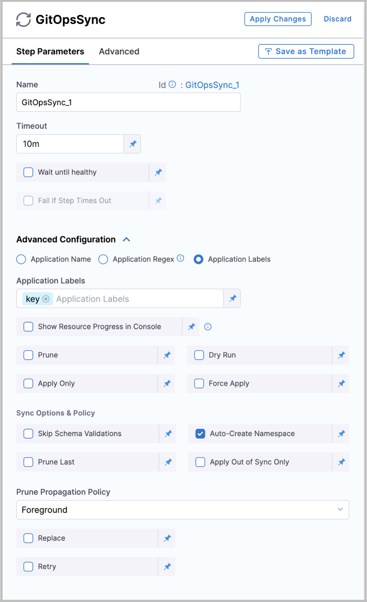

:::tip Important

This document describes how to use various GitOps steps in your [Harness PR pipeline](/docs/continuous-delivery/gitops/pr-pipelines/pr-pipelines.md). Before you begin, go through the basics of the [Harness PR pipeline](/docs/continuous-delivery/gitops/pr-pipelines/pr-pipelines).

:::

Harness automatically adds multiple steps to the PRs that you create in Harness. These steps and optional steps are described in this document.

:::note

You don't have to edit anything in the **Update Release Repo** and **Merge PR** steps. The steps are ready for use, but you can apply optional configurations.

:::

## Resolve services, environments, and clusters

Before your Harness PR pipeline runs, you will notice two tabs where Harness resolves the [service, environment, and cluster configuration](/docs/continuous-delivery/gitops/pr-pipelines/pr-svc-env.md). These appear as **Service** and **Cluster** tabs and their successful runs have the following logs.

### Service

```bash
Starting service step...  
Processing service variables...  
Applying environment variables and service overrides  
Processed service variables  
Processed artifacts and manifests  
Completed service step
```

### GitOps Clusters:

```bash
Environment(s): {dev}   
  
Processing clusters at scope PROJECT  
Following 1 cluster(s) are present in Harness Gitops  
Identifiers: {engineeringdev}   
  
Following 1 cluster(s) are selected after filtering  
Identifiers: {engineeringdev}   
  
Completed
```

## PR pipeline steps

### Update Release Repo

This step fetches JSON or YAML files, updates them with your changes, performs a commit and push, and then creates the PR.

You can also enter variables in this step to update key-value pairs in the config file you are deploying.

In this step, you can do the following:

- Provide a **custom PR title**. If you don't provide a PR title, Harness creates the PR with the title **Harness: Updating config overrides**.

- Specify **hierarchical variables**. If you specify a dot-separated variable in this step, the step creates or updates a nested variable. For example, if you specify the key-value pair of a variable as `a.b:val`, it creates or updates the config file with the following JSON object:
   ```
   {
       "a": {
            "b": "val"
       }
       ...
       // other existing config.json values
   }
   ```

If a variable name used in this step matches a variable in the Harness service or environment used in this pipeline, the variable entered in this step overrides the service or environment variable.

4. If an empty or blank value is provided for a variable, the variable is disregarded, and no updates are made to the JSON or YAML file for that specific variable.


A successful run for Update Release Repo looks like this:


### Merge PR

:::info Limitation

You can create a maximum of two Merge PR steps in a stage.

:::

This step merges a PR.

```bash
PR Link: https://github.com/wings-software/gitops-pipeline-demo/pull/155  
Pull Request successfully merged  
Commit Sha is bcd4f2f73a47b74dba54habbcd10a6679ed99a  
Done.
```

### Fetch Linked Apps

The Fetch Linked Apps step provides app information, such as the app name, agent identifier, and URL to the Harness GitOps app.

The following image shows information that is displayed on the **Output** tab of the step:


As shown in the image, you can select the **Click to copy** icon in the **Output Name** column to copy the expression that references a key name. You can then use that expression to reference the output value in a subsequent Shell Script step or other step setting.

Harness fetches the ApplicationSet YAML file from its file store and identifies the related Harness GitOps app(s). This can be verified in the step logs that follow:

```
Starting Git Fetch Files
Git connector Url: https://github.com/wings-software/gitops-automation.git
Branch: syncstepautomation

Fetching following Files :
- helm2/app1/appset.yaml

Successfully fetched following files:
- helm2/app1/appset.yaml


Git Fetch Files completed successfully.
App set Name: helm-k8s-app
Found linked app: syncstep-automation-app-cluster22. Link - https://app.harness.io/ng/#/account/1bvyLackQK-Hapk25-Ry4w/cd/orgs/default/projects/DoNotDeleteGitopsAutomationSyncStep/gitops/applications/syncstep-automation-app-cluster22?agentId=account.qagitopsautomationaccount
Found linked app: syncstep-automation-app-cluster11. Link - https://app.harness.io/ng/#/account/1bvyLackQK-Hapk25-Ry4w/cd/orgs/default/projects/DoNotDeleteGitopsAutomationSyncStep/gitops/applications/syncstep-automation-app-cluster11?agentId=account.qagitopsautomationaccount
```

:::note

The steps mentioned above are automatically added when you select the **GitOps** tab while creating a [Harness PR pipeline](/docs/continuous-delivery/gitops/pr-pipelines/pr-pipelines.md#create-a-harness-pr-pipeline).

:::

### Revert PR

This step reverts the commit passed and creates a new PR. Use this step if you want to run any tests or automation on the pipeline and then revert the commit done by the **Update Release Repo** step.

The Revert PR step uses the commitId from the Update Release Repo step as input. The commitId can be an expression, runtime input, or a static value. For example, 

```
<+pipeline.stages.deploy.spec.execution.steps.updateReleaseRepo.updateReleaseRepoOutcome.commitId>
```

The Revert PR step creates a new branch and creates a commit to revert the changes made by the commit in the Update Release Repo step.

```bash
Setting git configs
Using optimized file fetch
Created revert PR https://github.com/wings-software/gitops-pipeline-demo/pull/156
Done.
```

You can create another Merge PR step to merge the PR created by the Revert PR step. In this scenario, the Merge PR step reaches its maximum limit for a stage.

:::info

For the **Update GitOps App** and **GitOps Sync** steps, ensure that the service, environment, and cluster selected in the pipeline matches the service, environment, and cluster, respecitvely, in the application.

:::

### Update GitOps App

:::note

Currently, this feature is behind the feature flag `GITOPS_UPDATE_APP_STEP`. Contact [Harness Support](mailto:support@harness.io) to enable the feature.

:::

:::note Limitation

You can use the Update GitOps App step only once in a stage.

:::

This step updates a GitOps application through a PR Pipeline. Use this step if you have an existing GitOps application and want to update its target revision (branch or tag) or Helm overrides.

A common Git-based use case bases production deployments on Git tags because tags are immutable. In this use case, to deploy a new version, you can use the Update GitOps App step to update your GitOps application to a new tag.

By using this step, you can also provide Helm overrides (parameters, file parameters, or values files) from the pipeline. Helm parameters and file parameters represent individual value overrides for your Helm application, while values files represent an existing set of overrides already present in the repository.

:::info

Existing Helm parameters and file parameters are merged with the values provided in the PR pipeline. Other parameters remain unchanged. A parameter and a file parameter are not merged with each other.

:::

If a parameter is specified both in the values file and as a parameter or file parameter override, the latter takes precedence.


Once your GitOps application is updated, you can use the GitOps Sync step to deploy your changes.

### GitOps Sync

This step triggers a sync for your existing or updated GitOps application.

After selecting this step, in **Advanced Configuration**, select the application you want to sync and configure the sync options.

   

The sync options provided are the same options you receive while syncing an application in GitOps directly. 

This completes all the possible configurable steps in Harness PR pipelines. Happy Deploying!
