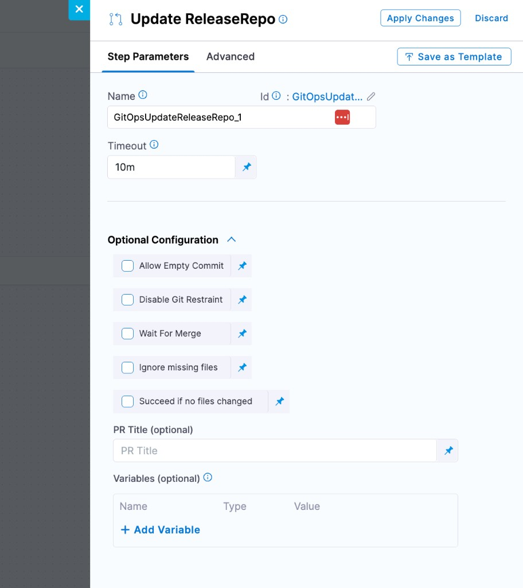
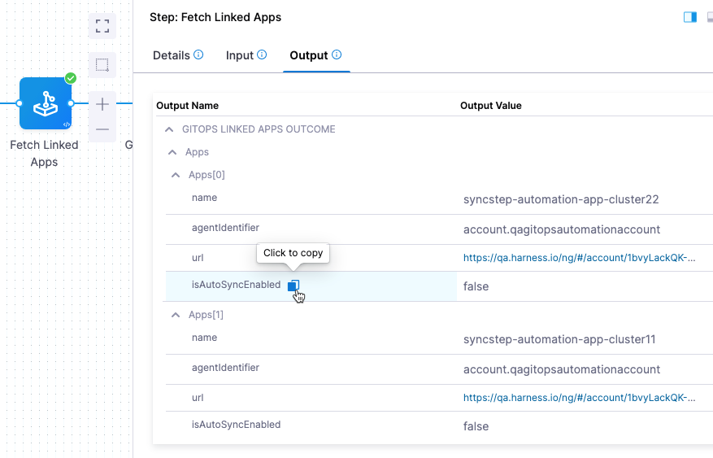
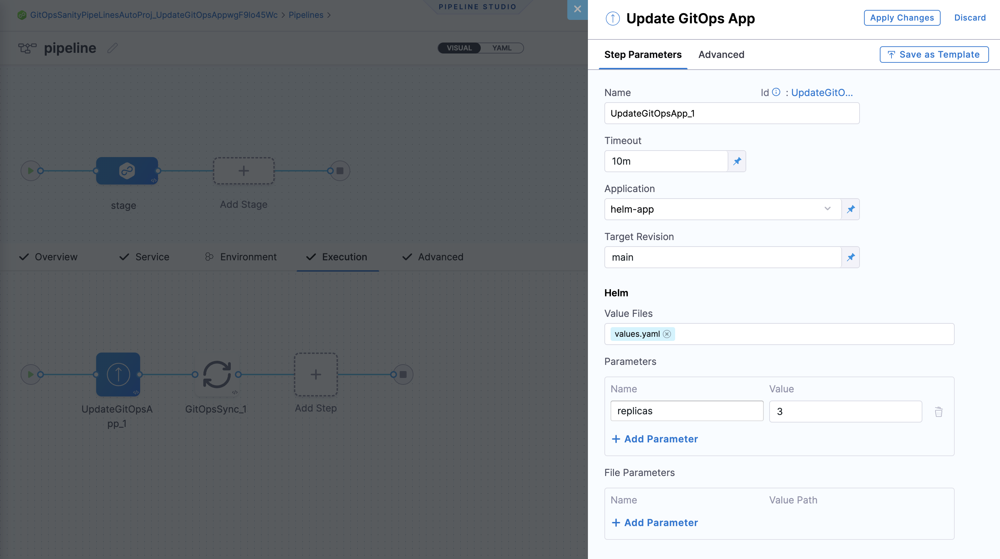
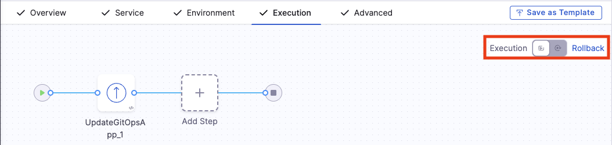
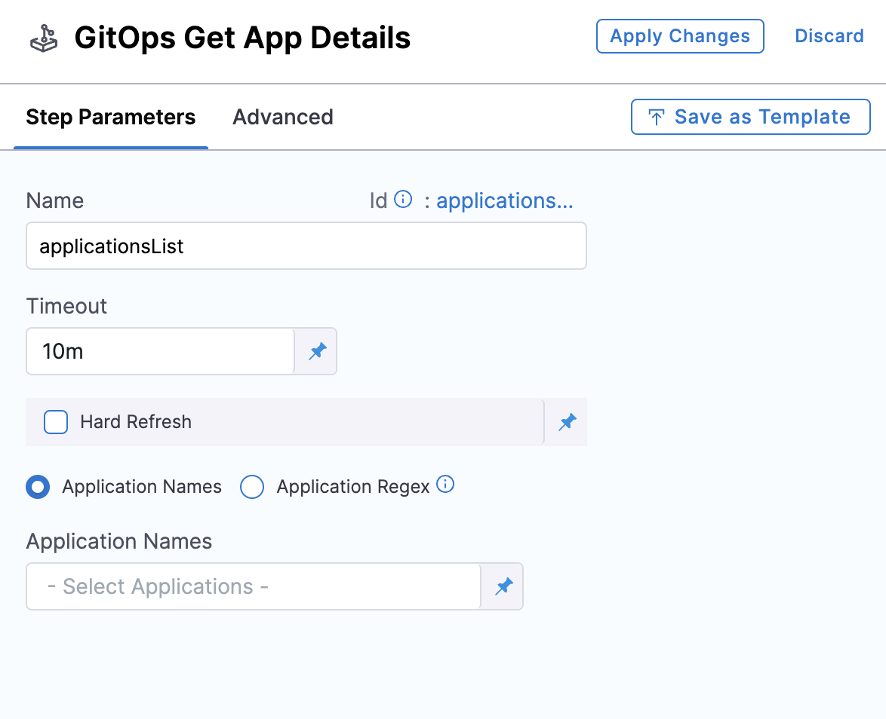
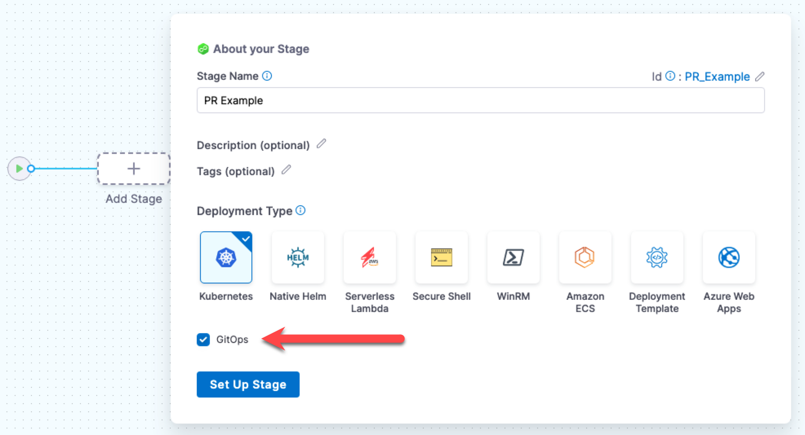
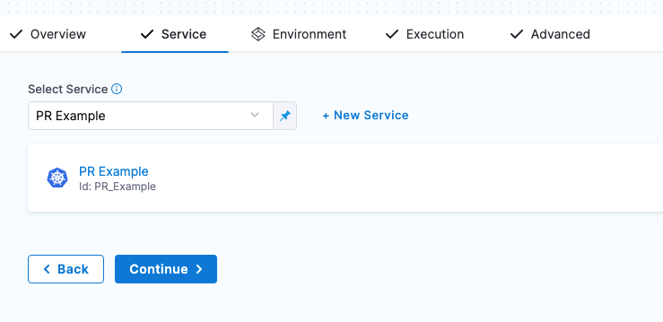
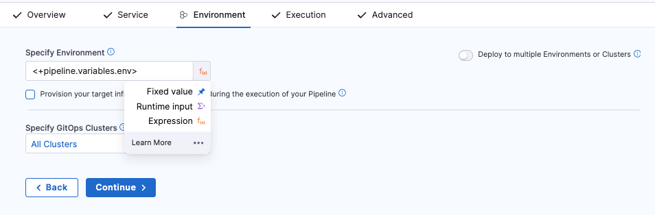
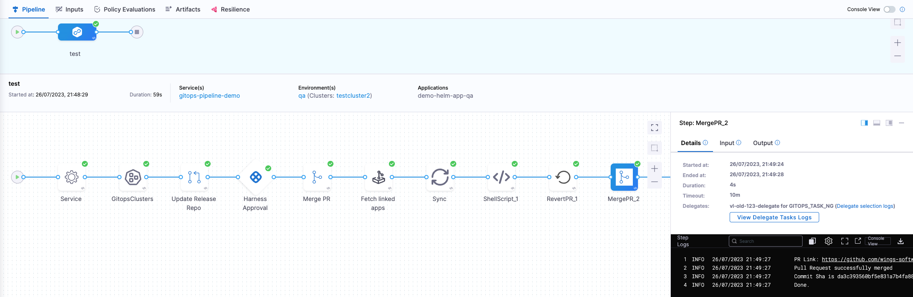

import DocImage from '@site/src/components/DocImage';

A Harness GitOps PR pipeline automates the full lifecycle of a Git-based deployment. Instead of applying changes directly to a cluster, the pipeline commits configuration updates to a Git repository, raises a pull request for review, and lets ArgoCD reconcile the desired state once the PR is merged. This keeps Git as the single source of truth while giving you pipeline-level orchestration, approval gates, and audit trails.

## What is a PR pipeline?

A PR pipeline connects your CI/CD workflow to GitOps by turning every deployment into a traceable Git change. The end-to-end flow looks like this:

```
Pipeline Trigger
      │
      ▼
Update Release Repo ── commits config changes & raises a PR
      │
      ▼
PR Created in Git
      │
      ▼
Review / Approval ──── manual or automated
      │
      ▼
Merge PR ───────────── pipeline merges the approved PR
      │
      ▼
ArgoCD Detects Change
      │
      ▼
GitOps Sync ────────── forces an immediate sync (optional)
      │
      ▼
Application Updated in Cluster
```

Each box in the flow maps to a concrete pipeline step you can configure in the Harness UI.

## Prerequisites

Before you create a PR pipeline, make sure the following are in place:

- **GitOps service with a Release Repo manifest:** The service must have at least a Release Repo manifest that points to the config file the pipeline will update (e.g. `values.yaml`, `config.json`). See [Create a GitOps service](/docs/continuous-delivery/gitops/gitops-entities/service/).
- **Harness environment and cluster:** An environment linked to a GitOps cluster managed by your GitOps agent. See [Create GitOps environments](/docs/continuous-delivery/gitops/gitops-entities/environment).
- **Git connector with write access:** A Harness Git connector that has permission to create branches and pull requests in your target repository.
- **ArgoCD application synced to a base state:** The GitOps application should already be synced so the pipeline has a known-good starting point.

## GitOps pipeline steps

Harness provides purpose-built steps for GitOps pipelines. The table below summarizes every available step, what it does, and which service manifest it depends on.

| Pipeline step | Purpose | Manifest required |
|---|---|---|
| [Update Release Repo](#update-release-repo) | Commits config changes (e.g. image tag, Helm values) to the release repo and raises a PR | Release Repo manifest |
| [Merge PR](#merge-pr) | Merges the PR created by Update Release Repo into the target branch | None |
| [Fetch Linked Apps](#fetch-linked-apps) | Discovers GitOps applications linked to the service and environment (ApplicationSet workflows only) | Deployment Repo manifest or ApplicationSet references |
| [GitOps Sync](#gitops-sync) | Triggers a hard sync of an ArgoCD application to apply the latest Git state | None |
| [Update GitOps App](#update-gitops-app) | Updates values files, Helm overrides, or target revision directly on the application | None |
| [GitOps Get App Details](#gitops-get-app-details) | Returns real-time application status as JSON for use in subsequent steps | None |
| [Revert PR](#revert-pr) | Reverts a previously merged PR - used in rollback scenarios | None |
| [GitOps Rollout](#gitops-rollout) | Controls Argo Rollouts progressive delivery (pause, resume, abort) | None |

### Update Release Repo

This step fetches your YAML config files (Kubernetes manifests, `kustomization.yaml`, or `values.yaml`) from the release repo, applies the variable changes you specify, commits the result to a new branch, and creates a pull request.

**Key capabilities:**

- **Custom PR title:** Provide a title or let Harness default to *Harness: Updating config overrides*.
- **Hierarchical variables:** A dot-separated key like `a.b` creates or updates a nested structure:
  ```json
  {
    "a": {
      "b": "val"
    }
  }
  ```
- **List value updates:** Target a specific list index, e.g. `spec.template.spec.containers[0].image`. You can update existing list values but cannot add or remove items.
- **Variable precedence:** If a variable name in this step matches one defined on the service or environment, the step-level value wins.
- **Automatic service and environment overrides:** In addition to the variables you define in this step, the Update Release Repo step automatically applies service-level and environment-level variable overrides. These overrides come from the GitOps Cluster step output and are merged into the config file. This means keys you did not explicitly add in the step (such as `deploy_file` or `repo_env_path`) may appear in the committed file.
- **Empty values:** A blank variable value is ignored — no update is written for that key.

:::tip Suppressing unwanted overrides
To prevent a specific service or environment override from being written to your config file, add it as a variable in the Update Release Repo step with a **blank value**. Variables with empty values are ignored and no update is written for that key, effectively suppressing the automatic override.
:::

**Optional configuration:**

- **Allow Empty Commit:** When `true`, the step commits even if no file changes are detected instead of failing. Requires Harness Delegate version 84600 or later.
- **Disable Git Restraint:** When `true`, removes the Git locking mechanism so multiple pipelines can modify the same repository concurrently through a single connector.



### Merge PR

Merges the pull request created by the Update Release Repo step.

:::info Limitation
- You can add a maximum of two Merge PR steps in a single stage.
- Git connectors authenticated through OAuth are not currently supported in this step.
:::

### Fetch Linked Apps

:::tip Not needed for standalone applications
If you are deploying standalone GitOps applications (no ApplicationSets), you do not need this step. You can select applications directly in the GitOps Sync step by name, regex, or labels. This step is only useful when ApplicationSets dynamically generate the applications you want to sync.
:::

Discovers all GitOps applications generated by the ApplicationSet linked to your service and environment — including app name, agent identifier, and a direct link to the app in Harness. This is most commonly used as a precursor to the [GitOps Sync](#gitops-sync) step: when Fetch Linked Apps is present, the Sync step automatically picks up the discovered applications and you do not need to specify them manually.

The step resolves applications using either the **Deployment Repo** details or the **ApplicationSet references** configured in your service. If neither is defined, the step will fail.

#### Filter applications per configured service/environment

The step includes a **Filter applications per configured service/env** checkbox:

- **Unchecked (default, recommended):** Fetches only applications matching both the service definition and the cluster(s) linked to the pipeline's environment.
- **Checked:** Fetches all applications in the cluster that belong to the specified environment, regardless of service configuration.

:::warning
Enabling the filter with a large number of applications may cause the step to fail due to timeout or resource constraints. Leave it unchecked unless you have a specific need.
:::

#### Multiple ApplicationSet support

:::info Feature flag
This feature requires `GITOPS_APPLICATIONSET_FIRST_CLASS_SUPPORT`. Contact [Harness Support](mailto:support@harness.io) to enable it.
:::

When enabled, you can configure multiple ApplicationSets at the service level. The Fetch Linked Apps step fetches applications across all agents where those ApplicationSets are deployed.

#### Step output

The output tab displays app name, agent ID, and URLs. You can copy any output expression and reference it in subsequent steps.



### GitOps Sync

Triggers a sync for one or more existing or updated GitOps applications. **This is the GitOps equivalent of a deployment** — it is the step that actually applies changes to your cluster. Place approval gates, policy checks, or any other pre-deployment validations *before* this step. Place verification, notifications, or post-deployment scripts *after* it.

- **Wait until healthy:** Enable this checkbox to hold the step until the application reaches a `Healthy` state.

**If a [Fetch Linked Apps](#fetch-linked-apps) step ran earlier in the stage**, the Sync step automatically uses the discovered applications — you do not need to select any applications in the step configuration.

If Fetch Linked Apps is not present (for example, when deploying standalone applications without ApplicationSets), use **Advanced Configuration** to choose how to select applications:

- **Application name:** Select specific applications manually from the dropdown.
- **Application regex:** Match up to 1000 applications using a regular expression. This field uses **Go (Golang) regex syntax** — not JEXL. You can test your patterns at [regex101](https://regex101.com/) with the **Golang** flavor selected.
- **Application labels:** Filter applications by their Kubernetes labels using exact match (`Key:Value`) or partial match (`Key` or `Value`). Partial searches also consider the Service name and Environment name associated with the application. This is especially useful when you want to sync a group of related applications — for example, all apps labeled `env:production`, or all apps belonging to a specific team or deployment group.

<div align="center">
  <DocImage path={require('./static/gitopssync-step.png')} width="50%" height="50%" title="Click to view full size image" />
</div>

#### Using expressions with application labels

`applicationLabels` represents a list of strings. Use one of these approaches to pass label values:

**JSON list functor:**

```
<+json.list("$", <+pipeline.variables.labels>)>
```

Format the `labels` variable as `["cluster"]` or `["cluster", "list"]`. See [JSON and XML functors](/docs/platform/variables-and-expressions/harness-variables/#json-and-xml-functors).

**Split function:**

```
<+pipeline.variables.labels.split(",")>
```

Input: `cluster` (single) or `cluster,list` (multiple).

#### Debugging and output

:::tip Check the console output
Open the step's console output during execution to see exactly which applications passed the filters and were actually synced. This is especially useful when using regex or label-based selection to verify the right set of applications was targeted.
:::

The GitOps Sync step exposes output variables that downstream steps can reference — for example, the list of applications that were synced. Use these in Shell Script or other steps to run custom validation or notification logic after the sync completes.

### Update GitOps App

Updates an existing GitOps application's target revision (branch or tag), Helm overrides (parameters, file parameters, values files), or Kustomize overrides directly from the pipeline - without modifying files in Git.

:::note Limitation
You can use the Update GitOps App step only once per stage.
:::

A common use case is tag-based production deployments: update the application's target revision to a new immutable Git tag, then follow with a GitOps Sync step.

:::info
Existing Helm parameters and file parameters are merged with the values provided in the step. If a parameter appears in both a values file and as an override, the override takes precedence.
:::



#### Rollback for Update GitOps App

:::note
This feature is behind the feature flag `CDS_GITOPS_ENABLE_UPDATE_GITOPS_APP_ROLLBACK`. Contact [Harness Support](mailto:support@harness.io) to enable it.
:::

1. **Toggle to the Rollback tab** using the **Execution / Rollback** toggle in the pipeline studio.
2. **Add an Update GitOps App step.** This rollback step requires no configuration - it automatically reverts to the last successful revision.
3. **Add a GitOps Sync step** after it to apply the rolled-back state.



#### Multi-source applications

When enabled, select your multi-source application in the **Application** field to see all sources. Update each source individually the same way you would a single-source application.

### GitOps Get App Details

Fetches the current details and status of one or more applications as a JSON payload that subsequent steps can reference via Harness expressions.

:::info Feature flag
This step requires `GITOPS_GET_APP_DETAILS_STEP`. Contact [Harness Support](mailto:support@harness.io) to enable it.
:::

- **Hard Refresh:** When enabled, forces a fresh status check from the cluster.
- **Application Names:** Select specific applications from the dropdown or use runtime input.
- **Application Regex:** Match up to 1000 applications using a regex pattern (fixed value, runtime input, or expression). Uses **Go (Golang) regex syntax** — not JEXL.



:::note Limitations
- Applications are included only if `serviceId`, `envId`, and `clusterId` match the pipeline values.
- The regex must be valid or the step fails.
- Maximum 1000 applications per step, with a 512 kB response size limit. Fields like `.app.spec.ignoreDifferences`, `.app.status.resources`, and `.app.status.operationstate.syncresult.resources` are trimmed to stay within the limit.
:::

**Example response:**

```json
{"applications": [{"name": "my-app", "status": "Healthy", "syncStatus": "Synced"}]}
```

### Revert PR

Reverts the commit from a previous Update Release Repo step and creates a new PR with the reverted changes. Use this in failure strategies or rollback scenarios.

:::note Limitation
Only one Update Release Repo or Revert PR step can run per GitHub token reference at a time, following [GitHub rate limit best practices](https://docs.github.com/en/rest/using-the-rest-api/best-practices-for-using-the-rest-api?apiVersion=2022-11-28#avoid-concurrent-requests).
:::

The step takes a `commitId` as input - typically sourced from the Update Release Repo output expression:

```
<+pipeline.stages.deploy.spec.execution.steps.updateReleaseRepo.updateReleaseRepoOutcome.commitId>
```

The Revert PR step creates a new branch, commits the revert, and opens a PR. Add a subsequent Merge PR step to merge it.

### GitOps Rollout

Controls Argo Rollouts progressive delivery within your pipeline. Use this step to pause, resume, or abort a rollout. For full details, see [Managing Rollouts in Harness Pipelines](/docs/continuous-delivery/gitops/argo-rollouts/managing-rollouts-in-harness-pipelines).

## Pipeline examples

Below are two common pipeline patterns showing which steps to use and in what order.

### Basic: image promotion with approval

A common PR pipeline updates a config value (e.g. an image tag), gets approval, and deploys:

```
Update Release Repo → Merge PR → Approval → GitOps Sync
```

1. **Update Release Repo** changes the image tag in `values.yaml` and raises a PR.
2. **Merge PR** merges the approved PR into the target branch.
3. **Approval** pauses the pipeline for a manual or automated approval gate before the deployment is applied. This is one of the key advantages of using a pipeline — you get a controlled checkpoint between the Git change and the cluster update.
4. **GitOps Sync** forces an immediate reconciliation so ArgoCD applies the change without waiting for the polling interval.

### Advanced: progressive delivery with verification

For canary or blue-green rollouts with health verification:

```
Update Release Repo → Merge PR → GitOps Sync → GitOps Get App Details → GitOps Rollout
```

1. **Update Release Repo** commits the new configuration and creates a PR.
2. **Merge PR** merges the PR.
3. **GitOps Sync** triggers the initial sync, which starts the Argo Rollout.
4. **GitOps Get App Details** fetches live application status so you can gate progression.
5. **GitOps Rollout** controls the rollout (promote to next step, pause, or abort based on verification results).

For a complete walkthrough of this pattern with Continuous Verification at each canary stage, see [Argo Rollouts with Continuous Verification](/docs/continuous-delivery/gitops/argo-rollouts/argo-rollouts-with-cv).

## Build your first PR pipeline

Follow these steps to create a basic image-promotion pipeline:

1. **Create a pipeline:** In your Harness project, go to **Pipelines** > **Create Pipeline**. Name it and click **Start**.

2. **Add a Deploy stage:** Click **Add Stage**, select **Deploy**, choose **Kubernetes** as the deployment type, and enable the **GitOps** toggle.

   

3. **Select your service:** Choose the GitOps service you configured with a Release Repo manifest.

   

4. **Configure the environment:** Select your target environment (or set it as a runtime input so you can choose at execution time). Click **Continue**.

   

5. **Configure the Update Release Repo step:** In the **Execution** tab, Harness adds the default steps automatically. Open the **Update Release Repo** step and add variables for the values you want to change (e.g. `image.tag` = `v2.0.0`).

6. **Add the Merge PR step** after Update Release Repo (added by default).

7. **(Optional) Add a GitOps Sync step** to force an immediate sync instead of waiting for ArgoCD's polling interval.

8. **Save and run:** Click **Save**, then **Run**. Select your environment and cluster when prompted, and observe the pipeline execution.

   

## Failure strategy and rollback

When a deployment goes wrong, use the **Revert PR** step to undo the configuration change:

1. **Add a Revert PR step** to your stage's failure strategy. Configure it with the `commitId` output from the Update Release Repo step:
   ```
   <+pipeline.stages.deploy.spec.execution.steps.updateReleaseRepo.updateReleaseRepoOutcome.commitId>
   ```

2. **Add a Merge PR step** after the Revert PR step to merge the revert automatically.

3. **Optionally add a GitOps Sync step** to force the application back to its previous state immediately.

:::info
You can add a maximum of two Merge PR steps in a single stage - one for the original PR and one for the revert.
:::

For a complete working example with failure strategy, see the [PR Pipeline with Failure Strategy](https://github.com/harness-community/Gitops-Samples/tree/main/PR-Pipeline-STO) sample repository.

## Sample configurations

These GitHub repositories provide complete working pipeline YAML samples. Use them as a starting point after you understand the pipeline flow above. They are not required reading for beginners.

- **[Basic PR Pipeline](https://github.com/harness-community/Gitops-Samples/tree/main/PR-Pipeline):** Minimal pipeline with Update Release Repo, Merge PR, and sync.
- **[PR Pipeline with Failure Strategy](https://github.com/harness-community/Gitops-Samples/tree/main/PR-Pipeline-STO):** Adds failure handling with Revert PR and automated rollback.
- **[PR Pipeline with Notifications](https://github.com/harness-community/Gitops-Samples/tree/main/PR-Pipeline-Notifications):** Configures Slack or email notifications on pipeline events.
- **[PR Pipeline with CV Integration](https://github.com/harness-community/Gitops-Samples/tree/main/PR-Pipeline-CV):** Includes Continuous Verification steps to monitor deployment health.

## See also

- **[ApplicationSets and PR Pipelines](/docs/continuous-delivery/gitops/pr-pipelines/pr-pipeline-application-set):** Use PR pipelines to dynamically create applications through ApplicationSets.
- **[Create a GitOps Service](/docs/continuous-delivery/gitops/gitops-entities/service/):** Configure the service manifests that PR pipeline steps depend on.
- **[Managing Argo Rollouts in Harness Pipelines](/docs/continuous-delivery/gitops/argo-rollouts/managing-rollouts-in-harness-pipelines):** Progressive delivery with canary and blue-green strategies.
