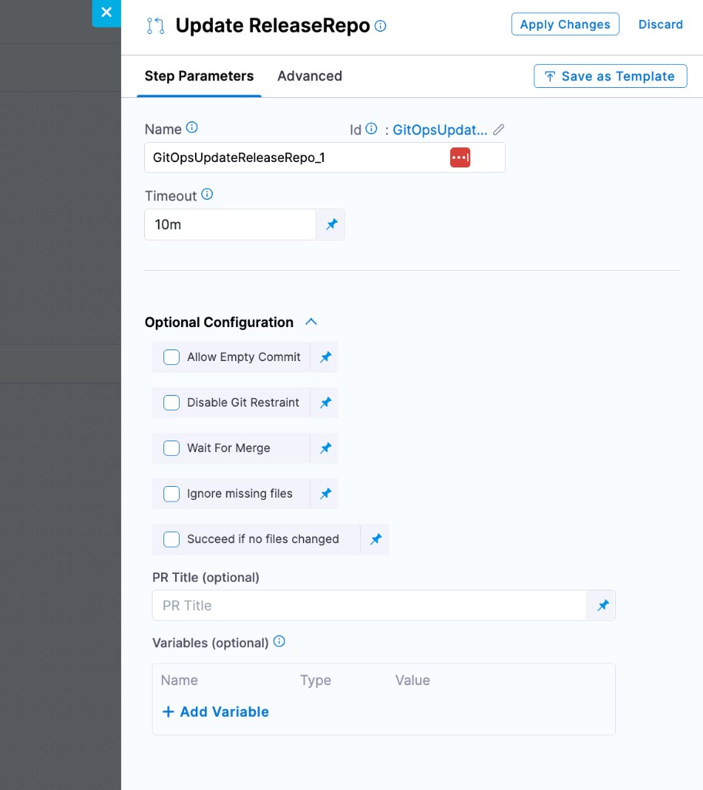
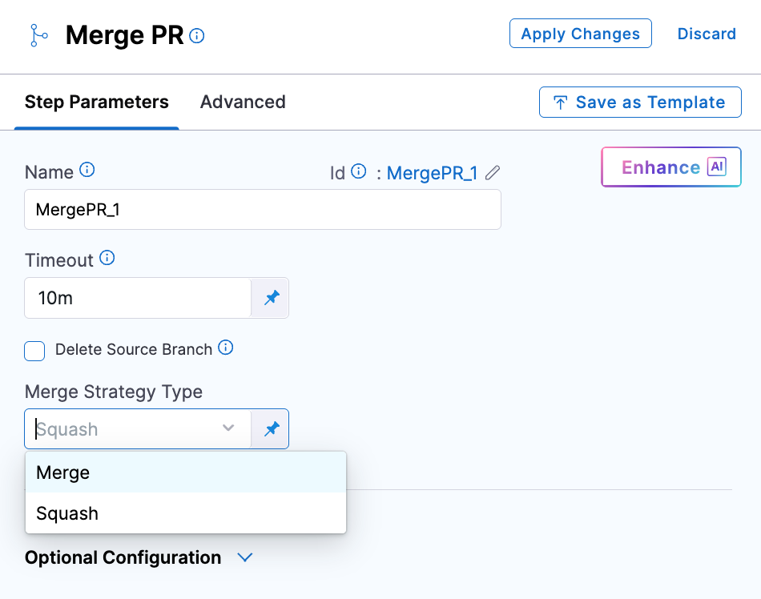
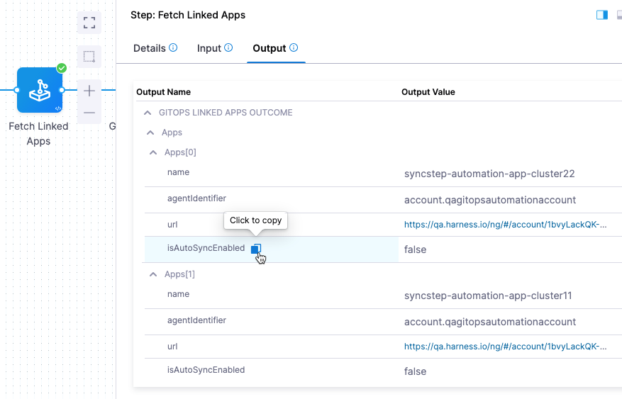
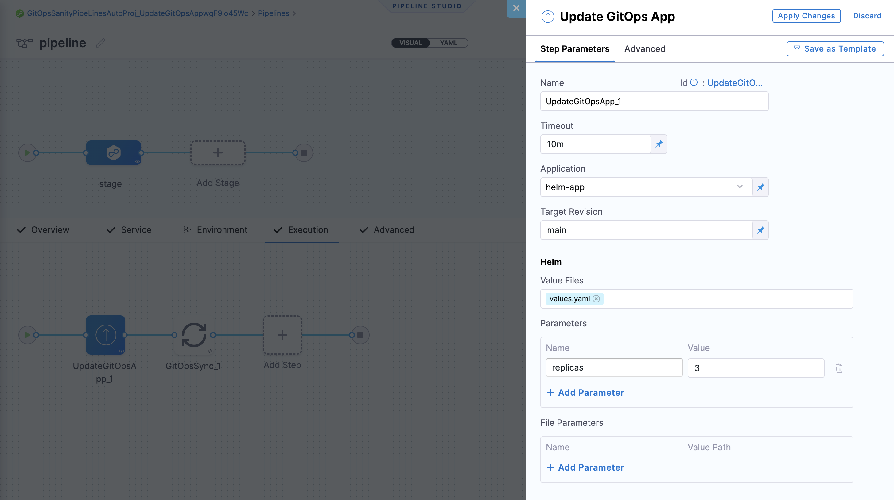
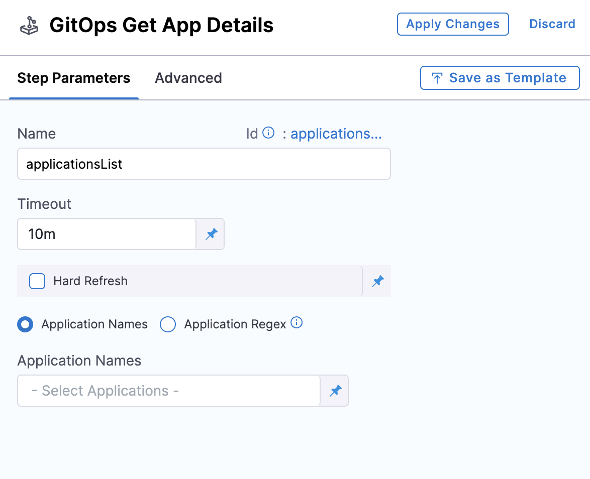
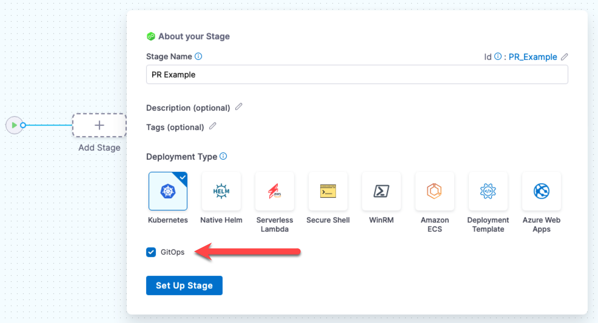
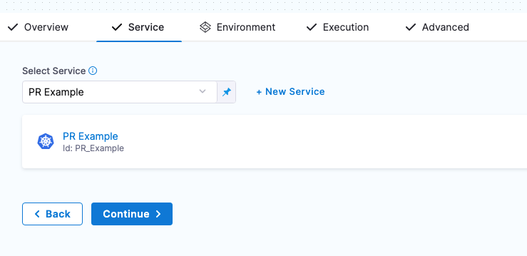
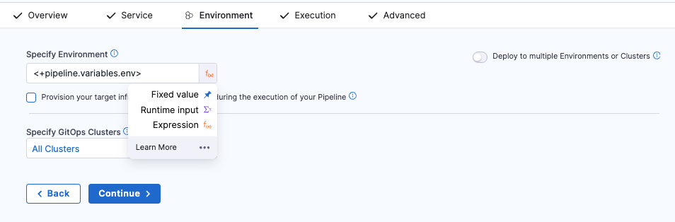

import DocImage from '@site/src/components/DocImage';

A Harness GitOps PR pipeline automates the full lifecycle of a Git-based deployment. Instead of applying changes directly to a cluster, the pipeline commits configuration updates to a Git repository, raises a pull request for review, and lets ArgoCD reconcile the desired state once the PR is merged. This keeps Git as the single source of truth while giving you pipeline-level orchestration, approval gates, and audit trails.

## What is a PR pipeline?

A PR pipeline connects your CI/CD workflow to GitOps by turning every deployment into a traceable Git change. You can choose between two flow patterns depending on how you want PR reviews and approvals to work.

**Standard flow (separate Merge PR step):**

```
Pipeline Trigger
      │
      ▼
Update Release Repo ── commits config changes & raises a PR
      │
      ▼
PR Created in Git
      │
      ▼
Review / Approval ──── manual or automated
      │
      ▼
Merge PR ───────────── pipeline merges the approved PR
      │
      ▼
ArgoCD Detects Change
      │
      ▼
GitOps Sync ────────── forces an immediate sync (optional)
      │
      ▼
Application Updated in Cluster
```

**PR-based promotion flow (wait for PR merge):**

```
Pipeline Trigger
      │
      ▼
Update Release Repo ── commits config changes, raises a PR,
      │                  and waits for external merge
      ▼
PR Created in Git ──── reviewers notified via Git provider
      │
      ▼
PR Reviewed & Merged ─ via Git provider (GitHub, GitLab, etc.)
      │
      ▼
Pipeline Resumes
      │
      ▼
ArgoCD Detects Change
      │
      ▼
GitOps Sync ────────── forces an immediate sync (optional)
      │
      ▼
Application Updated in Cluster
```

In the PR-based promotion flow, the pipeline pauses at the Update Release Repo step until the PR is merged through your Git provider's native review process. This removes the need for both a separate Merge PR step and an Approval step in the pipeline, because the PR review itself acts as the approval gate.

Each box in the flow maps to a concrete pipeline step you can configure in the Harness UI.

## Prerequisites

Before you create a PR pipeline, make sure the following are in place:

- **GitOps service with a Release Repo manifest:** The service must have at least a Release Repo manifest that points to the config file the pipeline will update (e.g. `values.yaml`, `config.json`). See [Create a GitOps service](/docs/continuous-delivery/gitops/gitops-entities/service/).
- **Harness environment and cluster:** An environment linked to a GitOps cluster managed by your GitOps agent. See [Create GitOps environments](/docs/continuous-delivery/gitops/gitops-entities/environment).
- **Git connector with write access:** A Harness Git connector that has permission to create branches and pull requests in your target repository.
- **ArgoCD application synced to a base state:** The GitOps application should already be synced so the pipeline has a known-good starting point.

## GitOps pipeline steps

Harness provides purpose-built steps for GitOps pipelines. The table below summarizes every available step, what it does, and which service manifest it depends on.

| Pipeline step | Purpose | Manifest required |
|---|---|---|
| [Update Release Repo](#update-release-repo) | Commits config changes (image tag, Helm values, etc.) to the release repo and raises a PR. Optionally waits for the PR to be merged externally. | Release Repo manifest |
| [Merge PR](#merge-pr) | Merges the PR created by Update Release Repo into the target branch | None |
| [Fetch Linked Apps](#fetch-linked-apps) | Discovers GitOps applications linked to the service and environment (ApplicationSet workflows only) | Deployment Repo manifest or ApplicationSet references |
| [GitOps Sync](#gitops-sync) | Triggers a hard sync of an ArgoCD application to apply the latest Git state | None |
| [Update GitOps App](#update-gitops-app) | Updates values files, Helm overrides, or target revision directly on the application | None |
| [GitOps Rollback](#gitops-rollback) | Rolls an Argo CD application back to a previous deployment revision | None |
| [GitOps Get App Details](#gitops-get-app-details) | Returns real-time application status as JSON for use in subsequent steps | None |
| [Revert PR](#revert-pr) | Reverts a previously merged PR — used in rollback scenarios | None |
| [GitOps Rollout](#gitops-rollout) | Controls Argo Rollouts progressive delivery (pause, resume, abort) | None |

---

### Update Release Repo

Fetches config files from the release repo, applies variable changes, commits to a new branch, and creates a PR.


| Parameter | Type | Required | Description |
|---|---|---|---|
| **Variables** (`variables[].name`) | `string` | Yes | Config file key. Dot-separated for nested (`a.b`), index for lists (`items[0].tag`). Cannot add or remove list items. |
| **Type** (`variables[].type`) | `string` | Yes | `String`, `Number`, or `Secret`. |
| **Value** (`variables[].value`) | `string` | Yes | Value to write. Blank values are ignored — no update is written for that key. |
| **PR Title** (`prTitle`) | `string` | No (`Harness: Updating config overrides`) | Title for the created PR. |
| **Wait for PR merge** (`waitForMerge`) | `boolean` | No (`false`) | Block pipeline until PR is merged externally via the Git provider. Requires ng-manager v1.146.0, next-gen-ui v1.134.0, delegate 891xx+. |
| **Allow Empty Commit** (`allowEmptyCommit`) | `boolean` | No (`false`) | Commit even when no file changes are detected. Requires delegate 84600+. |
| **Succeed if no files changed** (`allowNoFilesChanged`) | `boolean` | No (`false`) | Pass the step when all values already match the release repo. No branch, commit, or PR is created; `PR URL` output is empty. A downstream Merge PR step also passes when PR URL is empty. |
| **Ignore missing files** (`ignoreMissingFiles`) | `boolean` | No (`false`) | Skip the step instead of failing when the target config file does not exist in the repo. |
| **Don't Propagate Pipeline Variables** (`skipPipelineVariables`) | `boolean` | No (`false`) | Write only step-level variables. Excludes service and environment variable overrides from the release repo file. |
| **Disable Git Restraint** (`disableGitRestraint`) | `boolean` | No (`false`) | Remove the Git lock so multiple pipelines can write to the same repo concurrently. |
| **Ignore missing values** (`ignoreMissingValues`) | `boolean` | No (`false`) | Skip a variable update when its resolved value is null or empty. |

:::note Variable precedence
Step-level values override service and environment variables with the same name. To suppress a specific service or environment variable without disabling all propagation, add it in the step with a blank value — blank values are ignored, so no update is written for that key.
:::



---

### Merge PR

Merges the PR created by Update Release Repo.


| Parameter | Type | Required | Description |
|---|---|---|---|
| **Merge Strategy Type** (`mergeStrategy`) | enum | No (`merge`) | `merge`: preserves full commit history. `squash`: combines all PR commits into one commit on the target branch. |
| **Delete Source Branch** (`deleteSourceBranch`) | `boolean` | No (`false`) | Delete the PR source branch after merge completes. |
| **Disable Git Restraint** (`disableGitRestraint`) | `boolean` | No (`false`) | Remove the Git lock so multiple pipelines can write to the same repo concurrently. |

:::info Limitations
- Maximum 2 Merge PR steps per stage.
- Git connectors authenticated with OAuth are not supported.
:::



---

### Fetch Linked Apps

Discovers all GitOps applications generated by the ApplicationSet linked to the pipeline's service and environment. When this step runs before a GitOps Sync step, the Sync step automatically uses the discovered applications — no manual selection needed.

Not needed for standalone applications (no ApplicationSets). Select applications directly in the GitOps Sync step by name, regex, or labels instead.


| Parameter | Type | Required | Description |
|---|---|---|---|
| **Filter applications per configured service/env** (`filterByServiceEnvCluster`) | `boolean` | No (`false`) | `false` (recommended): fetch apps matching both service definition and linked cluster. `true`: fetch all apps in the cluster for the environment, ignoring service config. |

:::warning
`filterByServiceEnvCluster: true` with a large number of applications can cause the step to time out. Leave it `false` unless you have a specific need.
:::

The step output includes app name, agent ID, and URLs. Reference them in subsequent steps using Harness expressions from the output tab.



---

### GitOps Sync

Triggers a sync for one or more Argo CD applications — this is the step that applies changes to your cluster. Place approval gates and policy checks before it; place verification and notifications after it.

If a Fetch Linked Apps step ran earlier in the stage, the Sync step automatically uses the discovered applications and no selection is needed.


**Application selection (use one):**

| Parameter | Type | Required | Description |
|---|---|---|---|
| **Application Name** (`applicationsList`) | `list<object>` | No | Explicit `{agentId, applicationName}` pairs. Auto-populated when Fetch Linked Apps ran earlier in the stage. |
| **Application Regex** (`applicationRegex`) | `string` | No | Go regex matching up to 1000 app names. Not JEXL. Test at [regex101.com](https://regex101.com/) with Golang flavor. |
| **Application Labels** (`applicationLabels`) | `list<string>` | No | `Key:Value` label selectors. Partial matches also consider service and environment names. |

To pass label values from pipeline variables:
- JSON list: `<+json.list("$", <+pipeline.variables.labels>)>` — format variable as `["cluster"]` or `["cluster", "list"]`
- Split: `<+pipeline.variables.labels.split(",")>` — format variable as `cluster` or `cluster,list`

**Sync behaviour:**

| Parameter | Type | Required | Description |
|---|---|---|---|
| **Prune** (`prune`) | `boolean` | No (`false`) | Delete cluster resources absent from Git. |
| **Dry Run** (`dryRun`) | `boolean` | No (`false`) | Preview sync without applying changes. |
| **Apply Only** (`applyOnly`) | `boolean` | No (`false`) | Skip pre/post-sync hooks and sync waves. |
| **Force Apply** (`forceApply`) | `boolean` | No (`false`) | Delete and recreate resources instead of patching. |
| **Show Resource Progress** (`showResourceProgress`) | `boolean` | No (`false`) | Stream per-resource sync status to step logs. |

**Health and timeout:**

| Parameter | Type | Required | Description |
|---|---|---|---|
| **Wait until healthy** (`waitTillHealthy`) | `boolean` | No (`false`) | Hold step until all synced apps reach `Healthy`. |
| **Fail If Step Times Out** (`failOnTimeout`) | `boolean` | No (`false`) | When `waitTillHealthy: true`, fail the step if `Healthy` is not reached before timeout. |
| **Degraded State Timeout** (`degradedStateTimeout`) | duration string | No (`"0"`) | Max time app may stay in `Degraded` before step fails (e.g. `"30s"`, `"5m"`). `"0"` disables early-exit. Only evaluated when `waitTillHealthy: true`. |

:::warning
`degradedStateTimeout` can fire during transient degraded states such as rolling updates where pods are briefly unavailable. Set conservatively or leave at `"0"`.
:::

**Argo Rollouts:**

| Parameter | Type | Required | Description |
|---|---|---|---|
| **Auto-promote rollout** (`autoPromoteRolloutBehavior`) | enum | No | Action on an Argo Rollout after sync: `promote-full`, `resume`, `retry`, `abort`, `restart`. Omit if not using Argo Rollouts. |

**Resource filter** (`resourcesFilter`) — available only when selecting by application name, not by regex or labels:

| Parameter | Type | Required | Description |
|---|---|---|---|
| **Group** (`group`) | `string` | No | Kubernetes API group (e.g. `apps`). |
| **Kind** (`kind`) | `string` | No | Resource kind (e.g. `Deployment`). |
| **Name** (`name`) | `string` | No | Resource name pattern. |
| **Namespace** (`namespace`) | `string` | No | Namespace pattern. |
| **Label** (`label`) | `string` | No | Label selector. |

:::info Minimum versions for resource filter
Requires ng-manager v1.154.0 and next-gen-ui v1.141.0.
:::

**Sync options** (`syncOptions`):

| Parameter | Type | Required | Description |
|---|---|---|---|
| **Skip schema validation** (`skipSchemaValidation`) | `boolean` | No (`false`) | Skip Kubernetes schema validation before applying. |
| **Auto-create namespace** (`autoCreateNamespace`) | `boolean` | No (`false`) | Create the destination namespace if it does not exist. |
| **Prune resources at last** (`pruneResourcesAtLast`) | `boolean` | No (`false`) | Defer pruning until all other resources are applied. |
| **Apply out-of-sync only** (`applyOutOfSyncOnly`) | `boolean` | No (`false`) | Only apply resources that differ from cluster state. |
| **Replace resources** (`replaceResources`) | `boolean` | No (`false`) | Use `kubectl replace` instead of `apply`. |
| **Server-side apply** (`serverSideApply`) | `boolean` | No (`false`) | Use Kubernetes server-side apply. |
| **Respect ignore differences** (`respectIgnoreDifferences`) | `boolean` | No (`false`) | Honor the app's `ignoreDifferences` config during sync. |
| **Prune propagation policy** (`prunePropagationPolicy`) | enum | No (`foreground`) | How pruned resources are deleted: `foreground`, `background`, `orphan`. |

**Retry strategy** (`retryStrategy`):

| Parameter | Type | Required | Description |
|---|---|---|---|
| **Limit** (`limit`) | `integer` (≥ 0) | No | Max retry attempts. |
| **Base backoff** (`baseBackoffDuration`) | duration string | No | Initial wait before first retry (e.g. `5s`). |
| **Backoff factor** (`increaseBackoffByFactor`) | `integer` (≥ 0) | No | Multiply backoff by this factor on each retry. |
| **Max backoff** (`maxBackoffDuration`) | duration string | No | Backoff ceiling (e.g. `3m`). |

:::tip
Open the step's console output during execution to see exactly which applications passed the filters and were synced. Useful when using regex or label selection.
:::

<div align="center">
  <DocImage path={require('./static/gitopssync-step.png')} width="50%" height="50%" title="Click to view full size image" />
</div>

---

### Update GitOps App

Updates an Argo CD application's target revision, Helm overrides, or Kustomize overrides directly — without modifying files in Git. Common use case: pin the app to a new immutable Git tag, then follow with a GitOps Sync step.

:::note
One Update GitOps App step per stage maximum.
:::


| Parameter | Type | Required | Description |
|---|---|---|---|
| **Agent** (`agentId`) | `string` | Yes | Harness GitOps agent identifier. |
| **Application** (`applicationName`) | `string` | Yes | Argo CD application name. |
| **Target Revision** (`targetRevision`) | `string` | No | Branch, tag, or commit SHA. |
| **Helm overrides** (`helm`) | `object` | No | Helm parameters, file parameters, and values files. Merged with existing app params; step-level overrides take precedence. |
| **Kustomize overrides** (`kustomize`) | `object` | No | Kustomize image overrides. |

:::note Rollback for Update GitOps App
Add an Update GitOps App step on the **Rollback** tab of the pipeline stage (toggle using the Execution / Rollback switcher in the pipeline studio). The rollback step requires no configuration — it reverts automatically to the last successful revision. Add a GitOps Sync step after it to apply the state. This is separate from the [GitOps Rollback](#gitops-rollback) step, which targets Argo CD history entries.
:::

For multi-source applications, select your app in the Application field — all sources appear and can be updated individually.



---

### GitOps Rollback

Rolls one or more Argo CD applications back to a previous deployment revision. This is the Harness equivalent of `argocd app rollback`.

Go to [Rollback GitOps applications](/docs/continuous-delivery/gitops/application/rollback-gitops-applications) for the full guide including how revisions work, the UI rollback flow, and edge cases.


**Top-level parameters:**

| Parameter | Type | Required | Description |
|---|---|---|---|
| **Applications** (`applicationsList`) | `list<object>` | Yes | One entry per application to roll back. |
| **Revisions to roll back** (`revisionsToRollback`) | `integer` | No (`1`) | Steps N syncs back for any app with no `historyId` or per-app `revisionsToRollback`. |
| **Prune** (`prune`) | `boolean` | No (`false`) | Prune resources absent from the rolled-back revision. |
| **Wait until healthy** (`waitTillHealthy`) | `boolean` | No (`false`) | Hold step until all rolled-back apps reach `Healthy`. |
| **Fail if step times out** (`failOnTimeout`) | `boolean` | No (`false`) | When `waitTillHealthy: true`, fail if `Healthy` not reached before timeout. |

**Per-application target (`applicationsList[*]`):**

| Parameter | Type | Required | Description |
|---|---|---|---|
| **Agent** (`agentId`) | `string` | Yes | Harness GitOps agent identifier. |
| **Application name** (`applicationName`) | `string` | Yes | Argo CD application name. |
| **History ID** (`historyId`) | `integer` | No | Exact history entry ID. Validated at runtime — missing ID is a pre-flight error. Highest precedence. |
| **Revisions to roll back** (`revisionsToRollback`) | `integer` | No | Per-app offset. Overrides step-level. Ignored when `historyId` is set. |

**Target resolution:** `per-app historyId` > `per-app revisionsToRollback` > `step-level revisionsToRollback` > default `1`

---

### GitOps Get App Details

Fetches live application status as a JSON payload that subsequent steps can reference via Harness expressions.


| Parameter | Type | Required | Description |
|---|---|---|---|
| **Hard Refresh** (`hardRefresh`) | `boolean` | No (`false`) | Force a fresh status check from the cluster instead of using cached state. |
| **Application Names** (`applicationsList`) | `list<object>` | No | Explicit `{agentId, applicationName}` pairs. |
| **Application Regex** (`applicationRegex`) | `string` | No | Go regex to match app names. Max 1000 apps. Invalid regex causes the step to fail. |

:::note Limitations
- Apps are included only when `serviceId`, `envId`, and `clusterId` match the pipeline values.
- Maximum 1000 apps per step. Response capped at 512 kB — fields like `.app.spec.ignoreDifferences`, `.app.status.resources`, and `.app.status.operationstate.syncresult.resources` are trimmed to stay within the limit.
:::

Example response:
```json
{"applications": [{"name": "my-app", "status": "Healthy", "syncStatus": "Synced"}]}
```



---

### Revert PR

Creates a new PR that reverts the commit from a previous Update Release Repo step. Use in failure strategies or rollback scenarios. Follow with a Merge PR step to merge the revert automatically.


| Parameter | Type | Required | Description |
|---|---|---|---|
| **Commit ID** (`commitId`) | `string` | Yes | Commit to revert. Typically the `commitId` output expression from Update Release Repo. |
| **PR Title** (`prTitle`) | `string` | No | Custom title for the revert PR. |
| **Disable Git Restraint** (`disableGitRestraint`) | `boolean` | No (`false`) | Remove the Git lock so multiple pipelines can write to the same repo concurrently. |

:::note GitHub secondary rate limits
Only one Update Release Repo or Revert PR step can run per GitHub token reference at a time, following [GitHub rate limit best practices](https://docs.github.com/en/rest/using-the-rest-api/best-practices-for-using-the-rest-api?apiVersion=2022-11-28#avoid-concurrent-requests).

To avoid hitting [GitHub secondary rate limits](https://docs.github.com/en/rest/using-the-rest-api/rate-limits-for-the-rest-api?apiVersion=2022-11-28#about-secondary-rate-limits) when multiple pipelines write concurrently, Harness recommends:
- **Use a GitHub App connector** instead of a Personal Access Token. GitHub Apps have higher rate limit allocations and per-installation limits that do not share a ceiling with user tokens.
- **Set `disableGitRestraint: true`** on your Update Release Repo and Revert PR steps. This removes the Harness-side Git lock so pipelines can proceed without queuing, letting the GitHub App's higher limits absorb the concurrency rather than serializing it at the Harness layer.
:::

---

### GitOps Rollout

Controls Argo Rollouts progressive delivery within your pipeline. Use this step to pause, resume, or abort a rollout. For full details, see [Managing Rollouts in Harness Pipelines](/docs/continuous-delivery/gitops/argo-rollouts/managing-rollouts-in-harness-pipelines).

---

## Deployment strategies

These four strategies cover the most common ways teams use Harness GitOps pipelines. Each strategy includes a complete pipeline YAML you can adapt directly — the YAML comments carry the key behavioral notes per step.

---

### Strategy 1: Sequential environment promotion with pipeline approval gates

Every deployment produces a tracked PR in Git and passes through an explicit pipeline approval before reaching the next environment. This gives teams a controlled promotion ladder where each stage advances only after a human sign-off, and every promotion is traceable as a merged PR.

**When to use:**
- Regulated environments where every change to production requires a recorded approval.
- Teams that want Git history to serve as the deployment audit trail.
- Pipelines that promote the same artifact across dev, staging, and prod in a single run.

**Key configuration:**
- `mergeStrategy: squash` on Merge PR keeps the release branch clean.
- `waitTillHealthy: true` on each GitOps Sync blocks stage advancement until the cluster is healthy.
- `failOnTimeout: true` combined with a 30-minute step timeout causes the pipeline to fail fast rather than hang.

**Failure handling:** Each stage's `rollbackSteps` contain a Revert PR step (using the commit ID from Update Release Repo) followed by a second Merge PR. The rollback merges the revert PR automatically and a final GitOps Sync restores the previous cluster state.

```yaml
pipeline:
  name: image-promotion-three-envs
  identifier: image_promotion_three_envs
  variables:
    - name: image_tag
      type: String
      required: true
      description: "Container image tag to promote (e.g. v2.1.0)"
  stages:
    # ── Stage 1: Dev ────────────────────────────────────────────────────────
    - stage:
        name: dev
        identifier: dev
        type: Deployment
        spec:
          deploymentType: Kubernetes
          gitOpsEnabled: true
          service:
            serviceRef: payments_service
          environment:
            environmentRef: dev
            gitOpsClusters:
              - identifier: dev_cluster
          execution:
            steps:
              - step:
                  type: GitOpsUpdateReleaseRepo
                  name: Update Release Repo
                  identifier: UpdateReleaseRepo
                  spec:
                    variables:
                      - name: image.tag         # writes to stages/dev/values.yaml
                        type: String
                        value: <+pipeline.variables.image_tag>
                    prTitle: "dev: promote <+pipeline.variables.image_tag>"
                    allowNoFilesChanged: true   # pass safely if tag is already current
                  timeout: 10m
              - step:
                  type: MergePR
                  name: Merge PR
                  identifier: MergePR
                  spec:
                    mergeStrategy: squash
                    deleteSourceBranch: true
                  timeout: 10m
              - step:
                  type: GitOpsSync
                  name: GitOps Sync
                  identifier: GitOpsSync
                  spec:
                    prune: false
                    waitTillHealthy: true
                    failOnTimeout: true         # fail fast if cluster does not reach Healthy
                    applicationsList:
                      - agentId: account.dev-agent
                        applicationName: payments-dev
                  timeout: 30m
            rollbackSteps:
              - step:
                  type: RevertPR
                  name: Revert PR
                  identifier: RevertPR
                  spec:
                    commitId: <+execution.steps.UpdateReleaseRepo.updateReleaseRepoOutcome.commitId>
                    prTitle: "revert: dev promote <+pipeline.variables.image_tag>"
                  timeout: 10m
              - step:
                  type: MergePR
                  name: Merge Revert PR
                  identifier: MergeRevertPR
                  spec:
                    mergeStrategy: squash
                  timeout: 10m
    # ── Stage 2: Staging (requires approval) ────────────────────────────────
    - stage:
        name: staging
        identifier: staging
        type: Approval
        spec:
          execution:
            steps:
              - step:
                  type: HarnessApproval
                  name: Approve staging promotion
                  identifier: ApproveStagingPromotion
                  spec:
                    approvalMessage: "Approve promotion of <+pipeline.variables.image_tag> to staging"
                    includePipelineExecutionHistory: true
                    approvers:
                      userGroups:
                        - account.engineering_leads
                      minimumCount: 1
                      disallowPipelineExecutor: false
                  timeout: 1d
    - stage:
        name: staging_deploy
        identifier: staging_deploy
        type: Deployment
        spec:
          deploymentType: Kubernetes
          gitOpsEnabled: true
          service:
            serviceRef: payments_service
          environment:
            environmentRef: staging
            gitOpsClusters:
              - identifier: staging_cluster
          execution:
            steps:
              - step:
                  type: GitOpsUpdateReleaseRepo
                  name: Update Release Repo
                  identifier: UpdateReleaseRepo
                  spec:
                    variables:
                      - name: image.tag
                        type: String
                        value: <+pipeline.variables.image_tag>
                    prTitle: "staging: promote <+pipeline.variables.image_tag>"
                    allowNoFilesChanged: true
                  timeout: 10m
              - step:
                  type: MergePR
                  name: Merge PR
                  identifier: MergePR
                  spec:
                    mergeStrategy: squash
                    deleteSourceBranch: true
                  timeout: 10m
              - step:
                  type: GitOpsSync
                  name: GitOps Sync
                  identifier: GitOpsSync
                  spec:
                    prune: false
                    waitTillHealthy: true
                    failOnTimeout: true
                    applicationsList:
                      - agentId: account.staging-agent
                        applicationName: payments-staging
                  timeout: 30m
            rollbackSteps:
              - step:
                  type: RevertPR
                  name: Revert PR
                  identifier: RevertPR
                  spec:
                    commitId: <+execution.steps.UpdateReleaseRepo.updateReleaseRepoOutcome.commitId>
                  timeout: 10m
              - step:
                  type: MergePR
                  name: Merge Revert PR
                  identifier: MergeRevertPR
                  spec:
                    mergeStrategy: squash
                  timeout: 10m
    # ── Stage 3: Production (requires 2 approvers) ──────────────────────────
    - stage:
        name: production_approval
        identifier: production_approval
        type: Approval
        spec:
          execution:
            steps:
              - step:
                  type: HarnessApproval
                  name: Approve production promotion
                  identifier: ApproveProductionPromotion
                  spec:
                    approvalMessage: "Approve promotion of <+pipeline.variables.image_tag> to production"
                    includePipelineExecutionHistory: true
                    approvers:
                      userGroups:
                        - account.engineering_leads
                        - account.release_managers
                      minimumCount: 2           # two approvers required for production
                      disallowPipelineExecutor: true
                  timeout: 2d
    - stage:
        name: production
        identifier: production
        type: Deployment
        spec:
          deploymentType: Kubernetes
          gitOpsEnabled: true
          service:
            serviceRef: payments_service
          environment:
            environmentRef: production
            gitOpsClusters:
              - identifier: production_cluster
          execution:
            steps:
              - step:
                  type: GitOpsUpdateReleaseRepo
                  name: Update Release Repo
                  identifier: UpdateReleaseRepo
                  spec:
                    variables:
                      - name: image.tag
                        type: String
                        value: <+pipeline.variables.image_tag>
                    prTitle: "prod: promote <+pipeline.variables.image_tag>"
                    allowNoFilesChanged: true
                  timeout: 10m
              - step:
                  type: MergePR
                  name: Merge PR
                  identifier: MergePR
                  spec:
                    mergeStrategy: squash
                    deleteSourceBranch: true
                  timeout: 10m
              - step:
                  type: GitOpsSync
                  name: GitOps Sync
                  identifier: GitOpsSync
                  spec:
                    prune: false
                    waitTillHealthy: true
                    failOnTimeout: true
                    applicationsList:
                      - agentId: account.prod-agent
                        applicationName: payments-prod
                  timeout: 30m
            rollbackSteps:
              - step:
                  type: RevertPR
                  name: Revert PR
                  identifier: RevertPR
                  spec:
                    commitId: <+execution.steps.UpdateReleaseRepo.updateReleaseRepoOutcome.commitId>
                  timeout: 10m
              - step:
                  type: MergePR
                  name: Merge Revert PR
                  identifier: MergeRevertPR
                  spec:
                    mergeStrategy: squash
                  timeout: 10m
```

---

### Strategy 2: PR-review gated promotion (Git provider as approval gate)

Each environment promotion creates a PR and blocks the pipeline until that PR is merged through the Git provider. The PR review in GitHub or GitLab replaces the Harness approval step. This means the deployment record, the review, and the approval are all a single Git event — which satisfies compliance requirements that treat PR merges as change approvals.

**When to use:**
- Teams whose change management process already runs through PR reviews and want to avoid duplicate gates.
- Organizations where the Git provider's audit log (who approved, when, on which commit) is the required approval record.
- Multi-environment pipelines where each environment has its own branch and reviewer group configured in the Git provider.

**Key configuration:**
- `waitForMerge: true` on Update Release Repo — the step blocks until the Git provider reports the PR merged.
- No Merge PR step needed. The pipeline resumes only after an external merge.
- `skipPipelineVariables: false` ensures environment-level variable overrides (set on the Harness environment) are written into the release repo file alongside the step-level variables, without any extra configuration per pipeline.

**Failure handling:** Because the pipeline cannot auto-merge a revert PR (there is no Merge PR step in this flow), add a Revert PR step on the rollback path with `waitForMerge: true` as well — reviewers must also approve the revert, which preserves the change-control record on rollback.

```yaml
pipeline:
  name: pr-gated-env-promotion
  identifier: pr_gated_env_promotion
  variables:
    - name: image_tag
      type: String
      required: true
  stages:
    # ── Stage 1: Staging — PR reviewed by Git provider ──────────────────────
    - stage:
        name: staging
        identifier: staging
        type: Deployment
        spec:
          deploymentType: Kubernetes
          gitOpsEnabled: true
          service:
            serviceRef: checkout_service
          environment:
            environmentRef: staging            # env-level overrides (replicas, resource limits)
            gitOpsClusters:                    # are written to the release repo automatically
              - identifier: staging_cluster    # because skipPipelineVariables: false (default)
          execution:
            steps:
              - step:
                  type: GitOpsUpdateReleaseRepo
                  name: Update Release Repo
                  identifier: UpdateReleaseRepo
                  spec:
                    variables:
                      - name: image.tag
                        type: String
                        value: <+pipeline.variables.image_tag>
                    prTitle: "staging: <+pipeline.variables.image_tag>"
                    waitForMerge: true         # pipeline blocks here until PR merged in GitHub/GitLab
                    skipPipelineVariables: false
                    allowNoFilesChanged: true
                  timeout: 7d                  # generous timeout: reviewer merge time is unpredictable
              - step:
                  type: GitOpsSync
                  name: GitOps Sync
                  identifier: GitOpsSync
                  spec:
                    waitTillHealthy: true
                    failOnTimeout: false        # sync success marks the step done even if health is slow
                    applicationsList:
                      - agentId: account.staging-agent
                        applicationName: checkout-staging
                  timeout: 30m
    # ── Stage 2: Production — separate PR, separate reviewer group ───────────
    - stage:
        name: production
        identifier: production
        type: Deployment
        spec:
          deploymentType: Kubernetes
          gitOpsEnabled: true
          service:
            serviceRef: checkout_service
          environment:
            environmentRef: production
            gitOpsClusters:
              - identifier: production_cluster
          execution:
            steps:
              - step:
                  type: GitOpsUpdateReleaseRepo
                  name: Update Release Repo
                  identifier: UpdateReleaseRepo
                  spec:
                    variables:
                      - name: image.tag
                        type: String
                        value: <+pipeline.variables.image_tag>
                    prTitle: "prod: <+pipeline.variables.image_tag>"
                    waitForMerge: true
                    skipPipelineVariables: false
                    allowNoFilesChanged: true
                  timeout: 7d
              - step:
                  type: GitOpsSync
                  name: GitOps Sync
                  identifier: GitOpsSync
                  spec:
                    waitTillHealthy: true
                    failOnTimeout: false
                    applicationsList:
                      - agentId: account.prod-agent
                        applicationName: checkout-prod
                  timeout: 30m
```

## PR-based promotion workflows

The **Wait for PR merge** option on the Update Release Repo step transforms a standard PR pipeline into a promotion workflow. Instead of the pipeline controlling the merge, the PR review and approval in your Git provider acts as the deployment gate. This approach aligns with the GitOps philosophy of using Git as the single source of truth for both configuration and approvals.

### How it works

1. The Update Release Repo step creates a branch, commits the config changes, and opens a PR in your Git provider.
2. The pipeline pauses and waits for the PR to be merged. Harness polls the Git provider to detect the merge.
3. Reviewers are notified through your Git provider's native notification system (for example, GitHub PR notifications, GitLab merge request emails).
4. Reviewers review, approve, and merge the PR through the Git provider's UI or CLI.
5. Once the PR is merged, the pipeline resumes and moves to the next step (typically GitOps Sync).

### When to use this pattern

Use PR-based promotion workflows when:

- **Your team already reviews and approves changes through PRs.** This avoids duplicate approval gates in both Git and the Harness pipeline.
- **You want multi-environment promotions gated by PR reviews.** For example, a pipeline that promotes to staging, waits for staging PR approval, then promotes to production with a separate PR review.
- **You want to align with Argo CD promotion patterns.** This approach mirrors the promotion workflow model used by tools like [gitops-promoter](https://github.com/argoproj-labs/gitops-promoter), where PR merges drive environment promotions.

### Multi-environment promotion example

A typical multi-environment promotion pipeline uses the **Wait for PR merge** option at each stage boundary:

```
┌─────────────────────────────────┐
│  Stage 1: Staging               │
│  Update Release Repo (wait)     │──── PR created for staging
│  GitOps Sync                    │     Reviewers merge staging PR
└──────────────┬──────────────────┘     Pipeline resumes
               │
               ▼
┌─────────────────────────────────┐
│  Stage 2: Production            │
│  Update Release Repo (wait)     │──── PR created for production
│  GitOps Sync                    │     Reviewers merge production PR
└─────────────────────────────────┘     Pipeline resumes
```

Each stage raises a PR for its target environment, and the pipeline advances only when that PR is merged. This gives reviewers full control over promotion timing while maintaining the audit trail and orchestration benefits of a pipeline.

---

## Build your first PR pipeline

Follow these steps to create a basic image-promotion pipeline:

1. **Create a pipeline:** In your Harness project, go to **Pipelines** > **Create Pipeline**. Name it and select **Start**.

2. **Add a Deploy stage:** Select **Add Stage**, select **Deploy**, and choose **Kubernetes** as the deployment type.

   

3. **Select your service:** Choose the service you configured with a Release Repository in its GitOps Repository Sources.

   

4. **Configure the environment:** Select your target environment (or set it as a runtime input so you can choose at execution time). Select **Continue**.

   

5. **Configure the Update Release Repo step:** In the **Execution** tab, Harness adds the default steps automatically. Open the **Update Release Repo** step and add variables for the values you want to change (for example, `image.tag` = `v2.0.0`).

6. **Choose your merge strategy:** You have two options:
   - **Use a separate Merge PR step (default):** Leave the Update Release Repo step as-is and keep the Merge PR step that Harness adds by default. Add an Approval step between them if you need a pipeline-level approval gate.
   - **Use Wait for PR merge:** Enable **Wait for PR merge** on the Update Release Repo step and remove the Merge PR step. The PR is reviewed and merged through your Git provider, and the pipeline resumes automatically.

7. **(Optional) Add a GitOps Sync step** to force an immediate sync instead of waiting for ArgoCD's polling interval.

8. **Save and run:** Select **Save**, then **Run**. Select your environment and cluster when prompted and observe the pipeline execution.

## Failure strategy and rollback

When a deployment goes wrong, use the **Revert PR** step to undo the configuration change:

1. **Add a Revert PR step** to your stage's failure strategy. Configure it with the `commitId` output from the Update Release Repo step:
   ```
   <+pipeline.stages.deploy.spec.execution.steps.updateReleaseRepo.updateReleaseRepoOutcome.commitId>
   ```

2. **Add a Merge PR step** after the Revert PR step to merge the revert automatically.

3. **Optionally add a GitOps Sync step** to force the application back to its previous state immediately.

:::info
You can add a maximum of two Merge PR steps in a single stage - one for the original PR and one for the revert.
:::

For a complete working example with failure strategy, see the [PR Pipeline with Failure Strategy](https://github.com/harness-community/Gitops-Samples/tree/main/PR-Pipeline-STO) sample repository.

## Sample configurations

These GitHub repositories provide complete working pipeline YAML samples. Use them as a starting point after you understand the pipeline flow above. They are not required reading for beginners.

- **[Basic PR Pipeline](https://github.com/harness-community/Gitops-Samples/tree/main/PR-Pipeline):** Minimal pipeline with Update Release Repo, Merge PR, and sync.
- **[PR Pipeline with Failure Strategy](https://github.com/harness-community/Gitops-Samples/tree/main/PR-Pipeline-STO):** Adds failure handling with Revert PR and automated rollback.
- **[PR Pipeline with Notifications](https://github.com/harness-community/Gitops-Samples/tree/main/PR-Pipeline-Notifications):** Configures Slack or email notifications on pipeline events.
- **[PR Pipeline with CV Integration](https://github.com/harness-community/Gitops-Samples/tree/main/PR-Pipeline-CV):** Includes Continuous Verification steps to monitor deployment health.

## See also

- **[ApplicationSets and PR Pipelines](/docs/continuous-delivery/gitops/pr-pipelines/pr-pipeline-application-set):** Use PR pipelines to dynamically create applications through ApplicationSets.
- **[Create a GitOps Service](/docs/continuous-delivery/gitops/gitops-entities/service/):** Configure the service manifests that PR pipeline steps depend on.
- **[Managing Argo Rollouts in Harness Pipelines](/docs/continuous-delivery/gitops/argo-rollouts/managing-rollouts-in-harness-pipelines):** Progressive delivery with canary and blue-green strategies.
