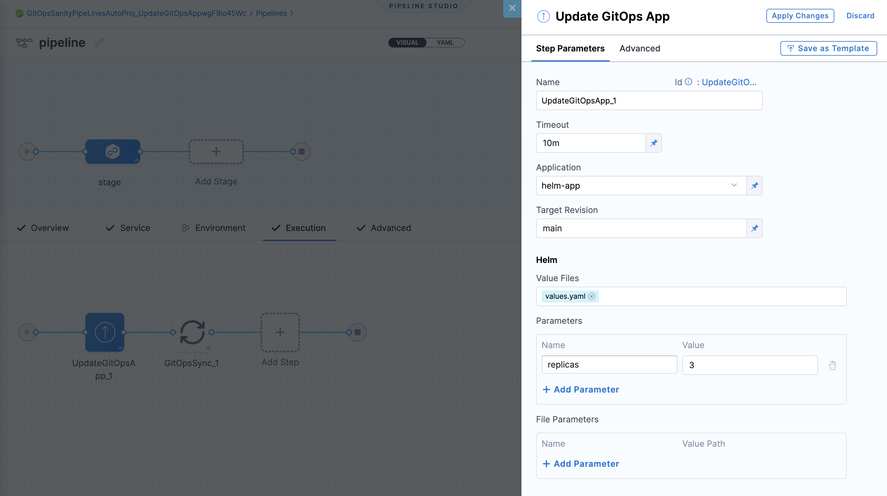

:::note

Currently, this feature is behind the feature flag `NG_SVC_ENV_REDESIGN`. Contact [Harness Support](mailto:support@harness.io) to enable the feature.

:::

This topic shows you how to create a Harness PR pipeline in Harness GitOps to make changes to one of an ApplicationSet's target environments.

Often, even though your ApplicationSet syncs one microservice/application to multiple target environments, you might want to change a microservice in just one of the target environments, such as a dev environment. A Harness PR Pipeline enables you to do this.

:::tip Important

This topic builds on the ApplicationSet created in [Harness GitOps ApplicationSets](/docs/continuous-delivery/gitops/applicationsets/harness-git-ops-application-set-tutorial). Ensure you have read that topic and, ideally, have set up an ApplicationSet in Harness before creating a PR pipeline.

:::

## Before you begin

This topic extends Harness GitOps features covered in the following topics:

* [Harness GitOps Basics](/docs/continuous-delivery/gitops/get-started/harness-git-ops-basics)
* [Harness CD GitOps Tutorial](/docs/continuous-delivery/gitops/get-started/harness-cd-git-ops-quickstart)
* [Harness GitOps ApplicationSets](/docs/continuous-delivery/gitops/applicationsets/harness-git-ops-application-set-tutorial)
* [Harness GitOps PR pipelines basics](/docs/continuous-delivery/gitops/pr-pipelines/pr-pipelines-basics)

Review these topics before proceeding.

## Create a PR pipeline

When you deploy a Harness PR pipeline, you indicate the target environment application and the config.json keys/values you want changed. Harness creates the pull request in your Git repo and merges it for you. Once complete, the target environment application has the new keys/values.


For the PR Pipeline, we'll create two Harness environments, dev and prod. These names are the same as the folder names in the repo:


We use the same names so that when we select a Harness environment we can pass along the same name as the target folder.

Next, we'll create a Harness service that points to the config.json files in these directories.

The path to the config.json files in the service will use the expression <+env.name>: `examples/git-generator-files-discovery/cluster-config/engineering/<+env.name>/config.json`.

At runtime, this expression resolves to the Harness environment you selected.

When you run the pipeline, you'll select which environment to use, dev or prod, and Harness will use the corresponding repo folder and update that application only.

### Create Harness environments for each target environment

First, let's create the **dev** environment.

1. In your Harness Project, click **Environments**.
2. Click **New Environment**.
3. Enter the following and click **Save**:
	1. **Name:** **dev**.
	2. **Environment Type:** **Pre-Production**.

The new environment is created.

#### Create variable for JSON key-value pair

Next, we'll add a variable for the JSON key-value we will be updating.

1. In **Advanced**, in **Variables**, click **New Variable Override**.
2. In the variable **Name**, enter **asset\_id** and click **Save**.  
   
   The `asset_id` name is a key-value in the config.json files for both dev and prod:
   
   

3. For variable **Value**, select **Runtime Input**:
   
   
   
   Later, when you run the pipeline, you'll provide a new value for this variable, and that value will be used to update the config.json file.

#### Select GitOps clusters to add to environment

Next, we'll link the Harness GitOps clusters for dev with the dev environment. Once you link GitOps clusters to an environment, you can then select from an environment's linked GitOps clusters when you select the environment in a pipeline.

1. Click **GitOps Clusters**.
2. Click **Select Cluster(s)**.
3. Select **engineering-dev**.
4. Click **Add**.


The Harness GitOps cluster is now linked to the environment.


#### Repeat the process for the prod environment

1. Create a new environment named **prod**.
2. Add the same `asset_id` variable to the prod environment.
3. Link the **engineering-prod** GitOps cluster to the environment.


### Create the PR pipeline

To create the pipeline, we'll simply create a new service that includes the manifest you want deployed and select the dev environment you created earlier.

1. In your Harness project, click **Pipelines**.
2. Click **Create a Pipeline**.
3. In **Create new Pipeline**, enter the name **PR Pipeline**, and then click **Start**.
4. Click **Add Stage**, and select **Deploy**.
   
   

5. Enter the following and click **Set Up Stage**:
	1. **Stage Name:** enter **PR Example**.
	2. **Deployment Type:** select **Kubernetes**.
	3. Enable the **GitOps** option.
  
  

   The stage is created and the service settings appear.

### Set up a Harness service

A Harness service represents what you're deploying. In this case, we're deploying an application template specified as a `config.json` file.

1. In your Harness project, select the **Services** tab.
2. Select **New Service**.
3. In **Name**, enter **PR Example**.
4. In **Manifests**, select **Add Release Repo Manifest**.
5. In **Release Repo Store**, select one the repository to use.

### Configuring a Harness Git connector for your repository

For information on setting up a Harness Git connector, go to [Connect to a Git repository](/docs/platform/connectors/code-repositories/connect-to-code-repo).

### Specify manifest details

Now we'll define the manifest to use for the PR pipeline. We'll use the path to the config.json files. We'll use the expression `<+env.name>` in the path so that we can dynamically select the path based on the Harness environment we select: **dev** or **prod**.

1. In **Manifest Details**, enter the following settings and then click **Submit**.
	1. **Manifest Name:** enter **config.json**.
	2. **Git Fetch Type:** select **Latest from Branch**.
	3. **Branch:** enter the name of the main branch (master, main, etc).
	4. **File Path:** enter `examples/git-generator-files-discovery/cluster-config/engineering/<+env.name>/config.json`.  
	
  Note the use of `<+env.name>`.
  
  

2. Back in **New Service**, click **Save**.

  the service is added to the pipeline.

  

1. Click **Continue** to add the environment.

### Add Environment Runtime Input

For the stage environment, we'll use a Harness runtime input. When you run the pipeline, Harness will prompt you for a value for the environment. You can select the environment you want to use for the PR.

1. Set **Specify environment or environment group** as a runtime input.
   
   

2. Click **Continue**.

## Review execution steps

In **Execution**, Harness automatically adds multiple steps. These steps, and optional steps, are described below.

:::note

You don't have to edit anything in these steps. The step are ready to run.

:::

### Update Release Repo

This step fetches your JSON files, updates them with your changes, performs a commit and push, and then creates the PR.  
 
There is an option to provide a custom PR title. If you don't provide a PR title, Harness creates the PR with the title **Harness: Updating config overrides**.  

This step supports hierarchical variables. If you specify a dot-separated variable in this step, it creates or updates a nested variable.  

You can also enter variables in this step to update key-value pairs in the config file you are deploying.  

If there is a matching variable name in the variables of the Harness service or environment used in this pipeline, the variable entered in this step will override them. 

If an empty or blank value is provided for a variable, it will be disregarded, and no updates will be made to the JSON or YAML file for that specific variable.


### Merge PR

This step simply merges the new PR.

### Fetch Linked Apps

The Fetch Linked Apps step provides app information, such as the app name, agent Id, and URL to the Harness GitOps app.

This information is displayed on the **Output** tab of the step.

  

You can copy the expression for any output in the **Output Name** column and use it to reference the output value in a subsequent Shell Script step or step setting.

In the step log you can see Harness fetch the appset YAML file from its file store and identify the related Harness GitOps app(s). For example:

```

Starting Git Fetch Files
Git connector Url: https://github.com/wings-software/gitops-automation.git
Branch: syncstepautomation

Fetching following Files :
- helm2/app1/appset.yaml

Successfully fetched following files:
- helm2/app1/appset.yaml


Git Fetch Files completed successfully.
App set Name: helm-k8s-app
Found linked app: syncstep-automation-app-cluster22. Link - https://app.harness.io/ng/#/account/1bvyLackQK-Hapk25-Ry4w/cd/orgs/default/projects/DoNotDeleteGitopsAutomationSyncStep/gitops/applications/syncstep-automation-app-cluster22?agentId=account.qagitopsautomationaccount
Found linked app: syncstep-automation-app-cluster11. Link - https://app.harness.io/ng/#/account/1bvyLackQK-Hapk25-Ry4w/cd/orgs/default/projects/DoNotDeleteGitopsAutomationSyncStep/gitops/applications/syncstep-automation-app-cluster11?agentId=account.qagitopsautomationaccount
```

### Revert PR

This step reverts the commit passed and creates a new PR. Use this step if you want to run any tests or automation on the pipeline and then revert the commit done by the **Update Release Repo** step.
  
The Revert PR step uses the commitId of the Update Release Repo step as input. The commitId can be an expression, runtime input, or a static value. For example, `<+pipeline.stages.deploy.spec.execution.steps.updateReleaseRepo.updateReleaseRepoOutcome.commitId>`. 

The Revert PR step creates a new branch and creates a commit to revert the changes done in the Update Release Repo step commit. 

You can create another Merge PR step to merge the Revert PR step. 

:::info Limitation

You can create a maximum of two Merge PR steps in a stage.

:::

### Update GitOps App

This step updates a GitOps application through a PR Pipeline. Use this step if you have an existing GitOps application and want to update its target revision (branch or tag) or Helm overrides.

A common Git-based use case bases production deployments on Git tags because tags are immutable. In this use case, to deploy a new version, you can use the Update GitOps App step to update your GitOps application to a new tag.

By using this step, you can also provide Helm overrides (parameters, file parameters, or values files) from the pipeline.

Helm parameters and file parameters represent individual value overrides for your Helm application, while values files represent an existing set of overrides already present in the repository.

Existing Helm parameters and file parameters are merged with the values provided in the PR pipeline. Other parameters remain unchanged. A parameter and a file parameter are not merged with each other.

If a parameter is specified both in the values file and as a parameter or file parameter override, the latter takes precedence.



Once your GitOps application is updated, you can use the [GitOps Sync Step](/docs/continuous-delivery/gitops/use-gitops/sync-gitops-applications) to deploy your changes.

:::note Limitation

You can use the Update GitOps App step only once in a stage.

:::

## Run and verify the PR pipeline

Now your PR pipeline is ready.

1. Click **Save**, and then click **Run**.
2. In **Run Pipeline**, in **Specify Environment**, select the **dev** Environment.
3. In **Environment Variables**, for **asset\_id**, enter the value `12345678`.
4. In **Specify GitOps Clusters**, select the **engineeringdev** cluster.
   
   

5. Click **Run Pipeline**.

  You can review the deployment steps in real-time.

  

  Here's an example of each step:

  * Service:
  ```bash
  Starting service step...  
  Processing service variables...  
  Applying environment variables and service overrides  
  Processed service variables  
  Processed artifacts and manifests  
  Completed service step
  ```

  * GitOps Clusters:
  ```bash
  Environment(s): {dev}   
    
  Processing clusters at scope PROJECT  
  Following 1 cluster(s) are present in Harness Gitops  
  Identifiers: {engineeringdev}   
    
  Following 1 cluster(s) are selected after filtering  
  Identifiers: {engineeringdev}   
    
  Completed
  ```

  * Update Release Repo:
  
  

  * Merge PR:
  ```bash
  PR Link: https://github.com/wings-software/gitops-pipeline-demo/pull/155  
  Pull Request successfully merged  
  Commit Sha is bcd4f2f73a47b74dba54habbcd10a6679ed99a  
  Done.
  ```

  * Revert PR:  
  ```bash
  Setting git configs
  Using optimized file fetch
  Created revert PR https://github.com/wings-software/gitops-pipeline-demo/pull/156
  Done.
  ```

  * Merge PR_1:   
  ```bash
  PR Link: https://github.com/wings-software/gitops-pipeline-demo/pull/156
  Pull Request successfully merged
  Commit Sha is da3c393560bf5e831a7b4fa123456c1eafb989ac
  Done.
  ```
  
  
6. Check the repo to see that the config.json file for the dev environment has been updated with the new **asset\_id** value:

  

Congratulations! You PR Pipeline was successful.

