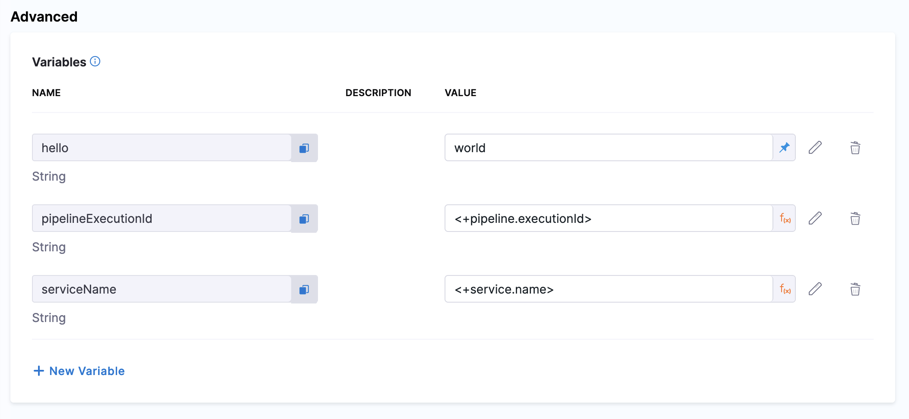
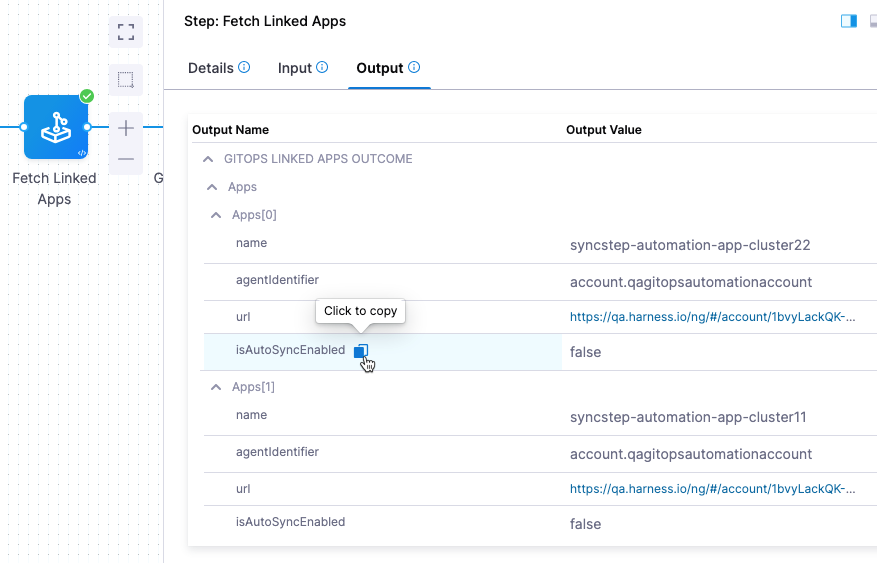

This topic shows you how to create a Harness PR pipeline in Harness GitOps to make changes to one of an ApplicationSet's target environments.

Often, even though your ApplicationSet syncs one microservice/application to multiple target environments, you might want to change a microservice in just one of the target environments, such as a dev environment. A Harness PR Pipeline enables you to do this.

:::tip Important

This topic builds on the ApplicationSet created in [Harness GitOps ApplicationSets](/docs/continuous-delivery/gitops/applicationsets/harness-git-ops-application-set-tutorial.md). Ensure you have read that topic and, ideally, have set up an ApplicationSet in Harness before creating a PR pipeline.

It is also recommended that you go through the [basics of Harness PR pipelines](/docs/continuous-delivery/gitops/pr-pipelines/pr-pipelines-basics.md) before proceeding further.

:::

When you deploy a Harness PR pipeline, you indicate the target environment application and the `config.json` keys/values you want changed. Harness creates the pull request in your Git repo and merges it for you. Once complete, the target environment application has the new keys/values.


For the PR Pipeline, we'll create two Harness environments, dev and prod. These names are the same as the folder names in the repo:


We use the same names so that when we select a Harness environment we can pass along the same name as the target folder. The path to your two `config.json` files would be the following-

- `examples/git-generator-files-discovery/cluster-config/engineering/dev/config.json`
- `examples/git-generator-files-discovery/cluster-config/engineering/prod/config.json`

Now, let's create Harness environments for each of the target environments - dev and prod.

## Create Harness environments for each target environment

An environment logically corresponds to your `dev`, `staging`, or `production` environments. Ideally, your ApplicationSet configuration files would differ on the basis of the environments they would deploy to.

To create a `dev` environment, do the following:

1. In your Harness project, select **Environments**.
2. Select **New Environment**.
3. Do the following, and then select **Save**:
	1. **Name** Enter `dev`.
	2. **Environment Type**: Select **Pre-Production**.

The new environment is created. Similarly, create another environment `prod` and select **Environment Type** as **Production**.

### Create a variable for JSON key-value pair to be updated

Next, we'll add a variable for the JSON key-value we will be updating.

1. In **Advanced**, in **Variables**, click **New Variable Override**.
2. In the variable **Name**, enter **asset\_id** and click **Save**.

   The `asset_id` name is a key-value in the `config.json` files for both dev and prod:

   

3. For variable **Value**, select **Runtime Input**:

   

   Later, when you run the pipeline, you'll provide a new value for this variable, and that value will be used to update the `config.json` file.

Repeat this process for the `prod` environment.

## Linking GitOps clusters to the Harness environments

Before updating your application's `config.json` values, Harness also resolves the GitOps clusters in which your application is deployed. The referenced cluster is the same cluster you created when you deployed your application. You do not need to create any new entities in Harness.

Once you link GitOps clusters to an environment, whenever you select an environment in a pipeline, you can select the environment's linked GitOps clusters. This ensures that you can control where applications are to be updated even within the same environment.

Link the **engineering-dev** GitOps cluster to the `dev` environment and **engineering-prod** GitOps cluster to the `prod` environment.

To link the Harness GitOps clusters with the `dev` environment, do the following:

1. Click **GitOps Clusters**.
2. Click **Select Cluster(s)**.
3. Select **engineering-dev**.
4. Click **Add**.


The Harness GitOps cluster is now linked to the environment.


Similarly, link the **engineering-prod** GitOps cluster to the `prod` environment.

You can link multiple clusters to a single environment.

## Create a Harness service

A Harness service logically corresponds to a microservice/application template in an ApplicationSet. Together with the environment and cluster entities, Harness resolves application `config.json` files in a Git repository to update manifest values through PR pipelines.

The path to the `config.json` files will be specified in the service and will use the expression `<+env.name>`.
```
examples/git-generator-files-discovery/cluster-config/engineering/<+env.name>/config.json
```

At runtime, this expression resolves to the Harness environment you selected. When you run the pipeline, you'll select which environment to use, `dev` or `prod`, and Harness will use the corresponding Git folder and update that application only.

:::info

Optionally, you can also specify the `config.json` path in your ApplicationSet and service to resolve based on clusters:

```
examples/git-generator-files-discovery/cluster-config/engineering/<+env.name>/<+cluster.name>/config.json 
```

Your actual directories in Git, say within your environment folder `dev`, would then need to look like this:

```
examples/git-generator-files-discovery/cluster-config/engineering/dev/cluster1/config.json
examples/git-generator-files-discovery/cluster-config/engineering/dev/cluster2/config.json
```

Harness can then resolve which directory to traverse during runtime and update only those applications that are deployed in a particular cluster, for example  `cluster1`. This is similar to how environments are resolved using the `<+env.name>` expression.

:::

Next, we'll create a Harness service that points to the `config.json` files in the Git directories.

1. In your Harness project, select the **Services** tab.
2. Select **New Service**.
3. In **Name**, enter **PR Example**.
4. In **Manifests**, select **Add Release Repo Manifest**.
5. In **Release Repo Store**, select the Harness Git connector to the repository which contains your `config.json` files. If you do not already have this configured, you will need to create a connector to your repository.

:::note
    
For information on setting up a Harness Git connector, go to [Connect to a Git repository](/docs/platform/connectors/code-repositories/connect-to-code-repo.md).
    
:::

### Specify Release Repo manifest details

Now we'll define the manifest to use for the PR pipeline. We'll use the path to the `config.json` files. We'll use the expression `<+env.name>` in the path so that we can dynamically select the path based on the Harness environment we select: **dev** or **prod**.

In **Manifest Details**, enter the following settings and then click **Submit**.
1. **Manifest Name:** enter **config.json**.
2. **Git Fetch Type:** select **Latest from Branch**.
3. **Branch:** enter the name of the main branch (master, main, etc).
4. **File Path:** enter `examples/git-generator-files-discovery/cluster-config/engineering/<+env.name>/config.json`.

    Note the use of `<+env.name>`.

    

5. Select **Submit**.
6. In the top-right corner, select **Save**.

### Specify Deployment Repo manifest details

Follow these steps once the Release Repo manifests are correctly configured to specify the path to your ApplicationSet template.

In **Manifest Details**, enter the following settings and then click **Submit**.
1. **Manifest Name:** enter **Application Set**.
2. **Git Fetch Type:** select **Latest from Branch**.
3. **Branch:** enter the name of the main branch (master, main, etc).
4. **File Path:** enter `examples/git-generator-files-discovery/git-generator-files.yaml`.
5. Select **Submit**.
6. In the top-right corner, select **Save**.

You have now successfully configured a Harness service for your PR pipeline.

## Configure variables in a Harness service/environment (optional)

:::note

For updating the `config.json` or `config.yaml` values, Harness supports variables in the [Update Release Repo step](/docs/continuous-delivery/gitops/pr-pipelines/gitops-pipeline-steps.md#update-release-repo-step). If you want to enforce common values at the service or environment level of your ApplicationSet, you can use service or environment variables.

Values from the **Update Release Repo** step have a higher priority than service or environment variables.

For checking the override priority for these service and environment variables, go to [Override Priority](/docs/continuous-delivery/x-platform-cd-features/environments/service-overrides.md#override-priority).

:::

The following process is applicable to both services and environments. This example uses services:

1. In your Harness project, select **Services**.
2. Select your service, and then select **Configuration**.
3. Under **Advanced**, select **New Variable**.
4. Enter the name and value for your variable, and then select **Save**.

   

These variables are now part of your PR pipeline and manifests will be updated accordingly.

## Create the PR pipeline

Finally, create the Harness PR pipeline by following these steps-

1. In your Harness project, click **Pipelines**.
2. Click **Create a Pipeline**.
3. In **Create new Pipeline**, enter the name **PR Pipeline**, and then click **Start**.
4. Click **Add Stage**, and select **Deploy**.

   

5. Enter the following and click **Set Up Stage**:
    1. **Stage Name:** enter **PR Example**.
    2. **Deployment Type:** select **Kubernetes**.
    3. Enable the **GitOps** option.

   

   The stage is created and the service settings appear.

6. Please select the service that you have already configured.

   

7. For the stage environment, we'll use a Harness runtime input. When you run the pipeline, Harness will prompt you for a value for the environment. You can select the environment you want to use for the PR.

    1. Set **Specify environment or environment group** as a runtime input.

       

    2. Click **Continue**.

## Review execution steps

In **Execution**, Harness automatically adds a few common PR pipeline steps. These steps and other PR pipeline steps, are briefly described below.

:::note

Harness automatically adds the **Update Release Repo**, **Merge PR** and **Fetch Linked Apps** Steps, which are ready to be run without any configuration. However, to further customize these steps or add other optional steps, please refer to [Harness GitOps pipeline steps](/docs/continuous-delivery/gitops/pr-pipelines/gitops-pipeline-steps.md).

:::

### Update Release Repo step

This step fetches your JSON files, updates them with your changes, performs a commit and push, and then creates a PR.

You can also enter variables in this step to update key-value pairs in the config file you are deploying.  

If there is a matching variable name in the variables of the Harness service or environment used in this pipeline, the variable entered in this step will override them.

For more information, please refer to [Update Release Repo step](/docs/continuous-delivery/gitops/pr-pipelines/gitops-pipeline-steps.md#update-release-repo-step).


### Merge PR step

This step simply merges the new PR.

### Fetch Linked Apps step

The Fetch Linked Apps step provides app information, such as the app name, agent identifier, and URL to the Harness GitOps app. 

Configuring the Deployment Repo manifest in your service is required for this step to execute correctly.

This information is displayed on the **Output** tab of the step.

  

You can copy the expression for any output in the **Output Name** column and use it to reference the output value in a subsequent Shell Script step or step setting.

### Revert PR

This step reverts the commit passed and creates a new PR. Use this step if you want to run any tests or automation on the pipeline and then revert the commit done by the **Update Release Repo** step.
  
The Revert PR step uses the commitId of the Update Release Repo step as input. The commitId can be an expression, runtime input, or a static value. For example, `<+pipeline.stages.deploy.spec.execution.steps.updateReleaseRepo.updateReleaseRepoOutcome.commitId>`. 

The Revert PR step creates a new branch and creates a commit to revert the changes done in the Update Release Repo step commit. 

You can create another Merge PR step to merge the Revert PR step. 

:::info Limitation

You can create a maximum of two Merge PR steps in a stage.

:::

## Run and verify the PR pipeline

Now your PR pipeline is ready.

1. Click **Save**, and then click **Run**.
2. In **Run Pipeline**, in **Specify Environment**, select the **dev** Environment.
3. In **Environment Variables**, for **asset\_id**, enter the value `12345678`.
4. In **Specify GitOps Clusters**, select the **engineeringdev** cluster.
   
   

5. Click **Run Pipeline**.

  You can review the deployment steps in real-time.

  

  Here's an example of each step:

  * Service:
  ```bash
  Starting service step...  
  Processing service variables...  
  Applying environment variables and service overrides  
  Processed service variables  
  Processed artifacts and manifests  
  Completed service step
  ```

  * GitOps Clusters:
  ```bash
  Environment(s): {dev}   
    
  Processing clusters at scope PROJECT  
  Following 1 cluster(s) are present in Harness Gitops  
  Identifiers: {engineeringdev}   
    
  Following 1 cluster(s) are selected after filtering  
  Identifiers: {engineeringdev}   
    
  Completed
  ```

  * Update Release Repo:
  
  

  * Merge PR:
  ```bash
  PR Link: https://github.com/wings-software/gitops-pipeline-demo/pull/155  
  Pull Request successfully merged  
  Commit Sha is bcd4f2f73a47b74dba54habbcd10a6679ed99a  
  Done.
  ```

  * Revert PR:  
  ```bash
  Setting git configs
  Using optimized file fetch
  Created revert PR https://github.com/wings-software/gitops-pipeline-demo/pull/156
  Done.
  ```

  * Merge PR_1:   
  ```bash
  PR Link: https://github.com/wings-software/gitops-pipeline-demo/pull/156
  Pull Request successfully merged
  Commit Sha is da3c393560bf5e831a7b4fa123456c1eafb989ac
  Done.
  ```
  
  
6. Check the repo to see that the `config.json` file for the dev environment has been updated with the new **asset\_id** value:

  

Congratulations! Your PR Pipeline was successful.

