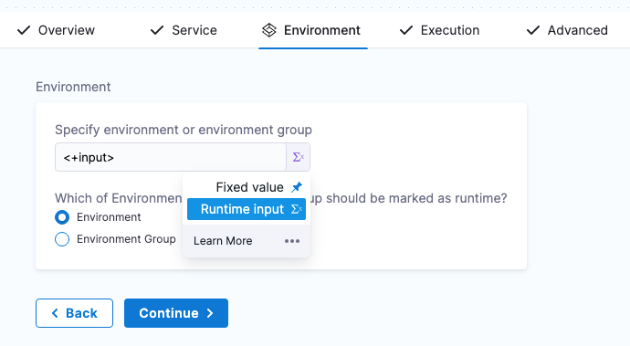

This topic shows you how to create a Harness PR pipeline in Harness GitOps to make changes to one of an ApplicationSet's target environments.

Often, even though your ApplicationSet syncs one microservice/application to multiple target environments, you might want to change a microservice in just one of the target environments, such as a dev environment. A Harness PR Pipeline enables you to do this.

:::tip Important

This topic builds on the ApplicationSet created in [Harness GitOps ApplicationSets](/docs/continuous-delivery/gitops/applicationsets/harness-git-ops-application-set-tutorial.md). Ensure you have read that topic and, ideally, have set up an ApplicationSet in Harness before creating a PR pipeline.

It is also recommended that you go through the [basics of Harness PR pipelines](/docs/continuous-delivery/gitops/pr-pipelines/pr-pipelines-basics.md) before proceeding further.

Check out [this example using ApplicationSet with PR Pipelines](./pr-pipeline-application-set.md) to get started with ApplicationSet with Harness GitOps PR Pipelines.
:::

When you deploy a Harness PR pipeline, you indicate the target environment application and the `config.json` keys/values you want changed. Harness creates the pull request in your Git repo and merges it for you. Once complete, the target environment application has the new keys/values.


## Prerequisites

Before creating a PR pipeline, ensure you have:

1. **Harness Environments**: Create environments (e.g., `dev`, `prod`) that match your Git repository folder structure. See [Create GitOps Environments](/docs/continuous-delivery/gitops/gitops-entities/environment) for detailed instructions.

2. **Environment Variables** (Optional): Configure environment variables for the key-value pairs you want to update in your configuration files. See [Configure Environment Variables](/docs/continuous-delivery/gitops/gitops-entities/environment#configure-environment-variables).

3. **GitOps Clusters Linked to Environments**: Associate your GitOps clusters with the appropriate environments. See [Add GitOps Clusters](/docs/continuous-delivery/gitops/gitops-entities/environment#step-3-add-gitops-clusters).

4. **Harness Service**: Create a service with Release Repo and Deployment Repo manifests configured. See [Create a GitOps Service](/docs/continuous-delivery/gitops/gitops-entities/service/).

:::tip Environment Naming
Name your Harness environments to match your Git directory structure. For example, if your Git paths are:
- `cluster-config/engineering/dev/config.json`
- `cluster-config/engineering/prod/config.json`

Create environments named `dev` and `prod`. This allows the `<+env.name>` expression in your service manifest paths to resolve correctly at runtime.
:::


:::info Service Configuration Required
Before proceeding, ensure you have created a GitOps service with the following manifests configured:

1. **Release Repo Manifest**: Points to your `config.json` files using the `<+env.name>` expression
   - Example path: `cluster-config/engineering/<+env.name>/config.json`

2. **Deployment Repo Manifest**: Points to your ApplicationSet template
   - Example path: `git-generator-files.yaml`

For detailed instructions on creating and configuring a GitOps service, see [Create a GitOps Service](/docs/continuous-delivery/gitops/gitops-entities/service/).

For information on using cluster-specific paths with `<+cluster.name>` expressions, see [Service Variables](/docs/continuous-delivery/gitops/gitops-entities/service#service-variables).
:::

## Create the PR pipeline

Finally, create the Harness PR pipeline by following these steps-

1. In your Harness project, click **Pipelines**.
2. Click **Create a Pipeline**.
3. In **Create new Pipeline**, enter the name **PR Pipeline**, and then click **Start**.
4. Click **Add Stage**, and select **Deploy**.

   

5. Enter the following and click **Set Up Stage**:
    1. **Stage Name:** enter **PR Example**.
    2. **Deployment Type:** select **Kubernetes**.
    3. Enable the **GitOps** option.

   

   The stage is created and the service settings appear.

6. Please select the service that you have already configured.

   

7. For the stage environment, we'll use a Harness runtime input. When you run the pipeline, Harness will prompt you for a value for the environment. You can select the environment you want to use for the PR.

   You can also use **Expressions** here. The value provided for the environment expression will propagate through all the PR steps. Note: only expressions that resolves to strings are valid and considered during execution.

    1. Set **Specify environment or environment group** as a runtime input.

       

    2. Click **Continue**.

## Review execution steps

In **Execution**, Harness automatically adds a few common PR pipeline steps. These steps and other PR pipeline steps, are briefly described below.

:::note

Harness automatically adds the **Update Release Repo**, **Merge PR** and **Fetch Linked Apps** Steps, which are ready to be run without any configuration. However, to further customize these steps or add other optional steps, please refer to [Harness GitOps pipeline steps](/docs/continuous-delivery/gitops/pr-pipelines/gitops-pipeline-steps.md).

:::

### Update Release Repo step

This step fetches your JSON files, updates them with your changes, performs a commit and push, and then creates a PR.

You can also enter variables in this step to update key-value pairs in the config file you are deploying.  

If there is a matching variable name in the variables of the Harness service or environment used in this pipeline, the variable entered in this step will override them.

For more information, please refer to [Update Release Repo step](/docs/continuous-delivery/gitops/pr-pipelines/gitops-pipeline-steps.md#update-release-repo-step).


### Merge PR step

This step simply merges the new PR.

### Fetch Linked Apps step

The Fetch Linked Apps step provides app information, such as the app name, agent identifier, and URL to the Harness GitOps app. 

Configuring the Deployment Repo manifest in your service is required for this step to execute correctly.

This information is displayed on the **Output** tab of the step.

  

You can copy the expression for any output in the **Output Name** column and use it to reference the output value in a subsequent Shell Script step or step setting.

### Revert PR

This step reverts the commit passed and creates a new PR. Use this step if you want to run any tests or automation on the pipeline and then revert the commit done by the **Update Release Repo** step.
  
The Revert PR step uses the commitId of the Update Release Repo step as input. The commitId can be an expression, runtime input, or a static value. For example, `<+pipeline.stages.deploy.spec.execution.steps.updateReleaseRepo.updateReleaseRepoOutcome.commitId>`. 

The Revert PR step creates a new branch and creates a commit to revert the changes done in the Update Release Repo step commit. 

You can create another Merge PR step to merge the Revert PR step. 

:::info Limitation

You can create a maximum of two Merge PR steps in a stage.

:::

## Run and verify the PR pipeline

Now your PR pipeline is ready.

1. Click **Save**, and then click **Run**.
2. In **Run Pipeline**, in **Specify Environment**, select the **dev** Environment.
3. In **Environment Variables**, for **asset\_id**, enter the value `12345678`.
4. In **Specify GitOps Clusters**, select the **engineeringdev** cluster.
   
   

5. Click **Run Pipeline**.

  You can review the deployment steps in real-time.

  

  Here's an example of each step:

  * Service:
  ```bash
  Starting service step...  
  Processing service variables...  
  Applying environment variables and service overrides  
  Processed service variables  
  Processed artifacts and manifests  
  Completed service step
  ```

  * GitOps Clusters:
  ```bash
  Environment(s): {dev}   
    
  Processing clusters at scope PROJECT  
  Following 1 cluster(s) are present in Harness Gitops  
  Identifiers: {engineeringdev}   
    
  Following 1 cluster(s) are selected after filtering  
  Identifiers: {engineeringdev}   
    
  Completed
  ```

  * Update Release Repo:
  
  

  * Merge PR:
  ```bash
  PR Link: https://github.com/wings-software/gitops-pipeline-demo/pull/155  
  Pull Request successfully merged  
  Commit Sha is bcd4f2f73a47b74dba54habbcd10a6679ed99a  
  Done.
  ```

  * Revert PR:  
  ```bash
  Setting git configs
  Using optimized file fetch
  Created revert PR https://github.com/wings-software/gitops-pipeline-demo/pull/156
  Done.
  ```

  * Merge PR_1:   
  ```bash
  PR Link: https://github.com/wings-software/gitops-pipeline-demo/pull/156
  Pull Request successfully merged
  Commit Sha is da3c393560bf5e831a7b4fa123456c1eafb989ac
  Done.
  ```
  
  
6. Check the repo to see that the `config.json` file for the dev environment has been updated with the new **asset\_id** value:

  

Congratulations! Your PR Pipeline was successful.