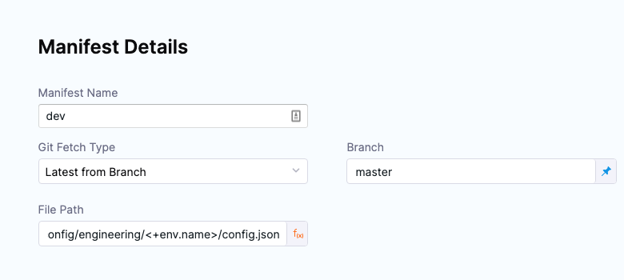

:::tip Important

This document elaborates on how to configure services, environments and clusters for a [Harness PR pipeline](/docs/continuous-delivery/gitops/pr-pipelines/pr-pipelines.md). It is recommended that you go through the basics of that topic before venturing into this one.

:::

A Harness Service logically corresponds to a microservice / application template in an ApplicationSet. Together with the environment and cluster entities, Harness resolves application `config.json` files in a Git repository to update manifest values via PR pipelines. In order to configure a Harness PR pipeline, it is thus very important to create these entities in Harness with appropriate configurations.

First, let's explore how to set up a Service in Harness.

## Service

The Harness service represents what you're deploying. In this case, we're deploying an application template which is specified as a `config.json` file.

1. In your Harness project, click on the **Services** tab.
2. Click on **New Service**.
2. In **Name**, enter **PR Example**.
3. In **Manifests**, click **Add Release Repo Manifest**.
4. In **Release Repo Store**, select one of the following repositories.

### Configuring a Harness Connector for your repository

```mdx-code-block
import Tabs from '@theme/Tabs';   
import TabItem from '@theme/TabItem';
```
```mdx-code-block
<Tabs>
<TabItem value="GitHub" label="GitHub" default>
```

Add a Harness GitHub connector to configure the location for Harness to fetch the `config.json` file.

To add a Harness GitHub connector:

1. In **GitHub Connector**, select **New GitHub Connector**.
2. Enter the following GitHub connector settings:
   1. **Name:** enter **gitops-github**.
   2. **URL Type:** select **Repository**.
   3. **Connection Type:** select **HTTP**.
   4. **GitHub Repository URL:** enter the HTTP URL for repo you used for your ApplicationSet, such as `https://github.com/johnsmith/applicationset.git`.
   5. **Authentication:** select **Username and Token**. For the token, you'll need to use a Personal Access Token (PAT) from GitHub. If you are logged into GitHub, just go to <https://github.com/settings/tokens>.
   6. Ensure the PAT has the **repo** scope selected.

      

      You will store the PAT in a [Harness Text Secret](/docs/platform/secrets/add-use-text-secrets). For details on Secrets Management, go to [Harness Secrets Management Overview](/docs/platform/secrets/secrets-management/harness-secret-manager-overview).

   7. Select **Enable API access** and use the same Harness secret.

   For more information, go to the [GitHub connector settings reference](/docs/platform/connectors/code-repositories/ref-source-repo-provider/git-hub-connector-settings-reference).
3. Select **Continue**.
4. In **Connect to the provider**, select **Connect through Harness Platform**., and then click **Save and Continue**.
5. When the **Connection Test** in complete, click **Continue**.

```mdx-code-block
</TabItem>
<TabItem value="Bitbucket" label="Bitbucket">
```
Add a Harness Bitbucket connector to configure the location from which Harness can pull the `config.json` file.

To add a Bitbucket connector:

1. In **Bitbucket Connector**, select **New Bitbucket Connector**.
2. Enter the following Bitbucket connector settings:
   1. **Name:** enter **gitops-bitbucket-cloud**.
   2. **URL Type:** select **Repository**.
   3. **Connection Type:** select **HTTP**.
   4. **GitHub Repository URL:** enter the HTTP URL for repo you used for your ApplicationSet, such as `https://bitbucket.org/johnsmith/applicationset.git`.
   5. **Authentication:** select **Username and Token**. For the token, use a Personal Access Token (PAT) from Bitbucket. If you are logged into Bitbucket, go to [HTTP access tokens](https://confluence.atlassian.com/bitbucketserver/http-access-tokens-939515499.html). You must provide an account-level app password or token. Repo-level tokens are not supported.

      Store the PAT in a [Harness Text Secret](/docs/platform/secrets/add-use-text-secrets). For details on Secrets Management, go to [Harness Secrets Management Overview](/docs/platform/secrets/secrets-management/harness-secret-manager-overview).

   6. Select **Enable API access** and use the same Harness secret.

   For more information, go to [Bitbucket connector settings reference](/docs/platform/connectors/code-repositories/ref-source-repo-provider/bitbucket-connector-settings-reference).
3. Select **Continue**.
4. In **Connect to the provider**, select **Connect through Harness Platform**, and then click **Save and Continue**.
5. After the Connection Test is complete, click **Continue**.

```mdx-code-block
</TabItem>    
</Tabs>
```

### Specify manifest details

Now we'll define the manifest to use for the PR pipeline. We'll use the path to the `config.json` files. We'll use the expression `<+env.name>` in the path so that we can dynamically select the path based on the Harness environment we select: **dev** or **prod**.

1. In **Manifest Details**, enter the following settings and then click **Submit**.
   1. **Manifest Name:** enter a manifest name like **config.json**.
   2. **Git Fetch Type:** select **Latest from Branch**.
   3. **Branch:** enter the name of the branch where you have your ApplicationSet configs in (eg. master, main, etc).
   4. **File Path:** enter `examples/git-generator-files-discovery/cluster-config/engineering/<+env.name>/config.json`.

   Note the use of `<+env.name>`.

  

2. Click on **Submit**.
3. Click on **Save** in the top right corner.

You have now successfully configured a Harness Service for your PR pipeline. 

:::note

For updating the `config.json` values, Harness supports variables in the [**Update Release Repo** Step](/docs/continuous-delivery/gitops/pr-pipelines/pipeline-steps.md). These variables can also be configured as service or environment variables in cases where you would like to logically enforce some common values in the service or environment level of your ApplicationSet.

Please note that values from the **Update Release Repo** step have a higher priority than service or environment variables.

For checking the override priority for these service and environment variables, please refer to [Override Priority](/docs/continuous-delivery/x-platform-cd-features/environments/service-overrides.md#override-priority)

:::

### Configure Variables in a Harness Service (optional)


## Create Harness environments for a target environment

Let's create a **dev** environment.

1. In your Harness Project, click **Environments**.
2. Click **New Environment**.
3. Enter the following and click **Save**:
    1. **Name:** **dev**.
    2. **Environment Type:** **Pre-Production**.

The new environment is created.

#### Create variable for JSON key-value pair

Next, we'll add a variable for the JSON key-value we will be updating.

1. In **Advanced**, in **Variables**, click **New Variable Override**.
2. In the variable **Name**, enter **asset\_id** and click **Save**.

   The `asset_id` name is a key-value in the `config.json` files for both dev and prod:

   

3. For variable **Value**, select **Runtime Input**:

   

   Later, when you run the pipeline, you'll provide a new value for this variable, and that value will be used to update the `config.json` file.

#### Select GitOps clusters to add to environment

Next, we'll link the Harness GitOps clusters for dev with the dev environment. Once you link GitOps clusters to an environment, you can then select from an environment's linked GitOps clusters when you select the environment in a pipeline.

1. Click **GitOps Clusters**.
2. Click **Select Cluster(s)**.
3. Select **engineering-dev**.
4. Click **Add**.


The Harness GitOps cluster is now linked to the environment.


#### Repeat the process for the prod environment

1. Create a new environment named **prod**.
2. Add the same `asset_id` variable to the prod environment.
3. Link the **engineering-prod** GitOps cluster to the environment.


2. Back in **New Service**, click **Save**.

the service is added to the pipeline.


1. Click **Continue** to add the environment.

### Add Environment Runtime Input

For the stage environment, we'll use a Harness runtime input. When you run the pipeline, Harness will prompt you for a value for the environment. You can select the environment you want to use for the PR.

1. Set **Specify environment or environment group** as a runtime input.

   

2. Click **Continue**.