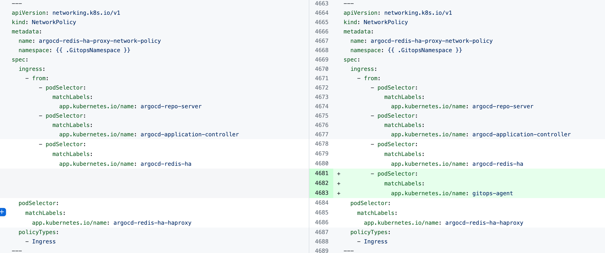
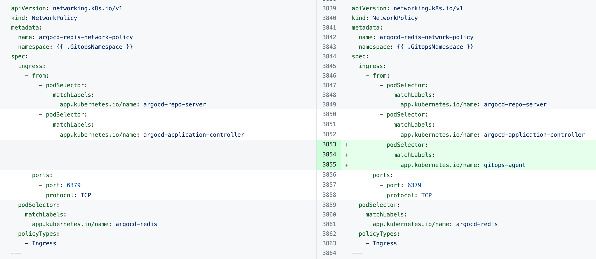
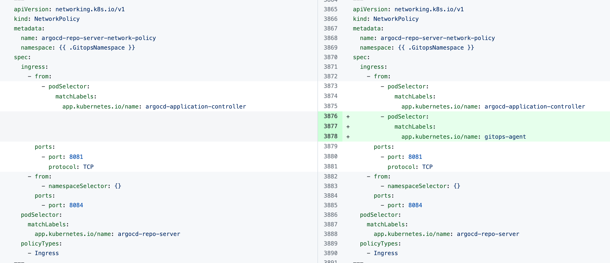

This documentation lists issues encountered when installing and using Harness GitOps and describes how to resolve them.

## Installation errors

### Error: "Agent took too long to respond"

You might encounter the error `the Agent took too long to respond` when installing the Harness GitOps Agent with an existing Argo CD instance.

The error indicates that the Harness GitOps Agent is unable to connect to Redis or to the Argo CD Repo Server and needs additional `NetworkPolicy` settings.

Add the following `podSelector` settings to the `NetworkPolicy` objects defined in your existing Argo CD *argocd-redis* and *argocd-repo-server* services.

The following table lists the `NetworkPolicy` objects for HA and non-HA Agents, and includes the YAML before and after the new `podSelector` is added.

| **NetworkPolicy** | **HA Agent** |
| --- | --- |
| `argocd-redis-ha-proxy-network-policy` |  |
| `argocd-repo-server-network-policy` |   |
|  | **Non-HA Agent** |
| `argocd-redis-network-policy` |   |
| `argocd-repo-server-network-policy` |   |

### Agent shows DEGRADED with "Redis Cache Installed" warning (BYOA with HA Redis)

When you install the Harness GitOps Agent as an overlay on an existing Argo CD instance, the agent overview page may show the agent as **DEGRADED** with a red "Redis Cache Installed" warning, even though the agent is functionally healthy (heartbeats are normal, applications are reconciling, and no Redis errors appear in the logs).

This happens because the agent health check looks for the default chart workload name `argocd-redis`. In HA installs, the Redis service is the HAProxy frontend (for example, `argocd-redis-ha-haproxy`), not `argocd-redis`, so the check cannot find it and reports DEGRADED.

To fix this, run `helm upgrade` with the correct HA flags:

```bash
helm upgrade argocd gitops-agent-byoa/gitops-helm-byoa --values override.yaml --namespace argocd \
  --set harness.configMap.argocd.redisHaProxySvc=<redis-ha-haproxy-service-name> \
  --set harness.configMap.argocd.repoServerSvc=<repo-server-service-name>
```

For a non-HA install, use `redisSvc` instead of `redisHaProxySvc`. Go to [Configure custom Argo CD component names](/docs/continuous-delivery/gitops/gitops-entities/agents/install-a-harness-git-ops-agent#configure-custom-argo-cd-component-names-byoa) for full details and examples for both setup types.

### Error: "Forbidden: seccomp may not be set provider"

If you see the error `Forbidden: seccomp may not be set provider`, remove the following block from all Argo CD configuration files that have a `kind: deployment` key-value pair.

```yaml
seccompProfile:
  type: RuntimeDefault
```

### OpenShift Security Context Constraints (SCC) for GitOps agent

On OpenShift clusters, the default `restricted` SCC blocks GitOps agent components from starting. You may see errors like `CreateContainerConfigError`, `Forbidden: seccomp may not be set`, or pods stuck in `CrashLoopBackOff`.

The following table lists the minimum SCC requirements for each GitOps agent component:

| Component | Required SCC | Reason |
|-----------|-------------|--------|
| `gitops-agent` | `nonroot-v2` | Runs as a non-root user but requires specific UID/GID |
| `argocd-repo-server` | `nonroot-v2` | Requires writable `/tmp` and non-root execution |
| `argocd-redis` | `anyuid` | Runs as a specific UID (999) by default |
| `argocd-application-controller` | `nonroot-v2` | Requires non-root execution with writable home directory |

To grant the required SCCs to the service accounts in your GitOps namespace:

```bash
# Replace <namespace> with your GitOps agent namespace (e.g., harness-gitops)
oc adm policy add-scc-to-user nonroot-v2 -z argocd-repo-server -n <namespace>
oc adm policy add-scc-to-user anyuid -z argocd-redis -n <namespace>
oc adm policy add-scc-to-user nonroot-v2 -z argocd-application-controller -n <namespace>
oc adm policy add-scc-to-user nonroot-v2 -z gitops-agent -n <namespace>
```

:::tip Verify SCC assignments
After applying SCCs, verify the assignments with `oc describe scc nonroot-v2 | grep -A 10 'Users:'` and `oc adm policy who-can use scc/nonroot-v2`. Then delete the failing pods to allow them to restart with the correct security context.
:::

:::note OpenShift Operator alternative
If the `CDS_GITOPS_OPERATOR` feature flag is enabled for your account, you can use the Harness GitOps Agent Operator for OpenShift, which handles SCC configuration automatically. Go to [GitOps Agent with OpenShift Operator](/docs/continuous-delivery/gitops/gitops-entities/agents/gitops-agent-with-openshift-operator) to install and configure the operator.
:::

### Operator-based manifest support

Before installing the Harness GitOps Agent, be aware of the following limitations regarding operator-based manifests:

- **OpenShift clusters:** Have Operator Lifecycle Manager (OLM) already built-in, so operator-based manifests are supported out of the box
- **Vanilla Kubernetes clusters:** Require manual setup of OLM, kubectl-operator plugin, and other CRDs before using operator-based manifests

**Recommendation:** For vanilla Kubernetes clusters, we recommend using the **Helm Chart** or **Kubernetes YAML** manifest options instead of operator-based manifests.

## Operational Errors

### Error: "Finalizer detected"

The message `failed to delete app in argo: failed to execute delete app task: rpc error: code = Unknown desc = finalizer detected,` indicates that the application you are trying to delete has a finalizer. If a finalizer is used, Argo CD does not delete the application until its resources are deleted. Therefore, the Harness GitOps Agent reconciles the existing application. 

To delete the application, remove the finalizer or delete its resources. Removing the finalizer should lead to the app being deleted automatically. For more information about the Argo CD app deletion finalizer, go to the [Argo CD documentation](https://argo-cd.readthedocs.io/), switch to the [supported Argo CD version](/docs/continuous-delivery/cd-integrations), and then perform a search for the app deletion finalizer.

### Error: Unable to delete or create app due to "error: create not allowed while custom resource definition is terminating"

During creation or deletion of any GitOps app, if the process fails with the message `failed to create app in argo: failed to execute create app task: rpc error: code = Unknown desc = error creating application: create not allowed while custom resource definition is terminating`, or some similar message about CRD being stuck in termination state, the cause is most likely due to some CRD resource pending deletion due to it having a finalizer.

In order for this CRD to complete termination, the finalizer from the pending resource needs to be removed. 

Possible CRD's causing this could most likely be one of these three: `applications.argoproj.io`, `applicationsets.argoproj.io` or 
`appprojects.argoproj.io`

Execute the following command to get pending resources for the CRD that are stuck in termination. (You can check the status of any CRD using `kubectl get crd` and then check any of these using `kubectl describe crd <crd_name>`.)

```
$ kubectl get <CRD> -n <namespace>
```

```
$ kubectl patch <CRD> <stuckresourcename> -n <namespace> --type json --patch="[{ \"op\": \"remove\", \"path\": \"/metadata/finalizers\" }]"
```

For example if the CRD `applications.argoproj.io` is stuck in the `TERMINATING` state in the `harness` namespace, this is how you can verify and patch it's resource causing it to be stuck.

```
$ kubectl get applications.argoproj.io -n harness

NAME        STATUS     SYNC
test-app    Unknown    Unknown
```

```
$ kubectl patch applications.argoproj.io test-app -n harness --type json --patch="[{ \"op\": \"remove\", \"path\": \"/metadata/finalizers\" }]"

applications.argoproj.io/test-app patched
```

This will now let the CRD `applications.argoproj.io` terminate gracefully.

:::note

CRD's are cluster-scoped and the resources themselves can be cluster or namespace-scoped, so pay attention to usage of `-n(namespace flag)` while executing these commands.

:::

If multiple resources are causing this error, you can use something similar to [this](https://github.com/argoproj/argo-cd/issues/1329#issuecomment-1247176754) to fix it.

### Issue: Agent degraded when installing a Bring Your Own Argo CD (BYOA) agent with a Helm chart

Execute the following script with the name of the agent as the argument. The agent name should be as shown in the Harness GitOps UI:

```
#!/bin/sh
#Extract values from the existing ConfigMap argocd-cmd-params-cm
REDIS_SERVER=$(kubectl get configmap -n argocd argocd-cmd-params-cm -o json | jq -r ‘.data[“redis.server”]‘)
ARGOCD_SERVER_REPO_SERVER=$(kubectl get configmap -n argocd argocd-cmd-params-cm -o json | jq -r ‘.data[“repo.server”]‘)
configmap_name=$1
agent_name=$1
echo $REDIS_SERVER
echo $ARGOCD_SERVER_REPO_SERVER
kubectl patch configmap -n argocd “$configmap_name” --type merge -p ‘{“data”: {“ARGOCD_SERVER_REPO_SERVER”: “‘$ARGOCD_SERVER_REPO_SERVER’“, “REDIS_SERVER”: “‘$REDIS_SERVER’“, “GITOPS_ARGOCD_REDIS_HA”: “redis-ha”, “GITOPS_ARGOCD_REDIS_HA_PROXY”: “redis-ha-haproxy”}}'
#comment the below command if ha mode is not used
kubectl patch deployment $configmap_name -n argocd --type=json -p=‘[{“op”: “replace”, “path”: “/spec/template/spec/containers/0/command”, “value”: [“/app/agent”, “--redis”, “‘”${REDIS_SERVER}“‘”]}]’
#Restart agent
kubectl rollout restart deployment -n argocd $agent_name
```

After you execute the script, verify that the script made the following changes to the ConfigMap. Where applicable, angle brackets (`<` and `>`) have been used to indicate where your release name should appear:

```
ARGOCD_SERVER_REPO_SERVER: “<YOUR_RELEASE_NAME>-argocd-repo-server:8081”
REDIS_SERVER: “<YOUR_RELEASE_NAME>-argocd-redis-ha-haproxy:6379"
GITOPS_ARGOCD_REDIS_HA: “redis-ha”
GITOPS_ARGOCD_REDIS_HA_PROXY: “redis-ha-haproxy”
```

### Error: "rpc error: code = InvalidArgument desc = existing cluster spec is different;"

This error indicates that the GitOps entity you are trying to create exists. It might exist in one of the following locations:

- A different scope (account, organization, or project) in Harness.

- A different Argo CD project that is not mapped to a Harness project.
  

### Issue: "rpc error: code = Unknown desc = error testing repository connectivity: authorization failed"

This error occurs when an agent is unable to connect to a repo:

- Ensure to review Github account rate limitations before attempting to connect to a repo.

- To manage rate limiting in GitHub, see [Enabling rate limits for Git](https://docs.github.com/en/enterprise-server@3.10/admin/configuration/configuring-user-applications-for-your-enterprise/configuring-rate-limits#enabling-rate-limits-for-git).

### Error: "NOAUTH Authentication required" when the app controller is up before the redis-secret is created

There is a known issue that is present in Argo when the app controller or other Argo CD service pod is up before the redis-secret is created. Please see this Argo thread for more information: [Redis NOAUTH failures](https://github.com/argoproj/argo-helm/issues/2836#issuecomment-2636975946). This error is happening in particular when using a manifest deployment rather than a helm deployment since helm deployments have hooks to make sure that everything comes up in the right order. 

The current workaround is to restart the appcontroller, agent, and any other Argo CD service pod or agent that is failing with this error.

## Error: GitOps agent pod stuck in CrashLoopBackoff

### Issue: This is an unauthorized agent. Sleeping for 15 minutes and then shutting down, please check your settings on HarnessUI

This issue occurred as the token in the agent’s YAML did not match the public key in the GitOps service database. The GitOps agent goes into a CrashLoopBackoff state due to an authentication failure with the GitOps service. 

This problem typically surfaces after re-enabling authentication if the agent previously operated in unauthenticated mode.

- Ensure the agent's YAML file is updated with the correct authentication token, matching the public key in the database. After updating the YAML file, redeploy the agent to authenticate it properly. 


## Application Creation Fails Due to Missing "project" Field (Argo CD 2.12 Change) (previously it was optional)

This is a **backward incompatible change** with **Argo 2.12**. The project field is now mandatory for repository access.

With the upgrade to **Argo CD 2.12**, the project field has been made mandatory (previously optional) for checking access to repositories at the project-level scope.
As a result, Harness GitOps requests that did not explicitly include the project field began to fail (As it was optional field), leading to issues in the GitOps application creation flow.

Additionally, Argo CD 2.12 introduced stricter controls on the use of repository kubernetes secret.
Previously, an Application or ApplicationSet would use any cluster secret that matched the URL specified in the repoUrl field.
However, starting from Argo CD 2.12, the project field of an application must match the project field of the cluster secret for access to be granted.

**Impact**

If a reposititory is scoped to `project-a`, an application associated with `project-b` can no longer access that repository.
To maintain access to the cluster secret across multiple projects, the project field on the repository kubernetes secret must be `unset` or explicitly scoped for multiple projects.

**Action Items for Users**
1. Update Application Configurations to Include the `project`  Field
- When creating new GitOps applications, ensure that the **project field** is explicitly included in the configuration.
2. Update Cluster Secrets to Support Multiple Projects
- If you have cluster secrets that need to be accessed by applications across multiple projects, you will need to `unset`  the **project field** in the cluster secret configuration. This ensures that the cluster secret is accessible by applications in different ArgoCD projects.

## ArgoCD AppSet "Degraded" Status with Project-Scoped Repos

**ArgoCD v2.x limitation**  
This is a known, recurring issue (see GitHub issue [#21016](https://github.com/argoproj/argo-cd/issues/21016) and internal ticket **CDS-109542**). There's no fix in ArgoCD v2.x—you'll need to upgrade to v3.x later this quarter for the proper resolution.

**Issue**  
Your ApplicationSet stays **Degraded** and you see errors like:  
`rpc error: code = Internal desc = unable to checkout git repo …`
`fatal: could not read Username for 'https://github.com': terminal prompts disabled`

**Details**  
- **Expected:** Your GitOps Application should sync normally.  
- **Observed:** Sync fails with `ApplicationGenerationFromParamsError` and authentication errors.  
- **Impact:** You cannot deploy via GitOps.  
- **Reproducibility:** Not a regression—this happens any time you use a project-scoped repo secret with an AppSet.  
- **Root cause:** Argo CD v2.x's AppSet controller cannot authenticate when the Secret has a `data.project` field (project-scoped credentials).

**Workaround**
1. In the `harness-gitops` namespace, edit your Git repository Secret.  
2. Remove the `data.project` key so the repo becomes cluster-scoped.  
3. Save and allow Argo CD to reconcile; your ApplicationSet will recover.

## YAML best practices for probe definitions

If you use custom health checks or probes in your GitOps configuration (for example, Argo CD resource health checks with inline scripts), incorrect YAML formatting of multi-line values is a common source of sync failures.

### Common error: "cannot unmarshal" in probe definitions

An error like `cannot unmarshal !!str ... into ...` during sync typically points to a YAML syntax issue in a multi-line string value, not a problem with the command itself. This happens when a multi-line command is written inline without proper YAML scalar notation.

### Use block scalars for multi-line commands

YAML provides two block scalar styles for multi-line strings:

- **Literal block scalar (`|`):** Preserves line breaks exactly as written. Use this for shell scripts and multi-line commands.
- **Folded block scalar (`>`):** Folds line breaks into spaces. Use this for long text that should become a single line.

**Before (broken):** Inline multi-line string causes unmarshaling errors.

```yaml
exec:
  command:
    - /bin/sh
    - -c
    - curl -s http://localhost:8080/health
      && curl -s http://localhost:8080/ready
      | grep -q '"status":"ok"'
```

**After (correct):** Using the `|` block scalar keeps each line intact.

```yaml
exec:
  command:
    - /bin/sh
    - -c
    - |
      curl -s http://localhost:8080/health \
        && curl -s http://localhost:8080/ready \
        | grep -q '"status":"ok"'
```

:::tip check for YAML multi-line issues first
When you see "cannot unmarshal" errors in GitOps sync operations, check your YAML for multi-line values first. The `|` block scalar is almost always what you want for inline shell commands in probe definitions.
:::

## Applications Missing in GitOps for kube-system Namespace

**Issue**  
Apps deployed in the reserved `kube-system` namespace do not appear in GitOps reconciliation or UI.
**Impact**  
Non-system apps in `kube-system` won’t be visible or reconciled, causing deployment issues.

**Workaround**  
- Avoid deploying non-system apps to `kube-system`.  
- Use dedicated namespaces like 'argocd' instead.  