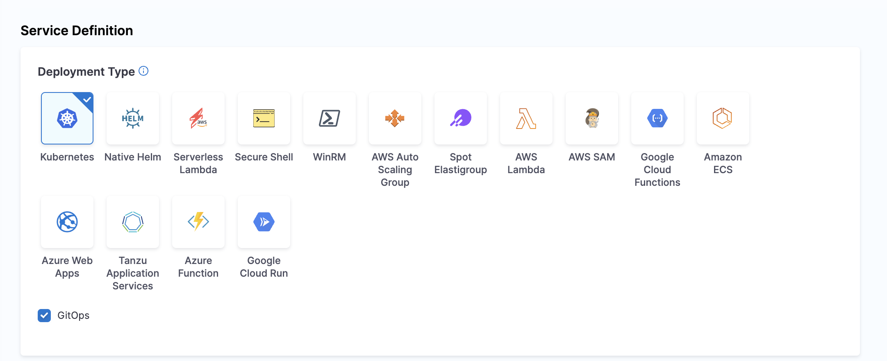
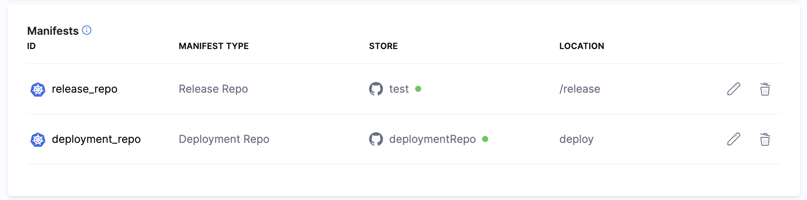
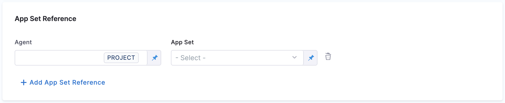
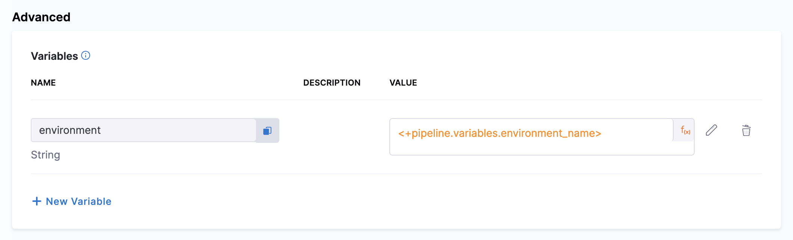

# GitOps Services

This topic describes how to use Harness GitOps services to track your GitOps applications and their deployment state.

## What is a Service in GitOps?

In the GitOps context, a service represents an application or a group of related applications deployed through the GitOps methodology. GitOps services help you:

- Track the deployment state of your applications
- Provide a central location to manage and observe all your GitOps applications

Unlike traditional CD services that define deployment artifacts and configurations, GitOps services focus on tracking, monitoring, and visualizing the state of applications synced automatically through GitOps agents.

## How to Create a GitOps Service

You can create GitOps services in two ways:

### Method 1: Create a Service for GitOps Applications

1. navigate to **Deployments** > **Services**in your Harness project.
2. Click **New Service**.
3. Enter a name for your service.
4. Select **Save**.
5. In the service configuration tab, under the service definition, in the deployment type, select Kubernetes and toggle on **Enable GitOps**.
   
   

6. Add the Manifests and Artifact details
6. You can also reference an App Set by clicking on the **Reference App Set** option and configuring the Agent and the app set reference.

8. Click **Save**.

### Method 2: Map Existing GitOps Applications to Services

If you have existing GitOps applications that were created via the GitOps UI or imported from Argo CD, you can map them to Harness services:

1. Navigate to **Deployments** > **GitOps** > **Applications**.
2. Select the application you want to map to a service.
3. In the **Ap Details** tab, you can map the application to a service.
4. Choose to either create a new service or map to an existing service.
5. Complete the mapping configuration and click **Apply Changes**.

There are two different flows for adding the service. One is by adding the manifest. We have two different types of manifest here

1. Release Repo: used in the updateReleaseRepo manifest for the update release repo step.
2. Deployment Repo Manifest used by the fetch linked apps step.

When the respective steps are added in the execution, it fetches the respective manifest YAML and does the deployment.

Another way is to use the App Set Reference field, wherein you provide the agent and the app set reference. This is a more dynamic way to add the service to the pipeline, as the app set and agent are already created and installed.

## Service Variables in GitOps

Service variables play a crucial role in managing configurations and deployments in GitOps. These variables help customize your deployments across different environments and clusters.

### How Service Variables Work

In GitOps, service variables provide the following capabilities:

1. **Service Variables Definition**: 
   - Define variables specific to your service, such as `imageTag`, `port`, and other service-specific settings
   - These variables can be referenced in your manifests and configurations

2. **Environment and Cluster-Level Overrides**: 
   - Variables can be overridden at different levels - environment, cluster, or service level
   - This flexibility allows for proper configuration management across environments

3. **Runtime Inputs**: 
   - Some service variables can be defined as runtime inputs
   - This is useful for variables that change frequently or need to be specified at deployment time

4. **Precedence and Overrides**: 
   - The order of precedence typically flows from infrastructure variables (highest priority) to service level variables (lowest priority)
   - This ensures that the most specific configurations are applied

### Using Cluster Name as a Service Variable

A specific use case is referencing cluster attributes stored in configuration files:

1. Store the cluster name in a configuration file (like `config.json`)
2. Reference this value as a service variable using expression syntax
3. During deployment, the service can target the correct cluster based on this reference

By using service variables with expressions, you can create dynamic and configurable deployments that adapt to different environments and requirements.

## How to Use the GitOps Service Dashboard

The GitOps Service Dashboard provides visibility into your GitOps applications and services. This dashboard helps you monitor deployment activity, success rates, and service status across your entire environment.

### Accessing the Service Dashboard

1. Navigate to **Deployments** > **Services**in your Harness project.
2. You'll see a list of all your services, including traditional CD and GitOps services.

### Dashboard Features

The Services Dashboard displays comprehensive information about your services:

#### Overview Statistics

At the top of the dashboard, you can see summary statistics including:

- **Total Services**: The total number of services in your project
- **Service Instances**: The number of active service instances
- **Deployments**: Number of deployments in the selected time period
- **Failure Rate**: Percentage of deployments that have failed
- **Frequency**: Average number of deployments per day

You can filter the view to see data for the last 7 days, 30 days, or a custom time range.

#### Environment Distribution

The dashboard shows how your services are distributed across environments:
- **Production** (Prod): Services deployed to production environments
- **Non-Production** (Non Prod): Services deployed to testing, development, or staging environments

#### Most Active Services

This section displays your most frequently deployed services, showing:
- Service names
- Number of deployments per service
- Success/failure status

#### Services Table

The main services table provides detailed information about each service:

| Column | Description |
|--------|-------------|
| SERVICE | Name of the service and its unique ID |
| Code Source | Source of the service configuration (Inline, Git, etc.) |
| TYPE | Type of service |
| ACTIVE INSTANCE COUNT | Number of active instances for each service |
| DEPLOYMENTS | Count of deployments, broken down by environment |
| FAILURE RATE | Percentage of failed deployments |
| FREQUENCY | Average number of deployments per time period |
| LAST PIPELINE EXECUTION | Most recent pipeline that deployed this service and its status |

#### Service Actions

From the service dashboard, you can perform several actions:
- Create a new service
- Search for specific services
- Sort services by various attributes
- View service details by clicking on a service name
- Access pipeline execution details by clicking on the last pipeline execution

### Service-Centric Monitoring

The Services dashboard provides a service-centric view of your deployments, enabling you to:

1. **Monitor deployment trends**: Track service deployment frequency and success rates over time
2. **Identify problematic services**: Quickly spot services with high failure rates
3. **Compare environments**: See how services perform across production and non-production environments

By utilizing the Services dashboard, you gain visibility into all your services, including GitOps applications. This helps you maintain reliable deployments and quickly address issues as they arise.

## Next Steps

- [Learn more about GitOps Applications](/docs/continuous-delivery/gitops/application/manage-gitops-applications)
- [Configure GitOps Repositories](/docs/continuous-delivery/gitops/gitops-entities/repositories/add-a-harness-git-ops-repository)
- [Set up GitOps Agent](/docs/continuous-delivery/gitops/gitops-entities/agents/install-a-harness-git-ops-agent)