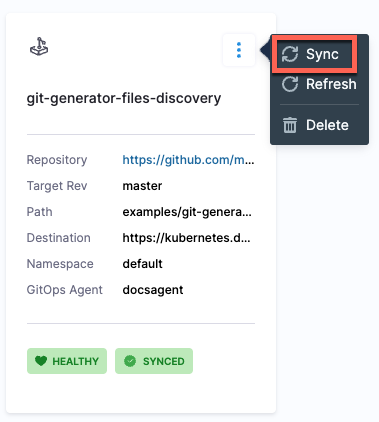
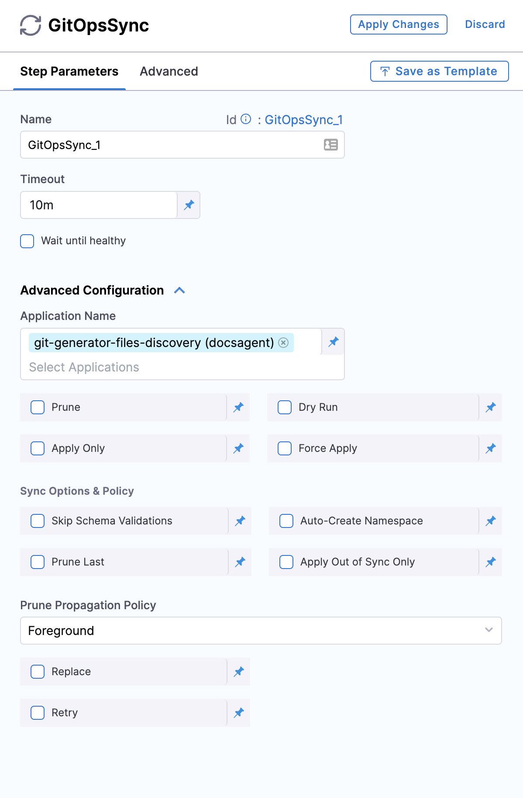

Sync is a process that ensures that the live state of a system matches its desired state by applying a declarative description. This process involves synchronizing the desired Git state with the live cluster state. 

To sync applications from the **Applications** page: 

1. In your GitOps project, go to **Deployments** > **GitOps** > **Applications**, and then select your application.
   
   

2. To sync the selected application: 
   * Select the more options icon, and then select **Sync**.
   
     
   * Select the application, and then select **SYNC**. 

     
3. Configure the sync options, and then select **Synchronize**.

   When synchronizing the application, you have the option to apply a specific revision. By default, target revision of the application is selected.
   
   The Branch and Tag options display a list of available branches and tags, allowing you to make a selection. Additionally, the Ref option enables synchronization of branches, tags, and commit hashes.
   
   

To sync applications using the **GitOpsSync** step: 

1. Select a pipeline and go to the **Execution** tab of a deploy stage.
   
   :::info

   Make sure that the service, environment, and cluster selected in the pipeline matches the service, environment, and cluster in the application.

   ::: 
   
2. Select **Add Step**, and then select the **GitOpsSync** step.
3. Select the GitOpsSync step to configure step parameters.
4. In **Advanced Configuration**, select the application you want to sync and configure the sync options.
   
        
 
5. Select **Apply Changes**.

Here is how the resources would look in Harness after the sync process is complete.

