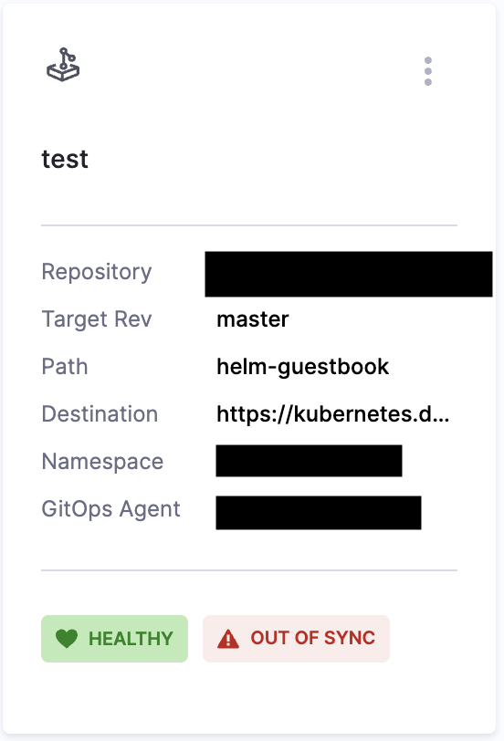

You can manage your applications through the **Applications** found in **GitOps Overview** page. 

<iframe 
    src="https://app.tango.us/app/embed/4d59383b-7b7d-4355-acb7-1eed4ca657f0" 
    title="Create an Upstream Proxy in Harness Artifact Registry" 
    style={{ minHeight: '640px' }}
    width="100%" 
    height="100%"
    referrerpolicy="strict-origin-when-cross-origin"
    frameborder="0"
    webkitallowfullscreen="true"
    mozallowfullscreen="true"
    allowfullscreen="true"
></iframe>

## New Applications

Create a new application by click **+New Application** in the top right. To learn more about creating applications, go to [Add a Harness GitOps Application](/docs/continuous-delivery/gitops/get-started/harness-cd-git-ops-quickstart#step-4-add-a-harness-gitops-application)

## Application Operations

Applications are displayed on this page as a series of tiles. You can change this to a list of rows in the top right. 

Each application will display various helpful information such as the application repository or a name and link to the GitOps Agent. 

Each tile will have 3 vertical dots. Clicking this will allow you to manually **Sync**, **Refresh**, or **Delete** the application. 

See the following to learn more about some of these operations:
- [Sync Applications](/docs/continuous-delivery/gitops/use-gitops/sync-gitops-applications)
- [Refresh Applications](/docs/continuous-delivery/gitops/get-started/harness-git-ops-basics#refresh)

## Filter Applications

At the top you can filter your applications using a search bar and application attributes.

### Create and Save Filters

You can also create and save custom filters so that you can make sure you're only looking at relevant applications consistently. 

:::note

This feature is currently behind the feature flag `GITOPS_FILTER_PANE_ENABLED`. To enable this feature, contact [Harness Support](mailto:support@harness.io)

:::

To create and save a filter, do the following:

1. Create a filter by doing any of the following:
    - Add a custom search term
    - Choose to filter by **Agents**, **Sync Status**, **Health Status**, etc.
    - Add an additional filter field by clicking the **+Add Filter** button.
2. Click **Save**
3. Enter a name for the filter, and choose if you want it visible to **Only me** or **Everyone** in the scope. 

Then you're done!

You can then load the filter each subsequent time by clicking the filter icon to the right of **Reset** and searching for your filter there. 
