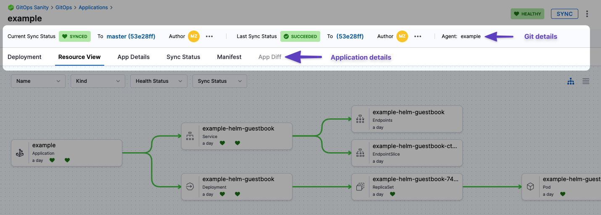

You can manage your applications through the **Applications** found in **GitOps Overview** page. 

<DocVideo src="https://app.tango.us/app/embed/Navigating-GitOps-to-Access-Applications-in-Harness-cad0aa3f8abd4f1d96af0e482c51729e" title="Navigating GitOps to Access Applications in Harness" />

## New Applications

Create a new application by click **+New Application** in the top right. To learn more about creating applications, go to [Add a Harness GitOps Application](/docs/continuous-delivery/gitops/get-started/harness-cd-git-ops-quickstart#step-4-add-a-harness-gitops-application)

## Application Operations

Applications are displayed on this page as a series of tiles. You can change this to a list of rows in the top right. 

Each application will display various helpful information such as the application repository or a name and link to the GitOps Agent. 

Each tile will have 3 vertical dots. Clicking this will allow you to manually **Sync**, **Refresh**, or **Delete** the application. 

See the following to learn more about some of these operations:
- [Sync Applications](/docs/continuous-delivery/gitops/use-gitops/sync-gitops-applications)
- [Refresh Applications](/docs/continuous-delivery/gitops/get-started/harness-git-ops-basics#refresh)

## Filter Applications

At the top you can filter your applications using a search bar and application attributes.

### Create and Save Filters

You can also create and save custom filters so that you can make sure you're only looking at relevant applications consistently. 

:::note

This feature is currently behind the feature flag `GITOPS_FILTER_PANE_ENABLED`. To enable this feature, contact [Harness Support](mailto:support@harness.io)

:::

To create and save a filter, do the following:

1. Create a filter by doing any of the following:
    - Add a custom search term
    - Choose to filter by **Agents**, **Sync Status**, **Health Status**, etc.
    - Add an additional filter field by clicking the **+Add Filter** button.
2. Click **Save**
3. Enter a name for the filter, and choose if you want it visible to **Only me** or **Everyone** in the scope. 

Then you're done!

You can then load the filter each subsequent time by clicking the filter icon to the right of **Reset** and searching for your filter there. 

## Application Management Dashboard

After you select an application, you will see the application dashboard:



* **Git details:** you can see the Git commit used as the source for the sync. Clicking the commit Ids opens the commit in the source provider.
* **Deployment:** the deployments dashboard shows when the Application was deployed (synced).
* **Resource View:** displays the desired to target state mapping of each Kubernetes object.
  The **Resource View** lets you inspect the live target infrastructure by:
	+ **Name:** Kubernetes object names.
	+ **Kind:** Kubernetes object types.
	+ **Health Status:** the health status of the Application. For example, is it syncing correctly (Healthy)?
	+ **Sync Status:** sort Kubernetes objects by their sync status.

  Select any item to see:
    - **Overview**: An overview of the resources properties, such as name, namespace, or sync status.
    - **Events**: Any events emitted by the pod.
    - **Logs**: The logs of the resource. These logs are searchable, copyable, and downloadable. You can also view the log tail by clicking on the down arrow in the bottom right corner (click image below).
    <div align="center">
      <DocImage path={require('./static/log-tail-down-arrow.png')} width="50%" height="50%" title="Click to view full size image" />
    </div>
    - **Manifest**: The manifest of the resource.
    - **Diff**: The diff between the source manifest and application if they are out of sync.


* **App Details:** displays the settings of the Application. You can edit the settings and apply your changes, including the **Sync Options & Policy**.
* **Sync Status:** displays all of the sync operations performed by the Application.
* **Manifest:** displays the manifest of the Application. This is not the same as the source manifest in the Git source repo.  
You can edit the manifest in **Manifest** and the changes are synced in the target infrastructure, but when you do a full sync from your source repo the state of the source repo overwrites any changes made in **Manifest**.
* **App Diff:** displays a diff against the live state in the cluster and desired state in Git. 

## Application Configuration Options

### Ignore HPA Changes to Prevent Out-of-Sync Status

When Horizontal Pod Autoscaler (HPA) is enabled, pod scaling can cause GitOps to detect unwanted differences and mark applications as out of sync. 

To prevent this, configure the following in the application to ignore differences on replicas:

```yaml
ignoreDifferences:
    - group: apps
      kind: Deployment
      jsonPointers:
        - /spec/replicas
    - group: apps
      kind: StatefulSet
      jsonPointers:
        - /spec/replicas
syncPolicy: 
  syncOptions: 
  - RespectIgnoreDifferences=true
```

Alternatively, you can add the following to the Argo ConfigMap:

```yaml
apiVersion: v1
kind: ConfigMap
metadata:
  name: argocd-cm
data:
  resource.customizations: |
    apps/Deployment:^(app-with-hpa|hpa-enabled-.*|.*-autoscaled)$:
      ignoreDifferences: |
        jsonPointers:
        - /spec/replicas
```

For more details, see:
- [Argo CD Sync Options](https://argo-cd.readthedocs.io/en/stable/user-guide/sync-options/#respect-ignore-difference-configs)
- [Argo CD Application Specification Reference](https://argo-cd.readthedocs.io/en/stable/user-guide/application-specification/)