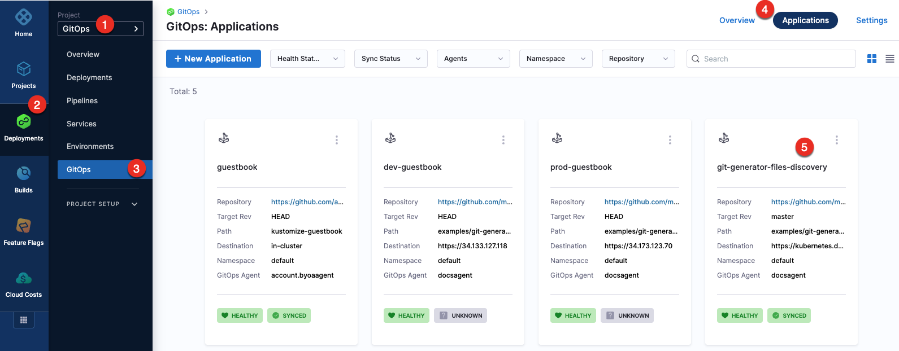
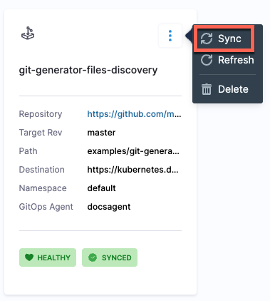
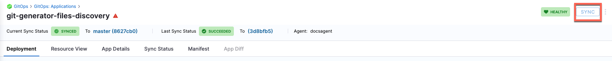
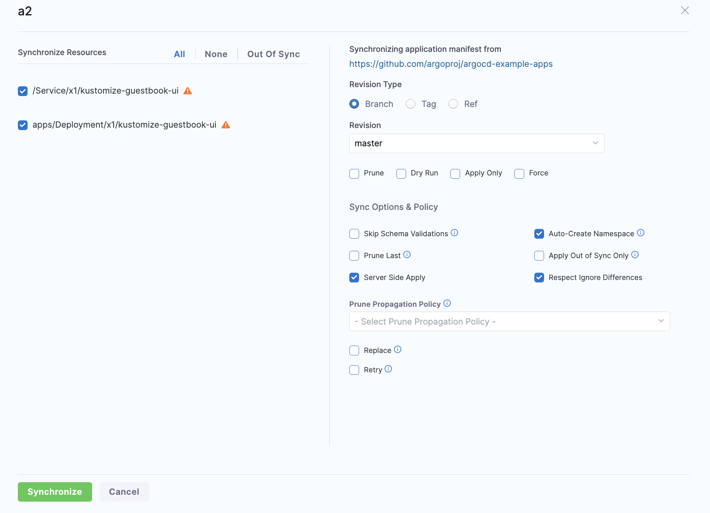
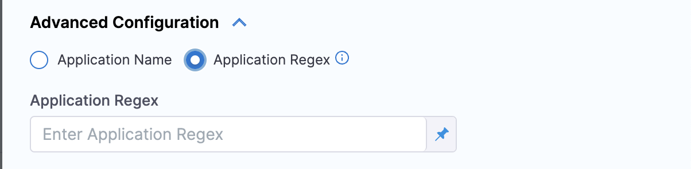
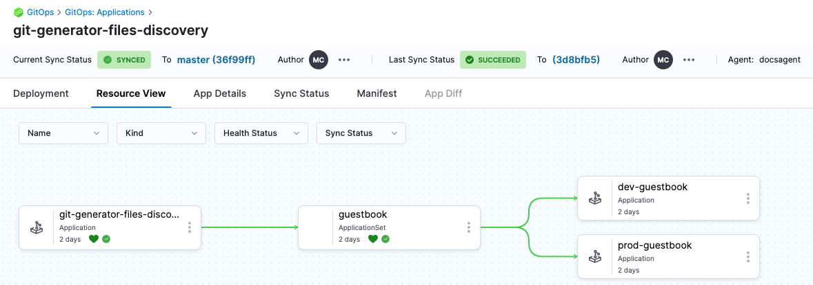
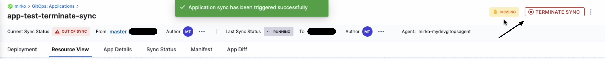

Sync is a process that ensures that the live state of a system matches its desired state by applying a declarative description. This process involves synchronizing the desired Git state with the live cluster state. 

## Sync for Single Sources application.

To sync applications from the **Applications** page: 

1. In your GitOps project, go to **Deployments** > **GitOps** > **Applications**, and then select your application.
   
   

2. To sync the selected application: 
   * Select the more options icon, and then select **Sync**.
   
     
   * Select the application, and then select **SYNC**. 

     
3. Configure the sync options, and then select **Synchronize**.

   When synchronizing the application, you have the option to apply a specific revision. By default, target revision of the application is selected.
   
   The Branch and Tag options display a list of available branches and tags, allowing you to make a selection. Additionally, the Ref option enables synchronization of branches, tags, and commit hashes.
   
   

To sync applications using the **GitOpsSync** step: 

1. Select a pipeline and go to the **Execution** tab of a deploy stage.
   
   :::info

   Make sure that the service, environment, and cluster selected in the pipeline matches the service, environment, and cluster in the application.

   ::: 
   
2. Select **Add Step**, and then select the **GitOpsSync** step.
3. Select the GitOpsSync step to configure step parameters.
4. Optionally, click on the **Wait until healthy** checkbox, if you would like the step to run until the application reaches it's **Healthy** state.
5. Optionally, if you enabled **Wait until healthy** you can enable **Fail If Step Times Out**. This will cause the step to fail if it times out while waiting for the health check to pass. For example, enabling this option now means the step could sync successfully but fail if a healthy state isn't reached by the time the time out period runs out. 
6. In **Advanced Configuration**, select the application you want to sync and configure the sync options.
      You can either can either choose an application or applications manually, or you can match up to 1000 applications using a regex filter.

        
 
7. Select **Apply Changes**.

Here is how the resources would look in Harness after the sync process is complete.

## Sync for  Multiple Sources application

For more information on creating a multi-source application, refer to the [Support for Multiple Sources](/docs/continuous-delivery/gitops/get-started/harness-cd-git-ops-quickstart#step-4-add-a-harness-gitops-application) documentation

Currently, Support for Multiple Sources is behind the feature flag `GITOPS_MULTI_SOURCE_ENABLED`. Please contact [Harness support](mailto:support@harness.io) to enable this feature.

After the application with multiple source is created, you can also choose which source to sync with the application during the sync operation. By default, all applications will be synced.

To sync a specific source:

1. Click the **Sync** button in the top right corner of the **Applications** page.
2. Under **Synchronizing application manifest from**, select the source tab from which you want to sync your application.
3. Check the **Sync Source** checkbox. The tab for the selected source, where the checkbox is enabled, will be highlighted in green.

## Terminate sync

To terminate an in-progress sync, go to the application for the syncing app and locate the **Terminate Sync** button in the top right corner of the UI. Replace the **Sync** button when a sync is in progress.

