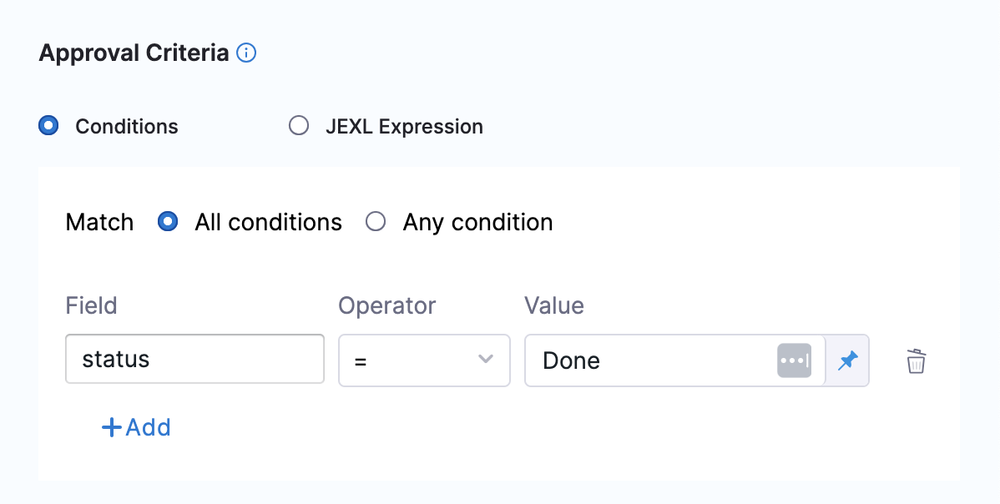
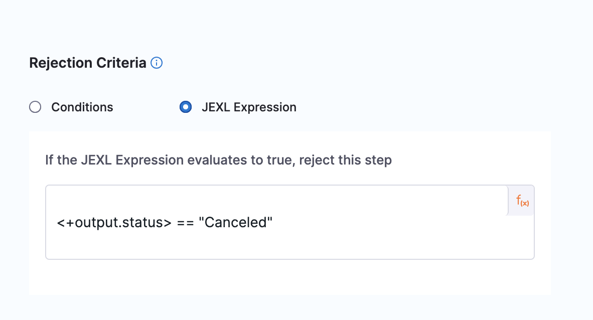
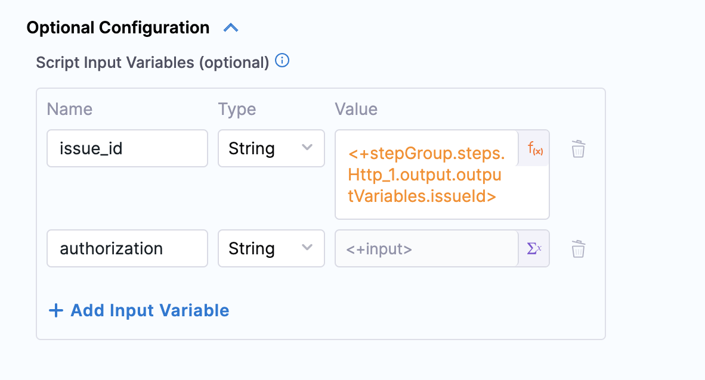

Linear.app is a powerful project management tool designed to streamline collaboration and enhance productivity. Offering a sleek and intuitive interface, Linear.app empowers teams to organize tasks, track progress, and prioritise projects seamlessly. With its emphasis on simplicity and flexibility, Linear.app provides a centralised hub for teams to coordinate efforts, making it an ideal solution for harnessing the full potential of linear workflows.

Despite the absence of a native integration, Harness excels in seamlessly integrating with Linear, showcasing its adaptability and customisation capabilities. A standout feature is Harness's ability to create custom approval steps, leveraging the robust functionality of Linear's GraphQL API. This allows for tailored checks on the status of created issues, enabling the smooth and automated orchestration of workflows. By harnessing these customisable capabilities, teams can enhance collaboration and efficiency, underscoring that even without a pre-built connection, Harness excels in crafting bespoke integrations with Linear.

##  Prerequisites

Before diving into the setup process, ensure that you have the following prerequisites in place:

1. **Linear.app Workspace Access:** Ensure you have access to the Linear.app workspace where you intend to integrate with Harness. This access is pivotal for configuring and implementing a seamless integration, allowing you to effectively manage and coordinate workflows between the two platforms within your designated workspace.

2. **API Authorization Token:** For a secure link between Harness and Linear, users must generate an API authorization token from Linear.app. This token acts as a key credential, enhancing data protection and ensuring encrypted communication between the two platforms. Follow [Linear's documentation](https://developers.linear.app/docs/graphql/working-with-the-graphql-api#personal-api-keys)to create your access token.

3. **Knowledge of GraphQL and Bash Scripting:** A foundational knowledge of GraphQL and Bash scripting is essential for customising workflows seamlessly. Understanding GraphQL enables users to tailor interactions with Linear's API, while Bash scripting empowers them to automate tasks and enhance efficiency in the workflow customisation process. With these skills, users can unlock the full potential of integrating Harness with Linear, ensuring a personalised and optimised project management experience.

## Configure Linear.app with custom approval

To use Linear.app with a custom approval, you need to use an HTTP step to create a Linear issue and then create a custom approval shell script.

### Create a Linear issue with HTTP step

First, use the Harness HTTP step to create a Linear issue. Configure the HTTP step as follows:


1. **URL:** Set the URL to `https://api.linear.app/graphql` the endpoint for Linear's GraphQL API.

2. **Method:** Choose POST as the HTTP method, as we are creating a new issue.

3. **Request Body:** Craft a GraphQL mutation for issue creation with placeholders for dynamic inputs.

   ```
   { 
       "query": "mutation IssueCreate { issueCreate(input: { title: \"<+spec.inputVariables.title>\", description: \"<+spec.inputVariables.description>\", teamId: \"<+spec.inputVariables.teamId>\", priority: <+spec.inputVariables.priority> }) { success issue { id number title priority priorityLabel identifier url description descriptionData state { name } } } }" 
   }
   ```

4. **Headers:** Configure necessary headers for proper communication with Linear's API.
   * Content-Type: application/json
   * Authorization: `<+secrets.getValue("authorization")>`

   Authorization should be kept secret to prevent unauthorized access. Revealing it exposes sensitive information, risking data breaches and compromising system security, making it a critical element to safeguard. 

5. **Assertion:** Ensure that the HTTP response code is 200 for a successful response.
   * Assertion: `<+httpResponseCode>==200`

6. **Output Variable:** Capture the newly created issue's ID for use in subsequent steps.
   * issueId = `<+json.select("data.issueCreate.issue.id", httpResponseBody)>`

### Add the Custom Approval shell script

Next, use a Bash script to set up a custom approval process. This script queries the Linear API to check the status of the created issue. Configure the Bash script as follows:


1.  **Script:** Create a Bash script to:
   * Install necessary packages.
   * Execute a curl command to query the Linear API for the issue status.
   * Extract and export the issue status as the variable status.
   * Print the status for visibility purpose.

   For example:

   ```
   #!/bin/bash
   # Update and install necessary packages
   sudo yum install -y microdnf
   microdnf update
   microdnf install jq

   # Make the curl request
    response=$(curl --location 'https://api.linear.app/graphql' \
   --header 'Content-Type: application/json' \
   --header "Authorization: $authorization" \
   --data "{ \"query\": \"query Issue { issue(id: \\\"$issue_id\\\") { id number priority priorityLabel identifier url description descriptionData title state { name } } }\" }")

   export status=$(echo "$response" | jq -r '.data.issue.state.name')
   echo "Status: $status"
   ```

2. **Custom Approval Parameters:**
   * Timeout: How long you want Harness to try to complete the step before failing (and initiating the stage or step Failure Strategy) [1d].
   * Script Type: Choose Bash as the script type.
   * Retry Interval: Set how long the step should wait to run the script again if the Approval or Rejection criteria evaluate to false.The number of times a script executes depends on the Retry Interval, Script Timeout, and how fast the script executes [30s].
   * Script Timeout: Set how long the step should wait for the script to complete before timing out [5m].

3. **Approval Criteria:** Define approval criteria based on the extracted status variable, or you can establish criteria using any other variable.

   

4. **Rejection Criteria:** Rejection criteria is optional field either you can define or not. If you do not define the rejection criteria pipeline will retry until the timeout is achieved. After the timeout reached the pipeline will expire.

   

   This script queries the Linear API to retrieve the current status of the created issue. The obtained status is stored in a variable (status) for subsequent use in approval or rejection criteria.

5. **Script Input Variable:** While you can simply declare a variable in your script using a Harness expression or string for its value, using Input Variables provides some additional benefits:
   * You can easily identify and manage the Harness expressions used in your script.
   * You can template your script.

   You can declare the variable using Name and Value in Script Input Variables and then reference the variable in the script just as you would any other variable: `$var_name`.

   

## YAML example: Step group template 
Here's the YAML for a Step Group Template that demonstrates the use of Custom Approval with Linear.app.

```
template:
  name: Linear Approval Template
  type: StepGroup
  projectIdentifier: DoNotDelete_Apoorv
  orgIdentifier: default
  spec:
    steps:
      - step:
          type: Http
          name: Create Linear Ticket
          identifier: createLinearIssue
          spec:
            url: https://api.linear.app/graphql
            method: POST
            headers:
              - key: Content-Type
                value: application/json
              - key: Authorization
                value: <+input>
            inputVariables:
              - name: title
                value: <+input>
                type: String
              - name: description
                value: <+input>
                type: String
              - name: teamId
                value: <+input>
                type: String
              - name: priority
                value: <+input>
                type: String
            outputVariables:
              - name: issueId
                value: <+json.select("data.issueCreate.issue.id", httpResponseBody)>
                type: String
              - name: title
                value: <+json.select("data.issueCreate.issue.title", httpResponseBody)>
                type: String
              - name: priority
                value: <+json.select("data.issueCreate.issue.priority", httpResponseBody)>
                type: String
            requestBody: "{ \"query\": \"mutation IssueCreate { issueCreate(input: { title: \\\"<+spec.inputVariables.title>\\\", description: \\\"<+spec.inputVariables.description>\\\", teamId: \\\"<+spec.inputVariables.teamId>\\\", priority: <+spec.inputVariables.priority> }) { success issue { id number title priority priorityLabel identifier url description descriptionData state { name } } } }\" }"
            assertion: <+httpResponseCode>==200
          timeout: 10s
      - step:
          type: CustomApproval
          name: Linear Approval Stage
          identifier: Custom
          timeout: 1d
          spec:
            shell: Bash
            retryInterval: 30s
            scriptTimeout: 10m
            source:
              type: Inline
              spec:
                script: |-
                  #!/bin/bash
                  # Update and install necessary packages
                  sudo yum install -y microdnf
                  microdnf update
                  microdnf install jq

                  # Make the curl request
                   response=$(curl --location 'https://api.linear.app/graphql' \
                  --header 'Content-Type: application/json' \
                  --header "Authorization: $authorization" \
                  --data "{ \"query\": \"query Issue { issue(id: \\\"$issue_id\\\") { id number priority priorityLabel identifier url description descriptionData title state { name } } }\" }")

                  export status=$(echo "$response" | jq -r '.data.issue.state.name')
                  echo "Status: $status"
            environmentVariables:
              - name: issue_id
                type: String
                value: <+stepGroup.steps.createLinearIssue.output.outputVariables.issueId>
              - name: authorization
                type: String
                value: <+input>
            approvalCriteria:
              type: KeyValues
              spec:
                matchAnyCondition: false
                conditions:
                  - key: status
                    operator: equals
                    value: Done
            rejectionCriteria:
              type: Jexl
              spec:
                expression: <+output.status> == "Canceled"
            onDelegate: true
            outputVariables:
              - name: status
                type: String
                value: status
    stageType: Approval
  identifier: Linear_Approval_Template
  versionLabel: V1
```