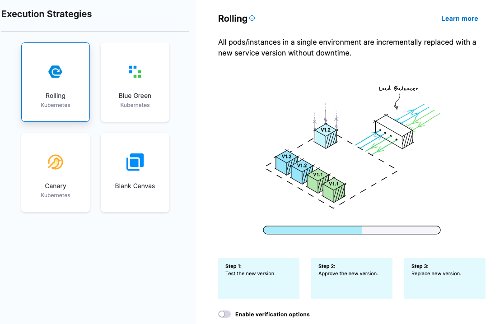
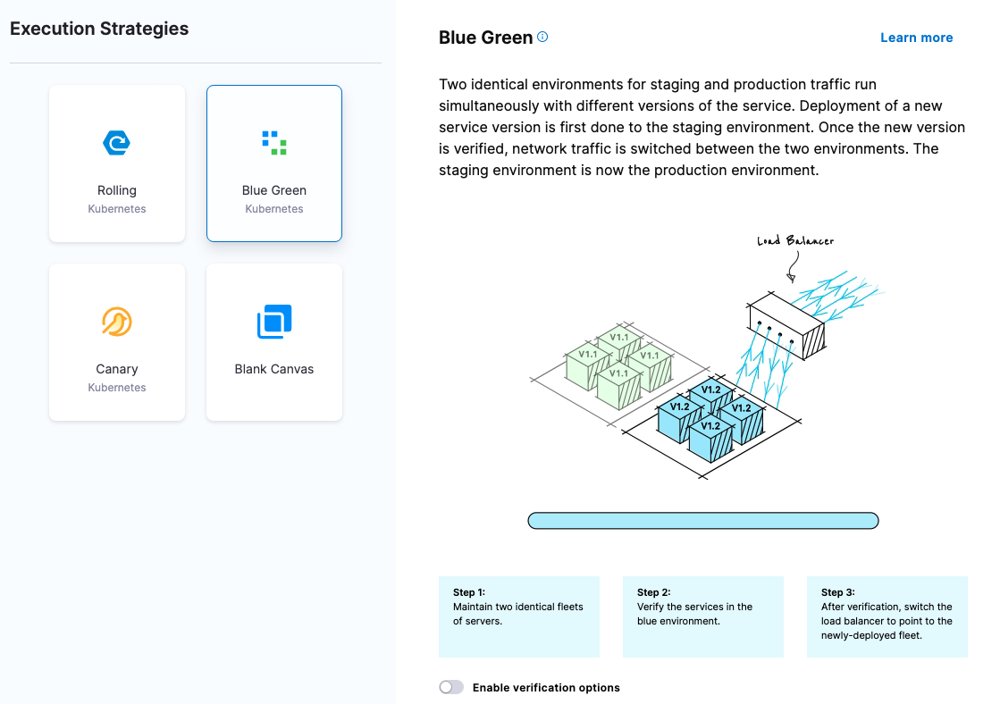
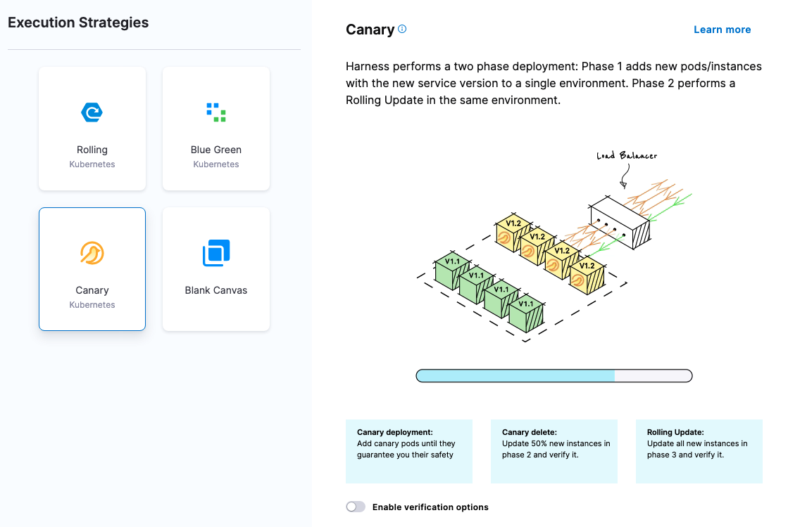
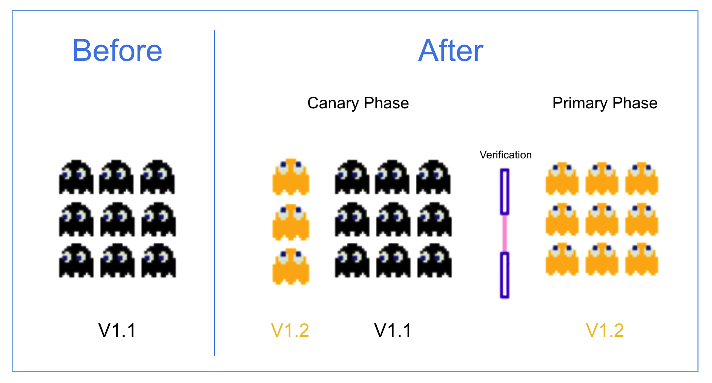

You have likely heard terms like *blue/green* and *canary* when it comes to deploying code and applications into production. These are common deployment strategies, available in Harness CD as stage strategies, along with others.

This topic will explain these strategies to give you an idea of how to approach deployments in Harness, and to help you decide what strategy is best for you.

### Deploy with or without gates

CD deployments are typically performed using manual approvals before deploying changes to production. These approvals are often called approval gates or release gates. 

Gates are checkpoints in the deployment process that can provide several benefits, including increased control, improved quality, compliance and security, stakeholder involvement, and better risk management.

However, gates can also slow down the deployment process, requiring manual intervention and increasing the time it takes to get changes to production.

CD deployments without gates, also known as "no-gate CD," refers to a CD process that does not require manual approval before deploying changes to production.

This approach has several advantages, including faster time to market and increased collaboration.

Of course, no-gate CD is not appropriate for all organizations and situations, and it may require significant investment in automation and testing to ensure that changes are deployed safely and reliably. 

Harness supports gated and no-gate CD by default. You can use several approval stages or steps in your pipelines, or simply deploy without gates.

For information on approval stages and steps, go to:

- [Using manual harness approval stages](https://developer.harness.io/docs/platform/Approvals/adding-harness-approval-stages)
- [Adding Jira approval stages and steps](https://developer.harness.io/docs/platform/Approvals/adding-jira-approval-stages)
- [Adding ServiceNow approval steps and stages](https://developer.harness.io/docs/platform/Approvals/service-now-approvals)

## Rolling deployment

With a rolling deployment, all nodes within a single environment are incrementally added one-by-one or in N batches (as defined by a window size) with a new service/artifact version.

### When to use rolling deployments

* When you need to support both new and old deployments.
* Load balancing scenarios that require reduced downtime.

One use of rolling deployments is as the stage following a canary deployment in a deployment pipeline. For example, in the first stage you can perform a canary deployment to a QA environment and verify each group of nodes and, once successful, you perform a rolling to production.

#### Pros

* Simple, relatively simple to rollback, less risk than Basic deployment.
* Gradual app rollout with increasing traffic.

#### Cons

* Verification gates between nodes difficult and slow.
* App/DB needs to support both new and old artifacts. Manual checks/verification at each increment could take a long time.
* Lost transactions and logged-off users are also something to take into consideration.

See [Create a Kubernetes Rolling Deployment](../deploy-srv-diff-platforms/kubernetes/kubernetes-executions/create-a-kubernetes-rolling-deployment.md).

## Blue Green deployment

With Blue Green deployment, two identical environments for staging and production traffic run simultaneously with different versions of the service.

QA and User Acceptance Testing (UAT) are typically done on the stage environment. When satisfied, traffic is flipped (via a load balancer) from the prod environment (current version) to the stage environment (new version).

You can then decommission the old environment once deployment is successful.

Some vendors call this a red/black deployment.

### When to use Blue Green deployments

* When you want to perform verification in a full production environment.
* When you want zero downtime.

#### Pros

* Simple, fast, well understood, and easy to implement: the switch is almost instantaneous.
* Less risk relative to other deployment strategies.
* Rapid rollback (flip traffic back to old environment)

#### Cons

* Replicating a production environment can be complex and expensive (i.e. microservice downstream dependencies).
* QA/UAT test coverage may not identify all anomalies & regressions in blue environment.
* An outage or SPOF could have wide-scale business impact before rollback kicks in.
* Current transactions and sessions will be lost due to the physical switch from one machine serving the traffic to another one.
* Database compatibility (schema changes, backward compatibility).

See:

* [Create a Kubernetes Blue Green Deployment](../deploy-srv-diff-platforms/kubernetes/kubernetes-executions/create-a-kubernetes-blue-green-deployment.md)

## Canary deployment

With Canary Deployment, all nodes in a single environment are incrementally updated in small phases, with each phase requiring a verification/gate to proceed to the next phase.

### When to use Canary deployments

When you want to verify whether the new version of the application is working correctly in your production environment.

This is currently the most common way to deploy apps/services into production.

#### Pros

* Deploy in small phases (e.g. 2%, 10%, 25%, 50,%, 75%, 100%).
* Lowest risk relative to all other deployment strategies (reduce business exposure).
* Test in production with real users & use cases.
* Run & compare two service versions side-by-side.
* Cheaper than blue/green, because there is no need to have two production environments.
* Fast and safe rollback.

#### Cons

* Scripting canary deployments can be complex (Harness automates this process).
* Manual verification can take time (Harness automates this process with Continuous Verification).
* Required monitoring and instrumentation for testing in production (APM, Log, Infra, End User, etc).
* Database compatibility (schema changes, backward compatibility).

For Kubernetes, Harness does this a little differently.

In Phase 1 we do a canary to the same group but we leave the production version alone. We just use other instances. Then we delete our canary version in Phase 1.

In Phase 2 we do a rolling deployment with the production version and scale down the older version.

See:

* [Create a Kubernetes Canary Deployment](../deploy-srv-diff-platforms/kubernetes/kubernetes-executions/create-a-kubernetes-canary-deployment.md)

### Build deployments

A Build deployment runs a build process, such as a Jenkins job that creates a WAR file and deposits it in a registry.

:::note

Build deployments in CD stages are not part of Harness Continuous Integration (CI). Harness CI performs extensive code testing, compiling, and artifact registration.

Build deployments in CD stages are a way to perform standard job runs without using Harness CI. For an example, go to [Run Jenkins jobs in CD pipelines](/docs/continuous-delivery/x-platform-cd-features/cd-steps/builds/run-jenkins-jobs-in-cd-pipelines).

:::

#### When to use build deployments

Typically, you use build deployments as part of a build step or stage in a CD pipeline.

A build step runs a build process (Jenkins job) and deposits the built artifact in a registry.

#### Build step for push events

Build steps can also be used to build an artifact when the source has been updated.

For example, you might use a trigger to execute the CD pipeline on a Webhook event, such as a Git push event. In this case, the new artifact version needs to be built before the pipeline can pick it up.

You simply add a build step at the beginning of the pipeline to build the artifact so you always have the latest build.

## Basic deployments

With basic deployments, all nodes (pods, instances, etc) within a single environment are updated at the same time with a single new service/artifact version.

Basic deployments are supported in Harness for a number of platforms as a way for you to experiment with deployments. They are not intended for production deployments because they are not as safe as Canary or Blue Green deployments.

### When to use basic deployments

* Your app/service is not business, mission, or revenue-critical.
* You’re deploying off-hours and no one is using the app/service.
* You're experimenting with deployments and it's okay if the app/service fails.

#### Pros

* Simple and fast
* Useful for learning Harness

#### Cons

* Risk, outages, slower rollback

Not too long ago, basic deployments were how developers rolled out applications. Typically, someone in Ops updated the servers at midnight and then you hoped all goes well.

## Multi-service deployments

With multi-service deployments, all nodes within a single environment are updated at the same time with *multiple* new services/artifacts.

For a detailed explanation of multi-service and multi-environment deployents, go to [Use multiple services and environments in a deployment
](/docs/continuous-delivery/x-platform-cd-features/advanced/multiserv-multienv/).

### When to use multi-service deployments

* When your app has service/version dependencies.

#### Pros

* Simple, fast, and with less risk than Basic deployment.

#### Cons

* Risk
* Difficult to test/verify all service dependencies, outages, slow rollback.

## Which deployment strategy should I use?

It depends entirely on the type of application/service and environment. Most Harness customers are currently using blue/green or canary deployments for mission-critical applications.

In many cases, customers are migrating from blue/green to canary so they can test in production with minimal business impact.

You can also combine many of the above deployment strategies into a single strategy.

