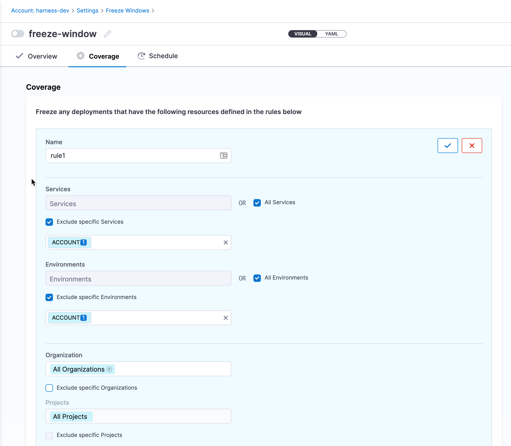
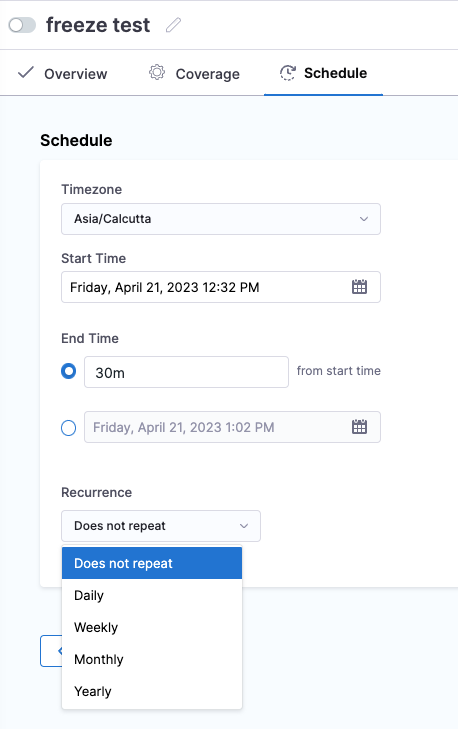
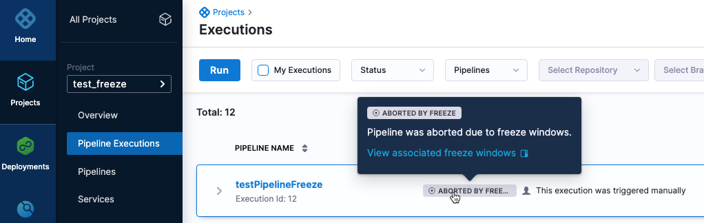
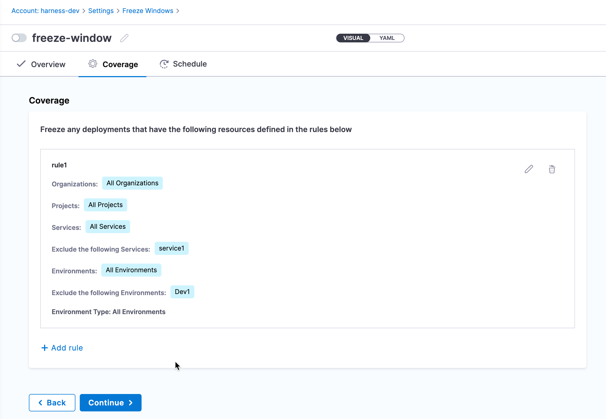
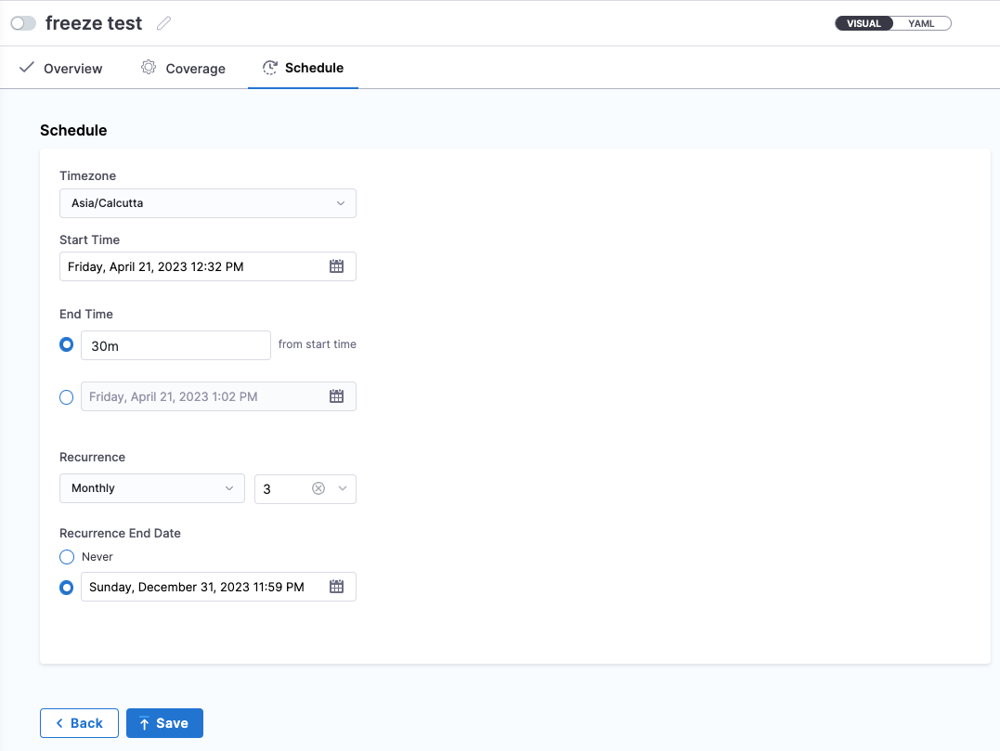
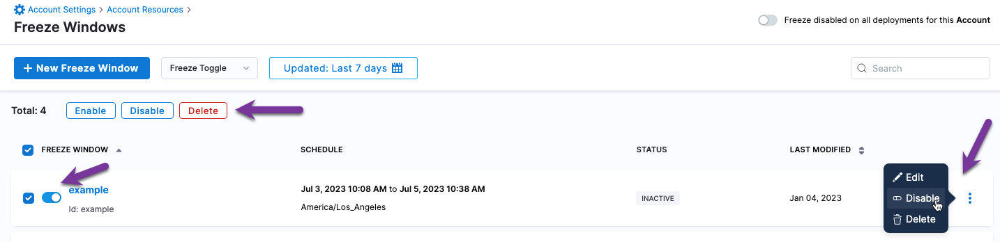
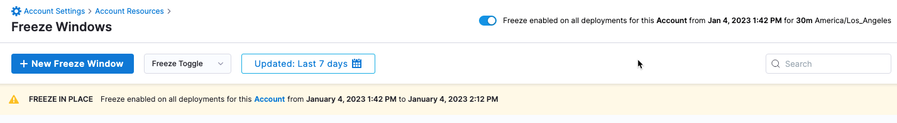

This topic covers the Harness deployment freeze feature, including how to set up freeze windows, access control, notifications, and best practices.

## Deployment freeze summary

If you are new to deployment freezes, review the following summary.

<details>
<summary>Deployment freeze summary</summary>

A deployment freeze is a period of time during in which no new changes are made to a system or application. This ensures that a system or application remains stable and free of errors, particularly in the lead-up to a major event or release.

During a deployment freeze, only critical bug fixes and security patches might be deployed, and all other changes are put on hold until the freeze is lifted.

Deployment freezes are commonly used in software development to ensure that a system is not destabilized by the introduction of new code in new application versions.
</details>

## Harness freeze windows

In Harness, you set up a a deployment freeze as a **freeze window**. 

A freeze window is defined using one or more rules and a schedule. The rules define the Harness orgs, projects, services, and environments to freeze. 



The schedule defines when to freeze deployments and the recurrence, if any (yearly, monthly, etc).




### Freeze window scope

Freeze windows can be set at the Harness account, org, or project levels, with the following differences:

- **Account**: rules can apply to specific, multiple, or all services or environments in the account.
- **Org**: rules can apply to specific, multiple, or all services or environments in the org.
- **Project**: rules can apply to specific, multiple, or all services, environments, or pipelines in the project.

### Exceptions

For each scope level, you can select all subordinate entities and then add exceptions. For example, you can select **All Projects** at the org level, but then select one or more projects as exceptions.

Exceptions save you the time of having to select multiple subordinate entities individually.

### What about pipelines already running?

If a pipeline is running and a freeze happens, the pipeline will continue to run until the current stage of the pipeline has executed. Once that stage executes, the freeze is implemented and no further stages will execute.

Pipelines that become frozen during execution and cannot complete all stages are marked as **Aborted By Freeze**. Hovering over the pipeline status in its execution history displays the associated freeze windows that failed the pipeline execution.



### Freeze windows only apply to CD stages

Deployment Freeze is a CD feature only. It does not apply to other module stages like CI and Feature Flags.

If a pipeline includes a CD stage and other module stages, like CI and Feature Flags, the freeze window is applied to the CD stage(s) **only**. The other stages in the pipeline will continue to run.

### Trigger freeze

You can create triggers in Harness to execute a pipeline under multiple conditions, such as a change to a Helm Chart, artifact, etc.

When a freeze is running, triggers will not execute frozen pipelines. The trigger invocations are rejected. 

:::info 

Pipelines executed with custom webhook triggers can override deployment freeze. This can be enabled by associating the API key or Service Account API key authorization with deployment freeze override permissions.

:::

You can create a freeze window notification to notify users when a trigger invocation was rejected. Notifications are described below.

### API freeze

A freeze window applies to the [Harness API](https://apidocs.harness.io/) also.

If you have set up a deployment freeze on an account, org, or project, you cannot initiate deployment on the frozen entities during the freeze schedule.

### Access control

Deployment freeze access control is configured using the **Deployment Freeze** role permissions.

- **Manage**: add/edit/delete freeze at any level.
- **Override**: When a deployment is required during a freeze duration, users with this role can still perform deployments.
- **Global**: enable/disable freeze across all deployments at account, org, and project levels.

### Important notes

Deployment freeze does not apply to [Harness GitOps PR pipelines](/docs/continuous-delivery/gitops/harness-git-ops-application-set-tutorial.md).

## Create a freeze window

1. Ensure your Harness user account uses a role with the required permissions.
   
   Freeze windows can be set at the Harness account, org, or project levels.

2. Select the scope for the freeze window:
   1. Account: go to **Account Settings** > **Freeze Windows**.
   2. Org: go to **Account Settings** > **Organizations** > select an org > click **Freeze Windows** in **Organization Level Governance**.
   3. Project: go to **Freeze Windows**.
3. **Click New Freeze Window**.
4. In **New Freeze Window**, enter a name for the freeze window and click **Start**.

Now you can define the rules for the freeze window.

### Define freeze window coverage and schedule

Let's look at an account-level example that applies a freeze to all orgs and projects from July 3rd to 5th and notifies users by email (`john.doe@harness.io`) and Harness user group (All Account Users).

```mdx-code-block
import Tabs from '@theme/Tabs';
import TabItem from '@theme/TabItem';
```
```mdx-code-block
<Tabs>
  <TabItem value="Visual" label="Visual" default>
```
1. In **Overview**, click **Continue**.
3. In **Coverage**, click **Add rule**.
4. In **Name**, enter a name for the rule. 
   
   Rules are combined. You can add multiple rules and the freeze window is applied according to the sum of all rules.

   The remaining settings will depend on whether this freeze window is being created at the account, org, or project level. In this example, we're using the account-level.
1. Click in **Organization** and select the org you want to freeze.
   
      You can also click **Exclude specific Organizations** and select the orgs you want to exclude. This can be helpful if you selected **All Organizations** in **Organization**.

2. In **Projects**, select the projects to freeze in the orgs you selected.

      You can also click **Exclude specific Projects** and select the projects you want to exclude. This can be helpful if you selected **All Projects** in **Projects**.

3. In **Environment Type**, select **All Environments**, **Production**, or **Pre-Production**. For example, this setting allows you to keep deploying pre-production app versions without worrying that production versions will be impacted.
4. Click the checkmark to add the rule.

   The coverage will look something like this:

   

5. Click **Continue**.

   In **Schedule**, you define when the freeze windows starts and stops.

6. In **Timezone**, select a timezone.
7. In **Start Time**, select a calendar date and time for the freeze window to start.
8. In **End Time**, select a duration (for example `1d`) or an end date and time. A minimum of `30m` is required.
   
   For a duration, you can use:
   - `w` for weeks
   - `d` for days
   - `h` for hours
   - `m` for minutes

9.  In **Recurrence**, select how often to repeat the freeze window and a recurrence end date.
    
    For recurrence, you can select: 
    - **Does not repeat**: to not repeat the recurrence of a freeze window. 
    - **Daily**: to freeze window daily.
    - **Weekly**: to freeze window weekly.
    - **Monthly**: to freeze window monthly. You can select the number of months to freeze window once every `n` months. For example, select 3 to freeze window once every 3 months.
    - **Yearly**: to freeze window yearly.

   The schedule will look something like this:

   

10. Click **Save**.

```mdx-code-block
  </TabItem>
  <TabItem value="YAML" label="YAML">
```

1. Click **YAML**.
2. Paste the following YAML example:
```yaml
freeze:
  name: example
  identifier: example
  entityConfigs:
  # enter the rule name
    - name: myapp freeze
    # select the entities to freeze
      entities:
        - type: Org
          filterType: All
        - type: Project
          filterType: All
        - type: Service
          filterType: All
        - type: EnvType
          filterType: All
  # enable or disable the freeze window with Enabled/Disabled
  status: Disabled
  # define when the freeze windows starts and stops.
  windows:
    - timeZone: America/Los_Angeles
      startTime: 2023-07-03 10:08 AM
      endTime: 2023-07-05 10:38 AM
  description: ""
  # set the notification events and method
  notificationRules:
    - name: my team
      identifier: my_team
      events:
        - type: FreezeWindowEnabled
        - type: DeploymentRejectedDueToFreeze
      notificationMethod:
        type: Email
        spec:
          userGroups:
            - account._account_all_users
          recipients:
            - john.doe@harness.io
      enabled: true
```
```mdx-code-block
  </TabItem>
</Tabs>
```

## Notify users of freeze window events

You can notify Harness users and people outside of your Harness account using freeze window notifications.

You can notify users of the following freeze window events:

- Freeze window is enabled.
- Deployments are rejected due to freeze window. This includes any trigger invocations that are rejected due to a freeze window.
  
In **Freeze Notification Message**, you can add a custom notification message.

You can use the following notification methods:

- Slack
- Email
- Harness User Groups
- PagerDuty
- Microsoft Teams

To enable notifications, do the following:

```mdx-code-block
<Tabs>
  <TabItem value="Visual" label="Visual" default>
```

1. In a freeze window, click **Notify**.
2. Click **Notifications**.
3. Enter a name for the notification and click **Continue**.
4. In **Configure the conditions for which you want to be notified**, select the freeze window events that send notifications.
5. Click **Continue**.
6. In **Notification Method**, configure one of the methods described in [Add a Pipeline Notification Strategy](../x-platform-cd-features/cd-steps/notify-users-of-pipeline-events.md
7. Click **Finish**.
8. Click **Apply Changes**.

```mdx-code-block
  </TabItem>
  <TabItem value="YAML" label="YAML">
```

1. In the freeze window, click **YAML**.
2. Enter the freeze window YAML notification events and method. For example, this YAML uses all events and the Email and User Group methods:
```
...
  notificationRules:
    - name: example
      identifier: example
      events:
        - type: FreezeWindowEnabled
        - type: DeploymentRejectedDueToFreeze
        - type: TriggerInvocationRejectedDueToFreeze
      notificationMethod:
        type: Email
        spec:
          userGroups:
            - account._account_all_users
          recipients:
            - john.doe@harness.io
      enabled: true
```
For examples of all methods, see [Add a Pipeline Notification Strategy](../x-platform-cd-features/cd-steps/notify-users-of-pipeline-events.md

```mdx-code-block
  </TabItem>
</Tabs>
```


## Enabling and disabling freeze windows

You can enable and disable freeze windows in the following ways:
- Toggle next to the freeze window name.
- Enable/Disable option in the freeze window options (⋮).
- Select **Freeze Window** and then select the Enable or Disable buttons.



## Freeze all deployments for an account, org, or project

At the top of **Freeze Windows** is the option **Freeze disabled on all deployments for this `[Account/Organization/Project]`**.

This is a global setting in the context of account, org, and project. It enables you to enable and disable all deployments for an account, org, or project for a specific duration.

By default, the setting is disabled, and so all deployments will work except those that are frozen by active freeze windows.

When you enable the setting, you are freezing all deployments. This overrides any active freeze windows.

When you enable this setting you will see **Freeze enabled on all deployments for this `[Account/Organization/Project]` from [duration]**.



## Deployment freeze best practices

Here are some best practices for implementing a deployment freeze:

- Communicate clearly with all team members about the deployment freeze, including its purpose, duration, and any exceptions that may be made.
- Prioritize critical bug fixes and security updates that must be made during the deployment freeze, and put in place processes for reviewing and approving these changes.
- Ensure that all necessary testing has been completed and that the current state of the system is stable before implementing the deployment freeze.
- Monitor the system closely during the deployment freeze to ensure that it remains stable and that any necessary updates can be made quickly and efficiently.
- After the deployment freeze is lifted, conduct a thorough review of the system to ensure that it is functioning properly and that any changes made during the freeze did not introduce any new issues.
