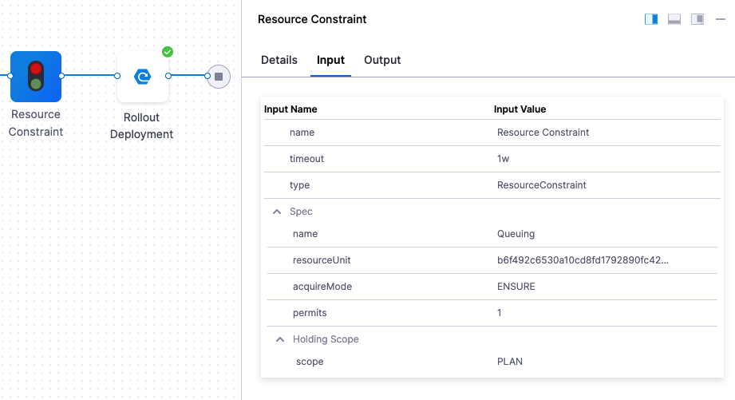

This topic describes how pipeline resource constraints prevent multiple pipelines or stages from requesting the same deployment environment resources at the same time.

Harness automatically adds Resource Constraints to every stage, but it's important to understand how it works and how it can be disabled.
​

Harness provide multiple options for controlling resource usage and protecting capacity limits. 

See [Controlling Resource Usage with Barriers, Resource Constraints, and Queue Steps](./controlling-deployments-with-barriers-resource-constraints-and-queue-steps.md).

## Resource Constraints Summary

Harness will only allow one Stage to deploy to the same Service and Infrastructure Definition combination at the same time. The Stages are typically in different Pipelines, but Resource Constrain also apply to Stages in the same Pipeline run in parallel.

Harness queues deployments to ensure that two Service and Infrastructure Definition combinations are not deploying at the same time.

Once the first Stage in the queue is done deploying, the next Stage in the queue can deploy to that Service and Infrastructure Definition combination.

You can also view the number of deployments that are queued, and access their execution links by hovering over the **Resource Constraint** step.

## Disabling Resource Constraints

If you want to allow multiple Pipelines to deploy to the same Infrastructure simultaneously, enable the **Allow simultaneous deployments on the same infrastructure** option in the Stage's **Infrastructure** settings.
