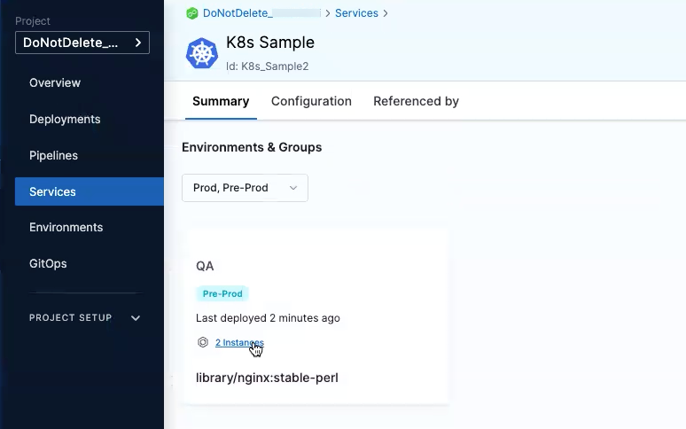
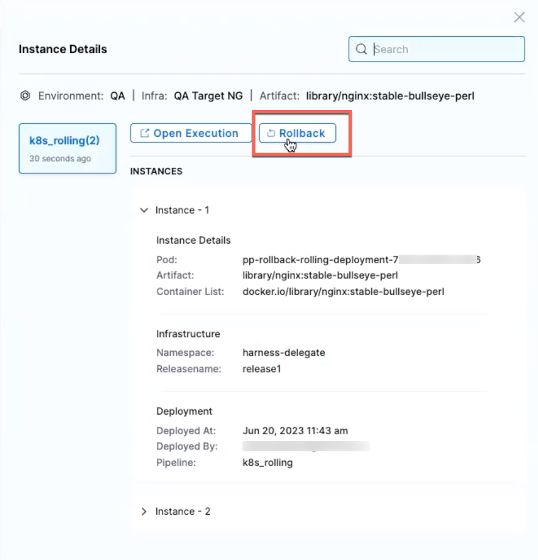
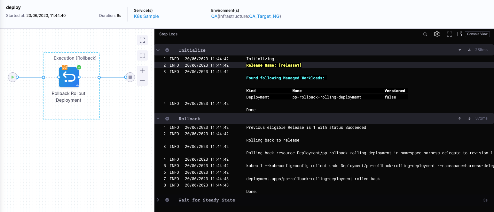
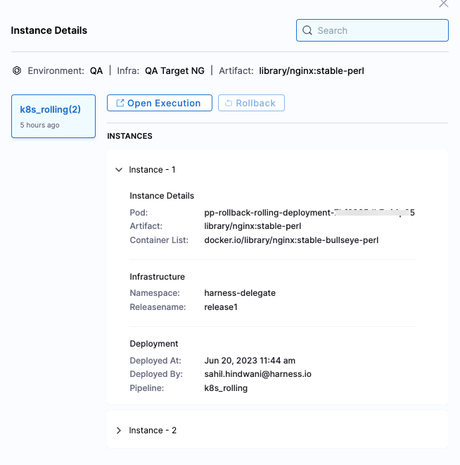

:::info

Currently, this feature is behind the feature flag `POST_PROD_ROLLBACK`. Contact [Harness Support](mailto:support@harness.io) to enable the feature.

:::

Post deployment rollback initiates a rollback of your most recent successful deployment. This allows rapid, predictable recovery from a deployment that succeeded on technical criteria, but that you want to roll back for other reasons.

## Important notes

* Post deployment rollback is currently supported for the following deployment types only: 
  - Kubernetes
  - AWS Auto Scale Group (ASG)
  - Tanzu Application Services (TAS)
  - Amazon Elastic Container Service (ECS)
  - Native Helm

    Harness anticipates expanding this feature to other deployment types in the future.
* You can rollback successful pipelines only. The rollback option is not available for failed pipelines.
* Only the rollback steps that are part of the stage can be used during rollback.
* You cannot roll back the same pipeline multiple times. You can perform rollback if the pipeline is executed again.
* If the pipeline configuration has changed between executions, the previous execution YAML is used as reference to roll back.
* Rollback steps can use expressions that refer to steps executed during the previous pipeline execution. The expressions are automatically resolved with values from the original execution.
* The stages should roll back in reverse order when  deployment rollback is triggered. 

## Roll back deployments

For post deployment rollback, Harness assumes that you have created a pipeline with multiple deployments so that the rollback steps can roll the pipeline back to the last successful deployment. 

For more details on creating a pipeline, go to [Create your first CD pipeline](/tutorials/cd-pipelines/kubernetes/manifest).

1. Open your [services dashboard](/docs/continuous-delivery/monitor-deployments/monitor-cd-deployments#individual-service-dashboards).
2. In **Summary**, in the **Environments & Groups** panel, select the deployment you want to roll back, and then select the **instances** link.
   
   Here's an example pipeline where the artifacts, `library/nginx:stable-perl` is deployed first, and `library/nginx:stable-bullseye-perl` is deployed next.

   
3. In **Instance Details**, select **Rollback**.
   
   

   Here, you're rolling back the deployed instance with the artifact `library/nginx:stable-bullseye-perl` to the previously deployed instance with artifact `library/nginx:stable-perl`.
4. In the **Rollback infrastructure** dialog, select **Confirm**.
   
   The pipeline execution for rollback stage appears in a new tab.

     

   Once the rollback is complete, your deployed instances will return to the state they were in before the most recent deployment.

   
