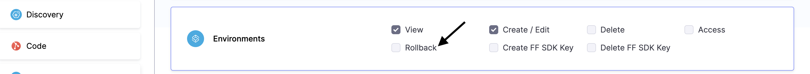
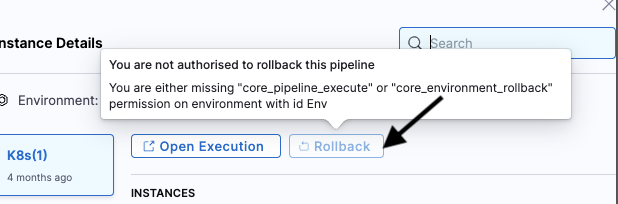
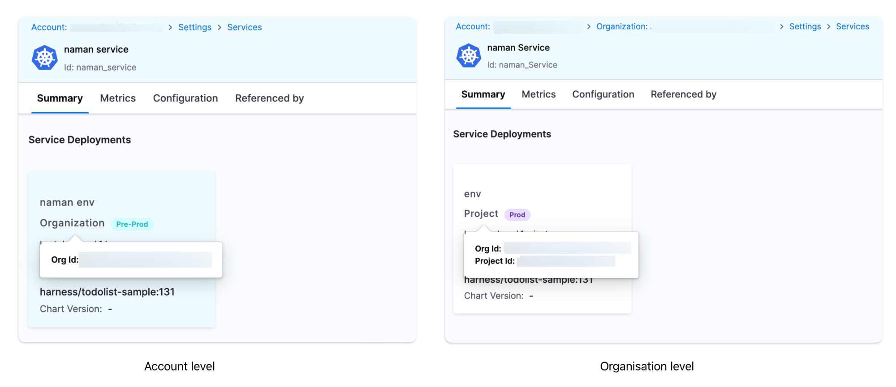
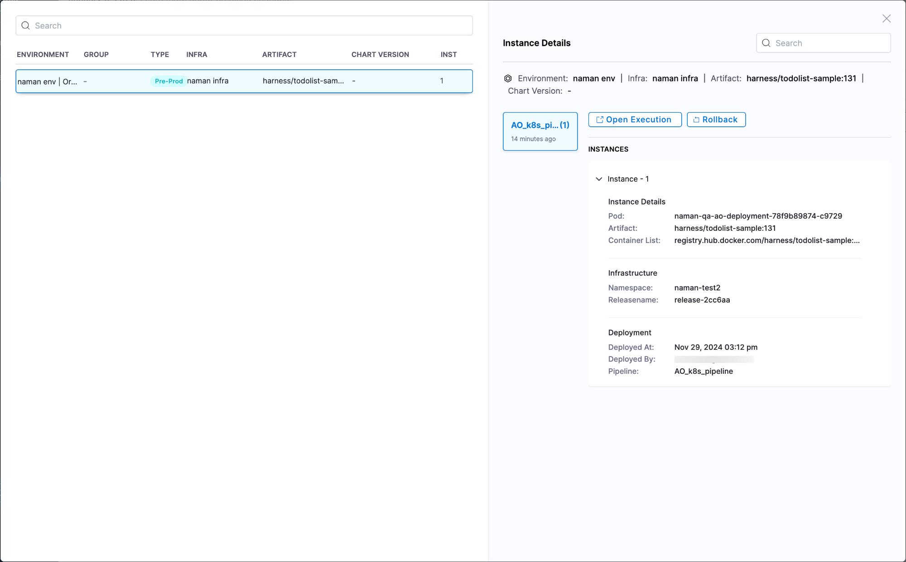
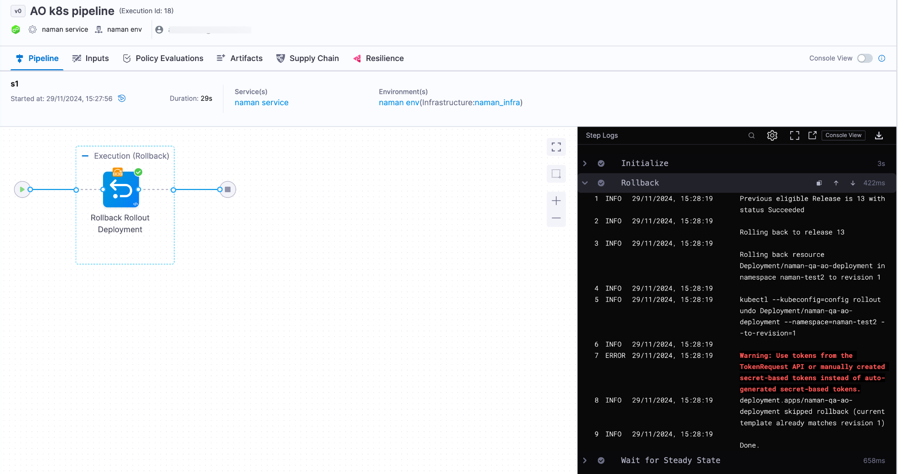

Post deployment rollback initiates a rollback of your most recent successful deployment. This allows rapid, predictable recovery from a deployment that succeeded on technical criteria, but that you want to roll back for other reasons.

## Important notes

* Post deployment rollback is currently supported for the following deployment types only: 
  - Kubernetes
  - AWS Auto Scale Group (ASG)
  - Tanzu Application Services (TAS)
  - Amazon Elastic Container Service (ECS)
  - Native Helm

    Harness anticipates expanding this feature to other deployment types in the future.
* Alternatively, for unsupported deployment types like **SSH deployments**, users can get the previous version and create a new forward deployment with the required version of the artifact and the manifest.
* You can rollback successful pipelines only. The rollback option is not available for failed pipelines.
* Only the rollback steps that are part of the stage can be used during rollback.
* You cannot roll back the same pipeline multiple times. You can perform rollback if the pipeline is executed again.
* If the pipeline configuration has changed between executions, the previous execution YAML is used as reference to roll back.
* Rollback steps can use expressions that refer to steps executed during the previous pipeline execution. The expressions are automatically resolved with values from the original execution.
* The stages should roll back in reverse order when  deployment rollback is triggered.
* Rolling back to a previous post-production deployment is only possible for executions that occurred within the past 30 days.
* You cannot roll back an execution if it is marked successful by the ignore failures failure strategy.

## Roll back deployments at Project Level

For post deployment rollback, Harness assumes that you have created a pipeline with multiple deployments so that the rollback steps can roll the pipeline back to the last successful deployment. 

For more details on creating a pipeline, go to [Create your first CD pipeline](/docs/continuous-delivery/get-started/cd-tutorials/manifest).

1. Open your [services dashboard](/docs/continuous-delivery/monitor-deployments/monitor-cd-deployments#individual-service-dashboards).
2. In **Summary**, in the **Environments & Groups** panel, select the deployment you want to roll back, and then select the **instances** link.
   
   Here's an example pipeline where the artifacts, `library/nginx:stable-perl` is deployed first, and `library/nginx:stable-bullseye-perl` is deployed next.

   
3. In **Instance Details**, select **Rollback**.
   
   

   Here, you're rolling back the deployed instance with the artifact `library/nginx:stable-bullseye-perl` to the previously deployed instance with artifact `library/nginx:stable-perl`.
4. In the **Rollback infrastructure** dialog, select **Confirm**.
   
   The pipeline execution for rollback stage appears in a new tab.

     

   Once the rollback is complete, your deployed instances will return to the state they were in before the most recent deployment.

   

### Permissions required for Post Deployment Rollback

To perform Post Deployment Rollback, user must have following permissions:-

1. Pipeline **Execute** permission. 
2. Environment **Rollback** permission.

:::info

A user will be allowed to execute rollbacks on any instance only if they possess these two specified permissions for the pipeline and environment through which deployment occurred. Otherwise, they will be presented with the following message when attempting to click **Rollback***.

:::

## Roll Back Deployments at Account Level and Organisation Level

Users can perform service rollbacks at both the account and organisation levels using **Service Dashboards**.

1. For an Account Level overview, navigate to Account Settings, then Services.
For an Organisation Level overview, navigate to Organisation Settings, then Services.
2. Select the service for which you want to perform a rollback. You can also use the search bar to simplify your search.
3. In the Summary tab, you can view all the service deployments performed at the account or organisation level.

4. To distinguish between environments, hover over the Organisation/Project in the card to view the org_id and project_id of the service deployment.
You can view the deployments in the Environment, Artifacts, or Charts view.

5. Click on View Instance and Rollback.
All executions will be displayed along with their environment details.
You can only perform a rollback in the Environment view.

6. Select the deployment for which the rollback is to be performed, and click Confirm to initiate the rollback.

You will be directed to the pipeline execution page, and the Rollback Rollout Step will be executed.

Similarly, users can perform service rollbacks at both the account and organisation levels using **Environment Dashboards** by following the same set of procedures.

1. For an Account Level overview, navigate to Account Settings, then Environments.
For an Organisation Level overview, navigate to Organisation Settings, then Environments.

The rest of the steps remain the same as those outlined for the Service Dashboards.

### Permissions Required for Post-Deployment Rollback

To perform a Post-Deployment Rollback, the user must have the following permissions:

1. Pipeline **Execute** permission for the specific pipeline.
2. Environment **Rollback** permission.

A user will only be allowed to execute rollbacks on any instance if they possess these two permissions for the pipeline and environment through which the deployment occurred. Otherwise, they will see the following message when attempting to click Rollback.