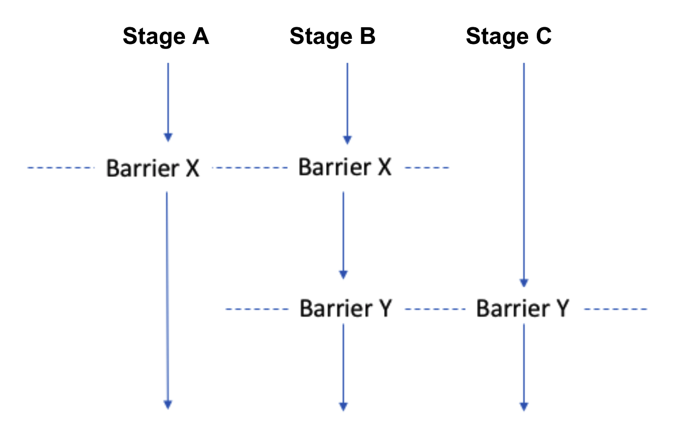
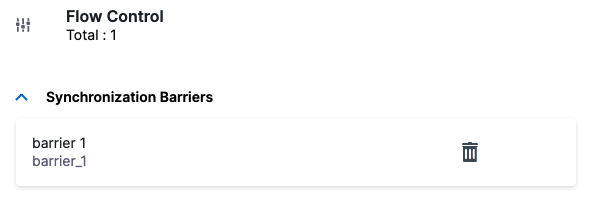
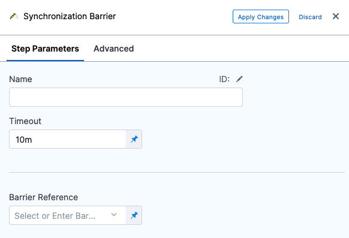

This topic describes how to synchronize stages and [step groups](../x-platform-cd-features/cd-steps/step-groups.md) in your pipeline using barriers.

:::note

Harness provides multiple options for controlling resource usage and protecting capacity limits. See [Controlling Resource Usage with Barriers, Resource Constraints, and Queue Steps](./controlling-deployments-with-barriers-resource-constraints-and-queue-steps.md).

:::

## Important notes

* You cannot use barriers with [Matrix, Looping, and Repeat](https://developer.harness.io/docs/platform/pipelines/looping-strategies-matrix-repeat-and-parallelism) strategies. 

## Barriers and Synchronization

When deploying interdependent services, such as microservices or a large and complicated application, there might be a need to coordinate the timing of the different components' deployments. A common example is the need to verify a group of services only after *all the services* are deployed successfully.

Harness address this scenario using Barriers. Barriers allow you to synchronize different stages and step groups in your Pipeline, and control the flow of your deployment systematically.

Barriers have an effect only when two or more stages/step groups use the same barrier name (**Barrier Reference** setting in the Barrier step), and are executed in parallel in a Pipeline. When executed in parallel, both stages/step groups will cross the barrier at the same time.

If a stage/step group fails before reaching its barrier point, the stage/step group signals the other stages/step groups that have the same barrier, and the other stages/step groups will react as if they failed as well. At that point, each stage/step group will act according to its [Define a Failure Strategy on Stages and Steps](/docs/platform/8_Pipelines/define-a-failure-strategy-on-stages-and-steps.md).

Here's a visualization of three stages run in parallel using Barriers. Stages A and B will wait for each other to reach Barrier X and Stages B and C will wait for each other to reach Barrier Y.

## Add Barrier

A barrier is simply a name added in a Pipeline's **Flow Control** settings.

1. In your Pipeline, click **Flow Control**.
   
   
2. In **Flow Control**, click **Add Barrier**.
   
   
3. In **Barrier Name**, enter a unique name, and then click outside of the settings. The barrier is created.
   
   

Next, the name is selected using the **Barrier** step in the stages where you want to synchronize.

## Step 2: Configure Barrier

To apply a barrier, do the following:

1. In your stage, in **Execution**, click **Add Step**, and then click **Barrier**.
   
   
2. Enter a name for the step.
3. In **Timeout**, enter the timeout period, in milliseconds. For example, 600000 milliseconds is 10 minutes. The timeout period determines how long each stage with a barrier must wait for the other stage to reach their barrier point. When the timeouts expire, it is considered a deployment failure.
4. Barrier timeouts are not hard timeouts. A barrier can fail anytime between timeout + 1min.In **Barrier Reference**, select the name of an existing barrier.
   
   
5. Click **Apply Changes**.

You cannot use a Harness variable expression in **Barrier Reference**.Now you can add another Barrier step using the same name to another stage at the point where you want to synchronize execution.

## Notes

* You can have multiple barriers in a stage/step group. Every barrier in the same stage/step group must use a unique **Barrier Reference**.
* Ensure the Barrier Reference string for each related barrier across the different stages/step groups matches.

