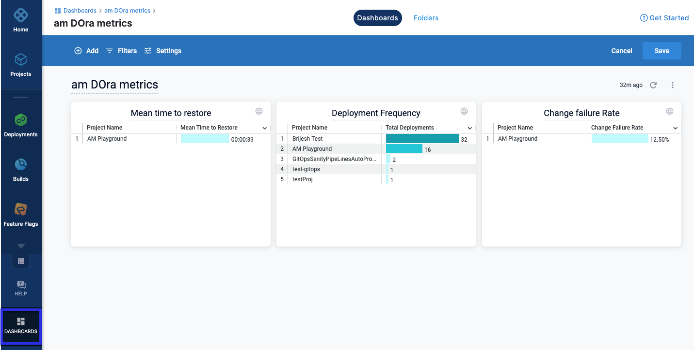
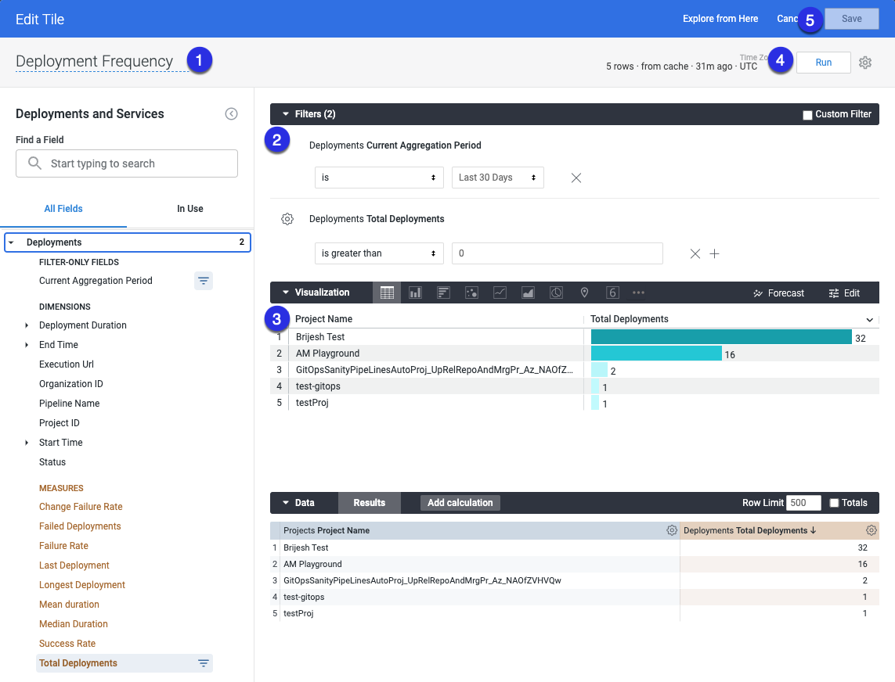
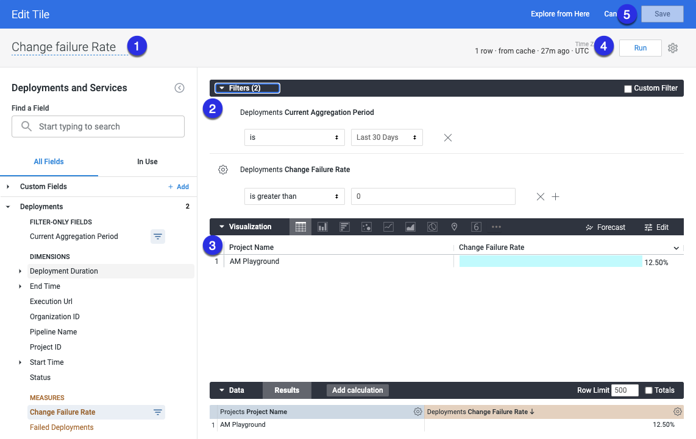
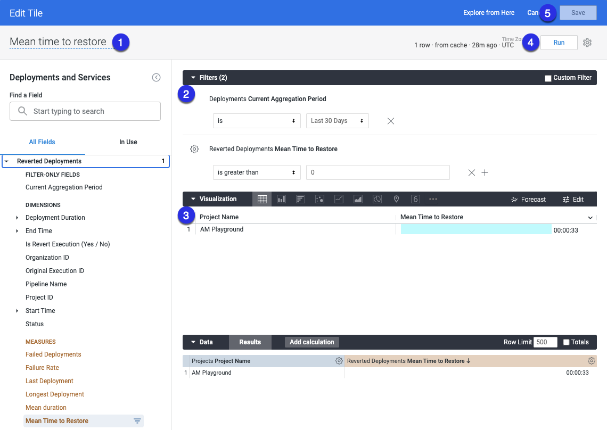

DevOps Research and Assessment (DORA) metrics is a standard measure of DevOps performance. By understanding these metrics, you can make informed decisions and implement improvements that can help your business grow.

## Create queries to pull data into your DORA dashboard

After you [create a DORA metrics dashboard](../../platform/dashboards/create-dashboards.md), you can [add tiles](/docs/platform/dashboards/create-dashboards/#step-2-add-tiles-to-a-dashboard) to the dashboard. 

You can edit, delete, resize, move postions, or download data of the tiles. 

Using the DORA metrics dashboard, you can view the following metrics.

* **Deployments Frequency** tells you how many deployments happened in a particular duration. This metric helps measure the consistency of software delivery and delivery performance. 
* **Mean Time to Restore (MTTR)** tells you the time taken to restore an issue found in the production environment.  
* **Change Failure Rate** is the percentage of failure rate across all services in a given time period. 



To gain deeper insights, you can create queries in the dashboard to capture data. Harness captures metrics for each service-environment combination within a pipeline. If you have a multi-service pipeline, metrics for each service-environment combination will be captured and reported separately.

## Deployment frequency

1. Enter a name your query. For example, Deployment Frequency. 
2. Select the following filters.
    * In **Deployments**, select **Custom Aggregation Period**, then select the time period.
    * In **Deployments**, select **Total Deployments**.
3. Configure your visualisation options. For more information, go to [create visualisation and graphs](/docs/platform/Dashboards/create-visualizations-and-graphs).
4. Select **Run**.
5. Select **Save** to save the query as a tile on your dashboard.



## Change failure rate

1. Enter a name your query. For example, Change Failure Rate. 
2. Select the following filters.
    * In **Deployments**, select **Custom Aggregation Period**, then select the time period.
    * In **Deployments**, select **Change Failure Rate**.
3. Configure your visualisation options. For more information, go to [create visualisation and graphs](/docs/platform/Dashboards/create-visualizations-and-graphs).
4. Select **Run**.
5. Select **Save** to save the query as a tile on your dashboard.



## Mean time to restore

1. Enter a name your query. For example, Mean Time to Restore. 
2. Select the following filters.
    * In **Deployments**, select **Custom Aggregation Period**, then select the time period.
    * In **Reverted Deployments**, select **Mean Time to Restore**.
3. Configure your visualisation options. For more information, go to [create visualisation and graphs](/docs/platform/Dashboards/create-visualizations-and-graphs).
4. Select **Run**.
5. Select **Save** to save the query as a tile on your dashboard.



### Use reverted executions to capture mean time to restore

Currently, Harness does not measure regressions or failures that occur after a production deployment is complete. 
 
During the pipeline deployment, if there is an issue that causes downtime, a reverted pipeline execution can restore the service.

You can mark a pipeline execution as a restored/reverted pipeline and link it to the pipeline execution that introduced the issue.

You can then use the difference between the end time of the parent execution and the end time of the reverted execution to capture mean time to restore.

To have a failed pipeline execution revert automatically, when you create a new pipeline stage, add the following tag with a runtime input (`<+input>`) to the pipeline YAML.

```
tags:
  revert_execution_id: <+input>
```

:::note

The Harness UI doesn't support runtime inputs (`<+input>`) for tags. Select the YAML view to add runtime inputs to tags. 

:::

Below is an example of a pipeline execution. The `revert_execution_id` tag represents the execution Id of the pipeline that caused the issue.

```
pipeline:
  identifier: "DOra_pipeline"
  tags:
    revert_execution_id: "Q0bizp0QTM6xtB1FZsR0zQ"
  stages:
  - stage:
      identifier: "stage1"
      type: "Deployment"
      spec:
        service:
          serviceRef: "Ser2"
        environment:
          environmentRef: "Env2"
          infrastructureDefinitions:
          - identifier: "Infra_2"
```


