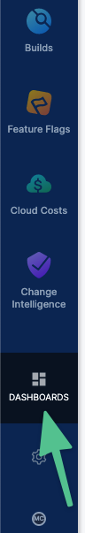
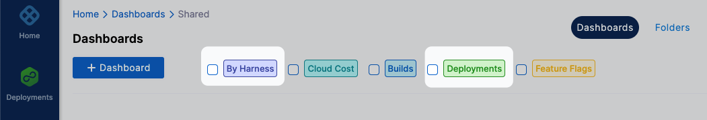
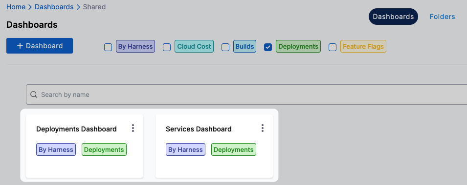
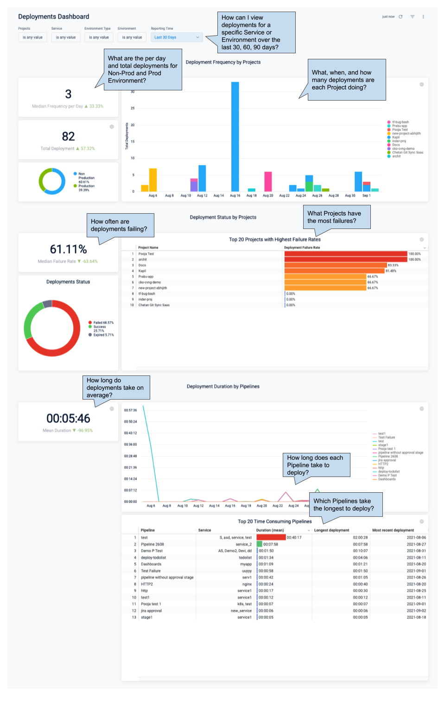
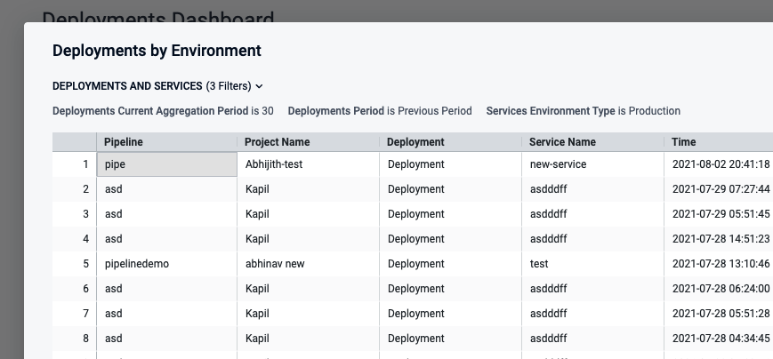
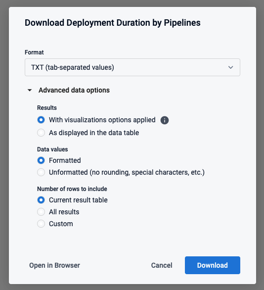
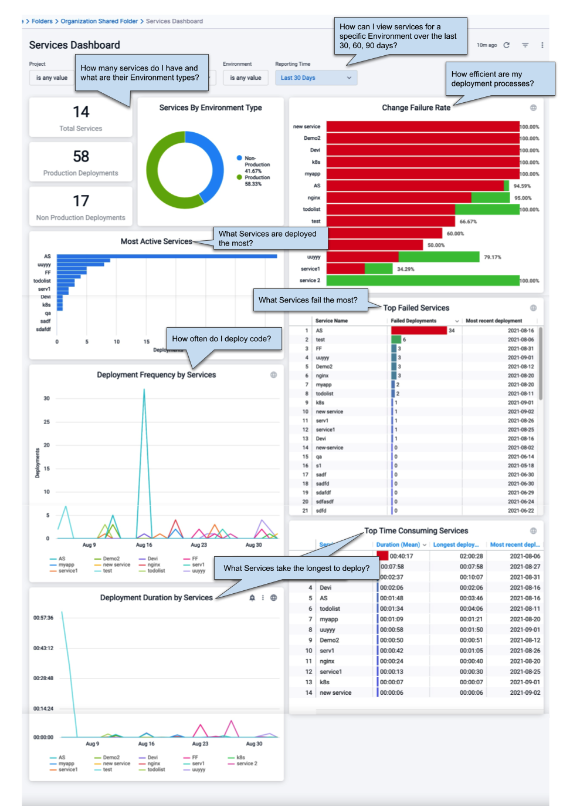
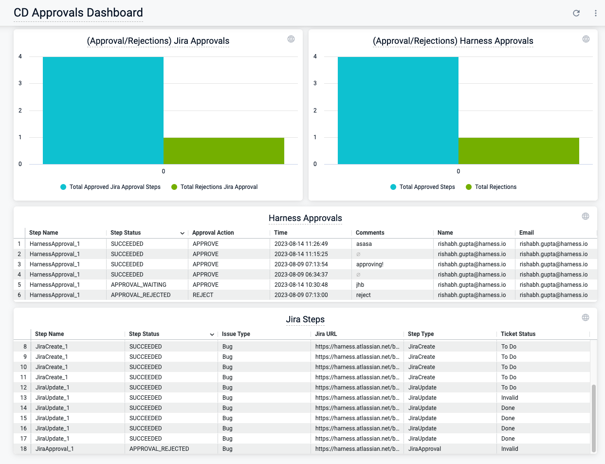
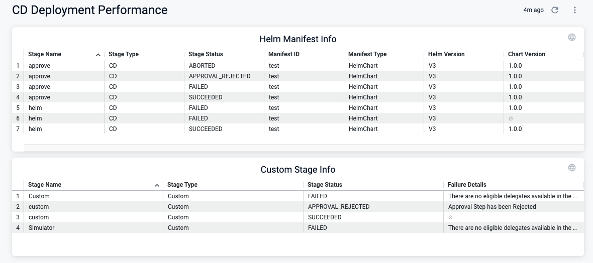

This topic describes how you can use DORA and other advanced metrics for deployments and services in CD Dashboards.

Deployments and services can be measured within the CD module (**Overview** and **Services** in the **Deployments** module), and using the Harness Platform Dashboards (**Dashboards**). Platform Dashboards also let you create highly advanced custom dashboards.

## Overview and services dashboards

Deployments are tracked in the **Overview** dashboard and services are tracked in the **Services** dashboard.

<docimage path={require('./static/monitor-cd-deployments-17.png')} width="60%" height="60%" title="Click to view full size image" />

## Overview dashboard

The Overview dashboard provides status for deployments and workloads and an overall **Deployments Health** metric:

<docimage path={require('./static/monitor-cd-deployments-18.png')} width="60%" height="60%" title="Click to view full size image" />

## Services dashboard

**What is a Harness service?** A Harness service is both a logical and configuration view of the services you deploy.

The logical view is immutable and contains a name, unique Id, and description. The configuration view can be changed with each stage of a pipeline and contains the artifacts, manifests, repo URLs, etc., for that stage's deployment of the service.

**What is a service instance in Harness?** Harness licensing is determined by the service instances you deploy. A service instance is when you use Harness to deploy the service and the underlying infrastructure for the instance. For example, an instance of a Kubernetes workload where Harness creates the pods.

The **Services** dashboard provides an overview of all the services and service instances in your project:

<docimage path={require('./static/monitor-cd-deployments-19.png')} width="60%" height="60%" title="Click to view full size image" />

## Individual service dashboards

:::note

Currently, the following service dashboard functionality is behind the feature flag `CDC_SERVICE_DASHBOARD_REVAMP_NG`. Contact [Harness Support](mailto:support@harness.io) to enable the feature.

:::

Click a service in the **Total Services** table to drill down and show more service details:

<docimage path={require('./static/eebdfe6a596f69e0fd2dca49ce04dd5659094aab8d76ef38886fa905659ffac9.png')} width="60%" height="60%" title="Click to view full size image" />  

Clicking on any card in this dashboard filters the executions list to display executions relevant to the service and environment/artifact.

An individual service's dashboard includes the following features.

:::note

If you do not see the environment cards in the dashboard, you will see the message `There are no environments with instances in this service`. This appears when there are no environments with *active* instances for this services. You must perform an actual deployment to create active instances.  Active services are services that are part of any pipeline execution (deployment) over the past 30 Days.

:::

### Open tasks

The **See Open Tasks** banner will appear when there are deployments with the following statuses:

- Aborted
- Aborted by deployment freeze
- Expired
- Waiting
- Failed

Selecting **See Open Tasks** displays executions that require your attention.

The **See Open Tasks** button is only displayed if there are tasks over the last 3 days.

If the **See Open Tasks** button is not displayed, you can see all tasks using the bell icon also.

<docimage path={require('./static/9f67ae3af9c7f548f8bd9f802008e0d5d8710b167c9c4a00d4e8b611aa370401.png')} width="60%" height="60%" title="Click to view full size image" />

### Environments tab

The **Environments** tab lists the environments and environment groups where the service has been deployed by one or more pipelines.

<docimage path={require('./static/4e748162f05ea1d64ee5c64ca924fc41afe6c61fce81ccbbd7f1d32a64b40a90.png')} width="60%" height="60%" title="Click to view full size image" />  

Each environment card shows the following:

- **Latest artifact:** the latest artifact deployed by this service to this environment.
- **Drift detection:** drift detection displays any differences between the deployments to environments in an environment group. For example, in this drift detection, two environments are using different artifacts with this service:

  <docimage path={require('./static/2f326c7718023be7ad2226f2ea3adb8a8eb772b7407304d134bbb3ffc8e473ad.png')} width="60%" height="60%" title="Click to view full size image" />  

  Drift detection is helpful to detect inconsistencies. For example, when you deploy a service to an environment group and there are failures in one of the environments or someone performs a different deployment to one or more of the group's environments.

- **Instance details:** details of the instance(s) where the service was deployed.

  <docimage path={require('./static/7814890e535b27da5affb299c3bb5f38332a13a55056a2afb25b4963a17ac27c.png')} width="60%" height="60%" title="Click to view full size image" />  

  Select **Open Execution** in the instance details to see the pipeline execution that deployed the service instance.
- **Deployments:** each deployment to a selected environment or environment group. If you filter using **My Deployments** you see only those deployments that your user account initiated.

### How instance information is obtained

Harness runs a perpetual task that constantly polls for the same combination of Harness service/artifact + Harness environment + Harness infrastructure definition. The instance count and details are updated as a result of this polling.

The perpetual task is alive for 2 weeks, even after the instances are downsized/deleted.

**Deployed By** shows the email address of the Harness user that initiated the deployment.

**Deployed By** will show `AUTO_SCALED` for instances that are scaled outside of the Harness deployment. For example, if you log into the Kubernetes cluster and manually auto-scale instances.

### Artifacts tab

The **Artifacts** tab shows how the service is mapped to multiple artifacts.

<docimage path={require('./static/68c91f46f95bed7606ce6a593c8598eca5ecec3495011123113e2e5de0b55cd2.png')} width="60%" height="60%" title="Click to view full size image" />

Each artifact card shows the following:

- **Artifacts:** each artifact used in a deployment of this service.
- **Environments:** each environment where an artifact was deployed with the service. 
  - Clicking the artifact name opens details for all environments where the artifact was deployed. 
  - Clicking the environment opens details for the specific environment where the artifact was deployed.
- **Drift detection:** drift detection displays any differences between the deployments to environments in an environment group. For example, if the artifact you select was deployed to an environment group, but one of the group's environments deployed a different artifact, it is highlighted as drift:

  <docimage path={require('./static/b46ca573dd4b036c3ab5189e6edda2fd86207f6401e8337a52f365da443007a9.png')} width="60%" height="60%" title="Click to view full size image" />  

  Clicking on the environment group name will take you to that group's settings. Clicking on the execution date (in this example, `1 day ago`) will take you to the pipeline execution details.
- **Deployments:** each deployment of the service or a selected artifact. If you filter using **My Deployments** you see only those deployments that your user account initiated. 

### View in table

The **View in Table** setting shows all of the instances of the service in all of the environments used with the service. 

<docimage path={require('./static/d0bba45d5e8be50eeea30bcccbdffd4b0ed6d2900977782a2176257f53dc38ee.png')} width="60%" height="60%" title="Click to view full size image" /> 

Select **Open Execution** in the instance details to see the pipeline execution that deployed the service instance.

### Custom sequencing

In the **Environment** tab, you can use **Custom Sequence** to arrange the environment cards.

To use custom sequencing, do the following:

1. Select the **Environments** tab.
2. Select the gear icon next to **Custom Sequence**.
   
   <docimage path={require('./static/11ceac73896d71cbde9774efb01e64a8e42cc7d3f9470181116e58f809a91bd5.png')} width="60%" height="60%" title="Click to view full size image" />  

3. In **Environment Sequence**, reorder the environment/group to create the sequence you want.
4. Select **Save**.

  Now the environment cards are reordered. 
  
  You can disable custom sequencing by toggling it off.

## Platform Dashboards

The account-wide Platform Dashboards in Harness contain built-in dashboards that provide advanced details about your deployments and services.

You can also create your own custom dashboards describing dimensions, aggregates, calculations, and data relationships.

The Platform Dashboards use [LookML](https://docs.looker.com/data-modeling/learning-lookml/what-is-lookml), a dependency-tracking tool that provides predefined data types and syntax for data modeling.

### Built-in CD Dashboards

Currently, there are two built-in CD Dashboads: **Deployments** and **Services**.

To view these dashboards, in Harness, click **Dashboards**.

In **Dashboards**, click **Deployments** or **By Harness**.

Look for **Deployments Dashboard** and **Services Dashboard** in the dashboards that appear.

Let's look at each dashboard.

#### Deployments

The Deployments dashboard provides deployment frequency, status, and duration data in detail:

Clicking on data points, service names,  or project names brings up data tables.

Click on the Pipeline or Deployment and a new browser tab opens with the Pipeline or deployment from the record.

All data can be downloaded in multiple formats with multiple options.

#### Services

The services dashboard lets you measure the efficiency of your service deployments by Environment and overall.

### Custom CD Dashboards

You can create custom CD dashboards that visualize deployment data by different dimensions and measures.

Here's a quick video showing how to create a CD custom dashboard:

<!-- Video:
https://www.youtube.com/watch?v=9fqbYP6iK3g-->
<docvideo src="https://www.youtube.com/watch?v=9fqbYP6iK3g" />

See [Create Dashboards](../../platform/18_Dashboards/create-dashboards.md).

### Monitor Harness and Jira approvals using custom CD dashboards

Harness CD includes an extensive set of dashboard components that provide visibility into your Harness and Jira approvals. You can create custom dashbards that quickly answer questions such as:

* Which Harness and Jira Approval steps are currently waiting for approval?
* Which Jira Create and Update steps failed, and when?  
* Which Jira tickets have been rejected in the Jira Approval step? 
* Which deployments resulted in new or updated Jira tickets?
* How many approvals and rejections occurred in the specified time window? 

:::note Important notes

- Currently, this feature is behind the Feature Flag `CDS_STEP_EXECUTION_DATA_SYNC`. Contact [Harness Support](mailto:support@harness.io) to enable the feature.

- Dashboard components for ServiceNow approvals are not currently available. 

:::

<figure>

<figcaption>CD approvals dashboard - example</figcaption>
</figure>

You can use the following components to monitor the performance of your deployment pipelines:

- Harness Approval

  - Step type

  - Duration

  - Status

  - Approver

  - Error messages

  - Approval message

- Jira Approval

  - Step type

  - Issue Type

  - Jira Ticket URL (or issue key and project if the URL is unavailable)

-  JIRA Create/Update

   - Step type

   - Duration

   - Status

   - Error messages

   - Jira Ticket URL

   - Ticket Status

### Monitor deployment performance using custom CD dashboards

Harness CD includes an extensive set of dashboard components that provide visibility into the performance of your deployment pipelines. You can create custom dashboards to answer questions such as:

* Which stages and steps contain performance bottlenecks? 

* Which stages and steps have the most failures? 

* How much time is spent deploying artifacts vs. waiting for Jira approvals and other manual interventions? 

:::note
This feature is behind the feature flag `CDS_CUSTOM_STAGE_EXECUTION_DATA_SYNC`. Contact [Harness Support](mailto:support@harness.io) to enable the feature.
:::

<figure>

<figcaption>CD deployment performance dashboard - example</figcaption>
</figure>

You can use the following components to monitor the performance of your deployment pipelines: 

- Manifest data (only for HelmChart Manifest type for Helm/K8s deployments)

  - Helm version 

  - Chart Version

  - Manifest identifier

- Custom Stage Details

  - Stage type

  - Duration

  - Status

  - Failure message
