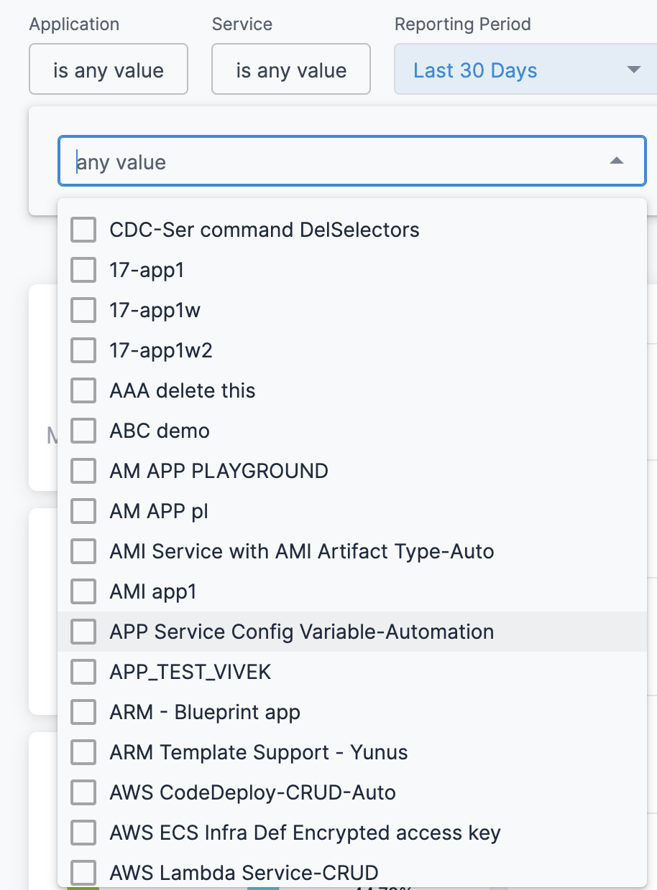
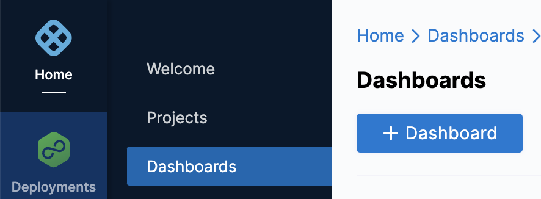

This topic describes how to view the Deployments (FirstGen) Dashboard and get more information about that data.

:::note

Currently, this feature is behind the Feature Flags `TIME_SCALE_CG_SYNC` and `CUSTOM_DASHBOARD_V2`. Contact [Harness Support](mailto:support@harness.io) to enable the feature.

:::

The **FirstGen** custom dashboards in Harness NextGen display information for your Harness FirstGen deployments. See [Harness FirstGen vs Harness NextGen](../../getting-started/harness-first-gen-vs-harness-next-gen.md).

Dashboards help you model and analyze business metrics and operational data. You can use this data to make data-driven business decisions. Using charts, data tables, and filters, Dashboards help you get the most useful deployments data.

Harness provides pre-loaded **By Harness** (pre-defined) and **Custom** (user-defined) Dashboards to visualize deployments data across your Applications, Services, and Environment. Using the **Deployments (FirstGen) Dashboard** you can:

* Discover new analytical insights into your deployment frequency by Application and Pipeline
* Track deployment status across different zones and time range in a logical and structured manner
* View your deployments at a glance, understand the applications with the highest failure rate, analyze deployment status, etc.

## Prerequisites

Ensure that you have enabled the following feature flags in the same order:

* TIME\_SCALE\_CG\_SYNC
* CUSTOM\_DASHBOARD\_V2

Contact [Harness Support](mailto:support@harness.io) to enable the feature.

## Step: View Deployments Dashboard

Perform the following steps to view CG Dashboard:

1. In Harness FirstGen, click **Custom** **Dashboards Next Gen**.
2. In **Dashboards**, select **By Harness** and click **Deployments (FirstGen)**.
   
   
   
   The Deployments (FirstGen) Dashboard is displayed.
3. In **Application**, select the Application(s) for which you want to view and analyze the data.
   
   

4. In **Service**, select the Service(s) for which you want to view and analyze the data.
   
   

5. Select **Reporting Period** to filter the data based on pre-defined time range filters. The available filters are:
	* Last 1 Day
	* Last 7 Days
	* Last 30 Days
	* Last 90 Days
	* Last year
6. In **Env Type**, select the environment where your applications and services are hosted.
   
   

7. Once you have made all your selections, click **Update**. The data is refreshed with the latest data from the database.
   
   

8. Hover on the chart to see the deployment status details.
   
   

9.  In **Deployment Frequency by Application**, hover on the chart to view the deployment frequency by Application.
    
	

	1. You can further drill into the deployment details **by Time**:
   
   
   
   The deployment details by Application are displayed.
   
   

10. In **Deployment Duration by Pipeline**, hover on the chart to view the deployment duration by Pipeline.
    
	

	1. You can further drill into the deployment details **by Time**:
	
	
	
	The deployment duration details by Pipeline are displayed.
	
	

## Clone a Dashboard

To clone a Dashboard, do the following:

1. In **Dashboards**, select **By Harness** and click **Deployments (FirstGen) Dashboard**.
2. Click the three-dot menu in the upper right of the dashboard and click **clone**.
   
   

## Example: Deployments and Services Dashboard

Here's an example that explains how you can create your own Dashboard to view your Deployment and Services data.

1. In Harness, click **Dashboards**.
2. In **Dashboards**, click **+ Dashboard**.

   

3. In **About the Dashboard**, in **Folder**, select **Organization Shared Folder**.
4. In **Name**, enter a name for your dashboard. For example, Deployments\_test.
5. (Optional) In **Tags**, type a name for your tag and press enter to create a tag, and click **Continue**.
6. Click **Edit Dashboard**.
   
   

7. Click **Add Tile**.
   
   

8. Select an Explore to get started. An Explore is a starting point for a query, designed to explore a particular subject area. The data shown in an Explore is determined by the dimensionsand measures you select from the field picker.
	* **Dimension**: A dimension can be thought of as a group or bucket of data.
	* **Measure**: A measure is information aboutthat bucket of data.
  
  

1.  Click the Explore that corresponds to the fields you want to include in your dashboard. For example, Deployments and Services.
2.  Enter a name for your tile. This will be the name of the tile on the dashboard.
   
   

3.  Select the dimensions and measures for your query. In this example, the following filters are used to aggregate data for the last 7 days:  

	* **Deployments**: Pipeline Name, Failed Deployments, and Total Deployments
	* **Services**: Failed Service Deployments, Successful Service Deployments, and Total Service Deployments
4.  Configure your visualization options. For more information, see [Create Visualizations and Graphs](../../platform/18_Dashboards/create-visualizations-and-graphs.md).
5.  Once you have set up your query, click **Run**.
   
   

6.  Click **Save** to save the query as a tile on your dashboard.
7.  You can add multiple tiles to your Dashboard. For example, add a tile for total and failed Service Deployments in the last 7 days.
   
   

8.  Once you have set up your query, click **Run** and then click **Save**. All the tiles are added to your Dashboard.
   
   

## See Also

You can also perform the following actions on the Dashboard:

* [Use Dashboard Actions](../../platform/18_Dashboards/use-dashboard-actions.md)
* [Download Dashboard Data](../../platform/18_Dashboards/download-dashboard-data.md)
* [Create Conditional Alerts](../../platform/18_Dashboards/create-conditional-alerts.md)
* [Schedule and Share Dashboards](../../platform/18_Dashboards/share-dashboards.md)

## Next Steps

Refer to the following topics to create your own Dashboard and chart data.

* [Create Dashboards](../../platform/18_Dashboards/create-dashboards.md)
* [Create Visualizations and Graphs](../../platform/18_Dashboards/create-visualizations-and-graphs.md)
* [Add Custom Fields](../../platform/18_Dashboards/add-custom-fields.md)

