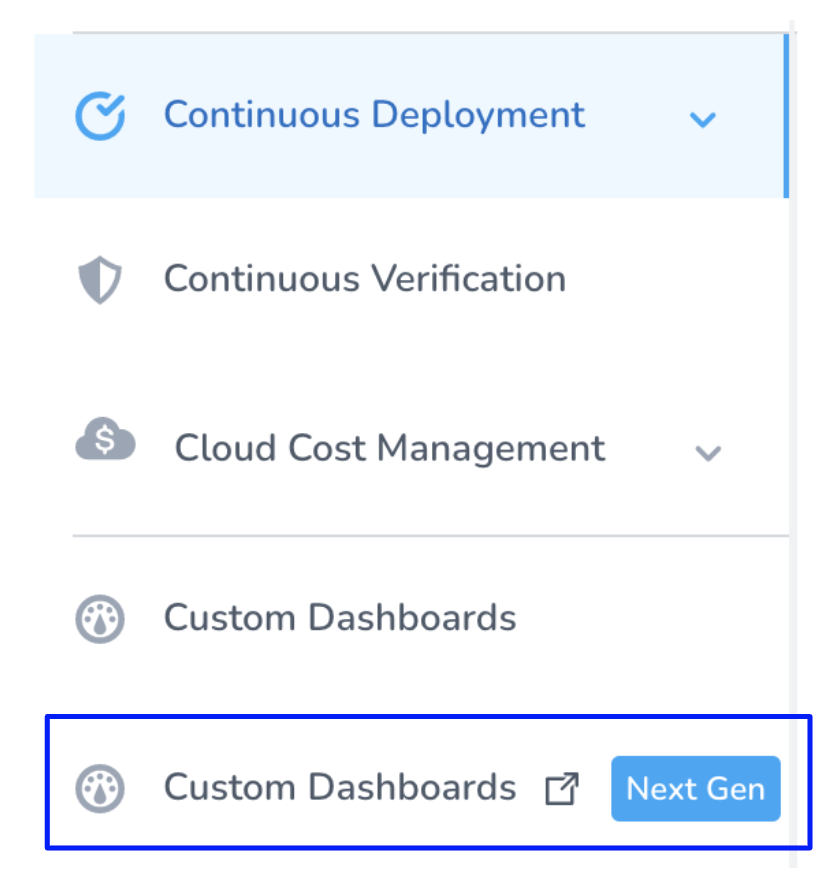
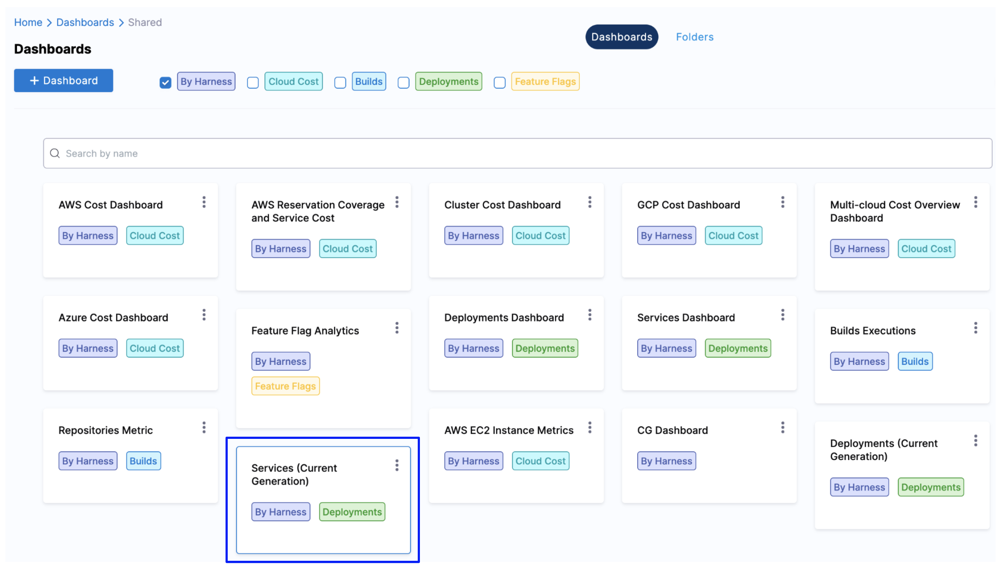

:::note

Currently, this feature is behind the Feature Flags `TIME_SCALE_CG_SYNC` and `CUSTOM_DASHBOARD_V2`. Contact [Harness Support](mailto:support@harness.io) to enable the feature.

:::

The **FirstGen** custom dashboards in Harness NextGen display information for your Harness FirstGen deployments. See [Harness FirstGen vs Harness NextGen](../../getting-started/harness-first-gen-vs-harness-next-gen.md).

Dashboards help you model and analyze business metrics and operational data. You can use this data to make data-driven business decisions. Using charts, data tables, and filters, Dashboards help you get the most useful services data.

Harness provides pre-loaded **By Harness** (pre-defined) and **Custom** (user-defined) Dashboards to visualize deployments data across your Applications, Services, and Environment. Using the **Services (FirstGen) Dashboard** you can:

* Discover new analytical insights into your Services
* Track production and non-production instances across different zones and time range in a logical and structured manner
* View your Services at a glance, understand the services with the highest failure rate, most active services, etc.

## Prerequisites

Ensure that you have enabled the following feature flags in the same order:

1. TIME\_SCALE\_CG\_SYNC
2. CUSTOM\_DASHBOARDS\_V2

Contact [Harness Support](mailto:support@harness.io) to enable the feature.

## Step: View Services Dashboard

Perform the following steps to view CG Dashboard:

1. In Harness First Generation, click **Custom** **Dashboards Next Gen**.
   
   

2. In **Dashboards**, select **By Harness** and click **Services (FirstGen) Dashboard**.
   
   
   
   The Services (FirstGen) Dashboard is displayed.
3. In **Application**, select the Application(s) for which you want to view and analyze the data.
   
   

4. Select **Reporting Period** to filter the data based on pre-defined time range filters. The available filters are:
	* Last 1 Day
	* Last 7 Days
	* Last 30 Days
	* Last 90 Days
	* Last year
5. In **Service**, select the Service(s) for which you want to view and analyze the data.
   
   

6. In **Env Type**, select the environment where your applications and services are hosted.
   
   

7. Once you have made all your selections, click **Update**. The data is refreshed with the latest data from the database.
   
   

8. Hover on the **Services by Environment Type** chart to see the Service deployments details.
   
   

9.  In **Change Failure Rate**, hover on the chart to view the service and its failure rate details.
    
	

10. In **Most Active Services**, hover on the chart to view the service and the service deployments details.
    
	

11. In **Services (Top 20) with most failures**, view the details of the top 20 services with most failures.
    
	

12. In **Deployment Duration By Service**, hover on the chart to view the service deployment duration details.
    
	
	
	1. You can further drill into the service deployment duration details **by Time**:
	
	
	
	The deployment duration by Service details for the selected time is displayed.
	
	

13. In **Deployment Frequency by Service**, hover on the chart to view the service deployment frequency details.
    
	

14. You can further drill into the service deployment frequency details **by Time**.
    
	

## Clone a Dashboard

To clone a Dashboard, do the following:

1. In **Dashboards**, select **By Harness** and click **Services (FirstGen) Dashboard**.
2. Click the three-dot menu in the upper right of the dashboard and click **clone**.
   
   

## See Also

You can also perform the following actions on the Dashboard:

* [Use Dashboard Actions](../../platform/18_Dashboards/use-dashboard-actions.md)
* [Download Dashboard Data](../../platform/18_Dashboards/download-dashboard-data.md)
* [Create Conditional Alerts](../../platform/18_Dashboards/create-conditional-alerts.md)
* [Schedule and Share Dashboards](../../platform/18_Dashboards/share-dashboards.md)

## Next Steps

Refer to the following topics to create your own Dashboard and chart data.

* [Create Dashboards](../../platform/18_Dashboards/create-dashboards.md)
* [Create Visualizations and Graphs](../../platform/18_Dashboards/create-visualizations-and-graphs.md)
* [Add Custom Fields](../../platform/18_Dashboards/add-custom-fields.md)

