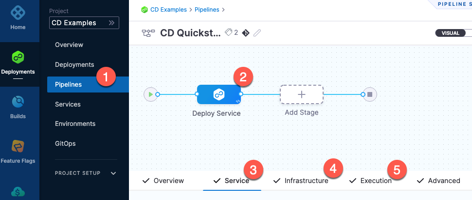
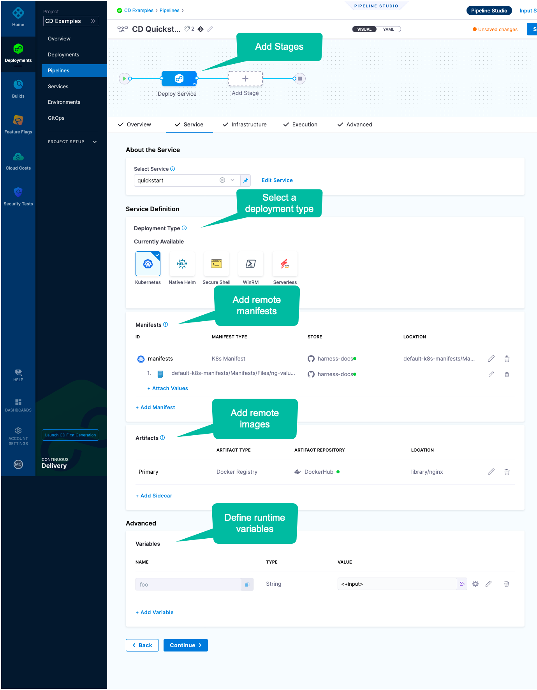
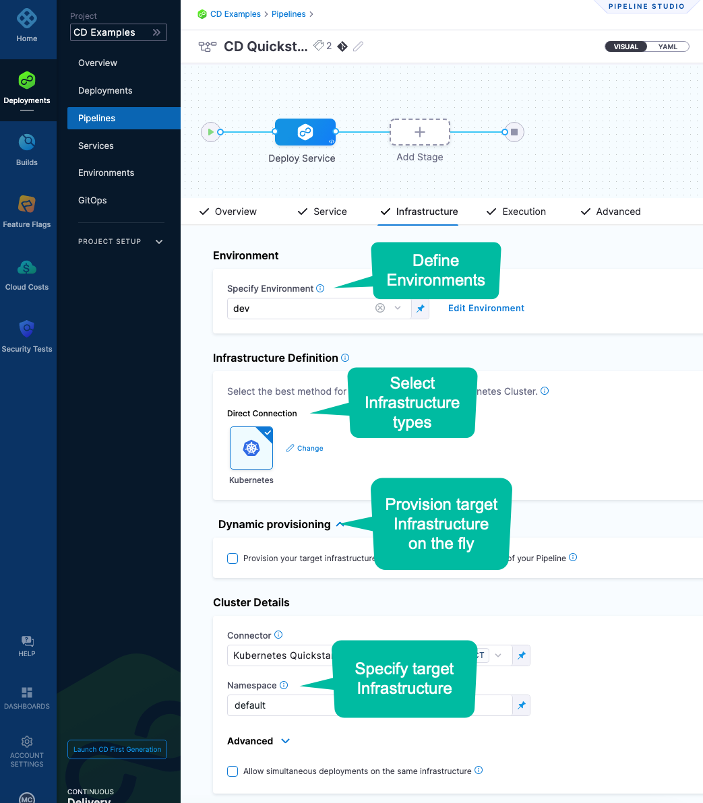
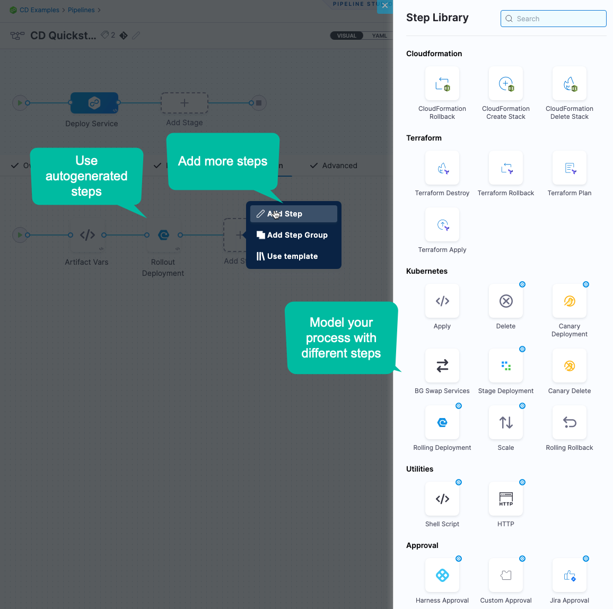
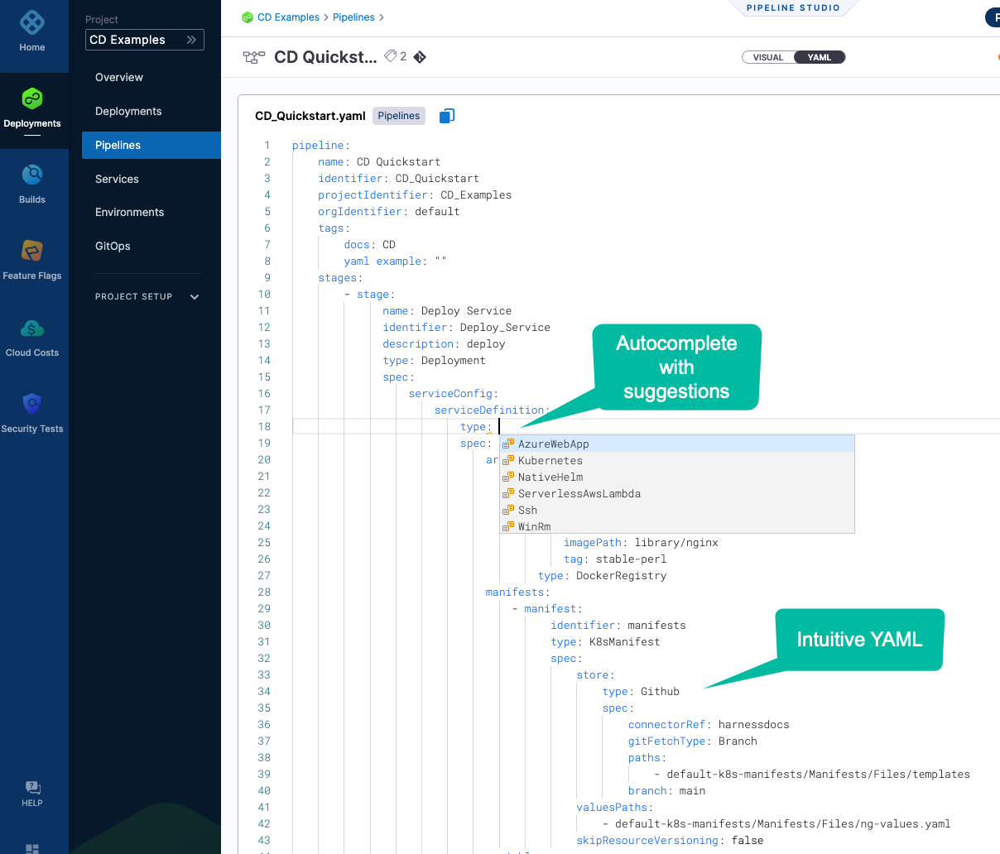
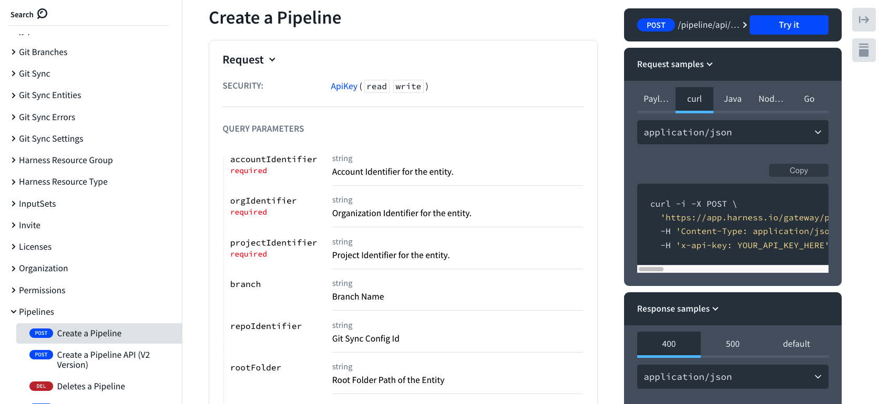
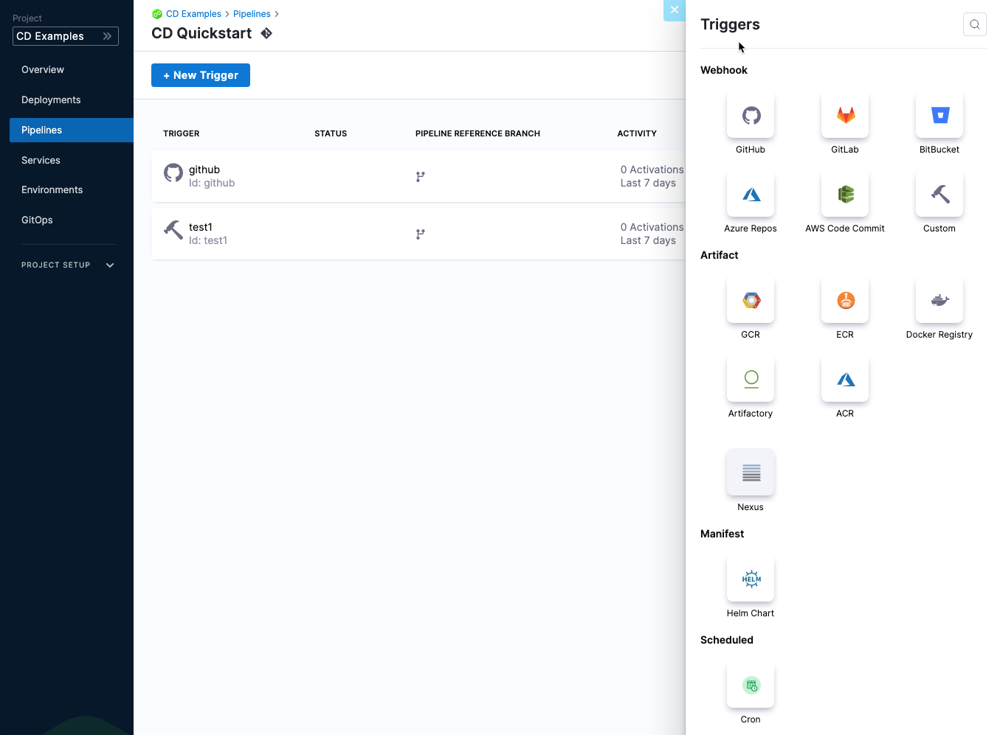
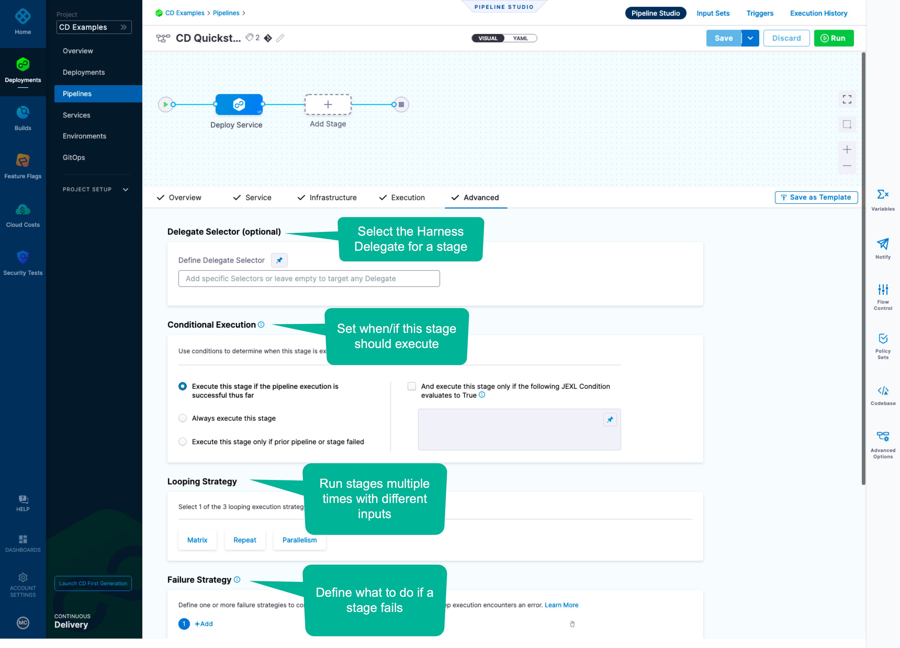
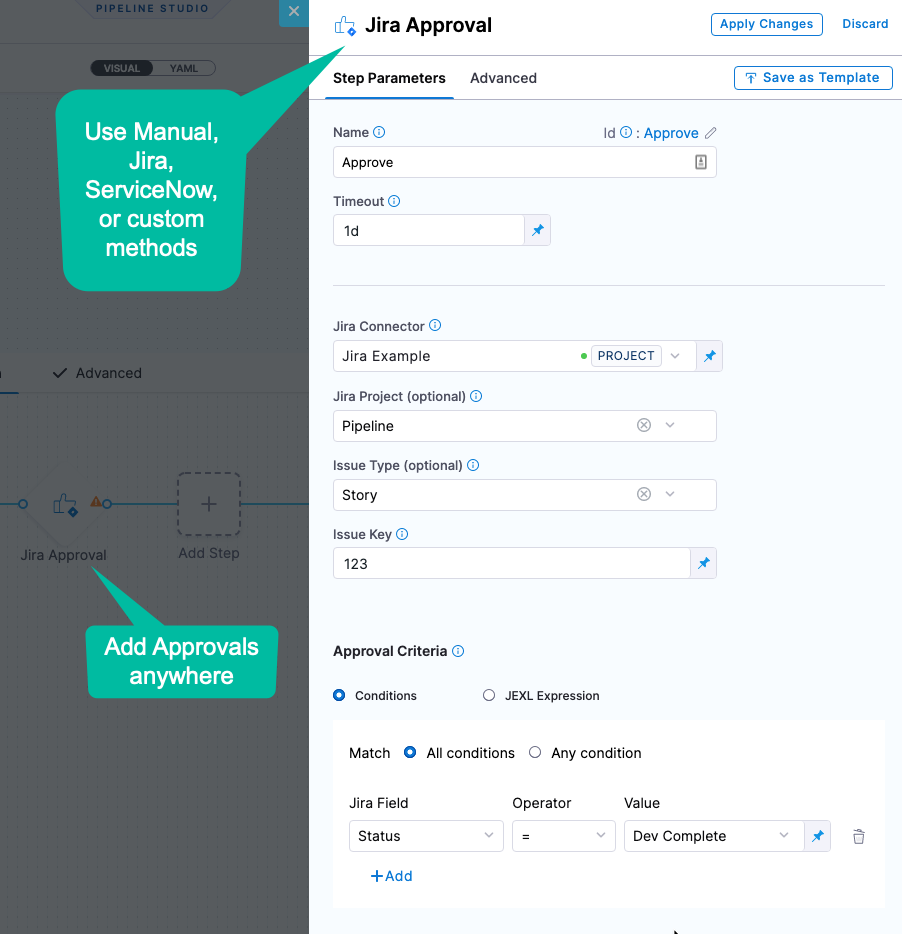
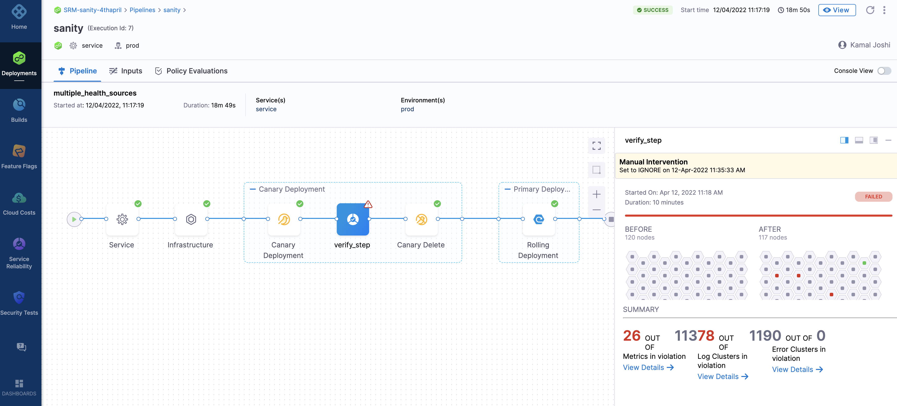

This topic describes how you use the Harness Continuous Delivery Abstraction Model.

### How do I model my CD practices in Harness?

Continuous Delivery is modeled using Pipelines and Stages.

In each Stage, you define **what** you want to deploy using Services, **where** you want to deploy it using Environments, and **how** you want to deploy it using Execution steps.

For example, a **Service** uses your Kubernetes manifests and Docker image, an **Environment** connects to your dev cluster, and Harness automatically generates an **Execution** using a Rolling Deployment step.

You can model visually, using code, or REST API.

#### Visual Studio

Model your process visually using a guided sequence:

| **Service** | **Infrastructure** | **Execution** |
| --- | --- | --- |
|  |  |  |

For more details, go to [Kubernetes deployment tutorial](../cd-quickstarts/kubernetes-cd-quickstart.md).

#### YAML Builder

Model your process in code using a full-featured YAML editor:

For more details, go to [Harness YAML Quickstart](../../../platform/8_Pipelines/harness-yaml-quickstart.md) and [YAML Reference: Pipelines](../../../platform/8_Pipelines/w_pipeline-steps-reference/yaml-reference-cd-pipeline.md).

#### REST API

Model your process using a full-featured REST API:

For more details, go to [Harness API Quickstart](../../../platform/16_APIs/api-quickstart.md) and [Use the Harness REST API](../../../platform/16_APIs/harness-rest-api-reference.md).

### How do I automate my CD process in Harness?

Harness Continuous Delivery provides Triggers for automating the execution of Pipelines, multiple settings for adding conditions to how the Pipeline executes and rolls back, and Approvals to ensure that Pipeline only proceed safely.

#### Triggers

Automate the execution of a Pipeline in response to changes in manifests/specs, artifacts, or on a schedule:

For more details, go to [Triggers](/docs/category/triggers).

#### Conditions

Set when, if, and how a Stage executes and what to do if it fails:

For more details, go to [Stage and Step Conditional Execution Settings](../../../platform/8_Pipelines/w_pipeline-steps-reference/step-skip-condition-settings.md).

#### Approvals

Add checks at any point in your process to ensure that deployments are safe:

For more details, see [Approvals](/docs/category/approvals).

### Verification

Harness' Continuous Verification (CV) approach simplifies verification.

Harness CV integrates with your APMs and logging tools to:

* Verify that the deployed service is running safely and perform automatic rollbacks.
* Apply machine learning to every deployment to identify and flag anomalies in future deployments.

For more details, see [Verify Deployments with the Verify Step](../../cd-execution/cv-category/verify-deployments-with-the-verify-step.md).

### Summary

This topic provided a high level overview of how you can model your software delivery process in Harness Continuous Delivery Pipelines and Stages.

For more details and example, go to:

* [CD tutorials](/docs/category/cd-tutorials)
* [CD overview and key concepts](cd-pipeline-basics.md)
* [Service-based licensing and usage for CD](service-licensing-for-cd.md)
* [Deployment concepts and strategies](../../cd-deployments-category/deployment-concepts.md)

