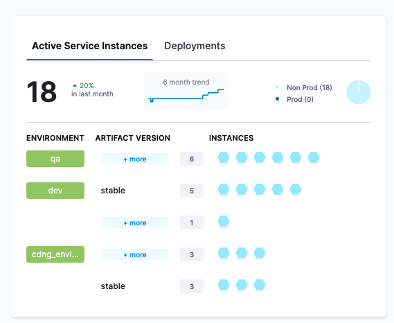
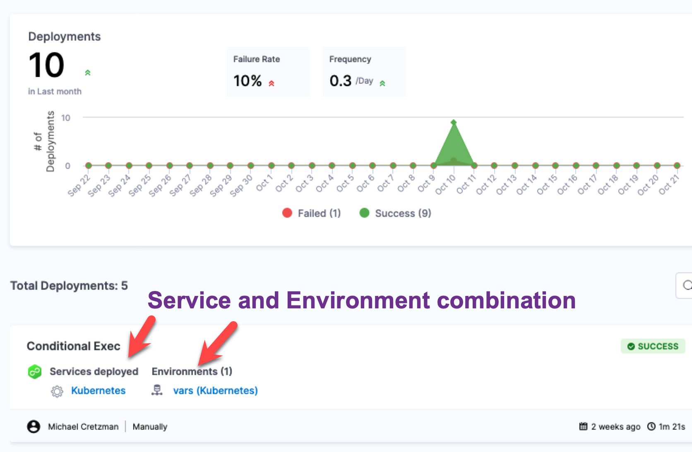

Harness uses a Service-based license model to charge Harness customers using its Continuous Delivery module.

The CD License calculation uses the Active Services count and the number of Service Instances each active Service's deployment creates.

# Active Services

Harness gets all Services that are part of any Pipeline execution (deployment) over the past **30 Days**. We call these a list of **Active Services**.

When determining Active Services, the status of the deployments does not matter. A Service is considered Active even if it was part of any failed deployments.

This includes if the Step involving a Service was skipped during a Pipeline execution.

For example, suppose a Pipeline has 4 different steps, each corresponding to a different Service: service1, service2, service3, service4.

When the Pipeline is run, Step 2 failed and the Pipeline skipped execution of Steps involving service3 and service4.

Harness still counts service3 and service4 as **Active Services** since they were part of a Pipeline execution (independent of the Pipeline execution status).

Also, the number of instances deployed does not matter here. A Service is considered Active even if the corresponding deployment(s) does not create any instance.

# Active Services vs Deployments

Active Service instances represents the active instances deployed using Harness strategies, whereas active Deployments contains all Service and Environment combinations.

# How Service-based Licensing is Calculated

For every Active Service found, Harness finds the **95th Percentile** of the number of its Service Instances across a period of 30 days.

The active CD License Usage is calculated as follows:

* Every Active Service consumes a **minimum of ONE license**.
* For every additional 20 Service Instances (95th Percentile of Service Instances across a period of 30 days), Harness adds another license for the corresponding Service.

This Service Instances count might or might not reflect the active instances as at the present time. Instead, it might reflect the 95th percentile count over last 30 days.### Example

Here's an example using 4 different Services.

| **Active Service** | **95th Percentile Active Instances** | **Licenses Consumed** |
| --- | --- | --- |
| Service 1 | 0 | 1 |
| Service 2 | 17 | 1 |
| Service 3 | 22 | 2 |
| Service 4 | 41 | 3 |

