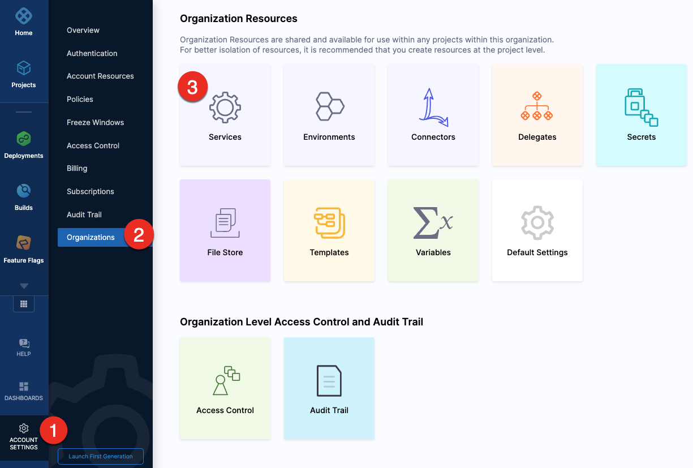
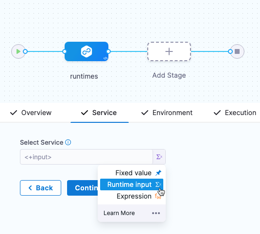
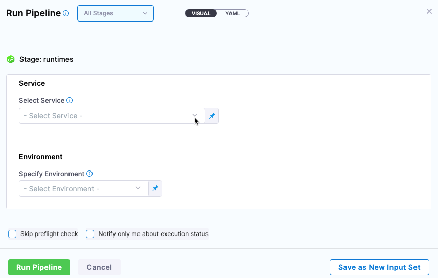

This topic describes Harness Continuous Delivery (CD) services and environments.

If you are new to Harness, please review [Harness key concepts](../../../getting-started/learn-harness-key-concepts.md) and [CD pipeline modeling overview](cd-pipeline-modeling-overview.md).

### Services and environments summary

Let's review services and environments:

* **Services represent your microservices and other workloads.**
	+ Each service contains a **Service Definition** that defines your deployment artifacts, manifests or specifications, configuration files, and service-specific variables.
* **Environments represent your deployment targets (QA, Prod, etc).**
	+ Each Environment contains one or more **Infrastructure Definitions** that list your target clusters, hosts, namespaces, etc.

Let's look at how you can create and manage services and environments.

### Creating services

Services can be created at account and organization levels or from inside or outside of a pipeline.

To create a service at an account and organization level, select **Services** in **Organization Resources**.

Creating an account level service enables you to manage the service globally across the organizations and projects within the account. 

An account level service can only reference connectors for the manifests and artifacts within the account. These services are global and cannot have dependencies at a lower hierarchy level.

Shared services can also be created and managed at account or organization levels.

:::note
When using an account level deployment stage template, you can referencing an account level service only. Similarly, for organization level stage templates, you can reference organization level services only. 

However, when using a deployment stage in a pipeline that has service configured as a runtime input, you can pick services from project, organization, or account levels to pass them as runtime inputs based on your RBAC. 

Go to [add a stage template](../../../platform/13_Templates/add-a-stage-template.md) for more information.
:::

To create a service from outside of a pipeline, you use **Services** in the navigation pane.

To create a service from inside of a Pipeline, select **New Service** in the **Services** tab of a new CD stage.

When you create the new service you define its **Service Definition**. For example, Kubernetes **Service Definition** with a Kubernetes manifest and Docker artifact.

Once the service and its service definition are saved, you can select it in any pipeline.

When you select the service in a pipeline, you can select **Edit Service** to edit its **Service Definition**.

### Creating and using environments

Environments can be created at account and organization levels or from inside or outside of a pipeline.

To create an environment at an account and organization level, select **Environments** in **Organization Resources**. 

To create an environment from inside of a pipeline, select **New Environment** in the **Infrastructure** tab of a new CD stage.

To create an Environment from outside of a pipeline, you use **Environments** in the navigation pane.

Next you can define all of its settings:

* **Infrastructure Definitions:** represent one or more environment infrastructures.
  * Infrastructure definitions are the actual clusters, hosts, etc., where Harness deploys a service.
  * For example, you might have a QA environment with separate Kubernetes clusters (infrastructure definitions) for each service you want to test.
  * You can add multiple infrastructure definitions to a single environment and select one when you add the environment to a stage.
* **Configuration:** the default environment configuration, including variables, manifests, specifications, and config files that will be used every time the environment is used in a stage.
* **Service Overrides:** override specific services. You select a service and define what will be overridden whenever that Service is deployed to this environment.
* **GitOps Clusters:** adding Harness GitOps clusters to an environment lets you select them as the deployment target in stages. For more information on Harness GitOps, go to [Harness GitOps Basics](../../cd-gitops/harness-git-ops-basics.md).

### Infrastructure definitions

Infrastructure definitions represent an environment's infrastructures physically. They are the actual clusters, hosts, namespaces, etc, where you are deploying a service.

An environment can have multiple **Infrastructure Definitions**. 

When you select an environment in a stage, you can select the **Infrastructure Definition** to use for that stage.

### Configuration

In the environment **Configuration**, you can manage the **Name**, **Description**, **Tags**, and **Environment Type** of the environment.

You can also set default manifests, specifications, config files, and variables to use whenever Harness deploys a service to this environment.

For example, a stage has a Kubernetes service with a manifest but whenever that service is deployed to the **QA** environment, the manifest in that environment's **Configuration** overwrites the namespace of with the manifest in the service with `QA`.

### Service overrides

Service overrides are different from **Environment Configuration** in the following ways:

* Environment **Configuration**: applies to every service that is used with the environment.
* Environment **Service Overrides**: applies to specific services you select. Whenever that service is used with that environment, the **Service Override** is applied.

### Override priority

When you are using environment configuration and service override to override service settings, it's important to understand the priority of the overrides.

The priority from top to bottom is:

1. Environment service overrides
2. Environment configuration
3. Service settings

### Values YAML overrides and merges

You can specify values YAML files at the environment's **Service Overrides** and **Configuration**, and the service itself.

Here is an example of specifying it at the environment's **Configuration**:

When you have a values yaml file at two or more of the environment **Service Overrides**, **Environment Configuration**, and the service itself, Harness merges the files into a single values YAML for deployment. This merging is performed at pipeline execution runtime.

Overriding occurs when the higher priority setting has the same `name:value` pair as a lower priority setting.

Let's look at two examples.

#### Merging values YAML name:value pairs

An environment's **Service Overrides** values YAML has the name:value pair `servicePort: 80` but no `replicas` name:value.

A service's **Service Definition** has a values YAML with `replicas: 2` but no `servicePort` name:value.

At runtime, the two values YAML files are merged into one.

The `servicePort: 80` from the environment **Service Overrides** values YAML is merged with the **Service Definition**'s `replicas: 2` in the values YAML:

#### Fully overriding values YAML name:value pairs

An environment's **Service Overrides** values YAML has the name:value pairs `replicas: 2` and `servicePort: 80`. 

A service's **Service Definition** has a values YAML with `replicas: 4` and `servicePort: 8080`. 

At runtime, the name:value pairs from the environment **Service Overrides** values YAML fully override the service values YAML. The `replicas: 2` and `servicePort: 80` from the environment **Service Overrides** are used.

### Config files and variables are completely overridden

Config files are a black box that can contain multiple formats and content, such as YAML, JSON, plain text, etc. Consequently, they cannot be overridden like Values YAML files.

Variables cannot be partially overridden either. They are completely replaced.

When you have **Config files** at two or more of the environment **Service Overrides**, **Configuration**, and the service itself, the standard override priority is applied.

When you have **Variables** with the same name at two or more of the environment **Service Overrides**, **Configuration**, and the service itself, the standard override priority is applied.

### GitOps Clusters

When you use Harness GitOps you can add GitOps clusters to an environment. 

To learn more about Harness GitOps, go to [Harness GitOps Basics](../../cd-gitops/harness-git-ops-basics.md). 

Next, when you create a pipeline, you can select the environment and the GitOps cluster(s) to use.

GitOps clusters are used in a PR pipeline. A PR pipeline creates and merges a Git PR on the `config.json` for a destination cluster as part of an ApplicationSet. The PR Pipeline runs, merges a change to the config.json, and a GitOps sync on the ApplicationSet is initiated.

GitOps Clusters are not used in standard CD pipelines. They're used when using GitOps only.

### Runtime inputs and expressions in services and environments

If you use runtime inputs in your services and environments, users will need to provide values for these when they run pipeline using these services and environments.

If you use expressions in your services and environments, Harness must be able to resolve these expressions when users run pipeline using these services and environments.

Select **Runtime input** for the service and environment.

When you run the pipeline, you can select the service and environment for their runtime inputs.

For more information on runtime inputs and expressions, go to [Fixed Values, Runtime Inputs, and Expressions](../../../platform/20_References/runtime-inputs.md).

### Services and environments RBAC

Please review these key RBAC uses cases for services and environments.

For extensive information on Harness RBAC, go to [Harness Role-Based Access Control Overview](../../../platform/4_Role-Based-Access-Control/1-rbac-in-harness.md) and [Harness Role-Based Access Control Quickstart](../../../platform/4_Role-Based-Access-Control/10-set-up-rbac-pipelines.md).

#### Access permission is needed to deploy to a service or environment

One of the most important advantages of services and environments is the ability to define roles that determines who can deploy them.

In order for a role to allow deployments using services and/or environments, the role must have the access permission enabled for services and/or environments.

The **View**, **Create**, **Edit**, **Delete**, and **Manage** permissions enable you to deploy a service and environment.

If a role does not have the **Access** permission for **Environments**, a user or user group assigned that role cannot deploy to any environment.

If a role does not have the **Access** permission for **Services**, a user or user group assigned that role cannot deploy any service.

#### Restrict access to specific services or environments for a user or user group

You can restrict a user or user group to using specific services and environments only. The process is the same for services and environments. 

Let's look at an example using environments.

If you want to restrict a user or user group to deploy to a specific environment only, do the following:

1. create a resource group and select the environment.
2. Create a Role and give the user or user group permissions. The **Access** permission is needed for deployments.
3. Assign the role and resource group to the user or user group.

### Environment groups

Environment groups are simple a way to group environments so you can assign permissions to multiple environments in a role.

