This topic describes Harness Continuous Delivery CD Services and Environments in Harness NextGen.

Currently, there are two versions of Services and Environments, v1 and v2. Services and Environments v1 is being replaced by Services and Environments v2, and it's important to understand their differences. This topic will cover the differences between the two versions.

:::info

For details on when service and environments v2 will become the default settings in your account, go to [Upgrade to service and environment v2](../upgrading/upgrade-cd-v2.md).

:::

If you are new to Harness, please review [Harness key concepts](../../../getting-started/learn-harness-key-concepts.md) and [CD pipeline modeling overview](cd-pipeline-modeling-overview.md).

:::note

Currently, Service and Environment v2 is behind the feature flag `NG_SVC_ENV_REDESIGN`. Contact [Harness Support](mailto:support@harness.io) to enable the feature.

:::

### Video summary

The following brief video covers the differences between the two versions of Services and Environments and goes into detail on v2.

<!-- Video:
https://www.youtube.com/watch?v=02RIvOGd0zg-->
<docvideo src="https://www.youtube.com/watch?v=02RIvOGd0zg" />

### Versions summary

Let's review Services and Environments:

* **Services represent your microservices and other workloads.**
	+ Services contain Service Definitions that list your deployment artifacts, manifests or specifications, configuration files, and Service-specific variables.
* **Environments represent your deployment targets (QA, Prod, etc).**
	+ Environments contain Infrastructure Definitions that list your target clusters, hosts, namespaces, etc.

Here are the main differences between version 1 and 2:

**v1:** 

* Management of Services and Environments (CRUD) only involves their Name, Tags, and Description. A Service's Definition (manifests, variables, etc.) and an Environment's Infrastructure (target hosts, clusters, etc.) are separate from the Service and Environment entities.
* A Service or Environment can be used in multiple pipeline stages, but a Service's Definition and an Environment's Infrastructure are tied to the stage instead of the Service and Environment entities.
* The result is that managing a Service or Environment requires managing them in every stage where they are used.

**v2:** 

* All management of Services and Environments (CRUD) is centralized in their entity definitions.
* A Service or Environment can be used in multiple stages, but a Service's Definition is part of the Service entity and an Environment's Infrastructures are part of the Environment entity.
* The result is that you can make a change to a Service or Environment and have that change reflected in every instance of that Service or Environment.

While both methods are supported currently, v2 will be the default moving forward and v1 will be deprecated in the near future.

Note: If you used [Harness FirstGen](../../../getting-started/harness-first-gen-vs-harness-next-gen.md), Services and Environments v2 in NextGen are coupled with their Service's Definition and Environment's Infrastructure just as in Harness FirstGen.

Let's look at how you can create and manage v2 Services and Environments.

#### Dynamic provisioning and Services and Environments v2

Harness Dynamic Provisioning provisions the target deployment Infrastructure on the fly as part of a CD stage's Infrastructure setup. For an example, see [Terraform Provisioning with Harness](../../cd-advanced/terraform-category/terraform-provisioning-with-harness.md).

Currently, Dynamic provisioning is supported in Services and Environments v1 only.

The current Services and Environments v2 implementation does not support dynamic provisioning yet. If you want to use dynamic provisioning, do not enable Services and Environments v2 yet. Dynamic provisioning will be supported in v2 in the near future. Standard provisioning is supported in v2.

### Creating v2 Services

Services can be created from inside or outside of a Pipeline.

To create a Service from outside of a Pipeline, you use **Services** in the navigation pane.

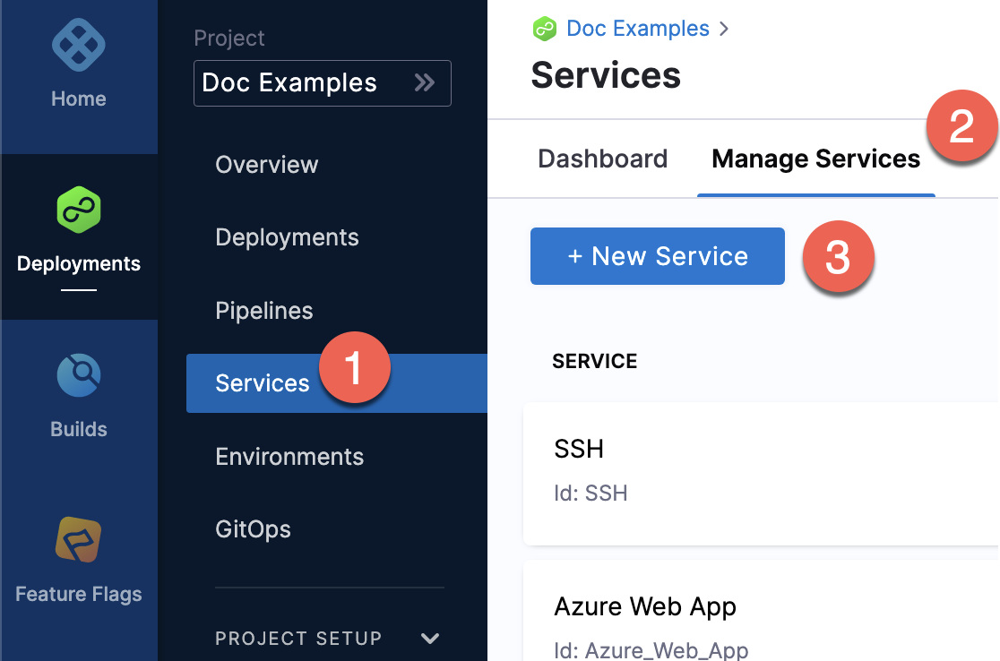

To create a Service from inside of a Pipeline, click **New Service** in the Services tab of a new CD stage.

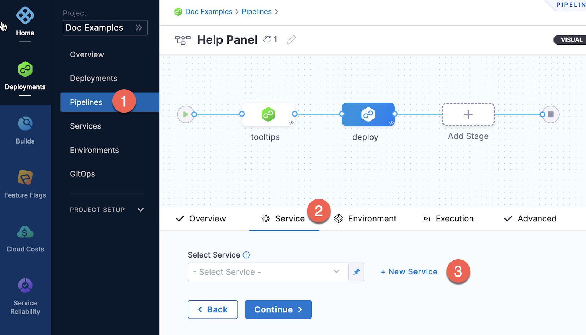

When you create the new Service you define its Service Definition. For example, Kubernetes Service Definition with a Kubernetes manifest and Docker artifact.

Once the Service and its Service Definition are saved, you can select it in any Pipeline.

When you select the Service in a Pipeline, you cannot edit its Service Definition inside the Pipeline, but you can click Edit Service to edit its Service Definition.

### Creating and using v2 Environments

Environments can be created from inside or outside of a Pipeline.

To create an Environment from inside of a Pipeline, click **New Environment** in the **Infrastructure** tab of a new CD stage. If you do this, you can only create the Environment name, tags, and type and Configuration (Manifests, Config Files, and Variables).

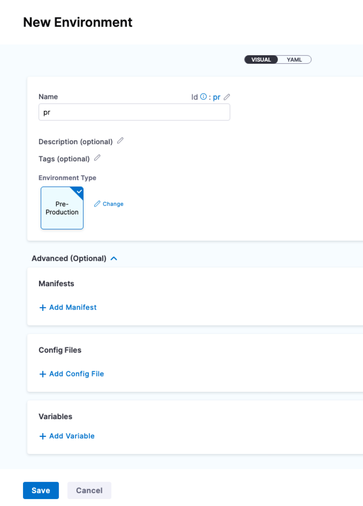

To create an Environment from outside of a Pipeline, you use **Environments** in the navigation pane.

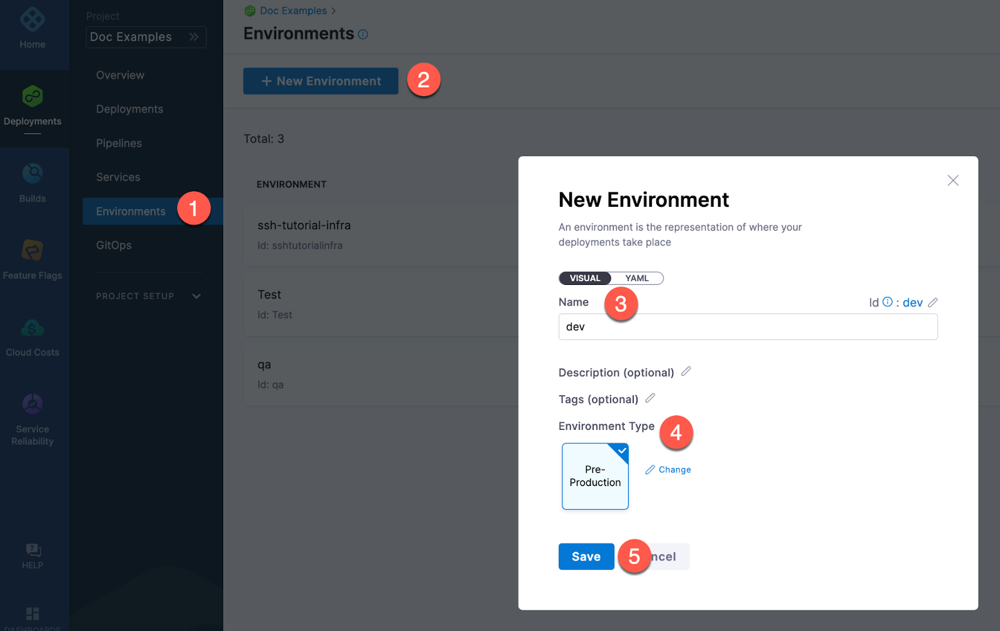

Next you can define all of its settings:

* **Infrastructure Definitions:** represent one or more Environment infrastructures.  
Infrastructure Definitions are the actual clusters, hosts, etc., where Harness deploys a Service.  
For example, you might have a QA Environment with separate Kubernetes clusters (Infrastructure Definitions) for each Service you want to test.  
You can add multiple Infrastructure Definitions to a single Environment and select one when you add the Environment to a stage.
* **Configuration:** the default Environment configuration, including variables, manifests, specifications, and config files that will be used every time the Environment is used in a stage.
* **Service Overrides:** override specific Services. You select a Service and define what will be overridden whenever that Service is deployed to this Environment.
* **GitOps Clusters:** adding Harness GitOps Clusters to an Environment lets you select them as the deployment target in stages. For more information on Harness GitOps, see [Harness GitOps Basics](../../cd-gitops/harness-git-ops-basics.md).

### Infrastructure Definitions

Infrastructure Definitions represent an Environment's infrastructures physically. They are the actual clusters, hosts, namespaces, etc, where you are deploying a Service.

An Environment can have multiple **Infrastructure Definitions**. 

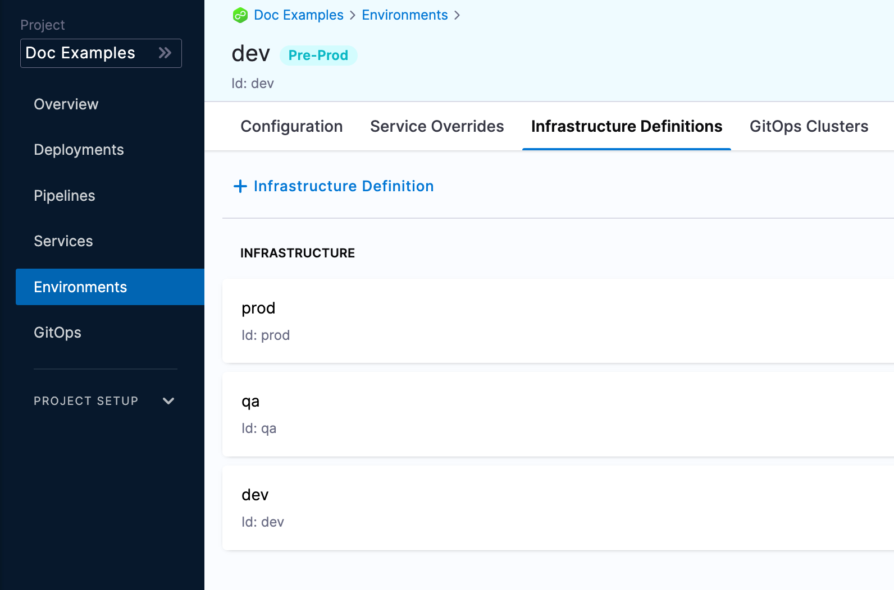

When you select an Environment in a stage, you can select which Infrastructure Definition to use for that stage.

### Configuration

In the Environment **Configuration**, you can manage the Name, Description, Tags, and Environment Type of the Environment.

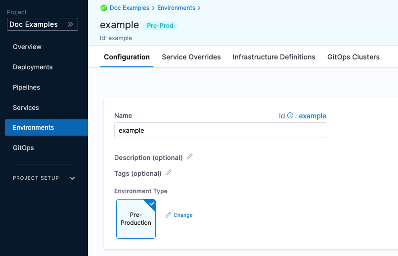

You can also set default manifests, specifications, config files, and variables to use whenever Harness deploys a Service to this Environment.

For example, a stage has a Kubernetes Service with a manifest but whenever that Service is deployed to the QA Environment, the manifest in that Environment's Configuration merges with the manifest in the Service.

### Service Overrides

Service Overrides are different from Environment Configuration in the following ways:

* Environment **Configuration**: applies to every Service that is used with the Environment.
* Environment **Service Overrides**: applies to specific Services you select. Whenever that Service is used with that Environment, the Service Override is applied.

### Override Priority

When you are using Environment Configuration and Service Override to override Service settings, it's important to understand the priority of the overrides.

The priority from top to bottom is:

1. Environment Service Overrides
2. Environment Configuration
3. Service Settings

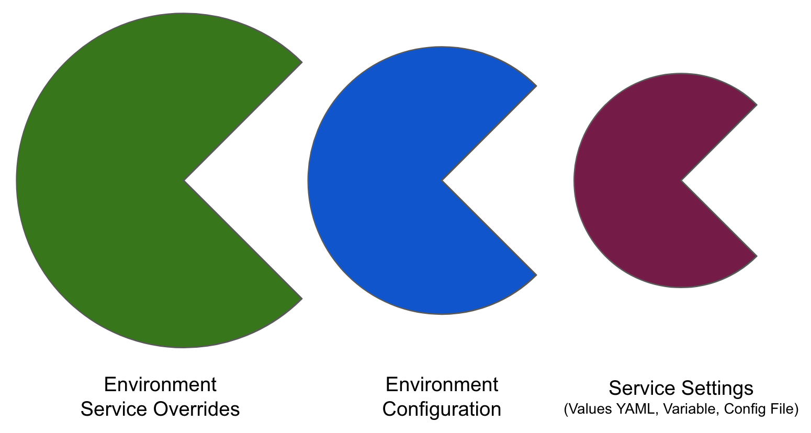

### Values YAML overrides and merges

You can specify Values YAML files at the Environment's **Service Overrides** and **Configuration**, and the Service itself.

Here is an example of specifying it at the Environment's **Configuration**:

When you have a Values YAML file at two or more of the Environment Service Overrides, Environment Configuration, and the Service itself, Harness merges the files into a single Values YAML for deployment. This merging is performed at Pipeline execution runtime.

Overriding occurs when the higher priority setting has the same name:value pair as a lower priority setting.

Let's look at two examples.

#### Merging Values YAMLs name:value pairs

An Environment's **Service Overrides** Values YAML has the name:value pair `servicePort: 80` but no `replicas` name:value.

A Service's **Service Definition** has a Values YAML with `replicas: 2` but no `servicePort` name:value.

At runtime, the two Values YAML files are merged into one.

The `servicePort: 80` from the Environment Service Overrides Values YAML is merged with the Service Definition's `replicas: 2` in the Values YAML:

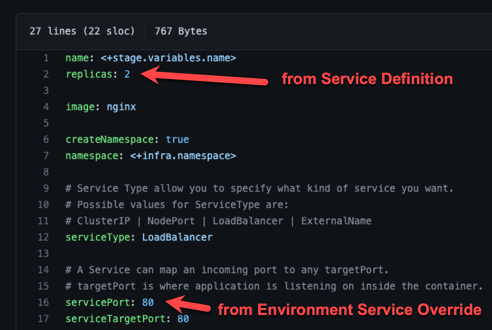

#### Fully overriding Values YAML name:value pairs

An Environment's **Service Overrides** Values YAML has the name:value pairs `replicas: 2` and `servicePort: 80`. 

A Service's **Service Definition** has a Values YAML with `replicas: 4` and `servicePort: 8080`. 

At runtime, the name:value pairs from the Environment Service Overrides Values YAML fully override the Service Values YAML. The and `replicas: 2` and `servicePort: 80` from the Environment Service Overrides are used.

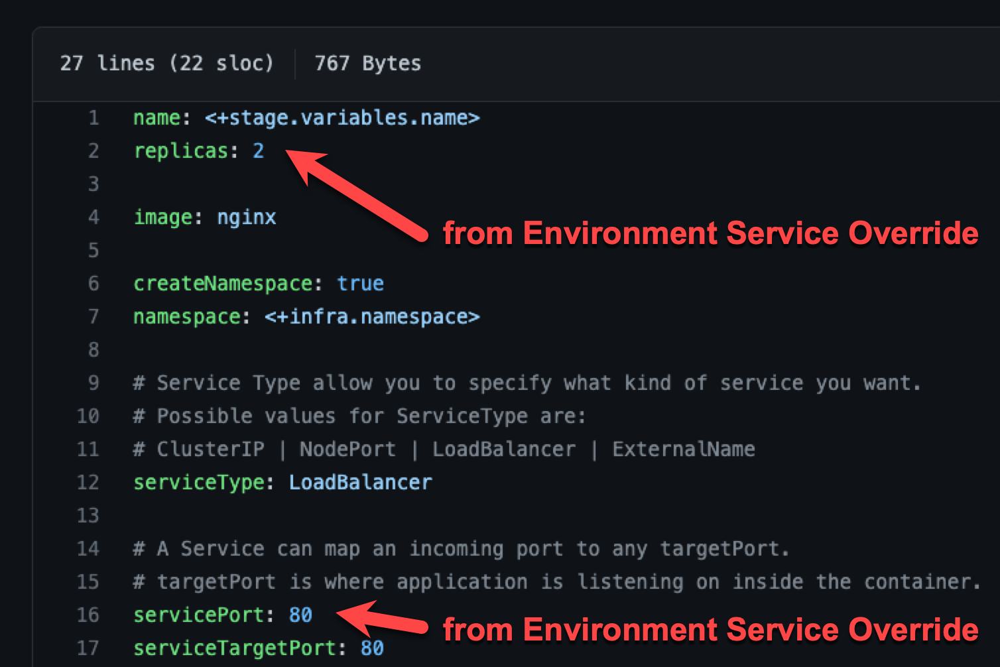

### Config files and variables are completely overridden

Config files are a black box that can contain multiple formats and content, such as YAML, JSON, plain text, etc. Consequently, they cannot be overridden like Values YAML files.

Variables cannot be partially overridden either. They are completely replaced.

When you have **Config files** at two or more of the Environment Service Overrides, Environment Configuration, and the Service itself, the standard override priority is applied.

When you have **Variables** with the same name at two or more of the Environment Service Overrides, Environment Configuration, and the Service itself, the standard override priority is applied.

### GitOps Clusters

When you use Harness GitOps you can add GitOps Clusters to an Environment. 

To learn more about Harness GitOps, go to [Harness GitOps Basics](../../cd-gitops/harness-git-ops-basics.md). 

Next, when you create a Pipeline, you can select the Environment and the GitOps Cluster(s) to use.

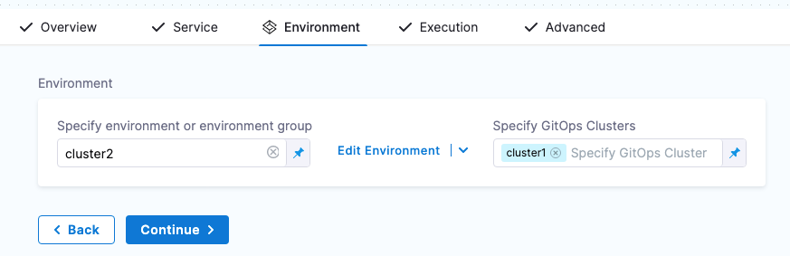

GitOps Clusters are used in a PR Pipeline. A PR Pipeline creates and merges a Git PR on the config.json for a destination cluster as part of an ApplicationSet. The PR Pipeline runs, merges a change to the config.json, and a GitOps Sync on the ApplicationSet is initiated.

GitOps Clusters are not used in standard CD Pipelines. Only when using GitOps.

### Runtime Inputs and Expressions in Services and Environments

If you use Runtime Inputs in your Services and Environments, users will need to provide values for these when they run Pipeline using these Services and Environments.

If you use Expressions in your Services and Environments, Harness must be able to resolve these expressions when users run Pipeline using these Services and Environments.

For more information on Runtime Inputs and Expressions, go to [Fixed Values, Runtime Inputs, and Expressions](../../../platform/20_References/runtime-inputs.md).

### Services and Environments RBAC

Please review these key RBAC uses cases for Services and Environments.

For extensive information on Harness RBAC, go to [Harness Role-Based Access Control Overview](../../../platform/4_Role-Based-Access-Control/1-rbac-in-harness.md) and [Harness Role-Based Access Control Quickstart](../../../platform/4_Role-Based-Access-Control/10-set-up-rbac-pipelines.md).#### Access permission is needed to deploy to a Service or Environment

One of the most important advantages of Services and Environments is the ability to define Roles that determines who can deploy them.

In order for a Role to allow deployments using Services and/or Environments, the Role must have the **Access** permission enabled for Services and/or Environments.

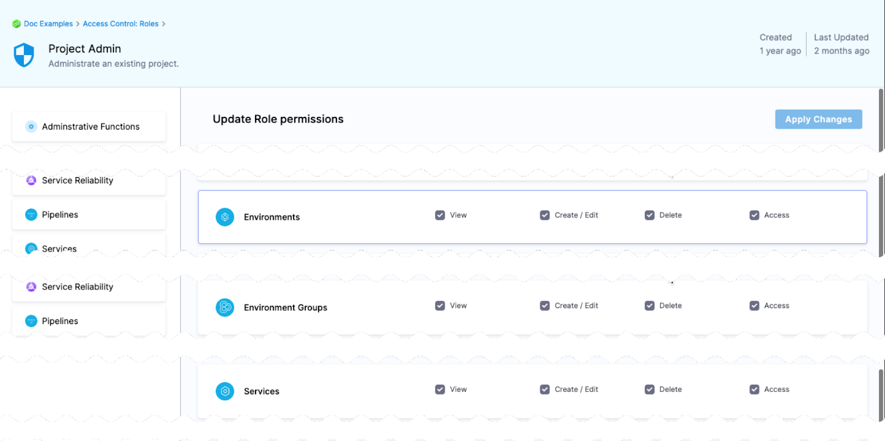

The View, Create, Edit, Delete, and Manage permissions to do enable you to deploy a Service and Environment.If a Role does not have the Access permission for **Environments**, a user or user group assigned that Role cannot deploy to any Environment.

If a Role does not have the Access permission for **Services**, a user or user group assigned that Role cannot deploy any Service.

#### Restrict access to specific Services or Environments for a user or user group

You can restrict a user or user group to using specific Services and Environments only. The process is the same for Services and Environments. 

Let's look at an example using Environments.

If you want to restrict a user or user group to deploy to a specific Environment only, do the following:

1. Create a Resource Group and select the Environment.
2. Create a Role and give the user or user group permissions. The **Access** permission is needed for deployments.
3. Assign the Role and Resource Group to the user or user group.

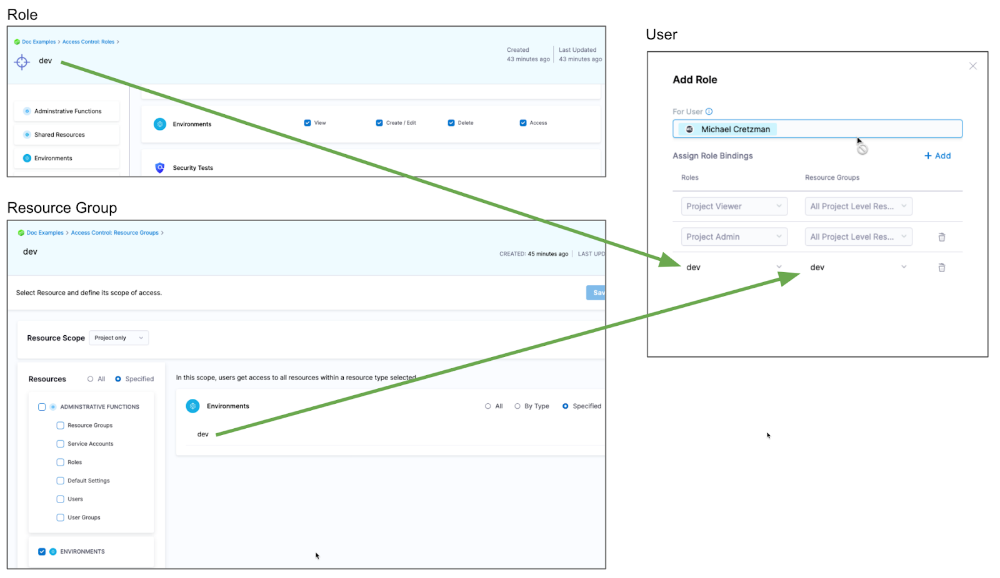

### Environment Groups

Environment Groups are simply a way to group Environments so you can assign permissions to multiple Environments in a Role.

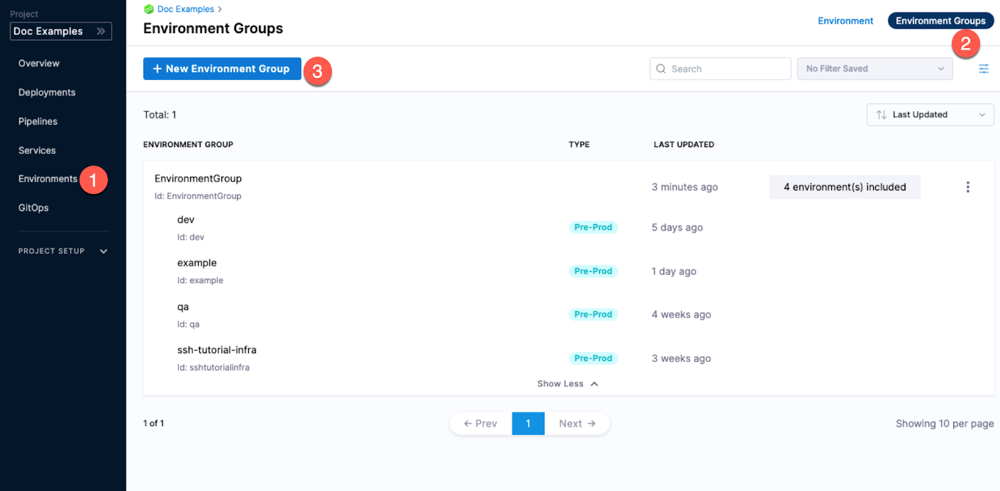

### Enabling Services and Environments v2

Currently, this feature is behind the feature flag `NG_SVC_ENV_REDESIGN`. Contact [Harness Support](mailto:support@harness.io) to enable the feature.

Once the feature flag is enabled, you can add v2 Services, Environments, and Infrastructure Definitions from Service and Environments top-level navigation the CD stage.

Top-level navigation:

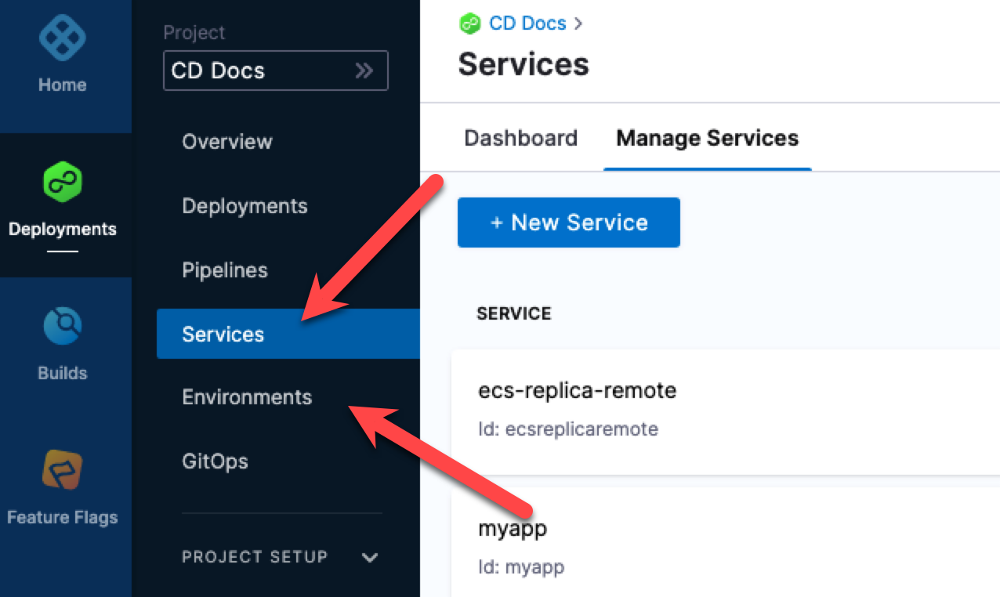

Stage-level Service:

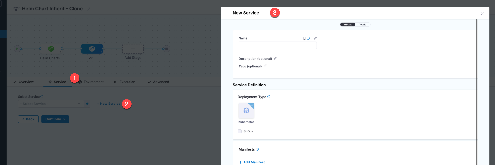

Stage-level Environment:

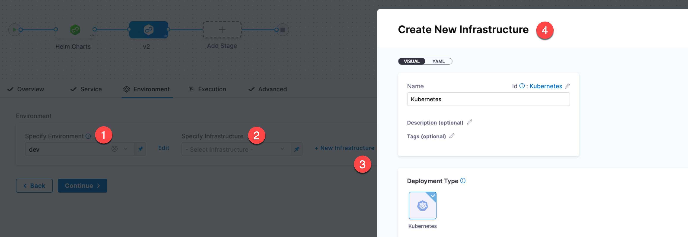

### Migrating from Services and Environments v1 to v2

While there is no explicit migration needed, Harness Customer Success, Product, and Engineering teams are available to help with this migration.Once you enable Services and Environments v2, Harness continues supporting v1 in the Deploy stage for existing Services and Environments.

For new Services and Environments, you must use v2 functionality.

#### Migrating Services

If you choose to edit an existing Pipeline, Service, and Environment, the Service and Environment are converted into the v2 experience.

In a CD Project, click **Services**, **Manage Services**, and then click **New Service**.

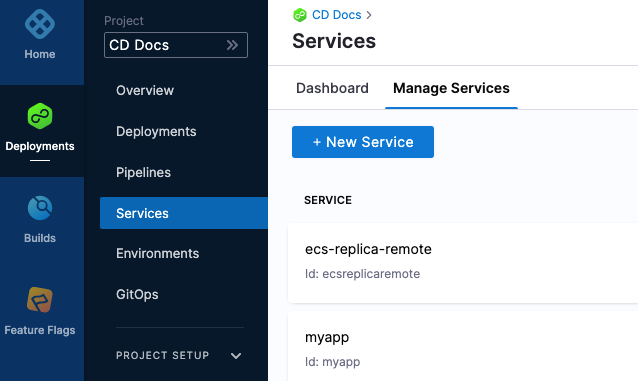

You will see that the Service Configuration section has more options. You can now associate a deployment type, Service Definition and Variables with the Service.

#### Migrating Environments

We recommend you retain your existing v1 Environment and recreate the Environment in v2 to ensure a safe cutover.

Your existing Pipelines will continue to use their v1 Environments.

In your Pipelines, you can map the Environment and the Infrastructure Definition to the v2 Environment.

We also recommend reviewing the values you have set as stage variables and see if those configurations can be moved to the Environment.

Any of the v1 Service Overview Variables for the v1 Service can be used as v2 Environment-based overrides in the v2 Environment Configuration or Service Overrides.

#### Migrating Pipelines

Harness recommends recreating the Pipeline with the new v2 Service and Environment experiences. This ensures a safe adoption of the experience without impacting your production Pipeline workloads.

#### Migrating Templates

Harness recommends recreating the templates and mapping the new templates to the v2 Service and Environment for safe adoption of the new Service and Environment.

The existing templates won’t be impacted with this approach. You will be creating a new template that will automatically leverage the new v2 Service and Environment experience.

The behavior of the template doesn't change, it simply uses v2 Service and Environments.

