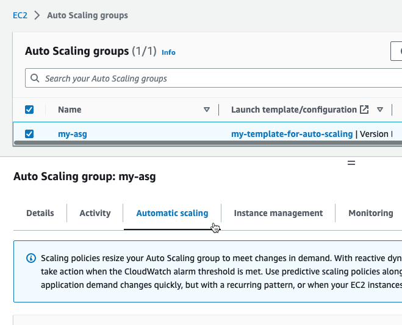
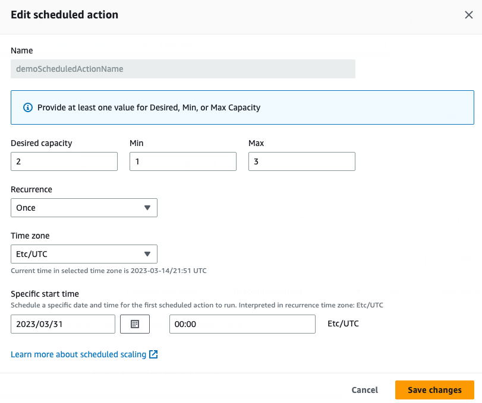
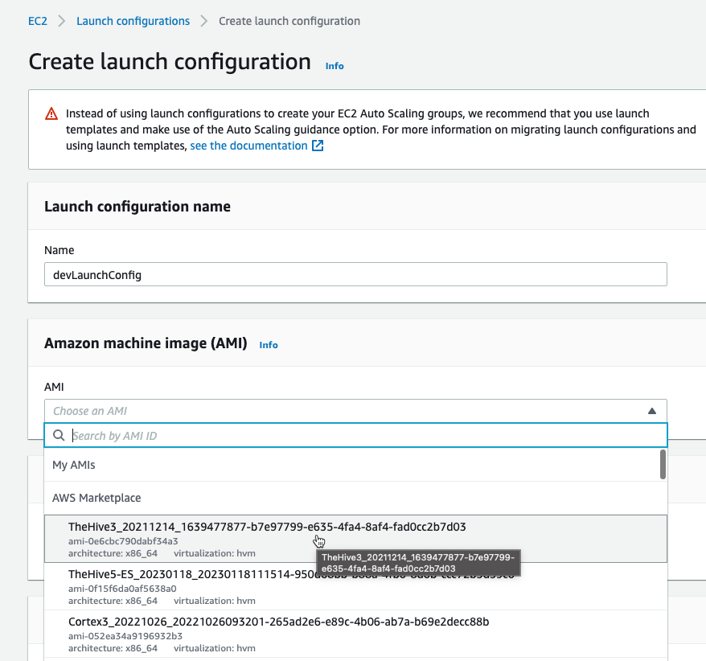
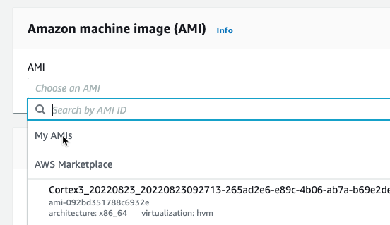
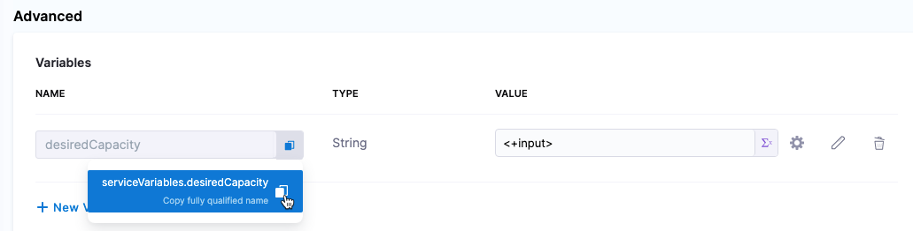

This topic explains how to deploy new AWS Auto Scale Groups (ASGs) and instances to Amazon Elastic Compute Cloud (EC2) using Harness.

## Deployment summary

Here's a high-level summary of the setup steps and how Harness deploys ASGs.

<details>
<summary>Setup summary</summary>

Here's a summary of how you set up ASG deployments in Harness:

1. Create the Harness ASG service.
   1. Add launch templates.
   2. Add auto scaling launch configurations.
   3. Add scaling policies (optional).
   4. Add scheduled update group action (optional).
   5. Add the AMI image to use for the ASG as an artifact.
2. Create the ASG environment.
   1. Connect Harness to the AWS region where you want to deploy.
3. Define the ASG pipeline execution.
   1. Select a deployment strategy (rolling, canary, blue green) and Harness automatically creates the steps to deploy the new ASG.
4. Deploy the pipeline.

</details>


<details>
<summary>Deployment summary</summary>

Here's a summary of how Harness deploys new ASG versions:

1. First deployment:
   1. Harness takes the launch template and launch configuration files you provides and creates a new ASG and its instances in your AWS account and region.
2. Subsequent deployments:
   1. Harness creates a new version of the launch template.
   2. Harness uses the new version to update the ASG. For example, if you increased the desired capacity (`desiredCapacity`) for the ASG in your launch configuration file, Harness will update the ASG.
   3. Instance refresh is triggered.

</details>

## AWS policy requirements

When you set up a Harness AWS connector to connect Harness with your AWS account, the AWS IAM role must have the following policies.

<details>
<summary>AmazonEC2FullAccess</summary>

- **Policy Name:** [AmazonEC2FullAccess](https://us-east-1.console.aws.amazon.com/iam/home#/policies/arn:aws:iam::aws:policy/AmazonEC2FullAccess).
- **Policy ARN:** arn:aws:iam::aws:policy/AmazonEC2FullAccess.
- **Description:** Provides full access to Amazon EC2 via the AWS Management Console.

Policy JSON:

```json
{  
  "Version": "2012-10-17",  
  "Statement": [  
    {  
      "Action": "ec2:*",  
      "Effect": "Allow",  
      "Resource": "*"  
    },  
    {  
      "Effect": "Allow",  
      "Action": "elasticloadbalancing:*",  
      "Resource": "*"  
    },  
    {  
      "Effect": "Allow",  
      "Action": "cloudwatch:*",  
      "Resource": "*"  
    },  
    {  
      "Effect": "Allow",  
      "Action": "autoscaling:*",  
      "Resource": "*"  
    }  
  ]  
}  
```
</details>

<details>
<summary>DescribeRegions</summary>

:::note

The [DescribeRegions](https://docs.aws.amazon.com/AWSEC2/latest/APIReference/API_DescribeRegions.html) action is required for all AWS IAM roles used in Harness AWS connectors regardless of what AWS service you are using.

:::

Harness needs a policy with the `DescribeRegions` action so that it can list the available regions for you when you define your target architecture.

Create a [Customer Managed Policy](https://docs.aws.amazon.com/IAM/latest/UserGuide/access_policies_managed-vs-inline.html#customer-managed-policies), add the `DescribeRegions` action to list those regions, and add that to any role used by the Cloud Provider.

```json
{  
    "Version": "2012-10-17",  
    "Statement": [  
        {  
            "Sid": "VisualEditor0",  
            "Effect": "Allow",  
            "Action": "ec2:DescribeRegions",  
            "Resource": "*"  
        }  
    ]  
}
```

</details>


## Create the ASG service

The Harness ASG service contains the following:

- Launch template.
- Auto scaling launch configuration.
- Scaling policies (optional).
- Scheduled update group action (optional).
- The AMI image to use for the ASG.

Harness supports standard ASG JSON and YAML formatted files. For more information, go to [Get started with Amazon EC2 Auto Scaling](https://docs.aws.amazon.com/autoscaling/ec2/userguide/get-started-with-ec2-auto-scaling.html) from AWS.

You can use remote files stored in a Git repo or the [Harness File Store](https://developer.harness.io/docs/continuous-delivery/cd-services/cd-services-general/add-inline-manifests-using-file-store/).

```mdx-code-block
import Tabs from '@theme/Tabs';
import TabItem from '@theme/TabItem';
```
```mdx-code-block
<Tabs>
  <TabItem value="YAML" label="YAML" default>
```

Here's an example where the configuration files are stored in the [Harness File Store](https://developer.harness.io/docs/continuous-delivery/cd-services/cd-services-general/add-inline-manifests-using-file-store/).

```yaml
service:
  name: svc-asg
  identifier: svcasg
  serviceDefinition:
    type: Asg
    spec:
      manifests:
        - manifest:
            identifier: launchTemplate
            type: AsgLaunchTemplate
            spec:
              store:
                type: Harness
                spec:
                  files:
                    - /asg/launchtemplate
        - manifest:
            identifier: launchConfig
            type: AsgConfiguration
            spec:
              store:
                type: Harness
                spec:
                  files:
                    - /asg/launchconfig
        - manifest:
            identifier: scalePolicy
            type: AsgScalingPolicy
            spec:
              store:
                type: Harness
                spec:
                  files:
                    - /asg/scalingPolicy.json
        - manifest:
            identifier: scheduledUpdateGroupAction
            type: AsgScheduledUpdateGroupAction
            spec:
              store:
                type: Harness
                spec:
                  files:
                    - /asg/scheduledUpdateGroupAction.json
      artifacts:
        primary:
          primaryArtifactRef: <+input>
          sources:
            - identifier: AMI-ARTIFACT
              spec:
                connectorRef: AWS_ASG_CONNECTOR
                region: us-east-1
                filters:
                  - name: ami-name
                    value: Returns local IP address at port 80
                version: Returns local IP address at port 80
              type: AmazonMachineImage
  gitOpsEnabled: false
```

```mdx-code-block
  </TabItem>
  <TabItem value="API" label="API">
```

```yaml
curl -i -X POST \
  'https://app.harness.io/gateway/ng/api/servicesV2/batch?accountIdentifier=<Harness account Id>' \
  -H 'Content-Type: application/json' \
  -H 'x-api-key: <Harness API key>' \
  -d '[{
    "identifier": "svcasg",
    "orgIdentifier": "default",
    "projectIdentifier": "CD_Docs",
    "name": "svc-asg",
    "description": "string",
    "tags": {
      "property1": "string",
      "property2": "string"
    },
    "yaml": "service:\n  name: svc-asg\n  identifier: svcasg\n  serviceDefinition:\n    type: Asg\n    spec:\n      manifests:\n        - manifest:\n            identifier: launchTemplate\n            type: AsgLaunchTemplate\n            spec:\n              store:\n                type: Harness\n                spec:\n                  files:\n                    - /asg/launchtemplate\n        - manifest:\n            identifier: launchConfig\n            type: AsgConfiguration\n            spec:\n              store:\n                type: Harness\n                spec:\n                  files:\n                    - /asg/launchconfig\n        - manifest:\n            identifier: scalePolicy\n            type: AsgScalingPolicy\n            spec:\n              store:\n                type: Harness\n                spec:\n                  files:\n                    - /asg/scalingPolicy.json\n        - manifest:\n            identifier: scheduledUpdateGroupAction\n            type: AsgScheduledUpdateGroupAction\n            spec:\n              store:\n                type: Harness\n                spec:\n                  files:\n                    - /asg/scheduledUpdateGroupAction.json\n      artifacts:\n        primary:\n          primaryArtifactRef: <+input>\n          sources:\n            - identifier: AMI-ARTIFACT\n              spec:\n                connectorRef: AWS_ASG_CONNECTOR\n                region: us-east-1\n                filters:\n                  - name: ami-name\n                    value: Returns local IP address at port 80\n                version: Returns local IP address at port 80\n              type: AmazonMachineImage\n  gitOpsEnabled: false"
  }]'
```

```mdx-code-block
  </TabItem>
  <TabItem value="Terraform Provider" label="Terraform Provider">
```

```yaml
resource "harness_platform_service" "example" {
  identifier  = "identifier"
  name        = "name"
  description = "test"
  org_id      = "org_id"
  project_id  = "project_id"

  ## SERVICE V2 UPDATE
  ## We now take in a YAML that can define the service definition for a given Service
  ## It isn't mandatory for Service creation 
  ## It is mandatory for Service use in a pipeline

  yaml = <<-EOT
                service:
                  name: svc-asg
                  identifier: svcasg
                  serviceDefinition:
                    type: Asg
                    spec:
                      manifests:
                        - manifest:
                            identifier: launchTemplate
                            type: AsgLaunchTemplate
                            spec:
                              store:
                                type: Harness
                                spec:
                                  files:
                                    - /asg/launchtemplate
                        - manifest:
                            identifier: launchConfig
                            type: AsgConfiguration
                            spec:
                              store:
                                type: Harness
                                spec:
                                  files:
                                    - /asg/launchconfig
                        - manifest:
                            identifier: scalePolicy
                            type: AsgScalingPolicy
                            spec:
                              store:
                                type: Harness
                                spec:
                                  files:
                                    - /asg/scalingPolicy.json
                        - manifest:
                            identifier: scheduledUpdateGroupAction
                            type: AsgScheduledUpdateGroupAction
                            spec:
                              store:
                                type: Harness
                                spec:
                                  files:
                                    - /asg/scheduledUpdateGroupAction.json
                      artifacts:
                        primary:
                          primaryArtifactRef: <+input>
                          sources:
                            - identifier: AMI-ARTIFACT
                              spec:
                                connectorRef: AWS_ASG_CONNECTOR
                                region: us-east-1
                                filters:
                                  - name: ami-name
                                    value: Returns local IP address at port 80
                                version: Returns local IP address at port 80
                              type: AmazonMachineImage
                  gitOpsEnabled: false
              EOT
}
```

```mdx-code-block
  </TabItem>  
  <TabItem value="Pipeline Studio" label="Pipeline Studio">
```

To configure a Harness ASG service, do the following:

1. In your project, in CD (Deployments), select **Services**.
2. Select **Manage Services**, and then select **New Service**.
3. Enter a name for the service and select **Save**.
4. Select **Configuration**.
5. In **Service Definition**, select **AWS Auto Scaling Group**.
6. In **AWS ASG Configurations**, enter the following configuration files. 
  Only **Launch Template** and **ASG Configuration** are required.
   1. [Launch template](https://docs.aws.amazon.com/autoscaling/ec2/userguide/create-launch-template.html). Enter a standard AWS JSON or YAML formatted launch template. 
   2. In **ASG Configuration**, add a [launch configuration](https://docs.aws.amazon.com/autoscaling/ec2/userguide/create-launch-config.html).
   3. [Scaling policy](https://docs.aws.amazon.com/autoscaling/ec2/userguide/examples-scaling-policies.html). This is optional.
   
   This is the same as the **Automatic scaling** option in the ASG console setup:

     

   4. [Scheduled update group action](https://docs.aws.amazon.com/autoscaling/ec2/userguide/ec2-auto-scaling-scheduled-scaling.html). This is optional.
   
   This is the same as the scheduled action in the ASG console setup:
   
     
   
   Next, in **Artifacts**, you add the AMI image to use for the ASG instances. This is similar to the Amazon machine image (AMI) section in the **Create launch configuration** wizard in the AWS console:

     
5. In **Artifacts**, select **Add Artifact Source**.
6. In **Specify Artifact Repository Type**, select **Amazon Machine Image**, and select **Continue**.
7. In **Amazon Machine Image Repository**, in **AWS Connector**, select or create a Harness AWS connector, and then select **Continue**. Review [AWS policy requirements](#aws-policy-requirements) to ensure that the AWS credentials you provide are adequate.
8. In **Artifact Details**, enter a name to identify this AMI artifact in Harness.
9. In **Region**, select the region where the ASG is located.
10. In **AMI Tags**, add any AWS Tags that you are using to identify your AMI. For details on these key/value pairs, go to [Tagging Your Amazon EC2 Resources](https://docs.aws.amazon.com/AWSEC2/latest/UserGuide/Using_Tags.html) from AWS.
11. In **AMI Filters**, add AMI filters to locate the AMI resource. These are key/value pairs that identify the AMI Id. This can be you own AMI or an AWS Marketplace AMI.
12. In **Version Details** and **Version**, specify the AMI version to use.
13. Select **Submit**.
14. Select **Save** to save the service.
    
    The Harness ASG service is complete. You can now use it in your Harness ASG pipelines.

```mdx-code-block
  </TabItem>
</Tabs>
```

### Artifact AMI overrides config files AMIs

You can specify an AMI in the launch template and a launch configuration used in the Harness service, but it will be overridden by the AMI specified in the Harness service **Artifacts** section.

The AMI specified in the Harness service **Artifacts** section is the same as selecting an AMI in the **Create launch configuration** wizard in the AWS console or `--image-id` in in the [create-launch-configuration](https://docs.aws.amazon.com/cli/latest/reference/autoscaling/create-launch-configuration.html) CLI command.

  

### Using service variables in config file

Service variables are a powerful way to template your services or make them more dynamic.

In the **Variables** section of the service, you can add service variables and then reference them in any of the ASG configuration files you added to the service.

For example, you could create a variable named desiredCapacity and set its value as a [fixed value, runtime input, or expression](https://developer.harness.io/docs/platform/references/runtime-inputs/).

  

Next, in your launch configuration file, you could reference the variable like this:

```json
{
  "autoScalingGroupName": "lovish2-asg",
  "minSize": 1,
  "maxSize": 3,
  "desiredCapacity": <+serviceVariables.desiredCapacity>,
  "tags": [{"key": "key7", "value":  "value7"}, {"key": "key2", "value":  "value2"}],
  "availabilityZones": ["us-east-1a", "us-east-1b"]
}
```

Now, when you add that service to a pipeline, you will be prompted to enter a value for this variable in the pipeline **Services** tab. The value you provide is then used as the `desiredCapacity` in your launch configuration.

## Create the ASG environment

The Harness ASG environment is where you define the region where you want to deploy the ASG.

```mdx-code-block
import Tabs1 from '@theme/Tabs';
import TabItem1 from '@theme/TabItem';
```
```mdx-code-block
<Tabs1>
  <TabItem1 value="YAML" label="YAML" default>
```
1. .
2. .

```mdx-code-block
  </TabItem1>
  <TabItem1 value="API" label="API">
```


```mdx-code-block
  </TabItem1>
  <TabItem1 value="Pipeline Studio" label="Pipeline Studio">
```

1. .
2. .

```mdx-code-block
  </TabItem1>
</Tabs1>
```


## Define the ASG pipeline execution


<details>
<summary>Rolling</summary>

summary

tabs for steps

</details>


<details>
<summary>Canary</summary>

summary

tabs for steps


</details>

<details>
<summary>Blue Green</summary>


summary

tabs for steps

</details>

## Deploy the ASG pipeline


<details>
<summary>Rolling</summary>


</details>


<details>
<summary>Canary</summary>


</details>

<details>
<summary>Blue Green</summary>


</details>


