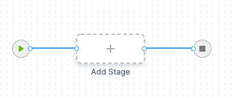
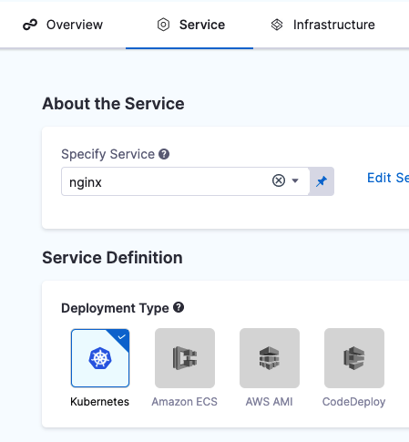
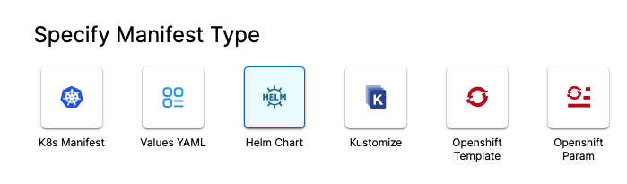
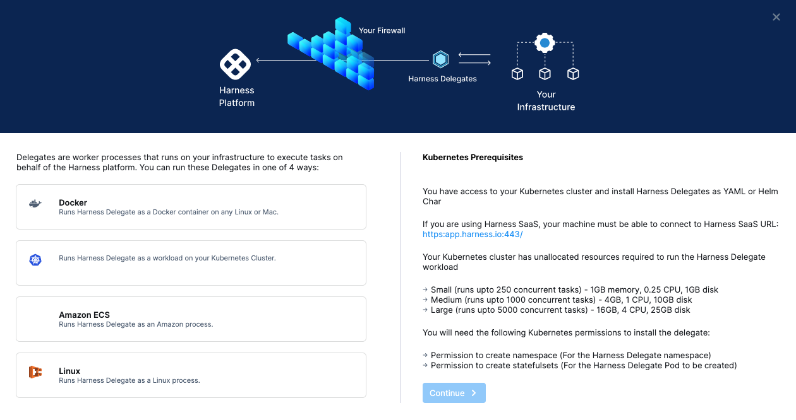
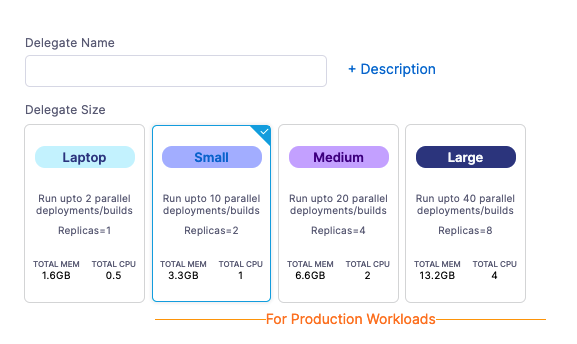
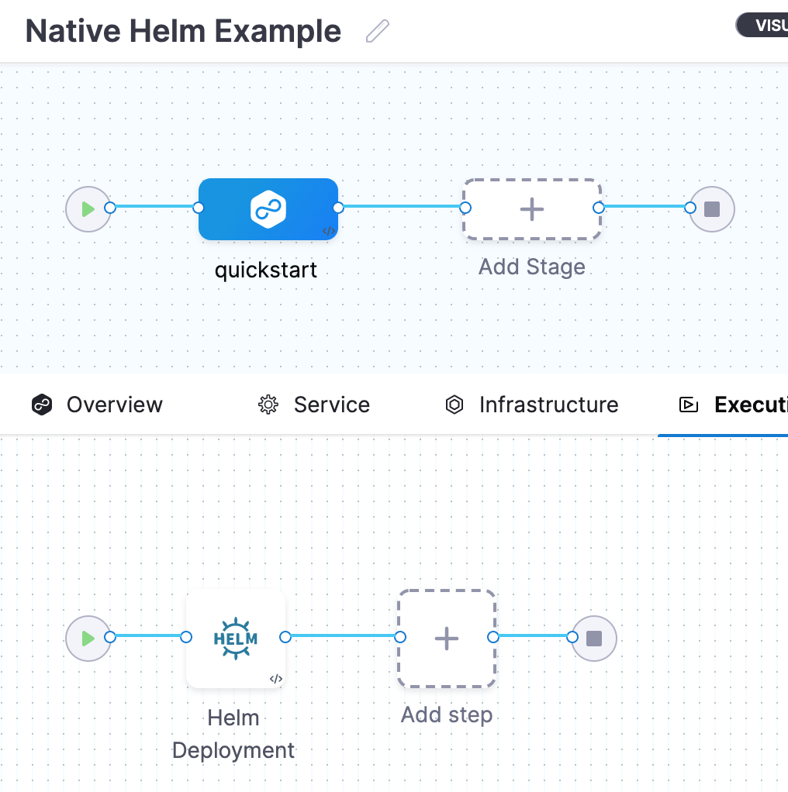
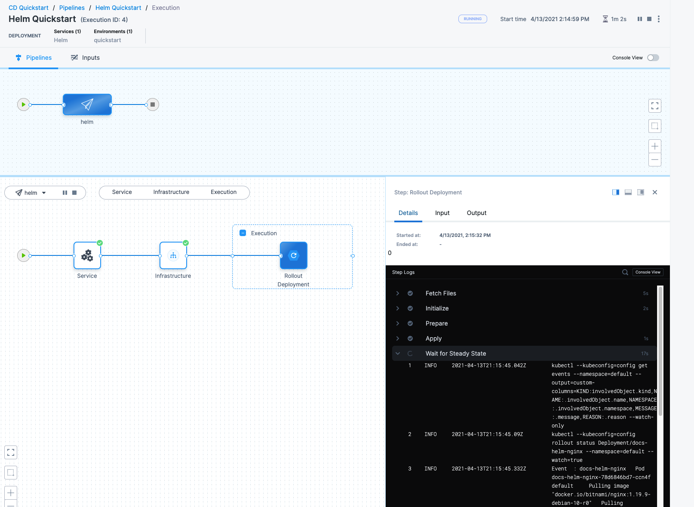
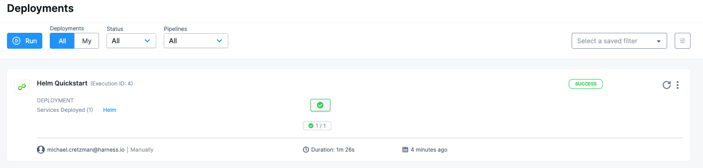

This quickstart shows you how to deploy a publicly available Docker image to your Kubernetes cluster using Helm charts and a Rolling [deployment strategy](../../cd-deployments-category/deployment-concepts.md) in Harness.

All you'll need is a small target cluster to run the Harness Delegate and receive the deployed image.

This quickstart should only take about 15 minutes.

## Objectives

You'll learn how to:

* Install and launch a Harness Kubernetes Delegate in your target cluster.
* Set up a Helm Pipeline.
* Run the new Helm Pipeline and deploy a Docker image to your target cluster.

## Before You Begin

We're going to be pulling a Helm chart for NGINX from the Bitnami repo at `https://charts.bitnami.com/bitnami`. You don't need any credentials for pulling the public chart.

You will need a target Kubernetes cluster where you will deploy NGINX:

Set up your Kubernetes clusterYou'll need a target Kubernetes cluster for Harness. Ensure your cluster meets the following requirements:

* **Number of nodes:** 3.
* **Machine type:** 4vCPU
* **Memory:** 4vCPUs, 16GB memory, 100GB disk. In GKE, the **e2-standard-4** machine type is enough for this quickstart.
* **Networking:** outbound HTTPS for the Harness connection to **app.harness.io**, **github.com**, and **hub.docker.com**. Allow TCP port 22 for SSH.
* A **Kubernetes service account** with permission to create entities in the target namespace is required. The set of permissions should include `list`, `get`, `create`, and `delete` permissions. In general, the cluster-admin permission or namespace admin permission is enough.  
For more information, see [User-Facing Roles](https://kubernetes.io/docs/reference/access-authn-authz/rbac/#user-facing-roles) from Kubernetes.

## Visual Summary

Here's a quick walkthrough of creating a Helm deployment Pipeline in Harness:

<!-- Video:
https://www.youtube.com/watch?v=Wvr52UKDOJQ-->
<docvideo src="https://www.youtube.com/watch?v=Wvr52UKDOJQ" />

## Step 1: Create the Deploy Stage

Pipelines are collections of stages. For this quickstart, we'll create a new Pipeline and add a single stage.

:::note

**Create a Project for your new CD Pipeline:** if you don't already have a Harness Project, create a Project for your new CD Pipeline. Ensure that you add the **Continuous Delivery** module to the Project. See [Create Organizations and Projects](../../../platform/1_Organizations-and-Projects/2-create-an-organization.md).

:::

1. In your Harness Project, click **Deployments**, and then click **Create a** **Pipeline**.
   
   

2. Enter the name **Helm Quickstart** and click **Start**.
   Your Pipeline appears.
   
   

3. Click **Add Stage** and select **Deploy**.
4. Enter the name **Deploy Service**, make sure **Service** is selected, and then click **Set Up Stage**.
   The new stage settings appear.
5. In **About the** **Service**, click **New Service**.
   :::note

   Let's take a moment and review Harness Services and Service Definitions (which are explained below). Harness Services represent your microservices/apps logically. You can add the same Service to as many stages are you need. Service Definitions represent your artifacts, manifests, and variables physically. They are the actual files and variable values.  
   
   By separating Services and Service Definitions, you can propagate the same Service across stages while changing the artifacts, manifests, and variables with each stage.

   :::
1. Give the Service the name **nginx** and click **Save**. 
   Once you have created a Service, it is persistent and can be used throughout the stages of this or any other Pipeline in the Project.
2. In **Deployment Type**, click **Kubernetes**. Now your Service looks like this:
   

Next, we'll add the NGINX Helm chart for the deployment.

## Step 2: Add the Helm Chart and Delegate

You can add a Harness Delegate inline when you configure the first setting that needs it. For example, when we add a Helm chart, we will add a Harness Connector to the HTTP server hosting the chart. This Connector uses a Delegate to verify credentials and pull charts, so we'll install the Delegate, too.

1. In **Manifests**, click **Add Manifest**. The manifest types appear.

   
2. Click **Helm Chart**, and then click **Continue**.
3. In **Specify Helm Chart Store**, click **HTTP Helm**.
   We're going to be pulling a Helm chart for NGINX from the Bitnami repo at `https://charts.bitnami.com/bitnami`. You don't need any credentials for pulling the public chart.
4. Click **New HTTP Helm Repo Connector**.
5. In the **HTTP Helm Repo Connector**, in **Name**, enter **helm-chart-repo**, and click **Continue**.
6. In **Helm Repository URL**, enter `https://charts.bitnami.com/bitnami`.
7. In **Authentication**, select **Anonymous**.
8.  Click **Continue**.
    Now we'll install and register a new Harness Delegate in your target cluster.
9.  In **Delegates Setup**, click **Install new Delegate**.
    The Delegate wizard appears.

    [](./static/helm-cd-quickstart-04.png)
10. Click **Kubernetes**, and then click **Continue**.

    
11. Enter a name for the Delegate, like **quickstart**, click the **Small** size.
12. Click **Continue**.
13. Click **Download Script**. The YAML file for the Kubernetes Delegate will download to your computer as an archive.

   Open a terminal and navigate to where the Delegate file is located.

   You will connect to your cluster using the terminal so you can simply run the YAML file on the cluster.

   In the same terminal, log into your Kubernetes cluster. In most platforms, you select the cluster, click **Connect**, and copy the access command.

   Next, install the Harness Delegate using the **harness-delegate.yaml** file you just downloaded. In the terminal connected to your cluster, run this command:

   ```
   kubectl apply -f harness-delegate.yaml
   ```
   You can find this command in the Delegate wizard:

   

   The successful output is something like this:

   ```
   % kubectl apply -f harness-delegate.yaml  
   namespace/harness-delegate unchanged  
   clusterrolebinding.rbac.authorization.k8s.io/harness-delegate-cluster-admin unchanged  
   secret/k8s-quickstart-proxy unchanged  
   statefulset.apps/k8s-quickstart-sngxpn created  
   service/delegate-service unchanged
   ```
1. In Harness, click **Verify**. It will take a few minutes to verify the Delegate. Once it is verified, close the wizard.
   Back in **Set Up Delegates**, you can select the new Delegate.
   In the list of Delegates, you can see your new Delegate and its tags.
2. Select the **Connect using Delegates with the following Tags** option.
3. Enter the tag of the new Delegate and click **Save and Continue**.
   When you are done, the Connector is tested. If it fails, your Delegate might not be able to connect to `https://charts.bitnami.com/bitnami`. Review its network connectivity and ensure it can connect.
4. Click **Continue**.
5. In **Manifest Details**, enter the following settings can click **Submit**.
   * **Manifest Identifier**: enter **nginx**.
   * **Helm Chart Name**: enter **nginx**.
   * **Helm Chart Version**: leave this empty.
   * **Helm Version**: select **Version 3**.

The Helm chart is added to the Service Definition.


Next, we can target your Kubernetes cluster for deployment.

## Step 3: Define Your Target Cluster

1. In **Infrastructure**, in **Environment**, click **New Environment**.
2. In **Name**, enter **quickstart**, and click **Save**.
3. In **Infrastructure Definition**, select the **Kubernetes**.
4. In **Cluster Details**, click **Select Connector**. We'll create a new Kubernetes Connector to your target platform. We'll use the same Delegate you installed earlier.
5. Click **New Connector**.
6. Enter a name for the Connector and click **Continue**.
7. In **Details**, select **Use the credentials of a specific Harness Delegate**, and then click **Continue**.
   
8. In **Set Up Delegates**, select the Delegate you added earlier by entering one of its Tags.
9.  Click **Save and Continue**. The Connector is tested. Click **Finish**.
10. Select the new Connector and click **Apply Selector**.
11. In **Namespace**, enter **default** or the namespace you want to use in the target cluster.
12. In **Release Name**, enter **quickstart**.
13. Click **Next**. The deployment strategy options appear.

## Step 4: Add a Rollout Deployment Step

1. We're going to use a Rolling [deployment strategy](../../cd-deployments-category/deployment-concepts.md), so click **Rolling**, and click **Apply**.

The **Rollout Deployment** step is added to **Execution**.



That's it. Now you're ready to deploy.

## Step 5: Deploy and Review

1. Click **Save** to save your Pipeline.
2. Click **Run**.
3. Click **Run Pipeline**.
   
   Harness verifies the connections and then runs the Pipeline.

   Toggle **Console View** to watch the deployment with more detailed logging.

   

4. Click the **Rollout Deployment** step and expand **Wait for Steady State**.


You can see `Status : quickstart-nginx deployment "quickstart-nginx" successfully rolled out.`

Congratulations! The deployment was successful.

In your Project's Deployments, you can see the deployment listed:



If you run into any errors, it is typically because the cluster does meet the requirements from [Before You Begin](#before_you_begin) or the cluster's network settings do not allow the Delegate to connect to the chart or image repos.

In this quickstart, you learned how to:

* Install and launch a Harness Kubernetes Delegate in your target cluster.
* Set up a Helm Pipeline.
* Run the new Helm Pipeline and deploy a Docker image to your target cluster.

## Next Steps

* See [CD tutorials](/docs/category/cd-tutorials) for other deployment features.
* [Trigger Pipelines on New Helm Chart](../../../platform/11_Triggers/trigger-pipelines-on-new-helm-chart.md).

